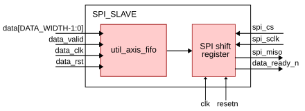

.. _spi_slave:

SPI Slave
===============================================================================

.. hdl-component-diagram::

The :git-hdl:`SPI Slave <library/spi_slave>` peripheral buffers a stream of
data samples in an asynchronous FIFO and streams them out to an external SPI
master. It lets a device that is not on the processor bus (for example a
microcontroller acting as an SPI controller) read data captured in the FPGA
fabric, without involving the processor or a DMA.

A typical use case is to expose ADC samples over a PMOD connector: the write
side of the FIFO is driven by the converter data path in the ADC clock domain,
while the read side is clocked by the system clock and shifted out on the SPI
interface under control of the external master.

Files
-------------------------------------------------------------------------------

.. list-table::
   :header-rows: 1

   * - Name
     - Description
   * - :git-hdl:`library/spi_slave/spi_slave.v`
     - Verilog source for the peripheral
   * - :git-hdl:`library/spi_slave/spi_slave_ip.tcl`
     - Tcl script to generate the Vivado IP Integrator project for the
       peripheral

Block Diagram
-------------------------------------------------------------------------------

Configuration Parameters
-------------------------------------------------------------------------------

.. hdl-parameters::
   :path: library/spi_slave

Interface
-------------------------------------------------------------------------------

.. hdl-interfaces::
   :path: library/spi_slave

Detailed Description
-------------------------------------------------------------------------------

The peripheral spans two clock domains, joined by an asynchronous FIFO
(:ref:`util_axis_fifo`):

- **Write side (data domain).** Samples presented on ``data`` are written into
  the FIFO on every ``data_clk`` cycle for which ``data_valid`` is asserted.
  This side is held in reset by the active-high ``data_rst``. The FIFO holds
  ``2**ADDRESS_WIDTH`` words of ``DATA_WIDTH`` bits.
- **Read / SPI side (system clock domain).** The FIFO read side, the pin
  synchronizers and the shift logic all run on ``clk`` and are reset by the
  active-low ``resetn``.

The asynchronous ``spi_cs`` and ``spi_sclk`` inputs are first brought into the
``clk`` domain through a two-stage synchronizer (``util_cdc``) and then edge
detected.

The SPI interface operates in **Mode 3** (clock idles high, data changes on the
falling edge and is sampled by the master on the rising edge), MSB first, with
``DATA_WIDTH`` bits per transfer:

#. ``data_ready_n`` reflects FIFO occupancy: it is driven low whenever at least
   one word is available to be read. The external master can poll it to know
   when a new sample is ready.
#. On the falling edge of ``spi_cs`` (start of a transfer) the next FIFO word
   is loaded into the shift register, its MSB is presented on ``spi_miso``, and
   the word is popped from the FIFO.
#. On each following SPI clock edge the shift register advances by one bit,
   presenting the next bit on ``spi_miso``, until all ``DATA_WIDTH`` bits have
   been shifted out.

The external master should frame each read as a single ``DATA_WIDTH``-bit,
chip-select-asserted transfer.

.. note::

   The peripheral only sources data; it has no MOSI input and ignores anything
   the master drives towards it. The number of bits per transfer is fixed by
   ``DATA_WIDTH`` and must match the master's word length.

References
-------------------------------------------------------------------------------

* HDL IP core at :git-hdl:`library/spi_slave`
