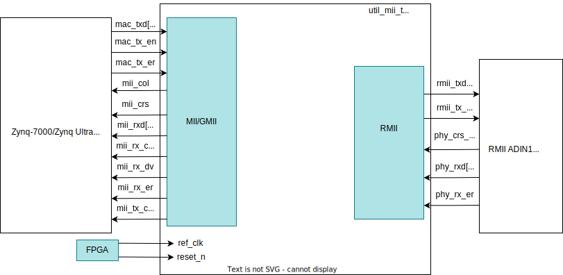

.. _util_mii_to_rmii:

Util MII to RMII
===============================================================================

.. hdl-component-diagram::

The :git-hdl:`Util MII to RMII <library/util_mii_to_rmii>` core
is designed to interface the Zynq-7000/Zynq UltraScale+ MPSoC - PS
Gigabit Ethernet MAC and Reduced Media Independent Interface (RMII)
:adi:`ADIN1300` PHY from the :adi:`CN0506` Dual PHY Ethernet evaluation board.

Features
--------------------------------------------------------------------------------

* Configurable interface for the MAC block (Media Independent Interface - MII
  or Gigabit Media Independent Interface - GMII).
* Configurable data rate for the MAC block and PHY chip.

Files
--------------------------------------------------------------------------------

.. list-table::
   :header-rows: 1

   * - Name
     - Description
   * - :git-hdl:`library/util_mii_to_rmii/util_mii_to_rmii.v`
     - Verilog source for the main module made of the MII and RMII interfaces.
   * - :git-hdl:`library/util_mii_to_rmii/mac_phy_link.v`
     - Verilog source for the conversion between RMII PHY chip interface and
       MII MAC block interface.
   * - :git-hdl:`library/util_mii_to_rmii/phy_mac_link.v`
     - Verilog source for the conversion between MII MAC block interface and
       RMII PHY chip interface.

Block Diagram
--------------------------------------------------------------------------------

Configuration Parameters
--------------------------------------------------------------------------------

.. hdl-parameters::

   * - INTF_CFG
     - MAC Block Interface Selection
   * - RATE_10_100
     - Data Rate Selection

Interface
--------------------------------------------------------------------------------

.. hdl-interfaces::

   * - MII
     - MAC-PHY Link (MII MAC Block to RMII PHY)
   * - GMII
     - MAC-PHY Link (GMII MAC Block to RMII PHY)
   * - RMII
     - PHY-MAC Link (RMII PHY to MII MAC Block)
   * - ref_clk
     - Reference Clock for MII to RMII IP core
   * - reset_n
     - Active-Low reset for MII to RMII IP core

Theory of Operation
--------------------------------------------------------------------------------

The following timing diagrams illustrate different signal protocols for MII and
RMII interfaces at data rates of 100 and 10 Mbps.

Receive Transactions
~~~~~~~~~~~~~~~~~~~~~~~~~~~~~~~~~~~~~~~~~~~~~~~~~~~~~~~~~~~~~~~~~~~~~~~~~~~~~~~

-  RMII (PHY) receive transaction at 100 Mbps with no errors and phy_crs_dv
   asserted until the final packet dibit. According to the RMII Specification
   Rev. 1.2, after the assertion of phy_crs_dv, several 00's dibits can precede
   the preamble 01's dibits. The preamble is composed of 28 "01" dibits and the
   start of frame delimiter of 3 "01" dibits and one "11" dibit followed by the
   frame containing 64-1522 bytes:

.. image:: phy_rec_simple.svg
   :alt: PHY Receive Simple

-  RMII (PHY) receive transaction at 100 Mbps with no errors and phy_crs_dv
   toggling at 25 MHz starting on a nibble boundary and indicates the PHY has
   lost the carrier but has accumulated nibbles to transfer:

.. image:: d2_phy_rec_tog.svg
   :alt: PHY Receive Toggle

-  At a data rate of 10 Mbps (ref_clk frequency divided by 10), mii_rxd will be
   sampled every :math:`10^{th}` cycle.
-  MII receive transaction converted from RMII (PHY) receive transaction at 100
   Mbps. In the MII mode mii_rx_dv and mii_rxd will be sampled on the falling
   edge of the 25 MHz mii_rx_clk and when mii_rx_dv is de-asserted, mii_rxd will
   present 0b0000 to the Ethernet MAC:

.. image:: mii_recv.svg
   :alt: ETH MAC Receive

Transmit Transactions
~~~~~~~~~~~~~~~~~~~~~~~~~~~~~~~~~~~~~~~~~~~~~~~~~~~~~~~~~~~~~~~~~~~~~~~~~~~~~~~

-  MII transmit transaction at 100 Mbps. In the MII mode mii_tx_en and mii_txd
   will be sampled on the rising edge of the 25 MHz mii_tx_clk:

.. image:: mii_transm.svg
   :alt: ETH MAC Transmit

-  In case of errors detection, mii_tx_er will be asserted and mii_txd dibits
   will be "01" for the rest of transmission to RMII interface.
-  At a data rate of 10 Mbps (ref_clk frequency divided by 10), mii_txd will be
   sampled every :math:`10^{th}` cycle.
-  RMII transmit transaction converted from MII transmit transaction at 100
   Mbps. In the RMII mode rmii_tx_en and rmii_txd will be sampled on the rising
   edge of the 50 MHz ref_clk:

.. image:: rmii_transm.svg
   :alt: PHY Transmit

Software Support
--------------------------------------------------------------------------------

Analog Devices recommends to use the provided software drivers.

* Linux driver at :git-linux:`drivers/net/mii.c`
* :dokuwiki:`Analog Devices ADIN1300/ADIN1200 PHY Linux Driver <resources/tools-software/linux-drivers/net-phy/adin>`

References
--------------------------------------------------------------------------------

* HDL IP core at :git-hdl:`library/util_mii_to_rmii`
* :adi:`ADIN1300 PHY Information <adin1300>`
* :adi:`ADIN1300 PHY Documentation <media/en/technical-documentation/data-sheets/ADIN1300.pdf>`
* :dokuwiki:`ADIN1300 PHY Linux Driver <resources/tools-software/linux-drivers/net-phy/adin>`
* :adi:`CN0506 Information <en/design-center/reference-designs/circuits-from-the-lab/cn0506.html>`
* :adi:`CN0506 Reference Note <media/en/reference-design-documentation/reference-designs/cn0506.pdf>`
* :dokuwiki:`CN0506 HDL Reference Design <resources/eval/user-guides/circuits-from-the-lab/cn0506/hdl>`
* :dokuwiki:`CN0506 User Guide <resources/eval/user-guides/circuits-from-the-lab/cn0506>`

