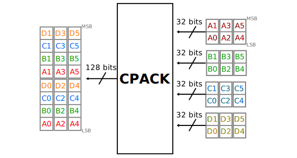
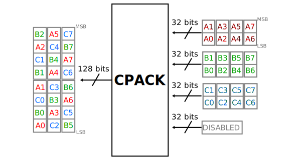

.. _util_cpack2:

Channel CPACK Utility
===============================================================================

.. hdl-component-diagram::

The :git-hdl:`channel CPACK utility core <library/util_pack/util_cpack2/util_cpack2.v>`
is meant to allow one or more channels to be enabled by software without any
padding.
This allows full usage of the DMA bandwidth without any overhead. This core
normally works with an ADC and DMA modules. The ADC interface is channel based
(one interface per each ADC channel) and consists of enable, valid and data
signals.
The DMA interface is a single FIFO interface consisting of valid and data signals.
The enable signals are usually controlled by software.
The core simply packs the ADC data of the individual channels into a single data
bus, as defined by the ADC enables.

Features
--------------------------------------------------------------------------------

* Supports Altera and AMD Xilinx devices
* Supports up to 64 channels
* Supports configurable channel data width

Files
--------------------------------------------------------------------------------

.. list-table::
   :header-rows: 1

   * - Name
     - Description
   * - :git-hdl:`library/util_pack/util_cpack2/util_cpack2.v`
     - Verilog source for the peripheral.

Configuration Parameters
--------------------------------------------------------------------------------

.. hdl-parameters::

Interface
--------------------------------------------------------------------------------

.. hdl-interfaces::

   * - packed_fifo_wr
     - FIFO interface to the DMA (sink).
       ``packed_fifo_wr_sync`` controls the correct alignment, when the source and
       sink interface data width is different.
       When this bit is asserted, the first sample on the DMA interface (16-bit LSB),
       must be a sample of the first channel.
   * - fifo_wr_en
     - Indicates that at least one payload from fifo_wr_data_* is valid.
   * - enable_*
     - Indicates the status of the channel, if asserted the channel is active.
   * - fifo_wr_data_*
     - ADC data bus from the ADC core.

Detailed Description
--------------------------------------------------------------------------------

The core "collects" samples from the ADC interface and passes it to the DMA
(or any other sink module), the data flow is controlled by the ADC. This is best
explained through some examples. Let's consider a 4 channel ADC with a channel
data width of 32 bits. The ADC core provides two 16-bit samples on its output
for all channels when the valid is asserted. The DMA interface, in this case,
is an interleaved 8 samples (128 bits) stream. This is because irrespective of
the ADC channel data width, the software always sees data as "samples interleaved".
The same data set may received by the DMA core with a channel width of 128 bits
or 16 bits.

   Four channel enabled (4'b1111)

   Three channel enabled (4'b1110)

   Two channel enabled (4'b1100)

References
--------------------------------------------------------------------------------

* HDL IP core at :git-hdl:`library/util_pack/util_cpack2`
