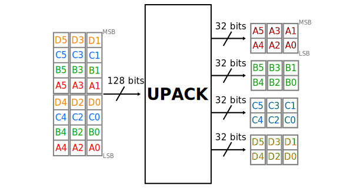
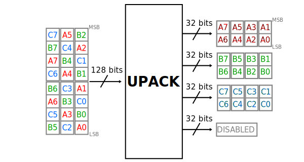
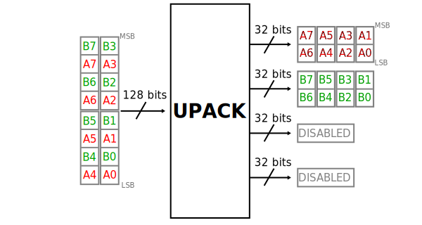

.. _util_upack2:

Channel UPACK Utility
===============================================================================

.. hdl-component-diagram::

The :git-hdl:`channel UPACK utility core <library/util_pack/util_upack2/util_upack2.v>`
is meant to allow one or more channels to be enabled by software without any
padding.
This allows full usage of the DMA bandwidth without any overhead. This core
normally works with an DAC and DMA modules.
The DAC interface is channel based (one interface per each DAC channel) and
consists of enable, valid and data signals. The DMA interface is a single FIFO
interface consisting of valid and data signals. The enable signals are usually
controlled by software. The core simply unpacks the DMA data into the individual
channels as defined by the enables.

Features
--------------------------------------------------------------------------------

* Supports Altera and AMD Xilinx devices
* Supports up to 64 channels
* Supports configurable channel data width

Files
--------------------------------------------------------------------------------

.. list-table::
   :header-rows: 1

   * - Name
     - Description
   * - :git-hdl:`library/util_pack/util_upack2/util_upack2.v`
     - Verilog source for the peripheral.

Configuration Parameters
--------------------------------------------------------------------------------

.. hdl-parameters::

Interface
--------------------------------------------------------------------------------

.. hdl-interfaces::

   * - s_axis
     - FIFO interface to the source.
   * - fifo_rd_en
     - Assert to indicate that the DAC core is ready to consume DAC data.
   * - fifo_rd_valid
     - Indicates that the enabled DAC channels data are valid.
   * - enable_*
     - Indicates the status of the channel, if asserted the channel is active.
   * - fifo_rd_data_*
     - DAC data bus to the DAC core (sink).

Detailed Description
--------------------------------------------------------------------------------

The core "collects" samples from the DMA interface (or any other source) and
passes it to the DAC on every valid request from the DAC. This is best explained
through some examples. Let's consider a 4 channel DAC with a channel data width
of 32 bits. That is, the DAC requires two 16-bit samples be present at its input
for all channels when the valid is asserted. The DMA interface in this case is
an interleaved 8 samples (128 bits) stream. This is because irrespective of the
DAC channel data width, the software always sees data as "samples interleaved".
The same data set may drive a DAC core with a channel width of 128 bits or 16 bits.

This data unpacking now needs to factor in the valid and the number of samples
that are to be read from the DMA. It is quite simple: a valid at the DAC
interface translates into a data required count based on the number of enables.
So if three channels are enabled the requirement is 6 samples, so the core
initiates a read from the DMA three out of four clock cycles.

   Four channel enabled (4'b1111)

   Three channel enabled (4'b1110)

   Two channel enabled (4'b1100)

References
--------------------------------------------------------------------------------

* HDL IP core at :git-hdl:`library/util_pack/util_upack2`
