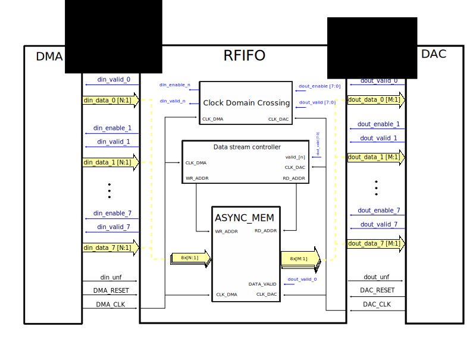

.. _util_rfifo:

Util RFIFO
===============================================================================

.. hdl-component-diagram::

The :git-hdl:`Util RFIFO <library/util_rfifo>` core
is a designed to downscale the clock rate of the TX data path.
There are scenarios when the device clock (interface clock) is too high (above
200 MHz), making it a challenge to integrate any processing cores between the
device core and UPACK/DMA, because of the small timing margins. By reducing the
clock rate of the data path, the user can easily integrate any custom processing
core into the design.

To define the correct configuration, the following questions need to
be answered:

#. What is the clock rate of the device core's data interface? (dout_clk)
#. What is the data rate of the device core's data interface?
   (``dout_valid@dout_clk``)
#. What is the targeted clock rate of the data path (din_clk), and how we can
   achieve it, respecting the main rule of thumb: **input data rate must be
   equal to the output data rate**?

If the device clock rate is equal to the device data rate, the only solution to
downscale the clock rate is to increase the data width of the output ports of
the FIFO. Currently the util_rfifo supports four data width ratios:
1:1/1:2/1:4/1:8.

Features
--------------------------------------------------------------------------------

* Supports Altera and AMD Xilinx devices.
* Downscale the DAC data path's clock rate.
* Supports multiple channels (max 8 channels).

Files
--------------------------------------------------------------------------------

.. list-table::
   :header-rows: 1

   * - Name
     - Description
   * - :git-hdl:`library/util_rfifo/util_rfifo.v`
     - Verilog source for the peripheral.

Block Diagram
--------------------------------------------------------------------------------

Timing Diagram
--------------------------------------------------------------------------------

.. image:: timing_diagram.png
   :alt: Util RFIFO timing diagram

Configuration Parameters
--------------------------------------------------------------------------------

.. hdl-parameters::

   * - NUM_OF_CHANNELS
     - The number of channels of the device.
   * - DIN_DATA_WIDTH
     - The bus width of the input data (DMA bus width).
   * - DOUT_DATA_WIDTH
     - The bus width of the output data (device core's data interface bus width).
   * - DIN_ADDRESS_WIDTH
     - The address width of the internal memory of the FIFO.

Interface
--------------------------------------------------------------------------------

.. hdl-interfaces::

   * - din_enable_*
     - Enable.
   * - din_valid_*
     - Valid.
   * - din_valid_in_*
     - Looped back valid.
   * - din_data_*
     - Data.
   * - din_unf
     - Input data underflow.
   * - dout_enable_*
     - Enable.
   * - dout_valid_*
     - Valid.
   * - dout_valid_out_*
     - Looped back valid.
   * - dout_data_*
     - Data.
   * - dout_unf
     - Output data underflow.

References
--------------------------------------------------------------------------------

* HDL IP core at :git-hdl:`library/util_rfifo`
* :dokuwiki:`UTIL RFIFO on wiki <resources/fpga/docs/util_rfifo>`
