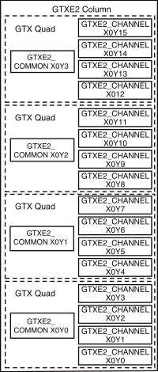
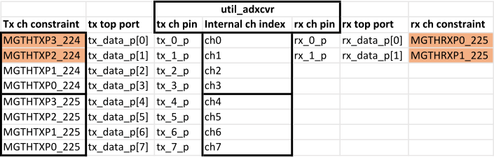
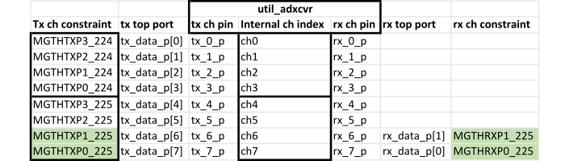
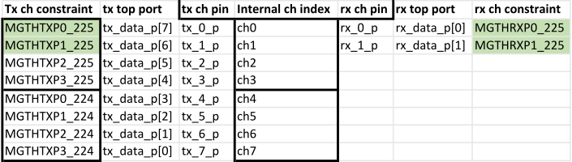

.. _util_adxcvr:

UTIL_ADXCVR core for AMD Xilinx devices
================================================================================

.. hdl-component-diagram::
   :path: library/xilinx/util_adxcvr

The
:git-hdl:`util_adxcvr <library/xilinx/util_adxcvr>`
IP core instantiates a Gigabit Transceiver (GT) and sets up the required
configuration. Basically, it is a simple wrapper file for a GT\* Column,
exposing just the necessary ports and attributes.

.. note::
    To understand the below wiki page is important to have a basic
    understanding about High Speed Serial I/O interfaces and Gigabit Serial
    Transceivers. To find more information about these technologies, please visit
    the :xilinx:`AMD Xilinx's solution center <support/answers/37181.html>`.

Currently this IP supports three different GT types:

-  GTXE2
   (:xilinx:`7 Series devices <support/documentation/user_guides/ug476_7Series_Transceivers.pdf>`)
-  GTHE3
   (:xilinx:`Ultrascale and Ultrascale+ <support/documentation/user_guides/ug576-ultrascale-gth-transceivers.pdf>`)
-  GTHE4
   (:xilinx:`Ultrascale and Ultrascale+ <support/documentation/user_guides/ug576-ultrascale-gth-transceivers.pdf>`)
-  GTYE4
   (:xilinx:`Ultrascale and Ultrascale+ <support/documentation/user_guides/ug578-ultrascale-gty-transceivers.pdf>`)

Features
--------------------------------------------------------------------------------

*  Supports GTX2, GTH3 and GTH4
*  Exposes all the necessary attributes for QPLL/CPLL configuration
*  Supports shared transceiver mode
*  Supports dynamic reconfiguration
*  RX Eye Scan

Block Diagram
--------------------------------------------------------------------------------

The following diagram shows a GTXE2 Column, which contains four GT Quads. Each
quad contains a GTEX2_COMMON and four GTXE2_CHANNEL primitives.

Configuration Parameters
--------------------------------------------------------------------------------

.. hdl-parameters::

  * - XCVR_TYPE
    - | Define the current GT type:
      | GTXE2(0), GTHE3(1), GTHE4(2)
  * - QPLL_REFCLK_DIV
    - QPLL reference clock divider M, see User Guide for more info
  * - QPLL_FBDIV_RATIO
    - QPLL reference clock divider N ratio, see User Guide for more info
  * - QPLL_CFG
    - Configuration settings for QPLL, see User Guide for more info
  * - QPLL_FBDIV
    - QPLL reference clock divider N, see User Guide for more info
  * - CPLL_FBDIV
    - CPLL feedback divider N2 settings, see User Guide for more info
  * - CPLL_FBDIV_4_5
    - CPLL reference clock divider N1 settings, see User Guide for more info
  * - TX_NUM_OF_LANES
    - Number of transmit lanes.
  * - TX_OUT_DIV
    - CPLL/QPLL output clock divider D for the TX datapath, see User Guide for
      more info
  * - TX_CLK25_DIV
    - Divider for internal 25 MHz clock for the TX datapath, see User Guide
      for more info
  * - TX_LANE_INVERT
    - Per lane polarity inversion. Set the n-th bit to invert the polarity of
      the n-th transmit lane.
  * - RX_NUM_OF_LANES
    - Number of transmit lanes
  * - RX_OUT_DIV
    - CPLL/QPLL output clock divider D for the RX datapath, see User Guide for
      more info
  * - RX_CLK25_DIV
    - Divider for internal 25 MHz clock for the RX datapath, see User Guide
      for more info
  * - RX_DFE_LPM_CFG
    - Configure the GT use modes, LPM or DFE, see User Guide for more info
  * - RX_PMA_CFG
    - Search for PMA_RSV in User Guide for more info
  * - RX_CDR_CFG
    - Configure the RX clock data recovery circuit for GTXE2, see User Guide
      for more info
  * - RX_LANE_INVERT
    - Per lane polarity inversion. Set the n-th bit to invert the polarity of
      the n-th receive lane.

Interface
--------------------------------------------------------------------------------

Microprocessor clock and reset
^^^^^^^^^^^^^^^^^^^^^^^^^^^^^^^^^^^^^^^^^^^^^^^^^^^^^^^^^^^^^^^^^^^^^^^^^^^^^^^^

.. list-table::
   :header-rows: 1

   * - Pin
     - Type
     - Description
   * - ``up_clk``
     - ``input``
     - System clock, running on 100 MHz
   * - ``up_rstn``
     - ``input``
     - System reset, the same as AXI memory map subordinate interface reset

PLL reference clock
^^^^^^^^^^^^^^^^^^^^^^^^^^^^^^^^^^^^^^^^^^^^^^^^^^^^^^^^^^^^^^^^^^^^^^^^^^^^^^^^

.. list-table::
   :header-rows: 1

   * - Pin
     - Type
     - Description
   * - ``qpll_ref_clk_0``
     - ``input``
     - Reference clock for the QPLL
   * - ``cpll_ref_clk_0``
     - ``input``
     - Reference clock for the CPLL

RX interface
^^^^^^^^^^^^^^^^^^^^^^^^^^^^^^^^^^^^^^^^^^^^^^^^^^^^^^^^^^^^^^^^^^^^^^^^^^^^^^^^

.. list-table::
   :header-rows: 1

   * - Pin
     - Type
     - Description
   * - ``rx_*_p``
     - ``input``
     - Positive differential serial data input
   * - ``rx_*_n``
     - ``input``
     - Negative differential serial data input
   * - ``rx_out_clk_*``
     - ``output``
     - Core logic clock output. Frequency = serial line rate/40
   * - ``rx_clk_*``
     - ``input``
     - Core logic clock loop-back input
   * - ``rx_charisk_*``
     - ``output[3:0]``
     - RX Char is K to the JESD204B IP
   * - ``rx_disperr_*``
     - ``output[3:0]``
     - RX disparity error to the JESD204B IP
   * - ``rx_notintable_*``
     - ``output[3:0]``
     - RX Not In Table to the JESD204B IP
   * - ``rx_data_*``
     - ``output[3:0]``
     - RX data to the JESD204B IP
   * - ``rx_calign_*``
     - ``input``
     - RX enable comma alignment from the JESD204B IP

TX interface
^^^^^^^^^^^^^^^^^^^^^^^^^^^^^^^^^^^^^^^^^^^^^^^^^^^^^^^^^^^^^^^^^^^^^^^^^^^^^^^^

.. list-table::
   :header-rows: 1

   * - Pin
     - Type
     - Description
   * - ``tx_*_p``
     - ``output``
     - Positive differential serial output
   * - ``tx_*_n``
     - ``output``
     - Negative differential serial output
   * - ``tx_out_clk_*``
     - ``output``
     - Core logic clock output. Frequency = serial line rate/40
   * - ``tx_clk_*``
     - ``input``
     - Core logic clock loop-back input
   * - ``tx_charisk_*``
     - ``input[3:0]``
     - TX Char is K from the JESD204B IP
   * - ``tx_data_*``
     - ``input[31:0]``
     - TX data from the JESD204B IP

Common DRP Interface
^^^^^^^^^^^^^^^^^^^^^^^^^^^^^^^^^^^^^^^^^^^^^^^^^^^^^^^^^^^^^^^^^^^^^^^^^^^^^^^^

.. list-table::
   :header-rows: 1

   * - Pin
     - Type
     - Description
   * - ``up_cm_*``
     - ``IO``
     - The common DRP interface, must be connected to the equivalent DRP ports
       of AXI_ADXCVR. This is a QUAD interface, shared by four transceiver
       lanes. This interface is available only if parameter QPLL_ENABLE is set
       to 0x1.

Channel DRP Interface
^^^^^^^^^^^^^^^^^^^^^^^^^^^^^^^^^^^^^^^^^^^^^^^^^^^^^^^^^^^^^^^^^^^^^^^^^^^^^^^^

.. list-table::
   :header-rows: 1

   * - Pin
     - Type
     - Description
   * - ``up_rx_*``
     - ``IO``
     - The RX channel DRP interface, must be connected to the equivalent DRP ports
       of AXI_ADXCVR. This is a channel interface, one per each RX transceiver
       lane.
   * - ``up_tx_*``
     - ``IO``
     - The TX channel DRP interface, must be connected to the equivalent DRP ports
       of AXI_ADXCVR. This is a channel interface, one per each TX transceiver
       lane.

Eye Scan DRP Interface
^^^^^^^^^^^^^^^^^^^^^^^^^^^^^^^^^^^^^^^^^^^^^^^^^^^^^^^^^^^^^^^^^^^^^^^^^^^^^^^^

.. list-table::
   :header-rows: 1

   * - Pin
     - Type
     - Description
   * - ``up_es_*``
     - ``IO``
     - The Eye-Scan DRP interface, must be connected to the equivalent DRP
       ports of UTIL_ADXCVR. This is a channel interface, one per each
       transceiver lane. This interface is available only if parameter
       TX_OR_RX_N is set to 0x0.

Design Guidelines
--------------------------------------------------------------------------------

.. note::
  Please refer to :ref:`Xilinx FPGAs Transceivers Wizard <xgt_wizard>`
  to generate the optimal parameters needed to configure the transceivers for
  your project.

Physical constraints considerations
--------------------------------------------------------------------------------

The util_adxcvr allocates resources/quads (channels and common) sequentially.
Meaning, if you have 8 lanes it will insert two quads, 4 channels and a common
block for each quad.

Channels within a quad are tightly coupled to the common block, the placement of
the channel resources can be permuted within a quad and is affected by the
constraint file with the restriction that rx\_<N>_p/n connect to tx\_<N>_p/n
must connect to the same channel.

Supposing we have the following pin constraints and connections to the
util_adxcvr:

So in this case we end up with a conflict during implementation:

We have to ensure that in implementation the mapping is correct either by
rearranging the Rx connections

or by rearranging the Tx connections of the util_adxcvr:

In such cases, when rearrangement is required due placement constraints,
complementary reordering is required either in the converter device (lane
crossbars) or inside the FPGA between the physical and link layer, to connect
the logical lanes with the same index on both end of the link.

Software Guidelines
--------------------------------------------------------------------------------

The software can configure this core through the :ref:`AXI_ADXCVR <axi_adxcvr>` IP
core.

References
--------------------------------------------------------------------------------

-  :xilinx:`High Speed Serial <products/technology/high-speed-serial.html>`
-  :xilinx:`7 Series FPGAs GTX/GTH Transceivers <support/documentation/user_guides/ug476_7Series_Transceivers.pdf>`
-  :xilinx:`UltraScale Architecture GTH Transceivers <support/documentation/user_guides/ug576-ultrascale-gth-transceivers.pdf>`
-  :xilinx:`UltraScale Architecture GTY Transceivers <support/documentation/user_guides/ug578-ultrascale-gty-transceivers.pdf>`

More Information
--------------------------------------------------------------------------------

-  :ref:`JESD204B High-Speed Serial Interface Support <jesd204>`
