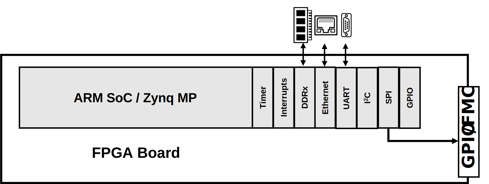

.. _ad353xr:

AD353XR HDL project
================================================================================

Overview
--------------------------------------------------------------------------------

The :adi:`AD3530R`/ :adi:`AD3530` and :adi:`AD3531R`/ :adi:`AD3531` are low
power, 16-bit, buffered voltage output, digital-to-analog converters (DACs) that
include a gain bit field, resulting in a full-scale output of 2.5V (gain = 1)
or 5V (gain = 2) for a reference voltage of 2.5V. :adi:`AD3530`/ :adi:`AD3530R`
has 8 channels, and :adi:`AD3531`/ :adi:`AD3531R` has 4 channels. :adi:`AD3530R`
and :adi:`AD3531R` has an on-chip, buffered, 2.5V reference available at the
VREF pin, capable of sourcing external loads up to +5mA.

Each DAC channel has its own Input register and DAC register. The DAC Register 
stores digital code equivalent to the DAC output voltage while the Input
Register acts as a temporary staging register before being passed on the DAC
Register. With the LDAC function, one or more DAC registers could be updated in
parallel with the data held in the Input Register. The DAC registers can also be
directly written to, in which the corresponding output updates immediately
without an LDAC.

:adi:`AD3530R`/ :adi:`AD3530` contains eight buffered voltage output DAC 
channels capable of sourcing 50mA and sinking up to 40mA of current.
:adi:`AD3531R`/ :adi:`AD3531` contains four buffered voltage output DAC channels
capable of sourcing 100mA and sinking 80 mA of current.

The :adi:`AD3530R`/ :adi:`AD3530` contains a 27:1 multiplexer while
:adi:`AD3531R`/ :adi:`AD3531` contains a 15:1 multiplexer, in which both could
output a voltage on the MUX_OUT pin that is a representative of either the
output voltage or output current of a chosen channel, or the internal die
temperature of the device.

Applications:

- Optical transceivers
- Test and measurement
- Industrial automation
- Data acquisition systems

Supported boards
-------------------------------------------------------------------------------

- :adi:`EVAL-AD3530R`
- :adi:`EVAL-AD3531R`

Supported devices
-------------------------------------------------------------------------------

- :adi:`AD3530`
- :adi:`AD3530R`
- :adi:`AD3531`
- :adi:`AD3531R`

Supported carriers
-------------------------------------------------------------------------------

- `ZedBoard <https://digilent.com/shop/zedboard-zynq-7000-arm-fpga-soc-development-board>`__ on FMC
- `Cora Z7S <https://digilent.com/shop/cora-z7-zynq-7000-single-core-for-arm-fpga-soc-development>`__ on GPIOs
- :intel:`DE10-Nano <content/www/us/en/partner/showcase/offering/a5b3b0000004cbwAAA/de10nano-kit.html>` on GPIOs

Block design
-------------------------------------------------------------------------------

Block diagram
~~~~~~~~~~~~~~~~~~~~~~~~~~~~~~~~~~~~~~~~~~~~~~~~~~~~~~~~~~~~~~~~~~~~~~~~~~~~~~~

The data path is depicted in the below diagram:

Hardware setup
~~~~~~~~~~~~~~~~~~~~~~~~~~~~~~~~~~~~~~~~~~~~~~~~~~~~~~~~~~~~~~~~~~~~~~~~~~~~~~~~~~

============ ================= ============== ================ ==============
Signal       AD353XR Testpoint ZedBoard FMC   Cora Z7-07S GPIO DE10-Nano GPIO
============ ================= ============== ================ ==============
CSB(SS0)     PMOD P1           M19/FMC-LA00_P F16              AE19
SDO(MOSI)    PMOD P2           N19/FMC-LA01_P T12              AG15
SDI(MISO)    PMOD P3           N20/FMC-LA01_N W15              AF18
SCK          PMOD P4           D18/FMC-CLK1_P H15              AG18
RESETB       PMOD P8           T19/FMC-LA10_N V13              AE20
LDACB        PMOD P9           J18/FMC_LA05_P T14              AE17
============ ================= ============== ================ ==============

.. important::

   The evaluation board is powered by 5V voltage from an external USB.

GPIOs
~~~~~~~~~~~~~~~~~~~~~~~~~~~~~~~~~~~~~~~~~~~~~~~~~~~~~~~~~~~~~~~~~~~~~~~~~~~~~~~

The Software GPIO number is calculated as follows:

- Zynq-7000: if PS7 is used, then the offset is 54
- All supported boards uses the same HDL GPIO EMIO Number

.. list-table::
   :widths: 25 25 25 25
   :header-rows: 2

   * - GPIO signal
     - Direction
     - HDL GPIO EMIO
     - Software GPIO
   * -
     - (from FPGA view)
     -
     - Zynq-7000
   * - RESETB
     - OUT
     - 33
     - 87
   * - LDACB
     - OUT
     - 34
     - 88

Building the HDL project
-------------------------------------------------------------------------------

The design is built upon ADI's generic HDL reference design framework.
ADI distributes the bit/elf files of these projects as part of the
:dokuwiki:`ADI Kuiper Linux <resources/tools-software/linux-software/kuiper-linux>`.
If you want to build the sources, ADI makes them available on the
:git-hdl:`HDL repository </>`. To get the source you must
`clone <https://git-scm.com/book/en/v2/Git-Basics-Getting-a-Git-Repository>`__
the HDL repository, and then build the project as follows:

**Linux/Cygwin/WSL**

.. shell::

   $cd hdl/projects/ad353xr/zed
   $make

A more comprehensive build guide can be found in the :ref:`build_hdl` user guide.

Resources
-------------------------------------------------------------------------------

Hardware related
~~~~~~~~~~~~~~~~~~~~~~~~~~~~~~~~~~~~~~~~~~~~~~~~~~~~~~~~~~~~~~~~~~~~~~~~~~~~~~~

- Product datasheet: :adi:`AD3530`
- Product datasheet: :adi:`AD3530R`
- Product datasheet: :adi:`AD3531`
- Product datasheet: :adi:`AD3531R`

- `UG-1203: EVAL-AD3530RARDZ Board User Guide <https://www.analog.com/media/en/technical-documentation/user-guides/eval-ad3530r-ug-2276.pdf>`__

HDL related
~~~~~~~~~~~~~~~~~~~~~~~~~~~~~~~~~~~~~~~~~~~~~~~~~~~~~~~~~~~~~~~~~~~~~~~~~~~~~~~

- :git-hdl:`AD353XR HDL project source code <projects/ad353xr>`

.. list-table::
   :widths: 30 35 35
   :header-rows: 1

   * - IP name
     - Source code link
     - Documentation link
   * - AXI_CLKGEN
     - :git-hdl:`library/axi_clkgen`
     - :ref:`axi_clkgen`
   * - AXI_DMAC
     - :git-hdl:`library/axi_dmac`
     - :ref:`axi_dmac`
   * - AXI_HDMI_TX
     - :git-hdl:`library/axi_hdmi_tx`
     - :ref:`axi_hdmi_tx`
   * - AXI_I2S_ADI
     - :git-hdl:`library/axi_i2s_adi`
     - ---
   * - AXI_SPDIF_TX
     - :git-hdl:`library/axi_spdif_tx`
     - ---
   * - AXI_SYSID
     - :git-hdl:`library/axi_sysid`
     - :ref:`axi_sysid`
   * - AXI_SYSID_ROM
     - :git-hdl:`library/sysid_rom`
     - :ref:`axi_sysid`
   * - UTIL_I2C_MIXER
     - :git-hdl:`library/util_i2c_mixer`
     - ---

Software related
~~~~~~~~~~~~~~~~~~~~~~~~~~~~~~~~~~~~~~~~~~~~~~~~~~~~~~~~~~~~~~~~~~~~~~~~~~~~~~~

- :git-no-os:`AD353XR No-OS project source code <projects/ad353xr>`
- :git-no-os:`AD353XR No-OS Driver source code <drivers/afe/ad353xr>`
- :dokuwiki:`AD353XR No-OS Driver documentation <resources/tools-software/uc-drivers/ad353xr>`
- :dokuwiki:`AD353XR IIO Application <resources/tools-software/product-support-software/ad353xr_mbed_iio_application>`

.. include:: ../common/more_information.rst

.. include:: ../common/support.rst
