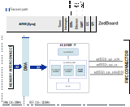

.. _ad3552r_evb:

AD3552R-EVB HDL project
================================================================================

Overview
-------------------------------------------------------------------------------

The :adi:`EVAL-AD3552R` is an evaluation board for the
:adi:`AD3552R`, a dual-channel, 16-bit fast precision
digital-to-analog converter (DAC). Each channel of the :adi:`AD3552R`
is equipped with a different transimpedance amplifier: Channel 0 has a fast
amplifier that achieves the optimal dynamic performance and Channel 1 has a
precision amplifier that guarantees the optimal DC precision over temperature.

The board allows testing all the output ranges of the DAC, waveform generation,
power supply and reference options.

Supported boards
-------------------------------------------------------------------------------

- :adi:`EVAL-AD3552R`

Supported devices
-------------------------------------------------------------------------------

- :adi:`AD3552R`

Supported carriers
-------------------------------------------------------------------------------

.. list-table::
   :widths: 35 35 30
   :header-rows: 1

   * - Evaluation board
     - Carrier
     - FMC slot
   * - :adi:`EVAL-AD3552R <EVAL-AD3552R>`
     - :xilinx:`ZedBoard <products/boards-and-kits/1-8dyf-11.html>`
     - FMC-LPC

Block design
-------------------------------------------------------------------------------

.. warning::

    The VADJ for Zedboard must be set to 1.8V.

Block diagram
~~~~~~~~~~~~~~~~~~~~~~~~~~~~~~~~~~~~~~~~~~~~~~~~~~~~~~~~~~~~~~~~~~~~~~~~~~~~~~~

The data path and clock domains are depicted in the below diagram:

CPU/Memory interconnects addresses
~~~~~~~~~~~~~~~~~~~~~~~~~~~~~~~~~~~~~~~~~~~~~~~~~~~~~~~~~~~~~~~~~~~~~~~~~~~~~~~

The addresses are dependent on the architecture of the FPGA, having an offset
added to the base address from HDL (see more at :ref:`architecture cpu-intercon-addr`).

====================  ===============
Instance              Zynq/Microblaze
====================  ===============
axi_ad3552r_dac       0x44A7_0000
axi_dac_dma           0x44A3_0000
axi_clkgen            0x44B0_0000
====================  ===============

GPIOs
~~~~~~~~~~~~~~~~~~~~~~~~~~~~~~~~~~~~~~~~~~~~~~~~~~~~~~~~~~~~~~~~~~~~~~~~~~~~~~~

.. list-table::
   :widths: 25 20 20 20 15
   :header-rows: 2

   * - GPIO signal
     - Direction
     - HDL GPIO EMIO
     - Software GPIO
     - Software GPIO
   * -
     - (from FPGA view)
     -
     - Zynq-7000
     - Zynq MP
   * - ad3552r_resetn
     - OUT
     - 38
     - 92
     - 116
   * - ad3552r_gpio_9
     - INOUT
     - 37
     - 91
     - 115
   * - ad3552r_gpio_8
     - INOUT
     - 36
     - 90
     - 114
   * - ad3552r_gpio_7
     - INOUT
     - 35
     - 89
     - 113
   * - ad3552r_gpio_6
     - INOUT
     - 34
     - 88
     - 112
   * - ad3552r_alertn
     - INOUT
     - 33
     - 87
     - 111
   * - ad3552r_ldacn
     - INOUT
     - 32
     - 86
     - 110

Interrupts
~~~~~~~~~~~~~~~~~~~~~~~~~~~~~~~~~~~~~~~~~~~~~~~~~~~~~~~~~~~~~~~~~~~~~~~~~~~~~~~

Below are the Programmable Logic interrupts used in this project.

================ === ========== ===========
Instance name    HDL Linux Zynq Actual Zynq
================ === ========== ===========
axi_dac_dma      13  57         89
================ === ========== ===========

Building the HDL project
-------------------------------------------------------------------------------

The design is built upon ADI's generic HDL reference design framework.
ADI distributes the bit/elf files of these projects as part of the
:dokuwiki:`ADI Kuiper Linux <resources/tools-software/linux-software/kuiper-linux>`.
If you want to build the sources, ADI makes them available on the
:git-hdl:`HDL repository </>`. To get the source you must
`clone <https://git-scm.com/book/en/v2/Git-Basics-Getting-a-Git-Repository>`__
the HDL repository, and then build the project as follows:

**Linux/Cygwin/WSL**

.. shell::

   $cd hdl/projects/ad3552r_evb/zed
   $make

A more comprehensive build guide can be found in the :ref:`build_hdl` user guide.

Resources
-------------------------------------------------------------------------------

Systems related
~~~~~~~~~~~~~~~~~~~~~~~~~~~~~~~~~~~~~~~~~~~~~~~~~~~~~~~~~~~~~~~~~~~~~~~~~~~~~~~

- :dokuwiki:`[Wiki] EVAL-AD3552R Evaluation Board on ZedBoard User Guide <resources/eval/user-guides/dac/ad3552r_eval_zed>`

Hardware related
~~~~~~~~~~~~~~~~~~~~~~~~~~~~~~~~~~~~~~~~~~~~~~~~~~~~~~~~~~~~~~~~~~~~~~~~~~~~~~~

- Product datasheets:

  - :adi:`AD3552R`
  - :adi:`EVAL-AD3552R`

- :adi:`UG-2217, User Guide | EVAL-AD3552R <media/en/technical-documentation/user-guides/eval-ad3552r-ug-2217.pdf>`

HDL related
~~~~~~~~~~~~~~~~~~~~~~~~~~~~~~~~~~~~~~~~~~~~~~~~~~~~~~~~~~~~~~~~~~~~~~~~~~~~~~~

- :git-hdl:`EVAL-AD3552R HDL project source code <projects/ad3552r_evb>`

.. list-table::
   :widths: 30 35 35
   :header-rows: 1

   * - IP name
     - Source code link
     - Documentation link

   * - AXI_AD3552R
     - :git-hdl:`library/axi_ad3552r`
     - :ref:`axi_ad3552r`
   * - AXI_CLKGEN
     - :git-hdl:`library/axi_clkgen`
     - :ref:`axi_clkgen`
   * - AXI_DMAC
     - :git-hdl:`library/axi_dmac`
     - :ref:`axi_dmac`
   * - AXI_HDMI_TX
     - :git-hdl:`library/axi_hdmi_tx`
     - :ref:`axi_hdmi_tx`
   * - AXI_I2S_ADI
     - :git-hdl:`library/axi_i2s_adi`
     - —
   * - AXI_SPDIF_TX
     - :git-hdl:`library/axi_spdif_tx`
     - 	—
   * - AXI_SYSID
     - :git-hdl:`library/axi_sysid`
     - :ref:`axi_sysid`
   * - SYSID_ROM
     - :git-hdl:`library/sysid_rom`
     - :ref:`axi_sysid`
   * - UTIL_I2C_MIXER
     - :git-hdl:`library/util_i2c_mixer`
     - 	—

Software related
~~~~~~~~~~~~~~~~~~~~~~~~~~~~~~~~~~~~~~~~~~~~~~~~~~~~~~~~~~~~~~~~~~~~~~~~~~~~~~

- :dokuwiki:`[Wiki] AD3552R Dual Channel, 16-Bit, 33 MUPS, Multispan, Multi-IO SPI DAC Linux device driver </resources/tools-software/linux-drivers/iio-dac/axi-ad3552r>`

.. include:: ../common/more_information.rst

.. include:: ../common/support.rst
