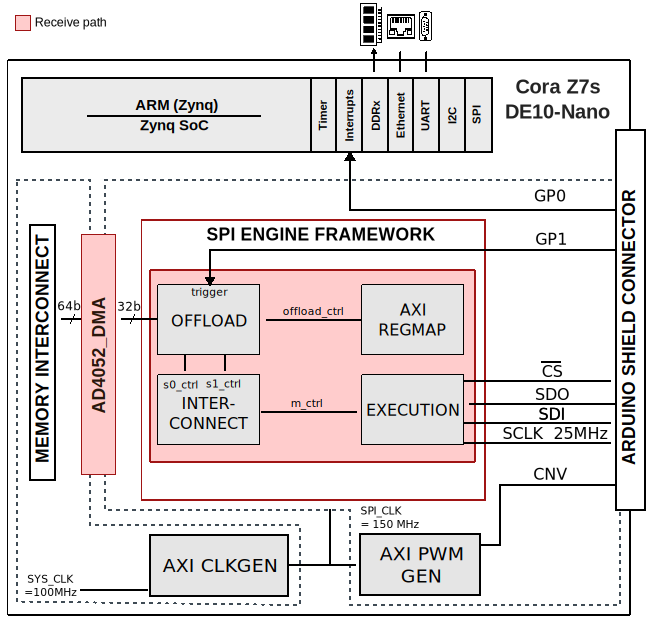

.. _ad4052_ardz:

AD4052-ARDZ HDL project
================================================================================

Overview
--------------------------------------------------------------------------------

The HDL reference design for the :adi:`AD4050`, :adi:`AD4052`, :adi:`AD4056`, and
:adi:`AD4058`.
They are versatile, 16-bit/12-bit, successive approximation register (SAR)
analog-to-digital converters (ADCs) that enable low-power, high-density data
acquisition solutions without sacrificing precision. These ADCs offer a unique
balance of performance and power efficiency, plus innovative features for
seamlessly switching between high-resolution and low-power modes tailored to the
immediate needs of the system.

The :adi:`AD4050`/:adi:`AD4052`/:adi:`AD4056`/:adi:`AD4058` are ideal for
battery-powered, compact data acquisition and edge sensing applications.

The :adi:`EVAL-AD4050-ARDZ`/:adi:`EVAL-AD4052-ARDZ` evaluation boards enable
quick and easy evaluation of the performance and features of the :adi:`AD4050`
or the :adi:`AD4052`, respectively.

This project has a :ref:`spi_engine` instance to control and acquire data from
the precision ADC.
This instance provides support for capturing continuous samples at the maximum
sample rate.

Supported boards
-------------------------------------------------------------------------------

- :adi:`EVAL-AD4050-ARDZ`
- :adi:`EVAL-AD4052-ARDZ`

Supported devices
-------------------------------------------------------------------------------

- :adi:`AD4050`
- :adi:`AD4052`
- :adi:`AD4056`
- :adi:`AD4058`

Supported carriers
-------------------------------------------------------------------------------

- `Cora Z7S <https://digilent.com/shop/cora-z7-zynq-7000-single-core-for-arm-fpga-soc-development>`__
  Arduino shield connector
- :intel:`DE10-Nano <content/www/us/en/developer/topic-technology/edge-5g/hardware/fpga-de10-nano.html>`
  Arduino shield connector

Block design
-------------------------------------------------------------------------------

Block diagram
~~~~~~~~~~~~~~~~~~~~~~~~~~~~~~~~~~~~~~~~~~~~~~~~~~~~~~~~~~~~~~~~~~~~~~~~~~~~~~~

The data path and clock domains are depicted in the below diagram:

CPU/Memory interconnects addresses
~~~~~~~~~~~~~~~~~~~~~~~~~~~~~~~~~~~~~~~~~~~~~~~~~~~~~~~~~~~~~~~~~~~~~~~~~~~~~~~

The addresses are dependent on the architecture of the FPGA, having an offset
added to the base address from HDL (see more at :ref:`architecture`).

.. table:: Cora Z7S

   ========================  ===========
   Instance                  Address
   ========================  ===========
   spi_adc_axi_regmap        0x44A0_0000
   spi_adc_dmac              0x44A3_0000
   axi_iic_eeprom            0x44A4_0000
   spi_clkgen                0x44A7_0000
   adc_trigger_gen           0x44B0_0000
   ========================  ===========

.. table:: DE10-Nano

   ========================  ===========
   Instance                  Address
   ========================  ===========
   axi_dmac_0                0x0002_0000
   axi_spi_engine_0          0x0003_0000
   pwm_trigger               0x0004_0000
   spi_clk_pll_reconfig      0x0005_0000
   ========================  ===========

I2C connections
~~~~~~~~~~~~~~~~~~~~~~~~~~~~~~~~~~~~~~~~~~~~~~~~~~~~~~~~~~~~~~~~~~~~~~~~~~~~~~~

.. list-table:: Cora Z7s
   :header-rows: 1

   * - I2C type
     - I2C manager instance
     - Alias
     - Address
     - Device Address
     - I2C subordinate
   * - PS
     - axi_iic_eeprom
     - axi_iic_eeprom_io
     - 0x44A4_0000
     - 0x52
     - EEPROM

.. list-table:: DE10-Nano
   :header-rows: 1

   * - I2C type
     - I2C manager instance
     - Alias
     - Address
     - Device Address
     - I2C subordinate
   * - PS
     - i2c1
     - sys_hps_i2c1
     - ---
     - 0x52
     - ---

Device address considering the EEPROM address pins ``A0=0``, ``A1=1``, ``A2=0``.

SPI connections
~~~~~~~~~~~~~~~~~~~~~~~~~~~~~~~~~~~~~~~~~~~~~~~~~~~~~~~~~~~~~~~~~~~~~~~~~~~~~~~

.. list-table::
   :widths: 25 25 25 25
   :header-rows: 1

   * - SPI type
     - SPI manager instance
     - SPI subordinate
     - CS
   * - PL
     - axi_spi_engine
     - ad4052
     - 0

GPIOs
~~~~~~~~~~~~~~~~~~~~~~~~~~~~~~~~~~~~~~~~~~~~~~~~~~~~~~~~~~~~~~~~~~~~~~~~~~~~~~~

The Software GPIO number is calculated as follows:

-  Cora Z7S: the offset is 54

.. list-table::
   :widths: 25 25 25 25
   :header-rows: 2

   * - GPIO signal
     - Direction
     - HDL GPIO EMIO
     - Software GPIO
   * -
     - (from FPGA view)
     -
     - Zynq-7000
   * - adc_cnv
     - OUTPUT
     - 34
     - 88
   * - adc_gp1
     - INOUT
     - 33
     - 87
   * - adc_gp0
     - INOUT
     - 32
     - 86

-  DE10-Nano: the offset is 32

.. list-table::
   :widths: 25 25 25 25
   :header-rows: 2

   * - GPIO signal
     - Direction
     - HDL GPIO EMIO
     - Software GPIO
   * -
     - (from FPGA view)
     -
     - DE10-Nano
   * - adc_cnv
     - OUTPUT
     - 34
     - 2
   * - adc_gp1
     - INPUT
     - 33
     - 1
   * - adc_gp0
     - INPUT
     - 32
     - 0

Interrupts
~~~~~~~~~~~~~~~~~~~~~~~~~~~~~~~~~~~~~~~~~~~~~~~~~~~~~~~~~~~~~~~~~~~~~~~~~~~~~~~

Below are the Programmable Logic interrupts used in this project.

=================== === ========== ===========
Instance name       HDL Linux Zynq Actual Zynq
=================== === ========== ===========
axi_adc_dma         13  57         89
spi_adc_axi_regmap  12  56         88
axi_iic_eeprom      11  55         87
=================== === ========== ===========

================ === =============== ================
Instance name    HDL Linux DE10-Nano Actual DE10-Nano
================ === =============== ================
axi_dmac_0       4   44               76
axi_spi_engine_0 3   43               75
================ === =============== ================

Building the HDL project
-------------------------------------------------------------------------------

The design is built upon ADI's generic HDL reference design framework.
ADI distributes the bit/elf files of these projects as part of the
:dokuwiki:`ADI Kuiper Linux <resources/tools-software/linux-software/kuiper-linux>`.
If you want to build the sources, ADI makes them available on the
:git-hdl:`HDL repository </>`. To get the source you must
`clone <https://git-scm.com/book/en/v2/Git-Basics-Getting-a-Git-Repository>`__
the HDL repository, and then build the project as follows:

**Linux/Cygwin/WSL**

.. shell::

   $cd hdl/projects/ad4052_ardz/coraz7s
   $make

.. shell::

   $cd hdl/projects/ad4052_ardz/de10nano
   $make

A more comprehensive build guide can be found in the :ref:`build_hdl` user guide.

Resources
-------------------------------------------------------------------------------

Hardware related
~~~~~~~~~~~~~~~~~~~~~~~~~~~~~~~~~~~~~~~~~~~~~~~~~~~~~~~~~~~~~~~~~~~~~~~~~~~~~~~

- Product datasheets:

  - :adi:`AD4050`
  - :adi:`AD4052`

HDL related
~~~~~~~~~~~~~~~~~~~~~~~~~~~~~~~~~~~~~~~~~~~~~~~~~~~~~~~~~~~~~~~~~~~~~~~~~~~~~~~

-  :git-hdl:`AD4052-ARDZ HDL project source code <projects/ad4052-ardz>`

.. list-table::
   :widths: 30 35 35
   :header-rows: 1

   * - IP name
     - Source code link
     - Documentation link
   * - AXI_PWM_GEN
     - :git-hdl:`library/axi_pwm_gen <library/axi_pwm_gen>`
     - :ref:`here <axi_pwm_gen>`
   * - AXI_CLKGEN
     - :git-hdl:`library/axi_dmac <library/axi_clkgen>` *
     - :ref:`here <axi_clkgen>`
   * - AXI_DMAC
     - :git-hdl:`library/axi_dmac <library/axi_dmac>`
     - :ref:`here <axi_dmac>`
   * - AXI_HDMI_TX
     - :git-hdl:`library/axi_hdmi_tx <library/axi_hdmi_tx>` **
     - :ref:`here <axi_hdmi_tx>`
   * - AXI_SYSID
     - :git-hdl:`library/axi_sysid <library/axi_sysid>`
     - :ref:`here <axi_sysid>`
   * - AXI_SPI_ENGINE
     - :git-hdl:`library/spi_engine/axi_spi_engine <library/spi_engine/axi_spi_engine>`
     - :ref:`here <spi_engine axi>`
   * - SPI_ENGINE_EXECUTION
     - :git-hdl:`library/spi_engine/spi_engine_execution <library/spi_engine/spi_engine_execution>`
     - :ref:`here <spi_engine execution>`
   * - SPI_ENGINE_INTERCONNECT
     - :git-hdl:`library/spi_engine/spi_engine_interconnect <library/spi_engine/spi_engine_interconnect>`
     - :ref:`here <spi_engine interconnect>`
   * - SPI_ENGINE_OFFLOAD
     - :git-hdl:`library/spi_engine/spi_engine_offload`
     - :ref:`here <spi_engine offload>`
   * - SYSID_ROM
     - :git-hdl:`library/sysid_rom <library/sysid_rom>`
     - :ref:`here <axi_sysid>`

.. admonition:: Legend
   :class: note

   -   ``*`` instantiated only for Cora Z7S
   -   ``**`` instantiated only for DE10-Nano

-  :ref:`SPI Engine Framework documentation <spi_engine>`

Software related
~~~~~~~~~~~~~~~~~~~~~~~~~~~~~~~~~~~~~~~~~~~~~~~~~~~~~~~~~~~~~~~~~~~~~~~~~~~~~~~

- :git-linux:`AD4052 Linux driver ad4052.c <drivers/iio/adc/ad4052.c>`

.. include:: ../common/more_information.rst

.. include:: ../common/support.rst
