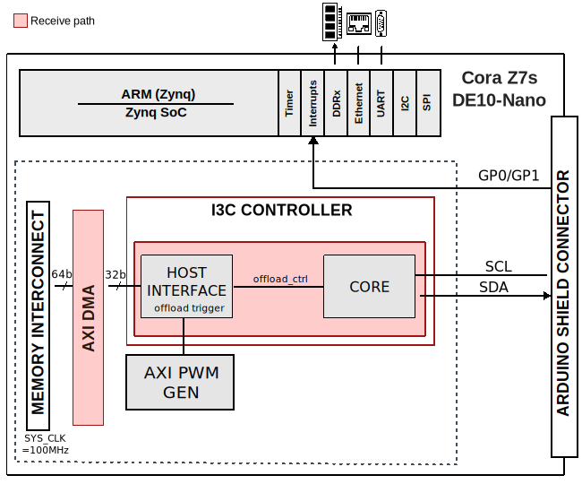

.. _ad4062_ardz:

AD4062-ARDZ HDL project
================================================================================

Overview
--------------------------------------------------------------------------------

The HDL reference design for the :adi:`AD4060`, :adi:`AD4062`.
They are versatile, 16-bit/12-bit, successive approximation register (SAR)
analog-to-digital converters (ADCs) that enable low-power, high-density data
acquisition solutions without sacrificing precision. These ADCs offer a unique
balance of performance and power efficiency, plus innovative features for
seamlessly switching between high-resolution and low-power modes tailored to the
immediate needs of the system.

The :adi:`AD4060 <eval-ad4060-eval-ad4062>`/:adi:`AD4062 <eval-ad4060-eval-ad4062>`
evaluation boards enable quick and easy evaluation of the performance and
features of the :adi:`AD4060` or the :adi:`AD4062`, respectively.

This project has an :ref:`i3c_controller` instance to control and acquire data
from the precision ADC.

Supported boards
-------------------------------------------------------------------------------

- :adi:`EVAL-AD4060`
- :adi:`EVAL-AD4062`

Supported devices
-------------------------------------------------------------------------------

- :adi:`AD4060`
- :adi:`AD4062`

Supported carriers
-------------------------------------------------------------------------------

- `Cora Z7S <https://digilent.com/shop/cora-z7-zynq-7000-single-core-for-arm-fpga-soc-development>`__
  Arduino shield connector
- :intel:`DE10-Nano <content/www/us/en/developer/topic-technology/edge-5g/hardware/fpga-de10-nano.html>`
  Arduino shield connector

Block design
-------------------------------------------------------------------------------

Block diagram
~~~~~~~~~~~~~~~~~~~~~~~~~~~~~~~~~~~~~~~~~~~~~~~~~~~~~~~~~~~~~~~~~~~~~~~~~~~~~~~

The data path and clock domains are depicted in the below diagram:

Configuration modes
~~~~~~~~~~~~~~~~~~~~~~~~~~~~~~~~~~~~~~~~~~~~~~~~~~~~~~~~~~~~~~~~~~~~~~~~~~~~~~~

The ``OFFLOAD`` parameter is used to enable the offload interface, as well as
adding the :ref:`axi_dmac` and :ref:`axi_pwm_gen` to the design.

- 0 - no offload (default)
- 1 - with default

CPU/Memory interconnects addresses
~~~~~~~~~~~~~~~~~~~~~~~~~~~~~~~~~~~~~~~~~~~~~~~~~~~~~~~~~~~~~~~~~~~~~~~~~~~~~~~

The addresses are dependent on the architecture of the FPGA, having an offset
added to the base address from HDL (see more at :ref:`architecture`).

.. table:: Cora Z7S

   ===============  ===========
   Instance         Address
   ===============  ===========
   i3c_controller   0x44A0_0000
   i3c_offload_dma  0x44A3_0000
   i3c_offload_pwm  0x44B0_0000
   ===============  ===========

.. table:: DE10-Nano

   ===============  ===========
   Instance         Address
   ===============  ===========
   i3c_offload_dma  0x0002_0000
   i3c_controller   0x0003_0000
   i3c_offload_pwm  0x0004_0000
   ===============  ===========

I3C/I2C connections
~~~~~~~~~~~~~~~~~~~~~~~~~~~~~~~~~~~~~~~~~~~~~~~~~~~~~~~~~~~~~~~~~~~~~~~~~~~~~~~

.. list-table:: Cora Z7s
   :header-rows: 1

   * - I2C/I3C subordinate
     - address
     - I3C manager
   * - EEPROM
     - 0x52
     - i3c_controller
   * - ADC
     - i3c_controller
     - Provisioned PID

.. list-table:: DE10-Nano
   :header-rows: 1

   * - I2C/I3C subordinate
     - EEPROM
     - I3C manager
   * - EEPROM
     - 0x52
     - i3c_controller
   * - ADC
     - i3c_controller
     - Provisioned PID

.. caution::

   By default, the DE10-Nano does not populate the passive pull-up in the SDA
   lane (DNI). Either populate the DE10-Nano's resistor R1 with a 2.2k ohm
   resistor, or use the ``WEAK_PULL_UP_RESISTOR`` to the ``i3c_sda`` pin.

Device address considering the EEPROM address pins ``A0=0``, ``A1=1``, ``A2=0``.
For the ADC, check the part datasheet and the set address pins.

GPIOs
~~~~~~~~~~~~~~~~~~~~~~~~~~~~~~~~~~~~~~~~~~~~~~~~~~~~~~~~~~~~~~~~~~~~~~~~~~~~~~~

The Software GPIO number is calculated as follows:

-  Cora Z7S: the offset is 54

.. list-table::
   :widths: 25 25 25 25
   :header-rows: 2

   * - GPIO signal
     - Direction
     - HDL GPIO EMIO
     - Software GPIO
   * -
     - (from FPGA view)
     -
     - Zynq-7000
   * - adc_gp1
     - INOUT
     - 33
     - 87
   * - adc_gp0
     - INOUT
     - 32
     - 86

-  DE10-Nano: the offset is 32

.. list-table::
   :widths: 25 25 25 25
   :header-rows: 2

   * - GPIO signal
     - Direction
     - HDL GPIO EMIO
     - Software GPIO
   * -
     - (from FPGA view)
     -
     -
   * - adc_gp1
     - INPUT
     - 33
     - 1
   * - adc_gp0
     - INPUT
     - 32
     - 0

Interrupts
~~~~~~~~~~~~~~~~~~~~~~~~~~~~~~~~~~~~~~~~~~~~~~~~~~~~~~~~~~~~~~~~~~~~~~~~~~~~~~~

Below are the Programmable Logic interrupts used in this project.

=================== === ========== ===========
Instance name       HDL Linux Zynq Actual Zynq
=================== === ========== ===========
axi_adc_dma         13  57         89
i3c_controller      12  56         88
=================== === ========== ===========

================ === =============== ================
Instance name    HDL Linux DE10-Nano Actual DE10-Nano
================ === =============== ================
i3c_controller   5   45              77
axi_dmac         4   44              76
================ === =============== ================

Building the HDL project
-------------------------------------------------------------------------------

The design is built upon ADI's generic HDL reference design framework.
ADI distributes the bit/elf files of these projects as part of the
:dokuwiki:`ADI Kuiper Linux <resources/tools-software/linux-software/kuiper-linux>`.
If you want to build the sources, ADI makes them available on the
:git-hdl:`HDL repository </>`. To get the source you must
`clone <https://git-scm.com/book/en/v2/Git-Basics-Getting-a-Git-Repository>`__
the HDL repository, and then build the project as follows:

**Linux/Cygwin/WSL**

.. shell::

   $cd hdl/projects/ad4062_ardz/coraz7s
   $make

.. shell::

   $cd hdl/projects/ad4062_ardz/de10nano
   $make

A more comprehensive build guide can be found in the :ref:`build_hdl` user guide.

Resources
-------------------------------------------------------------------------------

Hardware related
~~~~~~~~~~~~~~~~~~~~~~~~~~~~~~~~~~~~~~~~~~~~~~~~~~~~~~~~~~~~~~~~~~~~~~~~~~~~~~~

- Product datasheets:

  - :adi:`AD4060`
  - :adi:`AD4062`

HDL related
~~~~~~~~~~~~~~~~~~~~~~~~~~~~~~~~~~~~~~~~~~~~~~~~~~~~~~~~~~~~~~~~~~~~~~~~~~~~~~~

-  :git-hdl:`AD4062-ARDZ HDL project source code <projects/ad4062-ardz>`

.. list-table::
   :widths: 30 35 35
   :header-rows: 1

   * - IP name
     - Source code link
     - Documentation link
   * - AXI_SYSID
     - :git-hdl:`library/axi_sysid <library/axi_sysid>`
     - :ref:`here <axi_sysid>`
   * - AXI_PWM_GEN
     - :git-hdl:`library/axi_pwm_gen <library/axi_pwm_gen>`
     - :ref:`here <axi_pwm_gen>`
   * - AXI_DMAC
     - :git-hdl:`library/axi_dmac <library/axi_dmac>`
     - :ref:`here <axi_dmac>`
   * - AXI_HDMI_TX
     - :git-hdl:`library/axi_hdmi_tx <library/axi_hdmi_tx>` *
     - :ref:`here <axi_hdmi_tx>`
   * - I3C_CONTROLLER_HOST_INTERFACE
     - :git-hdl:`library/i3c_controller/i3c_controller_host_interface`
     - :ref:`here <i3c_controller host_interface>`
   * - I3C_CONTROLLER_CORE
     - :git-hdl:`library/i3c_controller/i3c_controller_core`
     - :ref:`here <i3c_controller core>`
   * - SYSID_ROM
     - :git-hdl:`library/sysid_rom <library/sysid_rom>`
     - :ref:`here <axi_sysid>`

.. admonition:: Legend
   :class: note

   - ``*`` instantiated only for DE10-Nano

-  :ref:`I3C Controller documentation <i3c_controller>`

.. include:: ../common/more_information.rst

.. include:: ../common/support.rst
