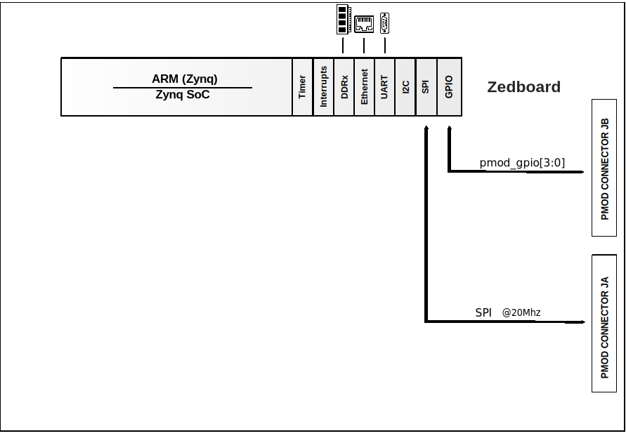

.. _ad4110:

AD4110 HDL project
================================================================================

Overview
--------------------------------------------------------------------------------

The :adi:`AD4110-1` is a complete, single-channel, universal input
analog-to-digital front end for industrial process control systems where sensor
type flexibility is required.

The high voltage input is fully software configurable for current or voltage
ranges and allow direct interface to all standard industrial analog signal
sources such as, ±20 mA, ±4 mA to ±20 mA, ±10 V, and all thermocouple types.
Field power can be supplied for loop powered current output sensors. A range of
excitation current sources for RTD sensors and other resistive sensors are
included. The integrated programmable gain amplifier, PGA, offers sixteen gain
settings from 0.2 to 24.

The high voltage input can be programmed to power up in either voltage or
current mode. When programmed to current mode, the unique input circuit
architecture provides a path for the loop current even in the absence of the
system module power supply.

The :adi:`AD4110-1` provides internal front-end diagnostic functions to indicate
overvoltage, undervoltage, open wire, overcurrent and overtemperature
conditions. The high voltage input is overcurrent limited and overvoltage
protected up to ±35 V.

The :adi:`AD4110-1` incorporates a 24-bit sigma delta analog to digital converter
offering conversion rates from 5 SPS to 125 kSPS with simultaneous 50 Hz and
60 Hz noise rejection.

Applications:

* Process control and industrial automation
* Remote and distributed control systems
* Instrumentation and measurement
* Sensor and data acquisition

Supported boards
-------------------------------------------------------------------------------

- :adi:`EVAL-AD4110-1`

Supported devices
-------------------------------------------------------------------------------

- :adi:`AD4110-1`

Supported carriers
-------------------------------------------------------------------------------

- `ZedBoard <https://digilent.com/shop/zedboard-zynq-7000-arm-fpga-soc-development-board>`__ on PMODs

Block design
-------------------------------------------------------------------------------

Block diagram
~~~~~~~~~~~~~~~~~~~~~~~~~~~~~~~~~~~~~~~~~~~~~~~~~~~~~~~~~~~~~~~~~~~~~~~~~~~~~~~

The data path and clock domains are depicted in the below diagram:

Jumper setup
~~~~~~~~~~~~~~~~~~~~~~~~~~~~~~~~~~~~~~~~~~~~~~~~~~~~~~~~~~~~~~~~~~~~~~~~~~~~~~~~~~

================== ================ =============================================
Jumper/Solder link Default Position Description
================== ================ =============================================
SL1                A                Connects the 5 V output of the :adi:`ADP7102`
                                    to the DVDD rail to supply the IOVDD pins of
                                    the :adi:`AD4110-1`
SL2                A                Valid SDP connection to evaluation board LED
SL3                A                Connects J8 AINCOM to Pin 26 (AINCOM(LV)) of
                                    the :adi:`AD4110-1`
SL4                A                Connects GND to Pin 28 (AIN2(LV)) of the
                                    :adi:`AD4110-1`
SL5                A                Connects VOUT of the TMP36 temperature sensor
                                    to Pin 27 (AIN1(LV)) of the :adi:`AD4110-1`
================== ================ =============================================

Hardware setup
~~~~~~~~~~~~~~~~~~~~~~~~~~~~~~~~~~~~~~~~~~~~~~~~~~~~~~~~~~~~~~~~~~~~~~~~~~~~~~~~~~

============ ================ ==============
Signal       AD4110 Testpoint  ZedBoard PMOD
============ ================ ==============
CS           CS               JA1
DIN(MOSI)    DIN              JA2
DOUT/RDY     DOUT             JA3
SCLK         SCLK             JA10
pmod_gpio[0] DOUT             JB1
3V3          SDP+3.3V(C43+)   JA6
GND          GND(C43-)        JA5
============ ================ ==============

The evaluation board is powered by the 3.3V voltage from the ZedBoard's PMOD
(Green color of LED1 indicates valid SDP connection to the evaluation board).
Also, the evaluation board is powered by a ±15V power supply connected to J14
(LED3 indicates a 5V supply to the evaluation board).

GPIOs
~~~~~~~~~~~~~~~~~~~~~~~~~~~~~~~~~~~~~~~~~~~~~~~~~~~~~~~~~~~~~~~~~~~~~~~~~~~~~~~

The Software GPIO number is calculated as follows:

- Zynq-7000: if PS7 is used, then the offset is 54

.. list-table::
   :widths: 25 25 25 25
   :header-rows: 2

   * - GPIO signal
     - Direction
     - HDL GPIO EMIO
     - Software GPIO
   * -
     - (from FPGA view)
     -
     - Zynq-7000
   * - pmod_gpio[3:0]
     - INOUT
     - 35:32
     - 89:86

Building the HDL project
-------------------------------------------------------------------------------

The design is built upon ADI's generic HDL reference design framework.
ADI distributes the bit/elf files of these projects as part of the
:dokuwiki:`ADI Kuiper Linux <resources/tools-software/linux-software/kuiper-linux>`.
If you want to build the sources, ADI makes them available on the
:git-hdl:`HDL repository </>`. To get the source you must
`clone <https://git-scm.com/book/en/v2/Git-Basics-Getting-a-Git-Repository>`__
the HDL repository, and then build the project as follows:

**Linux/Cygwin/WSL**

.. shell::

   $cd hdl/projects/ad4110/zed
   $make

A more comprehensive build guide can be found in the :ref:`build_hdl` user guide.

Resources
-------------------------------------------------------------------------------

Hardware related
~~~~~~~~~~~~~~~~~~~~~~~~~~~~~~~~~~~~~~~~~~~~~~~~~~~~~~~~~~~~~~~~~~~~~~~~~~~~~~~

- Product datasheet: :adi:`AD4110-1`
- `UG-1203: EVAL-AD4110-1SDZ Board User Guide <https://www.analog.com/media/en/technical-documentation/user-guides/EVAL-AD4110-1SDZ-UG-1203.pdf>`__

HDL related
~~~~~~~~~~~~~~~~~~~~~~~~~~~~~~~~~~~~~~~~~~~~~~~~~~~~~~~~~~~~~~~~~~~~~~~~~~~~~~~

- :git-hdl:`AD4110 HDL project source code <projects/ad4110>`

.. list-table::
   :widths: 30 35 35
   :header-rows: 1

   * - IP name
     - Source code link
     - Documentation link
   * - AXI_CLKGEN
     - :git-hdl:`library/axi_clkgen`
     - :ref:`axi_clkgen`
   * - AXI_DMAC
     - :git-hdl:`library/axi_dmac`
     - :ref:`axi_dmac`
   * - AXI_HDMI_TX
     - :git-hdl:`library/axi_hdmi_tx`
     - :ref:`axi_hdmi_tx`
   * - AXI_I2S_ADI
     - :git-hdl:`library/axi_i2s_adi`
     - ---
   * - AXI_SPDIF_TX
     - :git-hdl:`library/axi_spdif_tx`
     - ---
   * - AXI_SYSID
     - :git-hdl:`library/axi_sysid`
     - :ref:`axi_sysid`
   * - AXI_SYSID_ROM
     - :git-hdl:`library/sysid_rom`
     - :ref:`axi_sysid`
   * - UTIL_I2C_MIXER
     - :git-hdl:`library/util_i2c_mixer`
     - ---

Software related
~~~~~~~~~~~~~~~~~~~~~~~~~~~~~~~~~~~~~~~~~~~~~~~~~~~~~~~~~~~~~~~~~~~~~~~~~~~~~~~

- :git-no-os:`AD4110 No-OS project source code <projects/ad4110>`
- :git-no-os:`AD4110 No-OS Driver source code <drivers/afe/ad4110>`
- :dokuwiki:`AD4110 No-OS Driver documentation <resources/tools-software/uc-drivers/ad4110>`
- :dokuwiki:`AD4110 IIO Application <resources/tools-software/product-support-software/ad4110_mbed_iio_application>`

.. include:: ../common/more_information.rst

.. include:: ../common/support.rst
