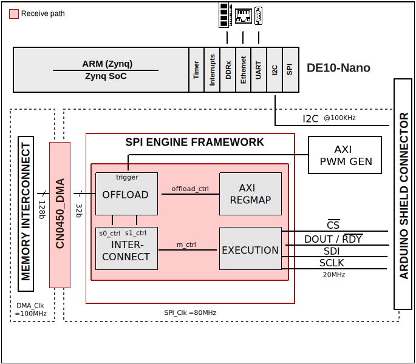

.. _ad411x_ad717x:

AD411x-AD717x HDL project
==================================================================================

Overview
----------------------------------------------------------------------------------

The :adi:`AD4111` /:adi:`AD4112` /:adi:`AD4114` /:adi:`AD4115`/ :adi:`AD4116` is
a low power, low noise, 24-bit, sigma-delta (Σ-Δ) analog-to-digital converter
(ADC), high impedance (≥1 MΩ) bipolar, ±10 V voltage inputs, and 0 mA to 20 mA
current inputs. The :adi:`AD4111` /:adi:`AD4112` /:adi:`AD4114` /:adi:`AD4115` /
:adi:`AD4116` also integrates key analog and digital signal conditioning blocks
to configure eight individual setups for each analog input channel in use.

The :adi:`AD4111` /:adi:`AD4112` /:adi:`AD4114` features a maximum output data
rate of 31.25 kSPS, :adi:`AD4115` features a maximum output data rate of 125
kSPS and :adi:`AD4116` features a maximum output data rate of 62.5 kSPS.

The :adi:`AD7172-2` /:adi:`AD7172-4` /:adi:`AD7173-8` /:adi:`AD7175-2`/
:adi:`AD7175-8` /:adi:`AD7176-2` /:adi:`AD7177-2` is a low noise, low power,
multiplexed, Σ-Δ analog-to-digital converter (ADC) for low bandwidth input
signals. The :adi:`AD7172-2` /:adi:`AD7172-4` /:adi:`AD7173-8` /:adi:`AD7175-2` /
:adi:`AD7175-8` /:adi:`AD7176-2` /:adi:`AD7177-2` integrates key analog and
digital signal conditioning blocks to allow users to configure an individual
setup for  each analog input channel in use.

The :adi:`AD7172-2` /:adi:`AD7172-4` /:adi:`AD7173-8` features a maximum output
data rate of 31.25 kSPS, :adi:`AD7175-2`/ :adi:`AD7175-8` /:adi:`AD7176-2`
features a maximum output data rate of 250 kSPS and :adi:`AD7177-2` features a
maximum output data rate of 10 kSPS.

The digital filter allows flexible settings, including simultaneous
50 Hz and 60 Hz rejection at a 27.27 SPS output data rate. The user
can select different filter settings depending on the requirements of
each channel in the application.

This project has a :ref:`spi_engine` instance to control and acquire data from
the AD411x/AD717x precision ADC. This instance provides support for
capturing continuous samples at the maximum sample rate.

Supported boards
---------------------------------------------------------------------------------

- :adi:`EVAL-AD4111`
- :adi:`EVAL-AD4112`
- :adi:`EVAL-AD4114`
- :adi:`EVAL-AD4115`
- :adi:`EVAL-AD4116`
- :adi:`EVAL-AD7173-8SDZ`
- :adi:`EVAL-AD7175-8`

Supported devices
---------------------------------------------------------------------------------

- :adi:`AD4111`
- :adi:`AD4112`
- :adi:`AD4114`
- :adi:`AD4115`
- :adi:`AD4116`
- :adi:`AD7172-2`
- :adi:`AD7172-4`
- :adi:`AD7173-8`
- :adi:`AD7175-2`
- :adi:`AD7175-8`
- :adi:`AD7176-2`
- :adi:`AD7177-2`

Supported carriers
-------------------------------------------------------------------------------

- :intel:`DE10-Nano <content/www/us/en/developer/topic-technology/edge-5g/hardware/fpga-de10-nano.html>` Arduino shield connector

Block design
-------------------------------------------------------------------------------

Block diagram
~~~~~~~~~~~~~~~~~~~~~~~~~~~~~~~~~~~~~~~~~~~~~~~~~~~~~~~~~~~~~~~~~~~~~~~~~~~~~~~

The data path and clock domains are depicted in the below diagram:

CPU/Memory interconnects addresses
~~~~~~~~~~~~~~~~~~~~~~~~~~~~~~~~~~~~~~~~~~~~~~~~~~~~~~~~~~~~~~~~~~~~~~~~~~~~~~~

The addresses are dependent on the architecture of the FPGA, having an offset
added to the base address from HDL (see more at :ref:`architecture cpu-intercon-addr`).

========================  ===========
Instance                  DE10-Nano
========================  ===========
axi_dmac_0                0x0002_0000
axi_spi_engine_0          0x0003_0000
trigger_generator         0x0004_0000
========================  ===========

I2C connections
~~~~~~~~~~~~~~~~~~~~~~~~~~~~~~~~~~~~~~~~~~~~~~~~~~~~~~~~~~~~~~~~~~~~~~~~~~~~~~~

.. list-table::
   :widths: 20 20 20 20 20
   :header-rows: 1

   * - I2C type
     - I2C manager instance
     - Alias
     - Address
     - I2C subordinate
   * - PS**
     - i2c1
     - sys_hps_i2c1
     - ---
     - ---

SPI connections
~~~~~~~~~~~~~~~~~~~~~~~~~~~~~~~~~~~~~~~~~~~~~~~~~~~~~~~~~~~~~~~~~~~~~~~~~~~~~~~

.. list-table::
   :widths: 25 25 25 25
   :header-rows: 1

   * - SPI type
     - SPI manager instance
     - SPI subordinate
     - CS
   * - PL
     - axi_spi_engine
     - ad411x_ad717x
     - 0

GPIOs
~~~~~~~~~~~~~~~~~~~~~~~~~~~~~~~~~~~~~~~~~~~~~~~~~~~~~~~~~~~~~~~~~~~~~~~~~~~~~~~

The Software GPIO number is calculated as follows:

- DE10-Nano: the offset is 32

.. list-table::
   :widths: 25 25 25 25
   :header-rows: 2

   * - GPIO signal
     - Direction
     - HDL GPIO EMIO
     - Software GPIO
   * -
     - (from FPGA view)
     -
     - DE10-Nano
   * - spi_miso
     - INPUT
     - 34
     - 2
   * - error
     - INPUT
     - 33
     - 1
   * - sync_error
     - INPUT
     - 32
     - 0

Interrupts
~~~~~~~~~~~~~~~~~~~~~~~~~~~~~~~~~~~~~~~~~~~~~~~~~~~~~~~~~~~~~~~~~~~~~~~~~~~~~~~

Below are the Programmable Logic interrupts used in this project.

================ === =============== ================
Instance name    HDL Linux DE10-Nano Actual DE10-Nano
================ === =============== ================
axi_spi_engine_0 5   45              77
axi_dmac_0       4   44              76
================ === =============== ================

Building the HDL project
-------------------------------------------------------------------------------

The design is built upon ADI's generic HDL reference design framework.
ADI distributes the bit/elf files of these projects as part of the
:dokuwiki:`ADI Kuiper Linux <resources/tools-software/linux-software/kuiper-linux>`.
If you want to build the sources, ADI makes them available on the
:git-hdl:`HDL repository </>`. To get the source you must
`clone <https://git-scm.com/book/en/v2/Git-Basics-Getting-a-Git-Repository>`__
the HDL repository, and then build the project as follows:

**Linux/Cygwin/WSL**

.. shell::

   $cd hdl/projects/ad411x_ad717x/de10nano
   $make

A more comprehensive build guide can be found in the :ref:`build_hdl` user guide.

Resources
-------------------------------------------------------------------------------

Hardware related
~~~~~~~~~~~~~~~~~~~~~~~~~~~~~~~~~~~~~~~~~~~~~~~~~~~~~~~~~~~~~~~~~~~~~~~~~~~~~~~

- Product datasheets:

  - :adi:`AD4111`
  - :adi:`AD4112`
  - :adi:`AD4114`
  - :adi:`AD4115`
  - :adi:`AD4116`
  - :adi:`AD4170-4`
  - :adi:`AD7172-2`
  - :adi:`AD7172-4`
  - :adi:`AD7173-8`
  - :adi:`AD7175-2`
  - :adi:`AD7175-8`
  - :adi:`AD7176-2`
  - :adi:`AD7177-2`

HDL related
~~~~~~~~~~~~~~~~~~~~~~~~~~~~~~~~~~~~~~~~~~~~~~~~~~~~~~~~~~~~~~~~~~~~~~~~~~~~~~~

- :git-hdl:`AD411x_AD717x HDL project source code <projects/ad411x_ad717x>`

.. list-table::
   :widths: 30 35 35
   :header-rows: 1

   * - IP name
     - Source code link
     - Documentation link
   * - AXI_DMAC
     - :git-hdl:`library/axi_dmac`
     - :ref:`axi_dmac`
   * - AXI_HDMI_TX
     - :git-hdl:`library/axi_hdmi_tx`
     - :ref:`axi_hdmi_tx`
   * - AXI_PWM_GEN
     - :git-hdl:`library/axi_pwm_gen`
     - :ref:`axi_pwm_gen`
   * - AXI_SYSID
     - :git-hdl:`library/axi_sysid`
     - :ref:`axi_sysid`
   * - AXI_SPI_ENGINE
     - :git-hdl:`library/spi_engine/axi_spi_engine`
     - :ref:`spi_engine axi`
   * - SPI_ENGINE_EXECUTION
     - :git-hdl:`library/spi_engine/spi_engine_execution`
     - :ref:`spi_engine execution`
   * - SPI_ENGINE_INTERCONNECT
     - :git-hdl:`library/spi_engine/spi_engine_interconnect`
     - :ref:`spi_engine interconnect`
   * - SPI_ENGINE_OFFLOAD
     - :git-hdl:`library/spi_engine/spi_engine_offload`
     - :ref:`spi_engine offload`
   * - SYSID_ROM
     - :git-hdl:`library/sysid_rom`
     - :ref:`axi_sysid`
   * - UTIL_SIGMA_DELTA_SPI
     - :git-hdl:`library/util_sigma_delta_spi`
     - :ref:`util_sigma_delta_spi`

-  :ref:`SPI Engine Framework documentation <spi_engine>`

.. include:: ../common/more_information.rst

.. include:: ../common/support.rst
