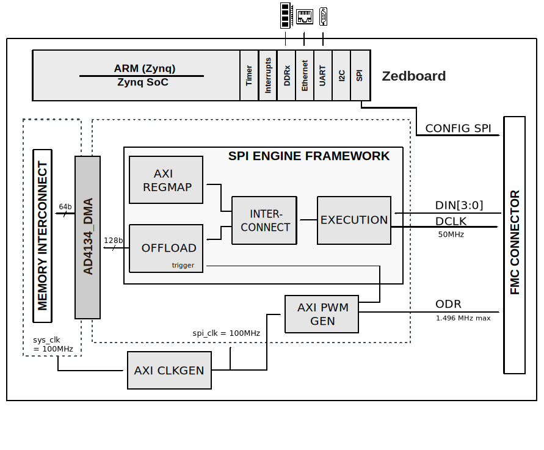

.. _ad4134_fmc:

AD4134-FMC HDL project
===============================================================================

Overview
-------------------------------------------------------------------------------

The :adi:`AD4134` is a quad channel, low noise, simultaneous sampling,
precision  analog-to-digital converter (ADC), based on the continuous time
sigma-delta (CTSD) modulation scheme. This architecture inherently rejects
signals around the ADC aliasing frequency band, giving the device its inherent
antialiasing capability, and removesthe need for a complex external
antialiasing filter.

This device has four independent converter channels in parallel, each with a
CTSD modulator and a digital decimation and filtering path. It enables
simultaneous sampling of four signal sources, with a maximum input bandwidth
of 391.5 kHz. It supports a wide range of ODR frequencies, from 0.01 kSPS to
1496 kSPS wih less than 0.01 SPS adjustment resolution, allowing the user to
granularly vary sampling speed to achieve coherent sampling.

The :adi:`AD4134` supports two device configuration schemes: serial peripheral
interface (SPI) and hardware pin configuration (pin control mode). The SPI
control mode offers access to all the features and configuration options
available on the chip.Pin control mode offers the benefit of simplifying the
device configuration, enabling the device to operate autonomously after
power-up operating in a standalone mode.

The HDL reference design for the EVAL-AD4134 provides all the interfaces that
are necessary to interact with the device using a Xilinx FPGA development
board; to acquire continuous data from the 24-bit 4-channel precision alias
free ADC device.

Supported boards
-------------------------------------------------------------------------------

- :adi:`EVAL-AD4134`

Supported devices
-------------------------------------------------------------------------------

- :adi:`AD4134`

Supported carriers
-------------------------------------------------------------------------------

- `ZedBoard <https://digilent.com/shop/zedboard-zynq-7000-arm-fpga-soc-development-board>`__ on FMC slot

Block design
-------------------------------------------------------------------------------

The reference design uses the SPI Engine Framework to interface with the AD4134
ADC and only supports the slave mode with both DCLK and ODR generated by the
FPGA. The device sends data on the 4 DIN bits.

Block diagram
~~~~~~~~~~~~~~~~~~~~~~~~~~~~~~~~~~~~~~~~~~~~~~~~~~~~~~~~~~~~~~~~~~~~~~~~~~~~~~~

The data path and clock domains are depicted in the below diagram:

Jumper setup
~~~~~~~~~~~~~~~~~~~~~~~~~~~~~~~~~~~~~~~~~~~~~~~~~~~~~~~~~~~~~~~~~~~~~~~~~~~~~~~

================== ========= ===============================
Jumper/Solder link Position  Description
================== ========= ===============================
JP16               Mounted   MODE (Slave) and DCLKIO (Input)
================== ========= ===============================

CPU/Memory interconnects addresses
~~~~~~~~~~~~~~~~~~~~~~~~~~~~~~~~~~~~~~~~~~~~~~~~~~~~~~~~~~~~~~~~~~~~~~~~~~~~~~~

The addresses are dependent on the architecture of the FPGA, having an offset
added to the base address from HDL (see more at :ref:`architecture cpu-intercon-addr`).

========================  ===========
Instance                  Zynq
========================  ===========
spi_ad4134_axi_regmap     0x44A0_0000
axi_ad4134_dma            0x44A3_0000
odr_generator             0x44B0_0000
axi_ad4134_clkgen         0x44B1_0000
========================  ===========

SPI connections
~~~~~~~~~~~~~~~~~~~~~~~~~~~~~~~~~~~~~~~~~~~~~~~~~~~~~~~~~~~~~~~~~~~~~~~~~~~~~~~

.. list-table::
   :widths: 25 25 25 25
   :header-rows: 1

   * - SPI type
     - SPI manager instance
     - SPI subordinate
     - CS
   * - PS
     - SPI 0
     - AD4134
     - 0

GPIOs
~~~~~~~~~~~~~~~~~~~~~~~~~~~~~~~~~~~~~~~~~~~~~~~~~~~~~~~~~~~~~~~~~~~~~~~~~~~~~~~

The Software GPIO number is calculated as follows:

- Zynq-7000: if PS7 is used, then offset is 54

.. list-table::
   :widths: 25 25 25 25
   :header-rows: 2

   * - GPIO signal
     - Direction
     - HDL GPIO EMIO
     - Software GPIO
   * -
     - (from FPGA view)
     -
     - Zynq-7000
   * - ad4134_dclkio
     - INOUT
     - 45
     - 99
   * - ad4134_dclk_mode
     - INOUT
     - 44
     - 98
   * - ad4134_gpio[7:0]
     - INOUT
     - 43:36
     - 97:90
   * - ad4134_pinbspi
     - INOUT
     - 35
     - 89
   * - ad4134_mode
     - INOUT
     - 34
     - 88
   * - ad4134_pdn
     - INOUT
     - 33
     - 87
   * - ad4134_resetn
     - INOUT
     - 32
     - 86

Interrupts
~~~~~~~~~~~~~~~~~~~~~~~~~~~~~~~~~~~~~~~~~~~~~~~~~~~~~~~~~~~~~~~~~~~~~~~~~~~~~~~

Below are the Programmable Logic interrupts used in this project.

=============== === ========== ===========
Instance name   HDL Linux Zynq Actual Zynq
=============== === ========== ===========
axi_ad4134_dma  13  57         89
spi_ad4134      12  56         88
=============== === ========== ===========

Building the HDL project
-------------------------------------------------------------------------------

The design is built upon ADI's generic HDL reference design framework.
ADI distributes the bit/elf files of these projects as part of the
:dokuwiki:`ADI Kuiper Linux <resources/tools-software/linux-software/kuiper-linux>`.
If you want to build the sources, ADI makes them available on the
:git-hdl:`HDL repository </>`. To get the source you must
`clone <https://git-scm.com/book/en/v2/Git-Basics-Getting-a-Git-Repository>`__
the HDL repository, and then build the project as follows:.

**Linux/Cygwin/WSL**

.. shell::

   $cd hdl/projects/ad4134_fmc/zed
   $make

A more comprehensive build guide can be found in the :ref:`build_hdl`
user guide.

Resources
-------------------------------------------------------------------------------

Hardware related
~~~~~~~~~~~~~~~~~~~~~~~~~~~~~~~~~~~~~~~~~~~~~~~~~~~~~~~~~~~~~~~~~~~~~~~~~~~~~~~

- Product datasheet: :adi:`AD4134`
- `UG-2016, EVAL-AD4134FMCZ Board User Guide <https://www.analog.com/media/en/technical-documentation/user-guides/eval-ad4134-ug-2016.pdf>`__

HDL related
~~~~~~~~~~~~~~~~~~~~~~~~~~~~~~~~~~~~~~~~~~~~~~~~~~~~~~~~~~~~~~~~~~~~~~~~~~~~~~~

- :git-hdl:`AD4134-FMC HDL project source code <projects/ad4134_fmc>`

.. list-table::
   :widths: 30 35 35
   :header-rows: 1

   * - IP name
     - Source code link
     - Documentation link
   * - AXI_CLKGEN
     - :git-hdl:`library/axi_clkgen`
     - :ref:`axi_clkgen`
   * - AXI_DMAC
     - :git-hdl:`library/axi_dmac`
     - :ref:`axi_dmac`
   * - AXI_HDMI_TX
     - :git-hdl:`library/axi_hdmi_tx`
     - :ref:`axi_hdmi_tx`
   * - AXI_I2S_ADI
     - :git-hdl:`library/axi_i2s_adi`
     - ---
   * - AXI_PWM_GEN
     - :git-hdl:`library/axi_pwm_gen`
     - :ref:`axi_pwm_gen`
   * - AXI_SPDIF_TX
     - :git-hdl:`library/axi_spdif_tx`
     - ---
   * - AXI_SYSID
     - :git-hdl:`library/axi_sysid`
     - :ref:`axi_sysid`
   * - AXI_SPI_ENGINE
     - :git-hdl:`library/spi_engine/axi_spi_engine`
     - :ref:`spi_engine axi`
   * - SPI_ENGINE_EXECUTION
     - :git-hdl:`library/spi_engine/spi_engine_execution`
     - :ref:`spi_engine execution`
   * - SPI_ENGINE_INTERCONNECT
     - :git-hdl:`library/spi_engine/spi_engine_interconnect`
     - :ref:`spi_engine interconnect`
   * - SPI_ENGINE_OFFLOAD
     - :git-hdl:`library/spi_engine/spi_engine_offload`
     - :ref:`spi_engine offload`
   * - AXI_SYSID_ROM
     - :git-hdl:`library/sysid_rom`
     - :ref:`axi_sysid`
   * - UTIL_I2C_MIXER
     - :git-hdl:`library/util_i2c_mixer`
     - ---

- :ref:`SPI Engine Framework documentation <spi_engine>`

Software related
~~~~~~~~~~~~~~~~~~~~~~~~~~~~~~~~~~~~~~~~~~~~~~~~~~~~~~~~~~~~~~~~~~~~~~~~~~~~~~~

Linux support:

- :git-linux:`Linux device tree zynq-zed-adv7511-ad4134.dts <arch/arm/boot/dts/xilinx/zynq-zed-adv7511-ad4134.dts>`
- :git-linux:`Linux driver ad4134.c <drivers/iio/adc/ad4134.c>`

No-OS support:

- :git-no-os:`AD4134_FMC No-OS project source code <projects/ad413x>`
- :git-no-os:`AD4134/AD7134 No-OS Driver source code <drivers/adc/ad713x>`
- :dokuwiki:`AD4134/AD7134 No-OS Software documentation[Wiki] <resources/tools-software/uc-drivers/ad713x>`

.. include:: ../common/more_information.rst

.. include:: ../common/support.rst
