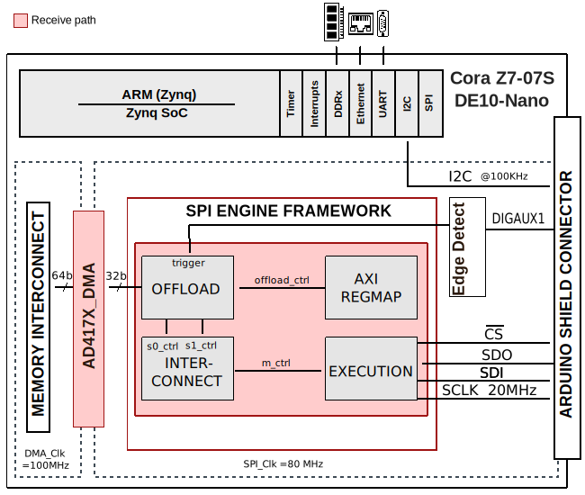

.. _ad4170:

AD4170_ASDZ HDL project
================================================================================

Overview
--------------------------------------------------------------------------------

The HDL reference design for the :adi:`AD4170-4` and :adi:`AD4190-4` provides
a high resolution, 24-Bit, DC to 50 kHz Input Bandwidth, Multichannel,
Low Noise Precision Sigma-Delta ADC with PGA.

The data acquisition board incorporates the AD4170-4, a DC to 50 kHz
input bandwidth, low noise, high speed, completely integrated analog front end
for high precision measurement applications.

The AD4170-4 offers output data rates from 7.6 SPS up to 500 kSPS, while the
AD4190-4 offers output data rates from 3.8 SPS up to 62.5 kSPS. The devices
contains a low noise, 24-bit Σ-Δ analog-to-digital converter (ADC),
and can be configured to have 4 differential inputs or 8 single-ended or
pseudodifferential inputs. The on-chip low noise gain stage ensures that signals
of small amplitude can be interfaced directly to the devices.

This project has a :ref:`spi_engine` instance to control and acquire data from
the AD4170-4 or AD4190-4 24-bit precision ADC. This instance provides support
for capturing continuous samples at the maximum sample rate.

Supported boards
-------------------------------------------------------------------------------

- :adi:`EVAL-AD4170-ASDZ`
- EVAL-AD4190-ARDZ

Supported devices
-------------------------------------------------------------------------------

- :adi:`AD4170-4`
- :adi:`AD4190-4`

Supported carriers
-------------------------------------------------------------------------------

- `Cora Z7S <https://digilent.com/shop/cora-z7-zynq-7000-single-core-for-arm-fpga-soc-development>`__ Arduino shield connector
- :intel:`DE10-Nano <content/www/us/en/developer/topic-technology/edge-5g/hardware/fpga-de10-nano.html>` Arduino shield connector

Block design
-------------------------------------------------------------------------------

Block diagram
~~~~~~~~~~~~~~~~~~~~~~~~~~~~~~~~~~~~~~~~~~~~~~~~~~~~~~~~~~~~~~~~~~~~~~~~~~~~~~~

The data path and clock domains are depicted in the below diagram:

CPU/Memory interconnects addresses
~~~~~~~~~~~~~~~~~~~~~~~~~~~~~~~~~~~~~~~~~~~~~~~~~~~~~~~~~~~~~~~~~~~~~~~~~~~~~~~

The addresses are dependent on the architecture of the FPGA, having an offset
added to the base address from HDL (see more at :ref:`architecture cpu-intercon-addr`).

========================  ===============
Instance                  Zynq/DE10-Nano
========================  ===============
spi_ad4170_axi_regmap*    0x44A0_0000
axi_ad4170_dma*           0x44A3_0000
spi_clkgen*               0x44A7_0000
axi_dmac_0**              0x0002_0000
axi_spi_engine_0**        0x0003_0000
========================  ===============

.. admonition:: Legend
   :class: note

   - ``*`` instantiated only for Cora Z7S
   - ``**`` instantiated only for DE10-Nano

I2C connections
~~~~~~~~~~~~~~~~~~~~~~~~~~~~~~~~~~~~~~~~~~~~~~~~~~~~~~~~~~~~~~~~~~~~~~~~~~~~~~~

.. list-table::
   :widths: 20 20 20 20 20
   :header-rows: 1

   * - I2C type
     - I2C manager instance
     - Alias
     - Address
     - I2C subordinate
   * - PL*
     - iic_ard
     - axi_iic_ard
     - 0x4160_0000
     - 24AA32A
   * - PS**
     - i2c1
     - sys_hps_i2c1
     - ---
     - ---

.. admonition:: Legend
   :class: note

   - ``*`` instantiated only for Cora Z7S
   - ``**`` instantiated only for DE10-Nano

SPI connections
~~~~~~~~~~~~~~~~~~~~~~~~~~~~~~~~~~~~~~~~~~~~~~~~~~~~~~~~~~~~~~~~~~~~~~~~~~~~~~~

.. list-table::
   :widths: 25 25 25 25
   :header-rows: 1

   * - SPI type
     - SPI manager instance
     - SPI subordinate
     - CS
   * - PL
     - axi_spi_engine
     - ad4170
     - 0

GPIOs
~~~~~~~~~~~~~~~~~~~~~~~~~~~~~~~~~~~~~~~~~~~~~~~~~~~~~~~~~~~~~~~~~~~~~~~~~~~~~~~

The Software GPIO number is calculated as follows:

- Cora Z7S: the offset is 54

.. list-table::
   :widths: 25 25 25 25
   :header-rows: 2

   * - GPIO signal
     - Direction
     - HDL GPIO EMIO
     - Software GPIO
   * -
     - (from FPGA view)
     -
     - Zynq-7000
   * - dig_aux[1]
     - INOUT
     - 33
     - 87
   * - dig_aux[0]
     - INOUT
     - 32
     - 86

- DE10-Nano: the offset is 32

.. list-table::
   :widths: 25 25 25 25
   :header-rows: 2

   * - GPIO signal
     - Direction
     - HDL GPIO EMIO
     - Software GPIO
   * -
     - (from FPGA view)
     -
     - DE10-Nano
   * - dig_aux[1]
     - INPUT
     - 33
     - 1
   * - dig_aux[0]
     - INPUT
     - 32
     - 0

Interrupts
~~~~~~~~~~~~~~~~~~~~~~~~~~~~~~~~~~~~~~~~~~~~~~~~~~~~~~~~~~~~~~~~~~~~~~~~~~~~~~~

Below are the Programmable Logic interrupts used in this project.

=================== === ========== ===========
Instance name       HDL Linux Zynq Actual Zynq
=================== === ========== ===========
axi_ad4170_dma      13  57         89
spi_ad4170          12  56         88
axi_iic_ard         11  55         87
=================== === ========== ===========

================ === =============== ================
Instance name    HDL Linux DE10-Nano Actual DE10-Nano
================ === =============== ================
axi_spi_engine_0 5   45               77
axi_dmac_0       4   44               76
================ === =============== ================

Building the HDL project
-------------------------------------------------------------------------------

The design is built upon ADI's generic HDL reference design framework.
ADI distributes the bit/elf files of these projects as part of the
:dokuwiki:`ADI Kuiper Linux <resources/tools-software/linux-software/kuiper-linux>`.
If you want to build the sources, ADI makes them available on the
:git-hdl:`HDL repository </>`. To get the source you must
`clone <https://git-scm.com/book/en/v2/Git-Basics-Getting-a-Git-Repository>`__
the HDL repository, and then build the project as follows:

**Linux/Cygwin/WSL**

.. shell::

   $cd hdl/projects/ad4170_asdz/coraz7s
   $make

.. shell::

   $cd hdl/projects/ad4170_asdz/de10nano
   $make

A more comprehensive build guide can be found in the :ref:`build_hdl` user guide.

Resources
-------------------------------------------------------------------------------

Hardware related
~~~~~~~~~~~~~~~~~~~~~~~~~~~~~~~~~~~~~~~~~~~~~~~~~~~~~~~~~~~~~~~~~~~~~~~~~~~~~~~

- Products datasheet:

  - :adi:`AD4170-4`
  - :adi:`AD4190-4`

HDL related
~~~~~~~~~~~~~~~~~~~~~~~~~~~~~~~~~~~~~~~~~~~~~~~~~~~~~~~~~~~~~~~~~~~~~~~~~~~~~~~

- :git-hdl:`AD4170_ASDZ HDL project source code <projects/ad4170_asdz>`

.. list-table::
   :widths: 30 35 35
   :header-rows: 1

   * - IP name
     - Source code link
     - Documentation link
   * - AXI_CLKGEN
     - :git-hdl:`library/axi_clkgen` *
     - :ref:`axi_clkgen`
   * - AXI_DMAC
     - :git-hdl:`library/axi_dmac`
     - :ref:`axi_dmac`
   * - AXI_HDMI_TX
     - :git-hdl:`library/axi_hdmi_tx` **
     - :ref:`axi_hdmi_tx`
   * - AXI_SYSID
     - :git-hdl:`library/axi_sysid`
     - :ref:`axi_sysid`
   * - AXI_SPI_ENGINE
     - :git-hdl:`library/spi_engine/axi_spi_engine`
     - :ref:`spi_engine axi`
   * - SPI_ENGINE_EXECUTION
     - :git-hdl:`library/spi_engine/spi_engine_execution`
     - :ref:`spi_engine execution`
   * - SPI_ENGINE_INTERCONNECT
     - :git-hdl:`library/spi_engine/spi_engine_interconnect`
     - :ref:`spi_engine interconnect`
   * - SPI_ENGINE_OFFLOAD
     - :git-hdl:`library/spi_engine/spi_engine_offload`
     - :ref:`spi_engine offload`
   * - SYSID_ROM
     - :git-hdl:`library/sysid_rom`
     - :ref:`axi_sysid`

.. admonition:: Legend
   :class: note

   - ``*`` instantiated only for Cora Z7S
   - ``**`` instantiated only for DE10-Nano

- :ref:`SPI Engine Framework documentation <spi_engine>`

Software related
~~~~~~~~~~~~~~~~~~~~~~~~~~~~~~~~~~~~~~~~~~~~~~~~~~~~~~~~~~~~~~~~~~~~~~~~~~~~~~~

- :git-no-os:`AD4170 no-OS driver ad4170.c <drivers/iio/adc/ad4170/ad4170.c>`

.. include:: ../common/more_information.rst

.. include:: ../common/support.rst
