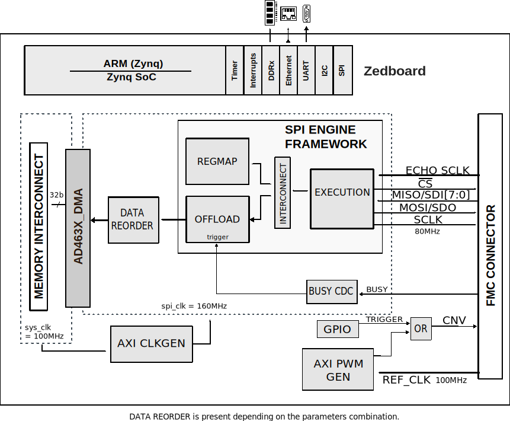
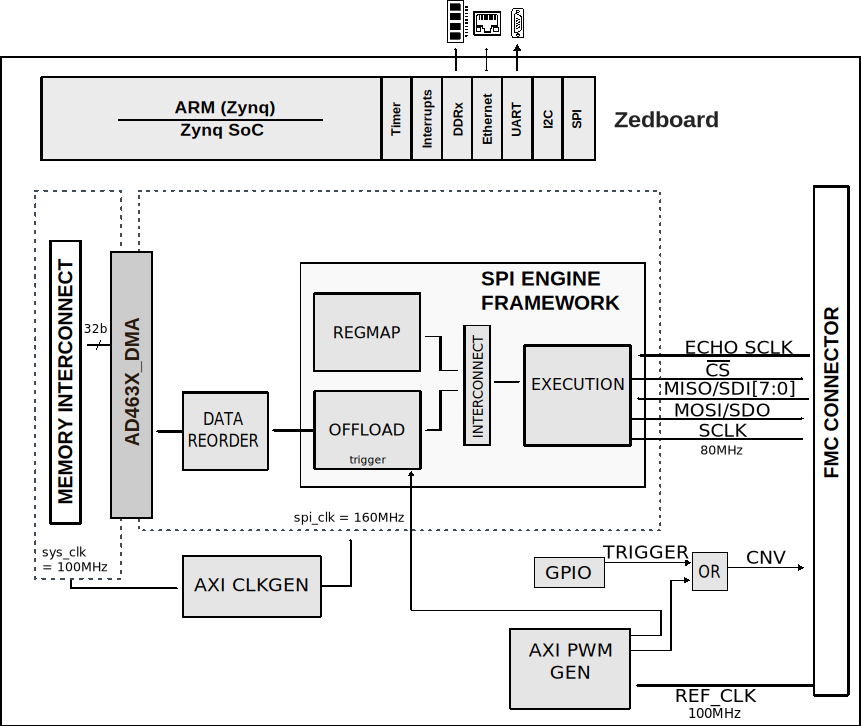
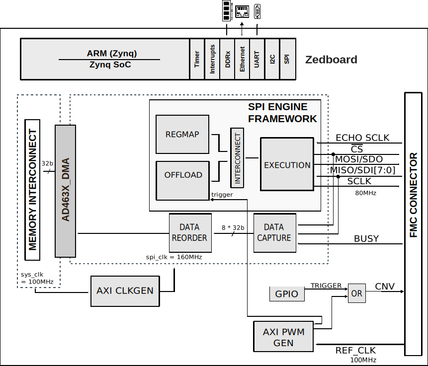

.. _ad4630_fmc:

AD4630-FMC HDL project
=================================================================================

Overview
---------------------------------------------------------------------------------

The :adi:`AD4630-24` is a two-channel, simultaneous sampling, Easy Drive, 2 MSPS
successive approximation register (SAR) analog-to-digital converter (ADC). The
:adi:`AD4030-24` is the single channel version. With a guaranteed maximum ±0.9
ppm INL and no missing codes at 24-bits, the :adi:`AD4630-24` and 
:adi:`AD4030-24` achieve unparalleled precision from −40°C to +125°C.
The :adi:`AD4030-16` is a 16-bit dual channel version.

A low-drift, internal precision reference buffer eases voltage reference
sharing with other system circuitry. The AD4630-24 offers a typical dynamic
range of 106 dB when using a 5 V reference. The :adi:`AD4030-24` offers a typical
dynamic range of 109 dB using a 5 V reference. The low noise floor enables signal
chains requiring less gain and lower power. A block averaging filter with
programmable decimation ratio can increase dynamic range up to 153 dB and
155.5dB for the :adi:`AD4030`. The wide differential input and common mode ranges
allow inputs to use the full ±VREF range without saturating, simplifying signal
conditioning requirements and system calibration. The improved settling of the
Easy Drive analog inputs broadens the selection of analog front-end components
compatible with the :adi:`AD4630-24`, :adi:`AD4630-16` and :adi:`AD4030-24`.
Both single-ended and differential signals are supported.

The versatile Flexi-SPI serial interface eases host processor and ADC
integration. A wide data clocking window, multiple SDO lanes, and optional DDR
data clocking can reduce the serial clock to 10 MHz while operating at a
sample rate of 2 MSPS. Echo clock mode and ADC master clock mode relax the
timing requirements and simplify the use of digital isolators.

The :adi:`AD4630-24`'s, :adi:`AD4630-16`'s and :adi:`AD4030-24`'s BGA package
integrates all critical power supply and reference bypass capacitors, reducing
the footprint and system component count, and lessening sensitivity to board
layout.

The HDL reference design for the :adi:`EVAL-AD4630_FMCZ` and
:adi:`EVAL-AD4030_FMCZ` provides all the interfaces that are necessary to
interact with the device using a Xilinx FPGA development board. The design has
all the necessary infrastructure to acquire data from the :adi:`AD4630-24`
24-bit dual-channel precision SAR ADC, :adi:`AD4630-16` 16-bit dual channel
precision SAR ADC and :adi:`AD4030-24` single channel ADC, supporting
continuous data capture at maximum 2 MSPS data rate. The design targeted to the
Zedboard, which is a low cost FPGA carrier board from Digilent, using a
Zynq-7000 re-programmable SoC from Xilinx.

Applications:
  * Automatic test equipment
  * Digital control loops
  * Medical instrumentation
  * Seismology
  * Semiconductor manufacturing
  * Scientific instrumentation
  
Supported boards
-------------------------------------------------------------------------------

-  :adi:`EVAL-AD4030-24FMCZ <EVAL-AD4030-24FMCZ>`
-  :adi:`EVAL-AD4630-16FMCZ <EVAL-AD4630-16FMCZ>`
-  :adi:`EVAL-AD4630-24FMCZ <EVAL-AD4630-24FMCZ>`

Supported devices
-------------------------------------------------------------------------------

-  :adi:`AD4030-24`
-  :adi:`AD4630-16`
-  :adi:`AD4630-24`

Supported carriers
-------------------------------------------------------------------------------

-  :xilinx:`ZedBoard <products/boards-and-kits/1-8dyf-11.html>` on FMC slot

Block design
---------------------------------------------------------------------------------

The reference design uses the :ref:`SPI Engine Framework <spi_engine>` to
interface with the AD4630 ADC. The design supports almost all possible digital
interface configurations of the device. In echo clock mode, because the clock
for data latching is routed back through the BUSY line, an additional data
capture module is used for saving the received samples and transmitting
forward for the DMA.

There are three modes in which the system can run. Refer to the :adi:`AD4630-24`,
:adi:`AD4630-16` or :adi:`AD4030-24` data sheet section titled SAMPLE CONVERSION
TIMING AND DATA TRANSFER for more explanation of data transfer zones.

Block diagram
~~~~~~~~~~~~~~~~~~~~~~~~~~~~~~~~~~~~~~~~~~~~~~~~~~~~~~~~~~~~~~~~~~~~~~~~~~~~~~~

The data path and clock domains are depicted in the below diagrams:

SPI mode - transfer zone 1
^^^^^^^^^^^^^^^^^^^^^^^^^^^^^^^^^^^^^^^^^^^^^^^^^^^^^^^^^^^^^^^^^^^^^^^^^^^^^^^

The main aspect of this mode is the fact that it is using the BUSY signal from
the ADC to trigger the Offload module. Data is then clocked out by the
Execution module and transferred to the DMA by the Offload module. CNV is
always generated by the AXI PWM GEN IP core regardless of the mode. Zone 1
transfer is not currently supported by the pre-compiled HDL files that are
included in the SD card image that is provided with the evaluation board.

SPI mode - transfer zone 2
^^^^^^^^^^^^^^^^^^^^^^^^^^^^^^^^^^^^^^^^^^^^^^^^^^^^^^^^^^^^^^^^^^^^^^^^^^^^^^^

In this mode, the BUSY signal is not used and both the CNV and the Offload
trigger signals are generated by the AXI PWM GEN core. The reason for using two
PWM outputs instead of a common one is to accommodate for the averaging mode
where the two signals will have different frequencies.

Echo clock mode - transfer zone 2
^^^^^^^^^^^^^^^^^^^^^^^^^^^^^^^^^^^^^^^^^^^^^^^^^^^^^^^^^^^^^^^^^^^^^^^^^^^^^^^

In this configuration, the ADC's BUSY-SCKOUT pin functions as a bit-clock
output and is generated by looping-through the host’s SCK. The SPI engine is
driving the SPI signals except it is no longer reading the data. For this
purpose, the Data Capture IP is used. This also allows for reading data in DDR
mode.

The design supports the following interface and clock modes both in SDR and DDR:

================== ================== ================== ==================
Mode               1 Lane per channel 2 Lane per channel 4 lane per channel
================== ================== ================== ==================
SPI mode           yes                yes                yes
Echo Clock mode    yes                yes                yes
================== ================== ================== ==================

Configuration modes
~~~~~~~~~~~~~~~~~~~~~~~~~~~~~~~~~~~~~~~~~~~~~~~~~~~~~~~~~~~~~~~~~~~~~~~~~~~~~~~

The CLK_MODE configuration parameter defines clocking mode of the device's
digital interface: Options: 0 - SPI mode, 1 - Echo-clock or Master clock mode

The NUM_OF_SDI configutation parameter defines the number of MOSI lines of the
SPI interface: Options: 1 - Interleaved mode, 2 - 1 lane per channel,
4 - 2 lanes per channel, 8 - 4 lanes per channel

The CAPTURE_ZONE configuration parameter defines the capture zone of the next
sample. There are two capture zones: 1 - from negative edge of the BUSY line
until the next CNV positive edge -20ns, 2 - from the next consecutive CNV
positive edge +20ns until the second next consecutive CNV positive edge -20ns

The DDR_EN configuration parameter defines the type of data transfer. In echo
and master clock mode the SDI lines can have Single or Double Data Rates.
Options: 0 - MISO runs on SDR, 1 - MISO runs on DDR.

CPU/Memory interconnects addresses
~~~~~~~~~~~~~~~~~~~~~~~~~~~~~~~~~~~~~~~~~~~~~~~~~~~~~~~~~~~~~~~~~~~~~~~~~~~~~~~

The addresses are dependent on the architecture of the FPGA, having an offset
added to the base address from HDL(see more at :ref:`architecture`).

========================  ===========
Instance                  Address
========================  ===========
spi_ad463x_axi_regmap     0x44A0_0000
axi_ad463x_dma            0x44A3_0000
spi_clkgen                0x44A7_0000
cnv_generator             0x44B0_0000
========================  ===========

I2C connections
~~~~~~~~~~~~~~~~~~~~~~~~~~~~~~~~~~~~~~~~~~~~~~~~~~~~~~~~~~~~~~~~~~~~~~~~~~~~~~~

.. list-table::
   :widths: 20 20 20 20 20
   :header-rows: 1

   * - I2C type
     - I2C manager instance
     - Alias
     - Address
     - I2C subordinate
   * - PL
     - iic_fmc
     - axi_iic_fmc
     - 0x4162_0000
     - ---
   * - PL
     - iic_main
     - axi_iic_main
     - 0x4160_0000
     - ---

SPI connections
~~~~~~~~~~~~~~~~~~~~~~~~~~~~~~~~~~~~~~~~~~~~~~~~~~~~~~~~~~~~~~~~~~~~~~~~~~~~~~~

.. list-table::
   :widths: 25 25 25 25
   :header-rows: 1

   * - SPI type
     - SPI manager instance
     - SPI subordinate
     - CS
   * - PL
     - axi_spi_engine
     - ad4630
     - 0

GPIOs
~~~~~~~~~~~~~~~~~~~~~~~~~~~~~~~~~~~~~~~~~~~~~~~~~~~~~~~~~~~~~~~~~~~~~~~~~~~~~~~

The Software GPIO number is calculated as follows:

-  Zynq-7000: if PS7 is used, then offset is 54

.. list-table::
   :widths: 25 25 25 25
   :header-rows: 2

   * - GPIO signal
     - Direction
     - HDL GPIO EMIO
     - Software GPIO
   * -
     - (from FPGA view)
     -
     - Zynq-7000
   * - ad463x_resetn
     - INOUT
     - 32
     - 86
     
Interrupts
~~~~~~~~~~~~~~~~~~~~~~~~~~~~~~~~~~~~~~~~~~~~~~~~~~~~~~~~~~~~~~~~~~~~~~~~~~~~~~~

Below are the Programmable Logic interrupts used in this project.

=================== === ========== ===========
Instance name       HDL Linux Zynq Actual Zynq
=================== === ========== ===========
axi_ad463x_dma      13  57         89
spi_ad463x          12  56         88
=================== === ========== ===========

Building the HDL project
-------------------------------------------------------------------------------

The design is built upon ADI's generic HDL reference design framework.
ADI does not distribute the bit/elf files of these projects so they
must be built from the sources available :git-hdl:`here </>`. To get
the source you must
`clone <https://git-scm.com/book/en/v2/Git-Basics-Getting-a-Git-Repository>`__
the HDL repository, and then build the project as follows:.

**Linux/Cygwin/WSL**

.. code-block::
   :linenos:

   user@analog:~$ cd hdl/projects/ad4630_fmc/zed
   user@analog:~/hdl/projects/ad4630_fmc/zed$ make NUM_OF_SDI=4 CAPTURE_ZONE=2

The result of the build, if parameters were used, will be in a folder named
by the configuration used:

if the following command was run

``make NUM_OF_SDI=4 CAPTURE_ZONE=2``

then the folder name will be:

``NUMOFSDI4_CAPTUREZONE2``

A more comprehensive build guide can be found in the :ref:`build_hdl` user guide.

Resources
-------------------------------------------------------------------------------

Systems related
~~~~~~~~~~~~~~~~~~~~~~~~~~~~~~~~~~~~~~~~~~~~~~~~~~~~~~~~~~~~~~~~~~~~~~~~~~~~~~~

- :dokuwiki:`[Wiki] AD463X and AD403X Developer's Guide <resources/eval/ad4630-24-eval-board/ad4630-24-developer-guide>`

Hardware related
~~~~~~~~~~~~~~~~~~~~~~~~~~~~~~~~~~~~~~~~~~~~~~~~~~~~~~~~~~~~~~~~~~~~~~~~~~~~~~~

-  Product datasheets:

-  :adi:`AD4030-24`
-  :adi:`AD4630-16`
-  :adi:`AD4630-24`
-  :dokuwiki:`[Wiki] AD4630/AD4030 Evaluation Board User Guide <resources/eval/ad4630-24-eval-board>`

HDL related
~~~~~~~~~~~~~~~~~~~~~~~~~~~~~~~~~~~~~~~~~~~~~~~~~~~~~~~~~~~~~~~~~~~~~~~~~~~~~~~

-  :git-hdl:`AD4630_FMC HDL project source code <projects/ad4630_fmc>`
-  :dokuwiki:`[Wiki] AD4630_FMC HDL project documentation <resources/eval/user-guides/ad463x/hdl>`

.. list-table::
   :widths: 30 35 35
   :header-rows: 1

   * - IP name
     - Source code link
     - Documentation link
   * - AD463X_DATA_CAPTURE
     - :git-hdl:`library/ad463x_data_capture`
     - ---
   * - AXI_CLKGEN
     - :git-hdl:`library/axi_clkgen`
     - :dokuwiki:`[Wiki] <resources/fpga/docs/axi_clkgen>`
   * - AXI_DMAC
     - :git-hdl:`library/axi_dmac`
     - :ref:`here <axi_dmac>`
   * - AXI_HDMI_TX
     - :git-hdl:`library/axi_hdmi_tx`
     - :dokuwiki:`[Wiki] <resources/fpga/docs/axi_hdmi_tx>`
   * - AXI_I2S_ADI
     - :git-hdl:`library/axi_i2s_adi`
     - ---
   * - AXI_PWM_GEN
     - :git-hdl:`library/axi_pwm_gen`
     - :dokuwiki:`[Wiki] <resources/fpga/docs/axi_pwm_gen>`
   * - AXI_SPDIF_TX
     - :git-hdl:`library/axi_spdif_tx`
     - ---
   * - AXI_SPI_ENGINE
     - :git-hdl:`library/spi_engine/axi_spi_engine`
     - :ref:`here <spi_engine axi>`
   * - SPI_AXIS_REORDER
     - :git-hdl:`library/spi_engine/spi_axis_reorder`
     - ---
   * - SPI_ENGINE_EXECUTION
     - :git-hdl:`library/spi_engine/spi_engine_execution`
     - :ref:`here <spi_engine execution>`
   * - SPI_ENGINE_INTERCONNECT
     - :git-hdl:`library/spi_engine/spi_engine_interconnect`
     - :ref:`here <spi_engine interconnect>`
   * - SPI_ENGINE_OFFLOAD
     - :git-hdl:`library/spi_engine/spi_engine_offload`
     - :ref:`here <spi_engine offload>`
   * - SYSID_ROM
     - :git-hdl:`library/sysid_rom`
     - :dokuwiki:`[Wiki] <resources/fpga/docs/axi_sysid>`
   * - UTIL_I2C_MIXER
     - :git-hdl:`library/util_i2c_mixer <library/util_i2c_mixer>`
     - ---

-  :ref:`SPI Engine Framework documentation <spi_engine>`

Software related
~~~~~~~~~~~~~~~~~~~~~~~~~~~~~~~~~~~~~~~~~~~~~~~~~~~~~~~~~~~~~~~~~~~~~~~~~~~~~~~

- :git-linux:`AD4630_FMC Linux driver source code <analogdevicesinc/linux/blob/main/drivers/iio/adc/ad4630.c>`
- :git-no-os:`AD463x_FMC No-OS project source code <projects/ad463x_fmcz>`
- :dokuwiki:`AD4630 ADC Linux Driver <resources/tools-software/linux-drivers/iio-adc/ad4630>`
- :dokuwiki:`AD463X ADC Linux Driver <resources/tools-software/linux-drivers/iio-adc/ad463x>`
- :dokuwiki:`AD4630/AD4030 - No-OS Driver <resources/tools-software/uc-drivers/ad463x>`

.. include:: ../common/more_information.rst

.. include:: ../common/support.rst
