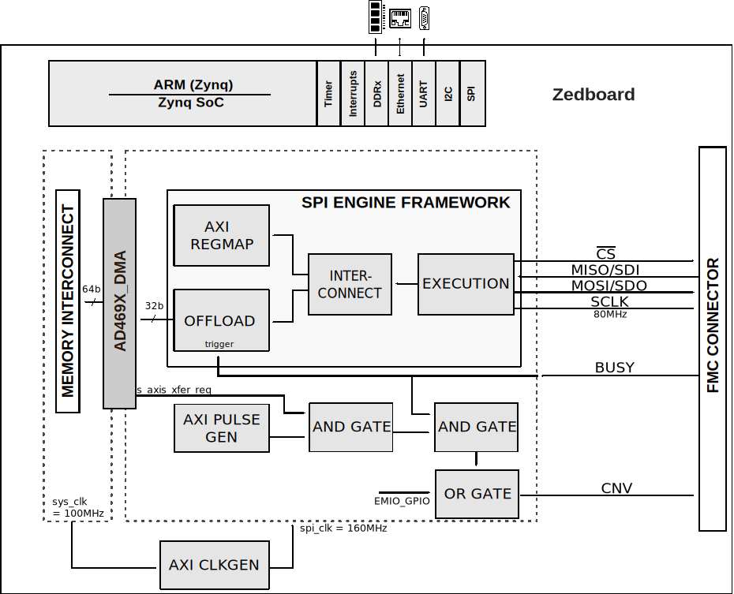
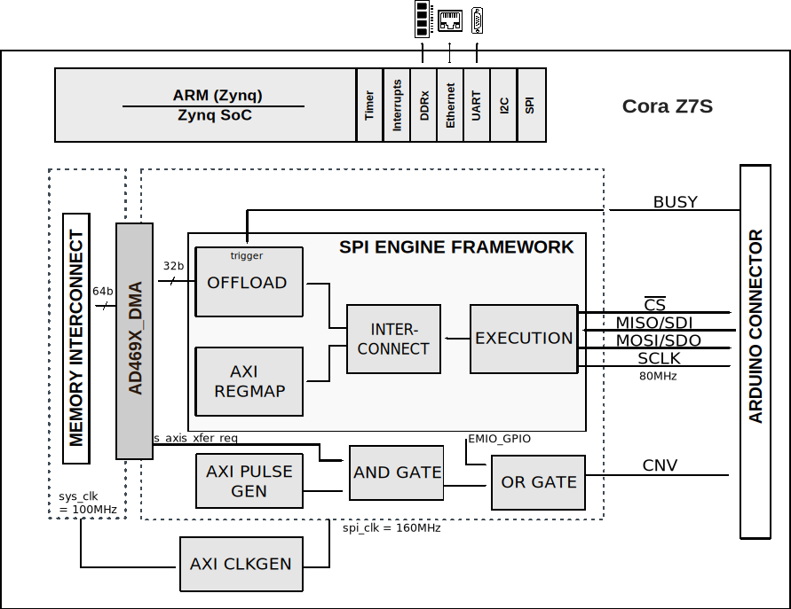
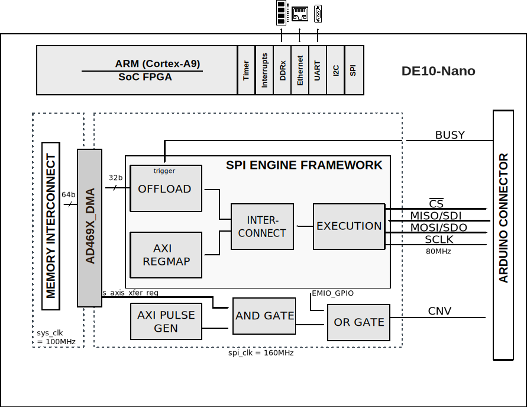

.. _ad469x_evb:

AD469X-EVB HDL project
===============================================================================

Overview
-------------------------------------------------------------------------------

The AD469X HDL reference design provides all the interfaces that are
necessary to interact with the devices on the :adi:`EVAL-AD4696` board.

The design has a SPI Engine instance to control and acquire data from the
:adi:`AD4696` 16-bit precisions ADC, providing support to capture continuous
samples at maximum sampling rate. Currently the design supports the Zedboard.

Supported boards
-------------------------------------------------------------------------------

- EVAL-AD4692
- :adi:`EVAL-AD4696`

Supported devices
-------------------------------------------------------------------------------

- AD4691
- AD4692
- AD4693
- AD4694
- :adi:`AD4695`
- :adi:`AD4696`
- :adi:`AD4697`
- :adi:`AD4698`

Supported carriers
-------------------------------------------------------------------------------

- `ZedBoard <https://digilent.com/shop/zedboard-zynq-7000-arm-fpga-soc-development-board>`__ on FMC slot
- `Cora Z7S <https://digilent.com/shop/cora-z7-zynq-7000-single-core-for-arm-fpga-soc-development>`__ on Arduino shield connector
- :intel:`DE10-Nano <content/www/us/en/developer/topic-technology/edge-5g/hardware/fpga-de10-nano.html>` on Arduino shield connector

Block design
-------------------------------------------------------------------------------

The reference design uses the standard :ref:`SPI Engine Framework <spi_engine>`
to interface the :adi:`AD4696` ADC in single SDO Mode.
The :ref:`SPI Engine Offload module <spi_engine offload>`, which can be used to
capture continuous data stream at maximum data rate, is triggered by the BUSY
signal of the device.

CNV signal gating
-------------------------------------------------------------------------------

The :git-hdl:`AXI PWM GEN <library/axi_pwm_gen>` IP core is used to drive CNV
when the SPI Engine is operating in Offload mode along with logic gates and a
few extra signals to ensure proper control of the signal.

The AND gate has the DMA ``s_axis_xfer_req`` signal and the PWM signal as inputs.
Since the PWM is free running, this gate is necessary to prevent the sequencer
on the ADC from getting out of sync. When the DMA is unable to receive more
data, the ``s_axis_xfer_req`` signal is driven low, blocking the PWM signal.

Also, to exit conversion mode on the device, one extra pulse on the CNV pin is
needed before sending the exit command, otherwise this command is ignored by the
ADC. This feature also allows the system to read single samples using the SPI
Engine FIFO mode. To achieve this, an OR gate is used to allow the software to
generate CNV pulses using a GPIO signal.

Block diagram
~~~~~~~~~~~~~~~~~~~~~~~~~~~~~~~~~~~~~~~~~~~~~~~~~~~~~~~~~~~~~~~~~~~~~~~~~~~~~~~

The data path and clock domains are depicted in the below diagram:

Zedboard
^^^^^^^^^^^^^^^^^^^^^^^^^^^^^^^^^^^^^^^^^^^^^^^^^^^^^^^^^^^^^^^^^^^^^^^^^^^^^^^

Cora Z7S
^^^^^^^^^^^^^^^^^^^^^^^^^^^^^^^^^^^^^^^^^^^^^^^^^^^^^^^^^^^^^^^^^^^^^^^^^^^^^^^

DE10-Nano
^^^^^^^^^^^^^^^^^^^^^^^^^^^^^^^^^^^^^^^^^^^^^^^^^^^^^^^^^^^^^^^^^^^^^^^^^^^^^^^

Configuration modes
~~~~~~~~~~~~~~~~~~~~~~~~~~~~~~~~~~~~~~~~~~~~~~~~~~~~~~~~~~~~~~~~~~~~~~~~~~~~~~~~~

The ``SPI_4WIRE`` configuration parameter defines if CNV signal is linked to
PWM or to SPI_CS to enable interfacing with a single 4-wire SPI port.

By default, it is set to 0.

Depending on the required pin functionality, some hardware
modifications need to be done on the board and/or ``make`` command:

In case we link CNV signal to PWM:

.. shell:: bash

   $make SPI_4WIRE=0

In case we link CNV signal to SPI_CS:

.. shell:: bash

   $make SPI_4WIRE=1

CPU/Memory interconnects addresses
~~~~~~~~~~~~~~~~~~~~~~~~~~~~~~~~~~~~~~~~~~~~~~~~~~~~~~~~~~~~~~~~~~~~~~~~~~~~~~~

The addresses are dependent on the architecture of the FPGA, having an offset
added to the base address from HDL(see more at :ref:`architecture cpu-intercon-addr`).

======================  =================
Instance                Zynq*/DE10-Nano**
======================  =================
axi_ad469x_dma*         0x44A3_0000
spi_clkgen*             0x44A7_0000
spi_ad469x_axi_regmap*  0x44A0_0000
ad469x_trigger_gen*     0x44B0_0000
axi_dmac_0**            0x0002_0000
axi_spi_engine_0**      0x0003_0000
ad469x_trigger_gen **   0x0004_0000
======================  =================

.. admonition:: Legend
   :class: note

   - ``*`` instantiated only for Cora Z7S and Zed
   - ``**`` instantiated only for DE10-Nano

I2C connections
~~~~~~~~~~~~~~~~~~~~~~~~~~~~~~~~~~~~~~~~~~~~~~~~~~~~~~~~~~~~~~~~~~~~~~~~~~~~~~~

.. list-table::
   :widths: 20 20 20 20 20
   :header-rows: 1

   * - I2C type
     - I2C manager instance
     - Alias
     - Address
     - I2C subordinate
   * - PL*
     - iic_fmc
     - axi_iic_fmc
     - 0x4162_0000
     - ---
   * - PL**
     - iic_ard
     - axi_iic_ard
     - 0x4160_0000
     - ---
   * - PS***
     - i2c1
     - sys_hps_i2c1
     - ---
     - ---

.. admonition:: Legend
   :class: note

   - ``*`` instantiated only for Zed
   - ``**`` instantiated only for Cora Z7S
   - ``***`` instantiated only for DE10-Nano

SPI connections
~~~~~~~~~~~~~~~~~~~~~~~~~~~~~~~~~~~~~~~~~~~~~~~~~~~~~~~~~~~~~~~~~~~~~~~~~~~~~~~

.. list-table::
   :widths: 25 25 25 25
   :header-rows: 1

   * - SPI type
     - SPI manager instance
     - SPI subordinate
     - CS
   * - PL
     - axi_spi_engine
     - ad469x
     - 0

GPIOs
~~~~~~~~~~~~~~~~~~~~~~~~~~~~~~~~~~~~~~~~~~~~~~~~~~~~~~~~~~~~~~~~~~~~~~~~~~~~~~~

The Software GPIO number is calculated as follows:

- Zynq-7000: if PS7 is used, then offset is 54

.. list-table::
   :widths: 25 25 25 25
   :header-rows: 2

   * - GPIO signal
     - Direction
     - HDL GPIO EMIO
     - Software GPIO
   * -
     - (from FPGA view)
     -
     - Zynq-7000
   * - ad469x_resetn
     - INOUT
     - 32
     - 86
   * - gpio[33]
     - IN
     - 33
     - 87
   * - gpio[34]
     - OUT
     - 34
     - 88

- DE10-Nano: the offset is 32

.. list-table::
   :widths: 25 25 25 25
   :header-rows: 2

   * - GPIO signal
     - Direction
     - HDL GPIO EMIO
     - Software GPIO
   * -
     - (from FPGA view)
     -
     - DE10-Nano
   * - ad469x_busy_alt_gp0;
     - INPUT
     - 33
     - 1
   * - ad469x_resetn
     - INPUT
     - 32
     - 0

``BSY_ALT_GP0`` pin can be configured to function as a GPIO pin,
the threshold detection alert indicator, the busy indicator, or the
second serial data output in dual-sdo MODE

Interrupts
~~~~~~~~~~~~~~~~~~~~~~~~~~~~~~~~~~~~~~~~~~~~~~~~~~~~~~~~~~~~~~~~~~~~~~~~~~~~~~~

Below are the Programmable Logic interrupts used in this project.

================ === ========== ===========
Instance name    HDL Linux Zynq Actual Zynq
================ === ========== ===========
axi_ad469x_dma   13  57         89
spi_ad469x       12  56         88
axi_iic_ard      11  55         87
================ === ========== ===========

================ === =============== ================
Instance name    HDL Linux DE10-Nano Actual DE10-Nano
================ === =============== ================
axi_spi_engine_0 5   45               77
axi_dmac_0       4   44               76
================ === =============== ================

Building the HDL project
-------------------------------------------------------------------------------

The design is built upon ADI's generic HDL reference design framework.
ADI distributes the bit/elf files of these projects as part of the
:dokuwiki:`ADI Kuiper Linux <resources/tools-software/linux-software/kuiper-linux>`.
If you want to build the sources, ADI makes them available on the
:git-hdl:`HDL repository </>`. To get the source you must
the HDL repository, and then build the project as follows:

**Linux/Cygwin/WSL**

.. shell::

   $cd hdl/projects/ad469x_evb/zed
   $make SPI_4WIRE=0

The result of the build, if parameters were used, will be in a folder named
by the configuration used:

if the following command was run

``SPI_4WIRE=0``

then the folder name will be:

``SPI4WIRE0``

A more comprehensive build guide can be found in the :ref:`build_hdl` user guide.

Resources
-------------------------------------------------------------------------------

Hardware related
~~~~~~~~~~~~~~~~~~~~~~~~~~~~~~~~~~~~~~~~~~~~~~~~~~~~~~~~~~~~~~~~~~~~~~~~~~~~~~~

- Product datasheets:

  - :adi:`AD4695`/:adi:`AD4696`
  - :adi:`AD4697`/:adi:`AD4698`

- `UG-1882, EVAL-AD4694FMCZ User Guide <https://www.analog.com/media/en/technical-documentation/user-guides/eval-ad4696fmcz-ug-1882.pdf>`__

HDL related
~~~~~~~~~~~~~~~~~~~~~~~~~~~~~~~~~~~~~~~~~~~~~~~~~~~~~~~~~~~~~~~~~~~~~~~~~~~~~~~

- :git-hdl:`AD469X_EVB HDL project source code <projects/ad469x_evb>`

.. list-table::
   :widths: 30 35 35
   :header-rows: 1

   * - IP name
     - Source code link
     - Documentation link
   * - AXI_CLKGEN
     - :git-hdl:`library/axi_clkgen`
     - :ref:`axi_clkgen`
   * - AXI_DMAC
     - :git-hdl:`library/axi_dmac`
     - :ref:`axi_dmac`
   * - AXI_HDMI_TX
     - :git-hdl:`library/axi_hdmi_tx`
     - :ref:`axi_hdmi_tx`
   * - AXI_I2S_ADI
     - :git-hdl:`library/axi_i2s_adi`
     - ---
   * - AXI_PWM_GEN
     - :git-hdl:`library/axi_pwm_gen`
     - :ref:`axi_pwm_gen`
   * - AXI_SPDIF_TX
     - :git-hdl:`library/axi_spdif_tx`
     - ---
   * - AXI_SPI_ENGINE
     - :git-hdl:`library/spi_engine/axi_spi_engine`
     - :ref:`spi_engine axi`
   * - AXI_SYSID
     - :git-hdl:`library/axi_sysid`
     - :ref:`axi_sysid`
   * - SPI_ENGINE_EXECUTION
     - :git-hdl:`library/spi_engine/spi_engine_execution`
     - :ref:`spi_engine execution`
   * - SPI_ENGINE_INTERCONNECT
     - :git-hdl:`library/spi_engine/spi_engine_interconnect`
     - :ref:`spi_engine interconnect`
   * - SPI_ENGINE_OFFLOAD
     - :git-hdl:`library/spi_engine/spi_engine_offload`
     - :ref:`spi_engine offload`
   * - SYSID_ROM
     - :git-hdl:`library/sysid_rom`
     - :ref:`axi_sysid`
   * - UTIL_I2C_MIXER
     - :git-hdl:`library/util_i2c_mixer`
     - ---

- :ref:`SPI Engine Framework documentation <spi_engine>`

Software related
~~~~~~~~~~~~~~~~~~~~~~~~~~~~~~~~~~~~~~~~~~~~~~~~~~~~~~~~~~~~~~~~~~~~~~~~~~~~~~~

- :git-linux:`AD469X_EVB - ZED dts source code <arch/arm/boot/dts/xilinx/zynq-zed-adv7511-ad4696.dts>`
- :git-no-os:`AD469X_EVB no-OS driver source code <drivers/adc/ad469x>`
- :git-no-os:`AD469X_EVB no-OS project source code <projects/ad469x_evb>`

.. include:: ../common/more_information.rst

.. include:: ../common/support.rst
