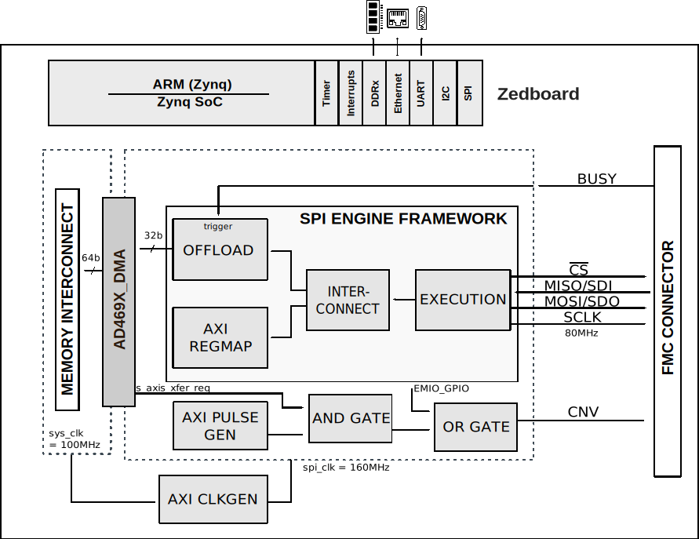

.. _ad469x_fmc:

AD469X-FMC HDL project
===============================================================================

Overview
-------------------------------------------------------------------------------

The AD469X HDL reference design provides all the interfaces that are
necessary to interact with the devices on the :adi:`EVAL-AD4696 <EVAL-AD4696>`
board.

The design has a SPI Engine instance to control and acquire data from the
:adi:`AD4696` 16-bit precisions ADC, providing support to capture continuous
samples at maximum sampling rate. Currently the design supports the Zedboard.

Supported boards
-------------------------------------------------------------------------------

-  :adi:`EVAL-AD4696 <EVAL-AD4696>`

Supported devices
-------------------------------------------------------------------------------

-  :adi:`AD4695`
-  :adi:`AD4696`
-  :adi:`AD4697`
-  :adi:`AD4698`

Supported carriers
-------------------------------------------------------------------------------

-  :xilinx:`ZedBoard <products/boards-and-kits/1-8dyf-11.html>` on FMC slot

Block design
-------------------------------------------------------------------------------

The reference design uses the standard :ref:`SPI Engine Framework <spi_engine>`
to interface the :adi:`AD4696` ADC in single SDO Mode.
The :ref:`SPI Engine Offload module <spi_engine offload>`, which can be used to
capture continuous data stream at maximum data rate, is triggered by the BUSY
signal of the device.

Block diagram
~~~~~~~~~~~~~~~~~~~~~~~~~~~~~~~~~~~~~~~~~~~~~~~~~~~~~~~~~~~~~~~~~~~~~~~~~~~~~~~

The data path and clock domains are depicted in the below diagram:

CPU/Memory interconnects addresses
~~~~~~~~~~~~~~~~~~~~~~~~~~~~~~~~~~~~~~~~~~~~~~~~~~~~~~~~~~~~~~~~~~~~~~~~~~~~~~~

The addresses are dependent on the architecture of the FPGA, having an offset
added to the base address from HDL(see more at :ref:`architecture`).

=====================  ===========
Instance               Address
=====================  ===========
axi_ad469x_dma         0x44A3_0000
spi_clkgen             0x44A7_0000
spi_ad469x_axi_regmap  0x44A0_0000
ad469x_trigger_gen     0x44B0_0000
=====================  ===========

I2C connections
~~~~~~~~~~~~~~~~~~~~~~~~~~~~~~~~~~~~~~~~~~~~~~~~~~~~~~~~~~~~~~~~~~~~~~~~~~~~~~~

.. list-table::
   :widths: 20 20 20 20 20
   :header-rows: 1

   * - I2C type
     - I2C manager instance
     - Alias
     - Address
     - I2C subordinate
   * - PL
     - iic_fmc
     - axi_iic_fmc
     - 0x4162_0000
     - ---
   * - PL
     - iic_main
     - axi_iic_main
     - 0x4160_0000
     - ---

SPI connections
~~~~~~~~~~~~~~~~~~~~~~~~~~~~~~~~~~~~~~~~~~~~~~~~~~~~~~~~~~~~~~~~~~~~~~~~~~~~~~~

.. list-table::
   :widths: 25 25 25 25
   :header-rows: 1

   * - SPI type
     - SPI manager instance
     - SPI subordinate
     - CS
   * - PL
     - axi_spi_engine
     - ad469x
     - 0

GPIOs
~~~~~~~~~~~~~~~~~~~~~~~~~~~~~~~~~~~~~~~~~~~~~~~~~~~~~~~~~~~~~~~~~~~~~~~~~~~~~~~

The Software GPIO number is calculated as follows:

-  Zynq-7000: if PS7 is used, then offset is 54

.. list-table::
   :widths: 25 25 25 25
   :header-rows: 2

   * - GPIO signal
     - Direction
     - HDL GPIO EMIO
     - Software GPIO
   * -
     - (from FPGA view)
     -
     - Zynq-7000
   * - ad469x_resetn
     - INOUT
     - 32
     - 86

Interrupts
~~~~~~~~~~~~~~~~~~~~~~~~~~~~~~~~~~~~~~~~~~~~~~~~~~~~~~~~~~~~~~~~~~~~~~~~~~~~~~~

Below are the Programmable Logic interrupts used in this project.

================ === ========== ===========
Instance name    HDL Linux Zynq Actual Zynq
================ === ========== ===========
axi_ad469x_dma   13  57         89
spi_ad469x       12  56         88
================ === ========== ===========

Building the HDL project
-------------------------------------------------------------------------------

The design is built upon ADI's generic HDL reference design framework.
ADI does not distribute the bit/elf files of these projects so they must be
built from the sources available :git-hdl:`here </>`. To get the source you must
`clone <https://git-scm.com/book/en/v2/Git-Basics-Getting-a-Git-Repository>`__
the HDL repository, and then build the project as follows:

**Linux/Cygwin/WSL**

.. code-block::
   :linenos:

   user@analog:~$ cd hdl/projects/ad469x_fmc/zed
   user@analog:~/hdl/projects/ad469x_fmc/zed$ make

A more comprehensive build guide can be found in the :ref:`build_hdl` user guide.

Resources
-------------------------------------------------------------------------------

Hardware related
~~~~~~~~~~~~~~~~~~~~~~~~~~~~~~~~~~~~~~~~~~~~~~~~~~~~~~~~~~~~~~~~~~~~~~~~~~~~~~~

-  Product datasheet: 

   -  :adi:`AD4695`/:adi:`AD4696`
   -  :adi:`AD4697`/:adi:`AD4698`

-  `UG-1882, EVAL-AD4694FMCZ User Guide <https://www.analog.com/media/en/technical-documentation/user-guides/eval-ad4696fmcz-ug-1882.pdf>`__

HDL related
~~~~~~~~~~~~~~~~~~~~~~~~~~~~~~~~~~~~~~~~~~~~~~~~~~~~~~~~~~~~~~~~~~~~~~~~~~~~~~~

-  :git-hdl:`AD469X_FMC HDL project source code <projects/ad469x_fmc>`

.. list-table::
   :widths: 30 35 35
   :header-rows: 1

   * - IP name
     - Source code link
     - Documentation link
   * - AXI_CLKGEN
     - :git-hdl:`library/axi_dmac <library/axi_clkgen>`
     - :dokuwiki:`[Wiki] <resources/fpga/docs/axi_clkgen>`
   * - AXI_DMAC
     - :git-hdl:`library/axi_dmac <library/axi_dmac>`
     - :ref:`here <axi_dmac>`
   * - AXI_HDMI_TX
     - :git-hdl:`library/axi_hdmi_tx <library/axi_hdmi_tx>`
     - :dokuwiki:`[Wiki] <resources/fpga/docs/axi_hdmi_tx>`
   * - AXI_I2S_ADI
     - :git-hdl:`library/axi_i2s_adi <library/axi_i2s_adi>`
     - ---
   * - AXI_PWM_GEN
     - :git-hdl:`library/axi_pwm_gen <library/axi_pwm_gen>`
     - :dokuwiki:`[Wiki] <resources/fpga/docs/axi_pwm_gen>`
   * - AXI_SPDIF_TX
     - :git-hdl:`library/axi_spdif_tx <library/axi_spdif_tx>`
     - ---
   * - AXI_SPI_ENGINE
     - :git-hdl:`library/spi_engine/axi_spi_engine <library/spi_engine/axi_spi_engine>`
     - :ref:`here <spi_engine axi>`
   * - AXI_SYSID
     - :git-hdl:`library/axi_sysid <library/axi_sysid>`
     - :dokuwiki:`[Wiki] <resources/fpga/docs/axi_sysid>`
   * - SPI_ENGINE_EXECUTION
     - :git-hdl:`library/spi_engine/spi_engine_execution <library/spi_engine/spi_engine_execution>`
     - :ref:`here <spi_engine execution>`
   * - SPI_ENGINE_INTERCONNECT
     - :git-hdl:`library/spi_engine/spi_engine_interconnect <library/spi_engine/spi_engine_interconnect>`
     - :ref:`here <spi_engine interconnect>`
   * - SPI_ENGINE_OFFLOAD
     - :git-hdl:`library/spi_engine/spi_engine_offload <library/spi_engine/spi_engine_offload>`
     - :ref:`here <spi_engine offload>`
   * - SYSID_ROM
     - :git-hdl:`library/sysid_rom <library/sysid_rom>`
     - :dokuwiki:`[Wiki] <resources/fpga/docs/axi_sysid>`
   * - UTIL_I2C_MIXER
     - :git-hdl:`library/util_i2c_mixer <library/util_i2c_mixer>`
     - :ref:`here <spi_engine offload>`

-  :ref:`SPI Engine Framework documentation <spi_engine>`

Software related
~~~~~~~~~~~~~~~~~~~~~~~~~~~~~~~~~~~~~~~~~~~~~~~~~~~~~~~~~~~~~~~~~~~~~~~~~~~~~~~

-  :git-no-os:`AD469X_FMCZ No-OS project source code  <projects/ad469x_fmcz>`

-  :dokuwiki:`How to build No-OS <resources/no-os/build>`

.. include:: ../common/more_information.rst

.. include:: ../common/support.rst
