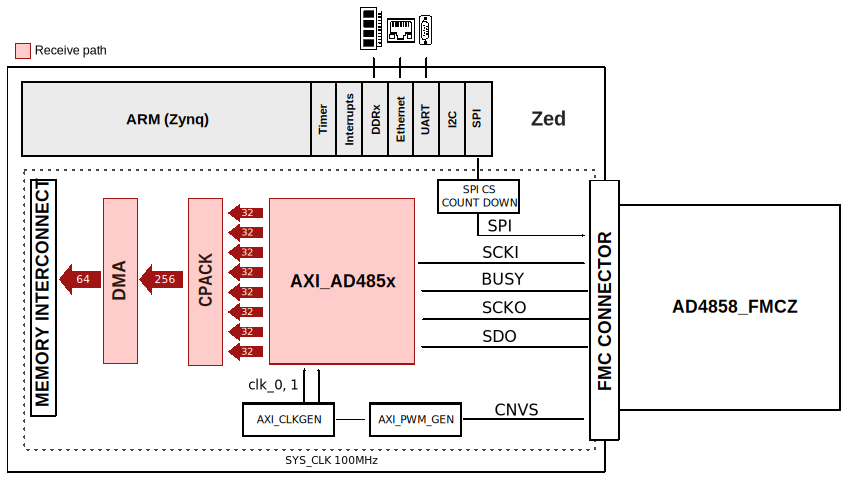
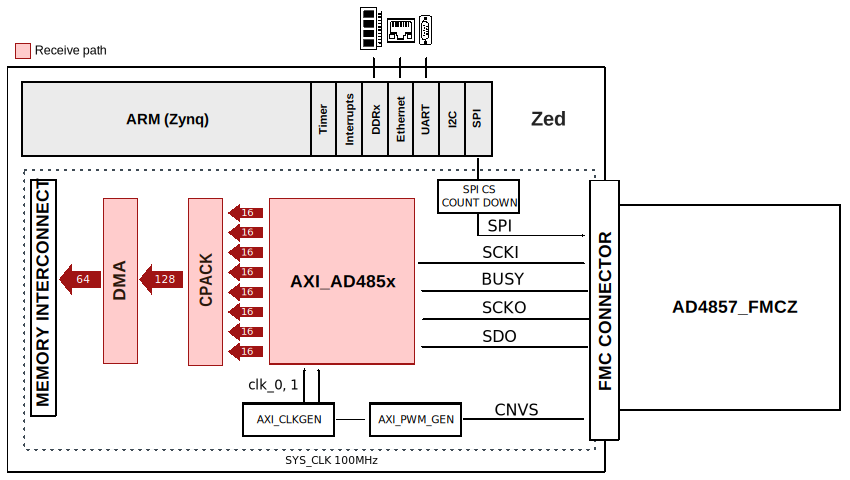

.. _ad485x_fmc:

AD485x_FMCZ HDL project
================================================================================

Overview
-------------------------------------------------------------------------------

This design is meant to support the AD485x family. For example,
:adi:`EVAL-AD4858` board contains :adi:`AD4858` chip, which is a 20-bit, low
noise 8-channel simultaneous sampling successive approximation register (SAR)
ADC, with buffered differential, wide common range picoamp inputs.

Supported boards
-------------------------------------------------------------------------------

- :adi:`EVAL-AD4858`
- :adi:`EVAL-AD4857`

Supported devices
-------------------------------------------------------------------------------

- :adi:`AD4858`
- :adi:`AD4857`
- :adi:`AD4856`
- :adi:`AD4855`
- :adi:`AD4854`
- :adi:`AD4853`
- :adi:`AD4852`
- :adi:`AD4851`

Supported carriers
-------------------------------------------------------------------------------

+--------------------+----------+----------+
| Evaluation board   | Carrier  | FMC slot |
+====================+==========+==========+
| :adi:`EVAL-AD4858` | ZedBoard | FMC LPC  |
+--------------------+          |          |
| :adi:`EVAL-AD4857` |          |          |
+--------------------+----------+----------+

Block design
-------------------------------------------------------------------------------

AD4858_FMCZ Block diagram
~~~~~~~~~~~~~~~~~~~~~~~~~~~~~~~~~~~~~~~~~~~~~~~~~~~~~~~~~~~~~~~~~~~~~~~~~~~~~~~

AD4857_FMCZ Block diagram
~~~~~~~~~~~~~~~~~~~~~~~~~~~~~~~~~~~~~~~~~~~~~~~~~~~~~~~~~~~~~~~~~~~~~~~~~~~~~~~

Clock scheme
~~~~~~~~~~~~~~~~~~~~~~~~~~~~~~~~~~~~~~~~~~~~~~~~~~~~~~~~~~~~~~~~~~~~~~~~~~~~~~~

Depending on the configuration used (CMOS or LVDS), the scheme differs a
little bit. In the sense that there is an extra clock 'external_fast_clk', see
the details in the diagram below.

For these evaluation boards, we used an internal clock of the FPGA.
Therefore, the external clocks given to AXI_AD485x IP are:

- in LVDS mode:

  - external_clk = 200 MHz
  - external_fast_clk = 400 MHz

- in CMOS mode:

  - external_clk = 200MHz

.. image:: ad485x_fmcz_clock_path.svg
   :width: 800
   :align: center
   :alt: AD4851_FMCZ clock path

CPU/Memory interconnects addresses
~~~~~~~~~~~~~~~~~~~~~~~~~~~~~~~~~~~~~~~~~~~~~~~~~~~~~~~~~~~~~~~~~~~~~~~~~~~~~~~

The addresses are dependent on the architecture of the FPGA, having an offset
added to the base address from HDL(see more at :ref:`architecture cpu-intercon-addr`).

============== ===========
Instance       Zynq
============== ===========
axi_ad485x     0x43C0_0000
axi_pwm_gen    0x43D0_0000
ad485x_dma     0x43E0_0000
adc_clkgen     0x4400_0000
============== ===========

SPI connections
~~~~~~~~~~~~~~~~~~~~~~~~~~~~~~~~~~~~~~~~~~~~~~~~~~~~~~~~~~~~~~~~~~~~~~~~~~~~~~~

.. list-table::
   :widths: 25 25 25 25
   :header-rows: 1

   * - SPI type
     - SPI manager instance
     - SPI subordinate
     - CS
   * - PS
     - SPI 0
     - AD485x
     - 0

Interrupts
~~~~~~~~~~~~~~~~~~~~~~~~~~~~~~~~~~~~~~~~~~~~~~~~~~~~~~~~~~~~~~~~~~~~~~~~~~~~~~~

Below are the Programmable Logic interrupts used in this project.

================ === ========== ===========
Instance name    HDL Linux Zynq Actual Zynq
================ === ========== ===========
axi_ad485x_dma   10  54         86
================ === ========== ===========

These are the board-specific interrupts
(found in :git-hdl:`here <projects/ad485x_fmc/common/ad485x_bd.tcl>`).

Building the HDL project
-------------------------------------------------------------------------------

The design is built upon ADI's generic HDL reference design framework.
ADI distributes the bit/elf files of these projects as part of the
:dokuwiki:`ADI Kuiper Linux <resources/tools-software/linux-software/kuiper-linux>`.
If you want to build the sources, ADI makes them available on the
:git-hdl:`HDL repository </>`. To get the source you must
`clone <https://git-scm.com/book/en/v2/Git-Basics-Getting-a-Git-Repository>`__
the HDL repository.

Then go to the project location (**projects/ad485x_fmc/carrier**) and run the
make command by typing in your command prompt (this example is for
`ZedBoard <https://digilent.com/shop/zedboard-zynq-7000-arm-fpga-soc-development-board>`__):

**Linux/Cygwin/WSL**

The default version of the interface is CMOS:

.. shell:: bash

   $cd hdl/projects/ad485x_fmc/zed
   $make

To build the LVDS version of the interface, run:

.. shell:: bash

   $cd hdl/projects/ad485x_fmc/zed
   $make LVDS_CMOS_N=1

A more comprehensive build guide can be found in the :ref:`build_hdl` user
guide.

Resources
-------------------------------------------------------------------------------

Systems related
~~~~~~~~~~~~~~~~~~~~~~~~~~~~~~~~~~~~~~~~~~~~~~~~~~~~~~~~~~~~~~~~~~~~~~~~~~~~~~~

Here you can find the quick start guides available for these evaluation boards:

.. list-table::
   :widths: 20 10
   :header-rows: 1

   * - Evaluation board
     - Zynq-7000
   * - AD485x_FMCZ
     - :dokuwiki:`zed <resources/fpga/xilinx/fmc/ad485x>`

HDL related
~~~~~~~~~~~~~~~~~~~~~~~~~~~~~~~~~~~~~~~~~~~~~~~~~~~~~~~~~~~~~~~~~~~~~~~~~~~~~~~

- :git-hdl:`AD485x_FMCZ HDL project source code <projects/ad485x_fmcz>`

.. list-table::
   :widths: 30 35 35
   :header-rows: 1

   * - IP name
     - Source code link
     - Documentation link
   * - AXI_AD485x
     - :git-hdl:`library/axi_ad485x`
     - :ref:`axi_ad485x`
   * - AXI_DMAC
     - :git-hdl:`library/axi_dmac`
     - :ref:`axi_dmac`
   * - AXI_CLKGEN
     - :git-hdl:`library/axi_clkgen`
     - :ref:`axi_clkgen`
   * - AXI_PWM_GEN
     - :git-hdl:`library/axi_pwm_gen`
     - :ref:`axi_pwm_gen`
   * - AXI_HDMI_TX
     - :git-hdl:`library/axi_hdmi_tx`
     - :ref:`axi_hdmi_tx`
   * - AXI_SPDIF_TX
     - :git-hdl:`library/axi_spdif_tx`
     - ---
   * - AXI_SYSID
     - :git-hdl:`library/axi_sysid`
     - :ref:`axi_sysid`
   * - SYSID_ROM
     - :git-hdl:`library/sysid_rom`
     - :ref:`axi_sysid`

Software related
~~~~~~~~~~~~~~~~~~~~~~~~~~~~~~~~~~~~~~~~~~~~~~~~~~~~~~~~~~~~~~~~~~~~~~~~~~~~~~~

.. include:: ../common/more_information.rst

.. include:: ../common/support.rst
