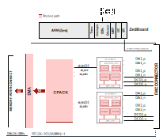
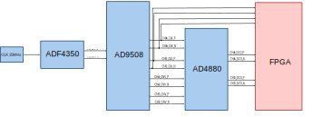

.. _ad488x_fmc_evb:

AD488X-FMC-EVB HDL project
================================================================================

Overview
-------------------------------------------------------------------------------

The :adi:`EVAL-AD4880-FMC` is designed to demonstrate the :adi:`AD4880`
performance.

The :git-hdl:`AD488X-FMC-EVB HDL project <projects/ad488x_fmc_evb>` supports
the following :adi:`AD4880` features:

- Single/Dual lane DDR data capture
- Self synchronization using the fixed pattern and bit-slip feature
- Capturing digital averaging filter with up to 2^10 decimation
- Analog-to-digital converter (ADC) configuration via serial peripheral
  interface (SPI)
- Sampling rate capability between 1.25 MSPS and 40 MSPS
- Synchronized capture between the channels

Supported boards
-------------------------------------------------------------------------------

- :adi:`EVAL-AD4880-FMC`

Supported devices
-------------------------------------------------------------------------------

- :adi:`AD4880`

Supported carriers
-------------------------------------------------------------------------------

.. list-table::
   :widths: 35 35 30
   :header-rows: 1

   * - Evaluation board
     - Carrier
     - FMC slot
   * - :adi:`EVAL-AD4880-FMC`
     - `ZedBoard <https://digilent.com/shop/zedboard-zynq-7000-arm-fpga-soc-development-board>`__
     - FMC-LPC

Block design
-------------------------------------------------------------------------------

.. warning::

    The VADJ for the Zedboard must be set to 2.5V.

Block diagram
~~~~~~~~~~~~~~~~~~~~~~~~~~~~~~~~~~~~~~~~~~~~~~~~~~~~~~~~~~~~~~~~~~~~~~~~~~~~~~~

The data path and clock domains are depicted in the below diagram:

Clock scheme
~~~~~~~~~~~~~~~~~~~~~~~~~~~~~~~~~~~~~~~~~~~~~~~~~~~~~~~~~~~~~~~~~~~~~~~~~~~~~~~

CPU/Memory interconnects addresses
~~~~~~~~~~~~~~~~~~~~~~~~~~~~~~~~~~~~~~~~~~~~~~~~~~~~~~~~~~~~~~~~~~~~~~~~~~~~~~~

The addresses are dependent on the architecture of the FPGA, having an offset
added to the base address from HDL (see more at :ref:`architecture`).

==================== ===============
Instance             Zynq/Microblaze
==================== ===============
axi_ad4080_adc_a     0x44A0_0000
axi_ad4080_adc_b     0x44A1_0000
axi_ad4880_dma       0x44A3_0000
ad4080_b_spi         0x44A7_0000
ad408x_clock_monitor 0x44A8_0000
==================== ===============

SPI connections
~~~~~~~~~~~~~~~~~~~~~~~~~~~~~~~~~~~~~~~~~~~~~~~~~~~~~~~~~~~~~~~~~~~~~~~~~~~~~~~

.. list-table::
   :widths: 25 25 25 25
   :header-rows: 1

   * - SPI type
     - SPI manager instance
     - SPI subordinate
     - CS
   * - PS
     - SPI 0
     - AD4880_A
     - 0
   * - PL
     - ad4080_b_spi
     - AD4880_B
     - 0
   * - PS
     - SPI 1
     - AD9508
     - 0
   * - PS
     - SPI 1
     - ADF4350
     - 1

GPIOs
~~~~~~~~~~~~~~~~~~~~~~~~~~~~~~~~~~~~~~~~~~~~~~~~~~~~~~~~~~~~~~~~~~~~~~~~~~~~~~~

.. list-table::
   :widths: 25 20 20 20 15
   :header-rows: 2

   * - GPIO signal
     - Direction
     - HDL GPIO EMIO
     - Software GPIO
     - Software GPIO
   * -
     - (from FPGA view)
     -
     - Zynq-7000
     - Zynq MP
   * - adcb_gpio3_fmc
     - OUT
     - 39
     - 93
     - 117
   * - adcb_gpio2_fmc
     - OUT
     - 38
     - 92
     - 116
   * - ad9508_sync
     - OUT
     - 37
     - 91
     - 115
   * - pwrgd
     - IN
     - 36
     - 90
     - 114
   * - adf435x_lock
     - IN
     - 35
     - 89
     - 113
   * - adca_gpio3_fmc
     - INOUT
     - 34
     - 88
     - 112
   * - adca_gpio2_fmc
     - INOUT
     - 33
     - 87
     - 111

Interrupts
~~~~~~~~~~~~~~~~~~~~~~~~~~~~~~~~~~~~~~~~~~~~~~~~~~~~~~~~~~~~~~~~~~~~~~~~~~~~~~~

Below are the Programmable Logic interrupts used in this project.

================ === ========== ===========
Instance name    HDL Linux Zynq Actual Zynq
================ === ========== ===========
axi_ad4880_dma   13  57         89
ad4080_b_spi     10  54         86
================ === ========== ===========

Building the HDL project
-------------------------------------------------------------------------------

The design is built upon ADI's generic HDL reference design framework.
ADI distributes the bit/elf files of these projects as part of the
:dokuwiki:`ADI Kuiper Linux <resources/tools-software/linux-software/kuiper-linux>`.
If you want to build the sources, ADI makes them available on the
:git-hdl:`HDL repository </>`. To get the source you must
`clone <https://git-scm.com/book/en/v2/Git-Basics-Getting-a-Git-Repository>`__
the HDL repository, and then build the project as follows:

**Linux/Cygwin/WSL**

.. shell:: bash

   $cd hdl/projects/ad488x_fmc_evb/zed
   $make

A more comprehensive build guide can be found in the :ref:`build_hdl` user guide.

Resources
-------------------------------------------------------------------------------

Systems related
~~~~~~~~~~~~~~~~~~~~~~~~~~~~~~~~~~~~~~~~~~~~~~~~~~~~~~~~~~~~~~~~~~~~~~~~~~~~~~~

- UG-2214, User Guide | EVAL-AD4880

Hardware related
~~~~~~~~~~~~~~~~~~~~~~~~~~~~~~~~~~~~~~~~~~~~~~~~~~~~~~~~~~~~~~~~~~~~~~~~~~~~~~~

-  Product datasheet: :adi:`AD4880`

HDL related
~~~~~~~~~~~~~~~~~~~~~~~~~~~~~~~~~~~~~~~~~~~~~~~~~~~~~~~~~~~~~~~~~~~~~~~~~~~~~~~

-  :git-hdl:`AD488x-FMC-EVB HDL project source code <projects/ad488x_fmc_evb>`

.. list-table::
   :widths: 30 35 35
   :header-rows: 1

   * - IP name
     - Source code link
     - Documentation link
   * - AXI_AD408X
     - :git-hdl:`library/axi_ad408x`
     - :ref:`axi_ad408x`
   * - AXI_CLKGEN
     - :git-hdl:`library/axi_clkgen`
     - :ref:`axi_clkgen`
   * - AXI_CLOCK_MONITOR
     - :git-hdl:`library/axi_clock_monitor`
     - :ref:`axi_clock_monitor`
   * - AXI_DMAC
     - :git-hdl:`library/axi_dmac`
     - :ref:`axi_dmac`
   * - AXI_HDMI_TX
     - :git-hdl:`library/axi_hdmi_tx`
     - :ref:`axi_hdmi_tx`
   * - AXI_I2S_ADI
     - :git-hdl:`library/axi_i2s_adi`
     - —
   * - AXI_SPDIF_TX
     - :git-hdl:`library/axi_spdif_tx`
     - 	—
   * - AXI_SYSID
     - :git-hdl:`library/axi_sysid`
     - :ref:`axi_sysid`
   * - SYSID_ROM
     - :git-hdl:`library/sysid_rom`
     - :ref:`axi_sysid`
   * - UTIL_I2C_MIXER
     - :git-hdl:`library/util_i2c_mixer`
     - 	—
   * - UTIL_CPACK2
     - :git-hdl:`library/util_pack/util_cpack2`
     - :ref:`util_cpack2`

Software related
~~~~~~~~~~~~~~~~~~~~~~~~~~~~~~~~~~~~~~~~~~~~~~~~~~~~~~~~~~~~~~~~~~~~~~~~~~~~~~~

-  Python support:

   -  `PyADI-IIO documentation <https://analogdevicesinc.github.io/pyadi-iio/>`__
   -  `PyADI-IIO example <https://github.com/analogdevicesinc/pyadi-iio/blob/ad4880/examples/ad4880_example.py>`__
   -  `PyADI-IIO class <https://github.com/analogdevicesinc/pyadi-iio/blob/ad4880/adi/ad4880.py>`__
   -  AD4880-FMC-EVB Linux device tree :git-linux:`zynq-zed-adv7511-ad4880.dts
      <arch/arm/boot/dts/zynq-zed-adv7511-ad4880.dts>`
   -  AD4880 Linux driver :git-linux:`ad4080.c <drivers/iio/adc/ad4080.c>`

.. include:: ../common/more_information.rst

.. include:: ../common/support.rst