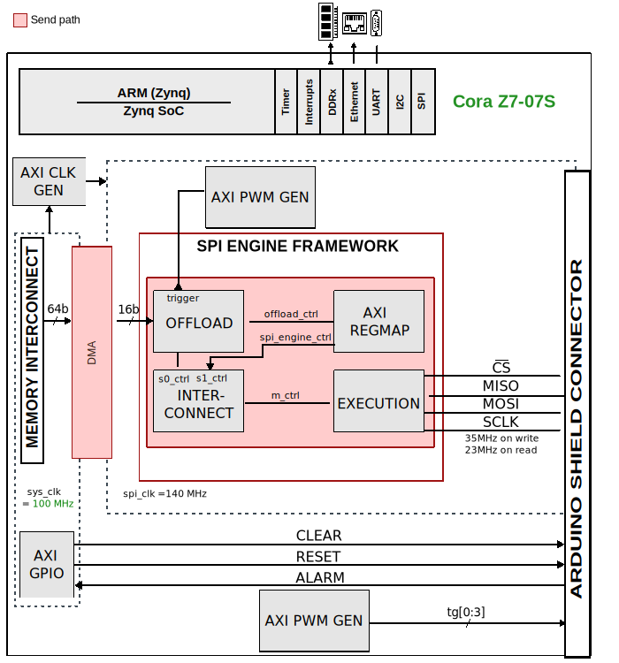

.. _ad5529r:

AD5529R HDL project
=================================================================================

Overview
---------------------------------------------------------------------------------

The :adi:`AD5529R` is a 16-channel, 16-bit voltage-output digital-to-analog
converter (DAC) with an integrated 4.096V precision reference. The device
supports programmable output ranges up to ±20V or 0-40V, making it suitable
for industrial control, test and measurement, and process automation applications.

Key features include:

- 16-bit resolution across 16 channels
- Built-in digital functions (toggle, dither, ramp)
- Monitor multiplexer for diagnostics
- SPI interface: 16-bit instruction + 8/16-bit data
- Maximum SPI clock: 50 MHz
- Settling time: 8-20 µs (range-dependent)

This HDL project implements the SPI Engine framework with DMA streaming,
enabling SPI throughput of 123.4 kSPS per channel with hardware-triggered
updates and zero CPU involvement. Actual update rate is settling-time
limited (125 kSPS at 0-5V range, down to 50 kSPS at ±20V range).

Supported boards
-------------------------------------------------------------------------------

- :adi:`EVAL-AD5529R-ARDZ`

Supported devices
-------------------------------------------------------------------------------

- :adi:`AD5529R`

Supported carriers
-------------------------------------------------------------------------------

- `Cora Z7-07S <https://digilent.com/shop/cora-z7-zynq-7000-single-core-for-arm-fpga-soc-development>`__ (XC7Z007S)

Block design
-------------------------------------------------------------------------------

Block diagram
~~~~~~~~~~~~~~~~~~~~~~~~~~~~~~~~~~~~~~~~~~~~~~~~~~~~~~~~~~~~~~~~~~~~~~~~~~~~~~~

The data path and clock domains are depicted in the below diagram:

CPU/Memory interconnects addresses
~~~~~~~~~~~~~~~~~~~~~~~~~~~~~~~~~~~~~~~~~~~~~~~~~~~~~~~~~~~~~~~~~~~~~~~~~~~~~~~

The addresses are dependent on the architecture of the FPGA, having an offset
added to the base address from HDL(see more at :ref:`architecture cpu-intercon-addr`).

==============================  ===========
Instance                        Zynq
==============================  ===========
spi_ad5529r_axi_regmap          0x44A0_0000
ad5529r_dma                     0x44A4_0000
trig_gen                        0x44B0_0000
axi_ad5529r_clkgen              0x44B1_0000
toggle_gen                      0x44B2_0000
axi_sysid_0                     0x4500_0000
==============================  ===========

SPI connections
~~~~~~~~~~~~~~~~~~~~~~~~~~~~~~~~~~~~~~~~~~~~~~~~~~~~~~~~~~~~~~~~~~~~~~~~~~~~~~~

.. list-table::
   :widths: 25 25 25 25
   :header-rows: 1

   * - SPI type
     - SPI manager instance
     - SPI subordinate
     - CS
   * - PL
     - spi_ad5529r
     - ad5529r
     - 0

GPIOs
~~~~~~~~~~~~~~~~~~~~~~~~~~~~~~~~~~~~~~~~~~~~~~~~~~~~~~~~~~~~~~~~~~~~~~~~~~~~~~~

The Software GPIO number is calculated as follows:

- Zynq-7000: if PS7 is used, then offset is 54

.. list-table::
   :widths: 25 25 25 25
   :header-rows: 2

   * - GPIO signal
     - Direction
     - HDL GPIO EMIO
     - Software GPIO
   * -
     - (from FPGA view)
     -
     - Zynq-7000
   * - ad5529r_clear
     - OUT
     - 32
     - 86
   * - ad5529r_reset
     - OUT
     - 33
     - 87
   * - ad5529r_alarm
     - IN
     - 34
     - 88

Interrupts
~~~~~~~~~~~~~~~~~~~~~~~~~~~~~~~~~~~~~~~~~~~~~~~~~~~~~~~~~~~~~~~~~~~~~~~~~~~~~~~

Below are the Programmable Logic interrupts used in this project.

.. IRQ assignments defined in: projects/ad5529r_ardz/common/ad5529r_ardz_bd.tcl
.. IRQ_F2P mode (REVERSE) set in: projects/common/coraz7s/coraz7s_system_bd.tcl

====================== === ========== ===========
Instance name          HDL Linux Zynq Actual Zynq
====================== === ========== ===========
ad5529r_dma            13  57         89
spi_ad5529r/axi_regmap 12  56         88
====================== === ========== ===========

Note: IRQ_F2P mode is REVERSE (bit 15 = highest priority).

Building the HDL project
-------------------------------------------------------------------------------

The design is built upon ADI's generic HDL reference design framework.
ADI distributes the bit/elf files of these projects as part of the
:dokuwiki:`ADI Kuiper Linux <resources/tools-software/linux-software/kuiper-linux>`.
If you want to build the sources, ADI makes them available on the
:git-hdl:`HDL repository </>`. To get the source you must
`clone <https://git-scm.com/book/en/v2/Git-Basics-Getting-a-Git-Repository>`__
the HDL repository, and then build the project as follows:

**Linux/Cygwin/WSL**

.. shell::

   $cd hdl/projects/ad5529r/coraz7s
   $make

A more comprehensive build guide can be found in the :ref:`build_hdl` user guide.

Resources
-------------------------------------------------------------------------------

Systems related
~~~~~~~~~~~~~~~~~~~~~~~~~~~~~~~~~~~~~~~~~~~~~~~~~~~~~~~~~~~~~~~~~~~~~~~~~~~~~~~

- TBD

Hardware related
~~~~~~~~~~~~~~~~~~~~~~~~~~~~~~~~~~~~~~~~~~~~~~~~~~~~~~~~~~~~~~~~~~~~~~~~~~~~~~~

- Product datasheets:

  - :adi:`AD5529R`

HDL related
~~~~~~~~~~~~~~~~~~~~~~~~~~~~~~~~~~~~~~~~~~~~~~~~~~~~~~~~~~~~~~~~~~~~~~~~~~~~~~~

- :git-hdl:`ad5529r HDL project source code <projects/ad5529r>`

.. list-table::
   :widths: 30 40 30
   :header-rows: 1

   * - IP name
     - Source code link
     - Documentation link
   * - AXI_CLKGEN
     - :git-hdl:`library/axi_clkgen`
     - :ref:`axi_clkgen`
   * - AXI_DMAC
     - :git-hdl:`library/axi_dmac`
     - :ref:`axi_dmac`
   * - AXI_PWM_GEN
     - :git-hdl:`library/axi_pwm_gen`
     - :ref:`axi_pwm_gen`
   * - AXI_SYSID
     - :git-hdl:`library/axi_sysid`
     - :ref:`axi_sysid`
   * - AXI_SPI_ENGINE
     - :git-hdl:`library/spi_engine/axi_spi_engine`
     - :ref:`spi_engine axi`
   * - SPI_ENGINE_EXECUTION
     - :git-hdl:`library/spi_engine/spi_engine_execution`
     - :ref:`spi_engine execution`
   * - SPI_ENGINE_OFFLOAD
     - :git-hdl:`library/spi_engine/spi_engine_offload`
     - :ref:`spi_engine offload`
   * - SYSID_ROM
     - :git-hdl:`library/sysid_rom`
     - :ref:`axi_sysid`

- :ref:`SPI Engine Framework documentation <spi_engine>`

Software related
~~~~~~~~~~~~~~~~~~~~~~~~~~~~~~~~~~~~~~~~~~~~~~~~~~~~~~~~~~~~~~~~~~~~~~~~~~~~~~~

- Linux driver: TBD
- No-OS driver: TBD

.. include:: ../common/more_information.rst

.. include:: ../common/support.rst
