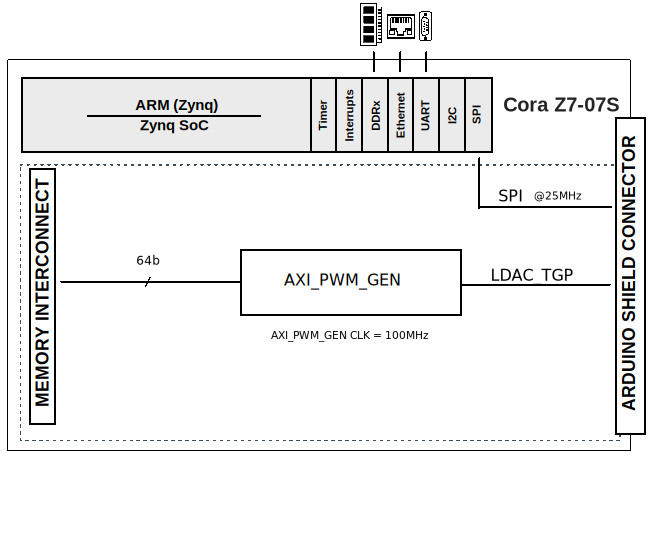

.. _ad5706r:

AD5706R HDL project
================================================================================

Overview
--------------------------------------------------------------------------------

The :adi:`AD5706R` devices are 4-channel, 16-/12-/10-bit resolution, low noise,
programmable current output, digital-to-analog converter (DAC) capable of
multiple operating modes and output current ranges with high power efficiency.
These are intended for photonics control and current mode biasing applications.
The devices incorporate a 2.5V, on-chip voltage reference, die temperature, load
DAC, and A/B toggle functions, output monitoring functions, and reset functions.

The family provides multiple programmable output current ranges up to 300mA.
With device addressable pins, an SPI transaction can communicate with up to four
:adi:`AD5706R` on the same SPI bus. Each DAC operates with an independent
positive power supply rails PVDDx from 1.65V to 3.6V, for optimizing power
efficiency and thermal power dissipation. The AD5706R operate from a 2.9V to
3.6V AVDD supply and are specified over the −40°C to +125°C temperature range.

Applications:

- Photonics Control
- Optical Communications
- LED Driver Programmable Current Source
- Current Mode Biasing

Supported boards
-------------------------------------------------------------------------------

- :adi:`EVAL-AD5706RARDZ`

Supported devices
-------------------------------------------------------------------------------

- :adi:`AD5706`
- :adi:`AD5706R`

Supported carriers
-------------------------------------------------------------------------------

- :xilinx:`Cora Z7-07S <products/boards-and-kits/1-1qlaz7n.html>` on Arduino Header

Block design
-------------------------------------------------------------------------------

Block diagram
~~~~~~~~~~~~~~~~~~~~~~~~~~~~~~~~~~~~~~~~~~~~~~~~~~~~~~~~~~~~~~~~~~~~~~~~~~~~~~~

The data path is depicted in the below diagram:

Hardware setup
~~~~~~~~~~~~~~~~~~~~~~~~~~~~~~~~~~~~~~~~~~~~~~~~~~~~~~~~~~~~~~~~~~~~~~~~~~~~~~~~~~

========= ================= =============
Signal    AD5706R Testpoint Cora Z7-07S 
========= ================= =============
SPI_CSB   CS                CHIPKIT IO 10        
SPI_SDO   SDO               CHIPKIT IO 11  
SPI_SDI   SDI               CHIPKIT IO 12  
SPI_SCLK  SCK               CHIPKIT IO 13  
SHDN      PMOD P7           CHIPKIT IO 7  
RESETB    RESET             CHIPKIT IO 8  
LDACB_TGP PMOD P6           CHIPKIT IO 9  
========= ================= =============

.. important::

   The evaluation board is powered by 5 V voltage from an external USB.

CPU/Memory interconnects addresses
~~~~~~~~~~~~~~~~~~~~~~~~~~~~~~~~~~~~~~~~~~~~~~~~~~~~~~~~~~~~~~~~~~~~~~~~~~~~~~~

The addresses are dependent on the architecture of the FPGA, having an offset
added to the base address from HDL (see more at :ref:`architecture cpu-intercon-addr`).

===================  ==========
Instance             Zynq-7000
===================  ==========
axi_ad5706R_pwm_gen  0x44A00000
===================  ==========

GPIOs
~~~~~~~~~~~~~~~~~~~~~~~~~~~~~~~~~~~~~~~~~~~~~~~~~~~~~~~~~~~~~~~~~~~~~~~~~~~~~~~

The Software GPIO number is calculated as follows:

- Zynq-7000: if PS7 is used, then the offset is 54

.. list-table::
   :widths: 25 25 25 25
   :header-rows: 2

   * - GPIO signal
     - Direction
     - HDL GPIO EMIO
     - Software GPIO
   * -
     - (from FPGA view)
     -
     - Zynq-7000
   * - RESETB
     - OUT
     - 32
     - 86
   * - SHDN
     - OUT
     - 33
     - 87

Building the HDL project
-------------------------------------------------------------------------------

The design is built upon ADI's generic HDL reference design framework.
ADI distributes the bit/elf files of these projects as part of the
:dokuwiki:`ADI Kuiper Linux <resources/tools-software/linux-software/kuiper-linux>`.
If you want to build the sources, ADI makes them available on the
:git-hdl:`HDL repository </>`. To get the source you must
`clone <https://git-scm.com/book/en/v2/Git-Basics-Getting-a-Git-Repository>`__
the HDL repository, and then build the project as follows:

**Linux/Cygwin/WSL**

.. shell::

   $cd hdl/projects/ad5706r/coraz7s
   $make

A more comprehensive build guide can be found in the :ref:`build_hdl` user guide.

Resources
-------------------------------------------------------------------------------

Hardware related
~~~~~~~~~~~~~~~~~~~~~~~~~~~~~~~~~~~~~~~~~~~~~~~~~~~~~~~~~~~~~~~~~~~~~~~~~~~~~~~

- Product datasheet: :adi:`AD5706R`
- `UG-XXXX: EVAL-AD5706RARDZ Board User Guide <https://www.analog.com/media/en/technical-documentation/user-guides/eval-ad5706r-ug-xxxx.pdf>`__

HDL related
~~~~~~~~~~~~~~~~~~~~~~~~~~~~~~~~~~~~~~~~~~~~~~~~~~~~~~~~~~~~~~~~~~~~~~~~~~~~~~~

- :git-hdl:`AD5706R HDL project source code <projects/ad5706r>`

.. list-table::
   :widths: 30 35 35
   :header-rows: 1

   * - IP name
     - Source code link
     - Documentation link
   * - AXI_CLKGEN
     - :git-hdl:`library/axi_clkgen`
     - :ref:`axi_clkgen`
   * - AXI_DMAC
     - :git-hdl:`library/axi_dmac`
     - :ref:`axi_dmac`
   * - AXI_HDMI_TX
     - :git-hdl:`library/axi_hdmi_tx`
     - :ref:`axi_hdmi_tx`
   * - AXI_PWM_GEN
     - :git-hdl:`library/axi_pwm_gen`
     - :ref:`axi_pwm_gen`

Software related
~~~~~~~~~~~~~~~~~~~~~~~~~~~~~~~~~~~~~~~~~~~~~~~~~~~~~~~~~~~~~~~~~~~~~~~~~~~~~~~

- :git-no-os:`AD5706R No-OS project source code <projects/ad5706r>`
- :git-no-os:`AD5706R No-OS Driver source code <drivers/afe/ad5706r>`
- :dokuwiki:`AD5706R No-OS Driver documentation <resources/tools-software/uc-drivers/ad5706r>`
- :dokuwiki:`AD5706R IIO Application <resources/tools-software/product-support-software/ad5706r_mbed_iio_application>`

.. include:: ../common/more_information.rst

.. include:: ../common/support.rst
