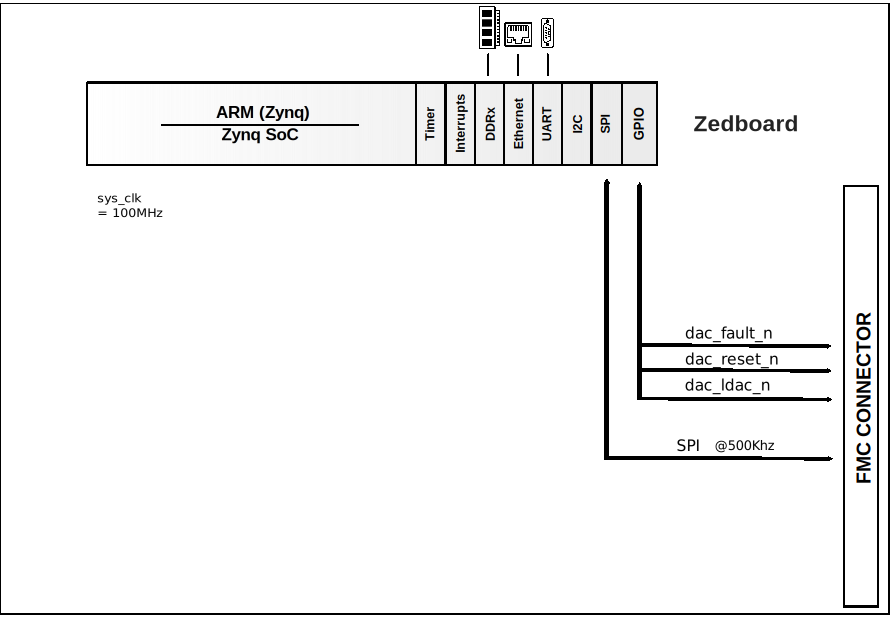

.. _ad5758_sdz:

AD5758-SDZ HDL project
================================================================================

Overview
--------------------------------------------------------------------------------

The :adi:`AD5758` is a single-channel, voltage and current output
digital-to-analog converter (DAC) that operates with a power supply range from
−33 V (minimum) on AVSS to +33 V (maximum) on AVDD1 with a maximum operating
voltage between the two rails of 60 V. On-chip DPC (dynamic power control)
minimizes package power dissipation, which is achieved by regulating the supply
voltage (VDPC+) to the VIOUT output driver circuitry from 5 V to 27 V using a
buck dc-to-dc converter, optimized for minimum on-chip power dissipation. The
CHART pin enables a HART signal to be coupled onto the current output.

The device uses a versatile 4-wire serial peripheral interface (SPI) that
operates at clock rates of up to 50 MHz and is compatible with standard SPI,
QSPI™, MICROWIRE™, DSP, and microcontroller interface standards. The interface
also features an optional SPI cyclic redundancy check (CRC) and a watchdog
timer. The :adi:`AD5758` offers improved diagnostic features from its
predecessors, such as output current monitoring and an integrated 12-bit
diagnostic ADC. Additional robustness is provided by the inclusion of a fault
protection switch on VIOUT, +VSENSE, and −VSENSE pins.

Applications:

* Process control
* Actuator control
* PLC and distributed control systems (DCS) applications
* HART network connectivity

Supported boards
-------------------------------------------------------------------------------

- :adi:`EVAL-AD5758`

Supported devices
-------------------------------------------------------------------------------

- :adi:`AD5758`

Supported carriers
-------------------------------------------------------------------------------

- `ZedBoard <https://digilent.com/shop/zedboard-zynq-7000-arm-fpga-soc-development-board>`__ on FMC slot

Other required hardware
-------------------------------------------------------------------------------

- :adi:`SDP-S`

Block design
-------------------------------------------------------------------------------

Block diagram
~~~~~~~~~~~~~~~~~~~~~~~~~~~~~~~~~~~~~~~~~~~~~~~~~~~~~~~~~~~~~~~~~~~~~~~~~~~~~~~

The data path and clock domains are depicted in the below diagram:

Jumper setup
~~~~~~~~~~~~~~~~~~~~~~~~~~~~~~~~~~~~~~~~~~~~~~~~~~~~~~~~~~~~~~~~~~~~~~~~~~~~~~~

================== ================ ============================================
Jumper/Solder link Default Position Description
================== ================ ============================================
JP1                B                Position B selects the VOUT3 pin of the
                                    :adi:`ADP1031`
JP2                Inserted         Connects the VLOGIC pin of the :adi:`AD5758`
                                    to the SVDD1 pin of the :adi:`ADP1031`
JP3                B                Position B selects the 3.3 V input via the
                                    EXT+3.3V header to the MVDD pin of the
                                    :adi:`ADP1031`
JP4                A                Position A connects the LDAC pin to GND
JP5                B                Position B selects the VLDO pin as the input
                                    voltage to the :adi:`ADR4525`
JP6                Not inserted     Shorts the VDPC+ pin to the AVDD1 pin,
                                    bypassing the positive dc-to-dc circuitry
JP7                A                Position A connects the AD0 pin to GND
JP8                A                Position A connects the AD1 pin to GND
JP9                Inserted         Connects the return signal to GND
JP10               B                Position B selects the :adi:`ADR4525` output
                                    as the input to the REFIN pin
JP11               Inserted         Selects 3.3 V output of the VLDO pin to the
                                    VLOGIC pin
JP12               A                Position A selects VOUT2 of the
                                    :adi:`ADP1031` as the input voltage to the
                                    AVDD2 pin
JP13               Inserted         Connects VOUT1 of the :adi:`ADP1031` to
                                    the AVDD1 pin
================== ================ ============================================

.. note::

    Jumpers on the P2_Header must be inserted to make the connection between the
    :adi:`ADP1031` and the :adi:`SDP-S`.

GPIOs
~~~~~~~~~~~~~~~~~~~~~~~~~~~~~~~~~~~~~~~~~~~~~~~~~~~~~~~~~~~~~~~~~~~~~~~~~~~~~~~

The Software GPIO number is calculated as follows:

- Zynq-7000: if PS7 is used, then the offset is 54

.. list-table::
   :widths: 25 25 25 25
   :header-rows: 2

   * - GPIO signal
     - Direction
     - HDL GPIO EMIO
     - Software GPIO
   * -
     - (from FPGA view)
     -
     - Zynq-7000
   * - dac_ldac_n
     - OUT
     - 34
     - 88
   * - dac_reset_n
     - OUT
     - 33
     - 87
   * - dac_fault_n
     - IN
     - 32
     - 86

Building the HDL project
-------------------------------------------------------------------------------

The design is built upon ADI's generic HDL reference design framework.
ADI distributes the bit/elf files of these projects as part of the
:dokuwiki:`ADI Kuiper Linux <resources/tools-software/linux-software/kuiper-linux>`.
If you want to build the sources, ADI makes them available on the
:git-hdl:`HDL repository </>`. To get the source you must
`clone <https://git-scm.com/book/en/v2/Git-Basics-Getting-a-Git-Repository>`__
the HDL repository, and then build the project as follows:.

**Linux/Cygwin/WSL**

.. shell::

   $cd hdl/projects/ad5758_sdz/zed
   $make

A more comprehensive build guide can be found in the :ref:`build_hdl` user guide.

Resources
-------------------------------------------------------------------------------

Hardware related
~~~~~~~~~~~~~~~~~~~~~~~~~~~~~~~~~~~~~~~~~~~~~~~~~~~~~~~~~~~~~~~~~~~~~~~~~~~~~~~

- Product datasheet: :adi:`AD5758`
- :adi:`UG-1268: EVAL-AD5758 Board User Guide <media/en/technical-documentation/user-guides/eval-ad5758-ug-1268.pdf>`

HDL related
~~~~~~~~~~~~~~~~~~~~~~~~~~~~~~~~~~~~~~~~~~~~~~~~~~~~~~~~~~~~~~~~~~~~~~~~~~~~~~~

- :git-hdl:`AD5758-SDZ HDL project source code <projects/ad5758_sdz>`

.. list-table::
   :widths: 30 35 35
   :header-rows: 1

   * - IP name
     - Source code link
     - Documentation link
   * - AXI_CLKGEN
     - :git-hdl:`library/axi_clkgen`
     - :ref:`axi_clkgen`
   * - AXI_DMAC
     - :git-hdl:`library/axi_dmac`
     - :ref:`axi_dmac`
   * - AXI_HDMI_TX
     - :git-hdl:`library/axi_hdmi_tx`
     - :ref:`axi_hdmi_tx`
   * - AXI_I2S_ADI
     - :git-hdl:`library/axi_i2s_adi`
     - ---
   * - AXI_SPDIF_TX
     - :git-hdl:`library/axi_spdif_tx`
     - ---
   * - AXI_SYSID
     - :git-hdl:`library/axi_sysid`
     - :ref:`axi_sysid`
   * - AXI_SYSID_ROM
     - :git-hdl:`library/sysid_rom`
     - :ref:`axi_sysid`
   * - UTIL_I2C_MIXER
     - :git-hdl:`library/util_i2c_mixer`
     - ---

Software related
~~~~~~~~~~~~~~~~~~~~~~~~~~~~~~~~~~~~~~~~~~~~~~~~~~~~~~~~~~~~~~~~~~~~~~~~~~~~~~~

- :dokuwiki:`Using the Serial Peripheral Interface on the AD5758 <resources/eval/user-guides/spi>`

Linux support:

- :dokuwiki:`AD5758 IIO DAC Linux Driver <resources/tools-software/linux-drivers/iio-dac/ad5758>`
- :git-linux:`AD5758_SDZ Linux driver source code <drivers/iio/dac/ad5758.c>`

No-OS support:

- :git-no-os:`AD5758-SDZ No-OS project source code <projects/ad5758-sdz>`
- :git-no-os:`AD5758 No-OS Driver source code <drivers/dac/ad5758>`
- :dokuwiki:`AD5758 No-OS Driver documentation <resources/tools-software/uc-drivers/ad5758>`

.. include:: ../common/more_information.rst

.. include:: ../common/support.rst
