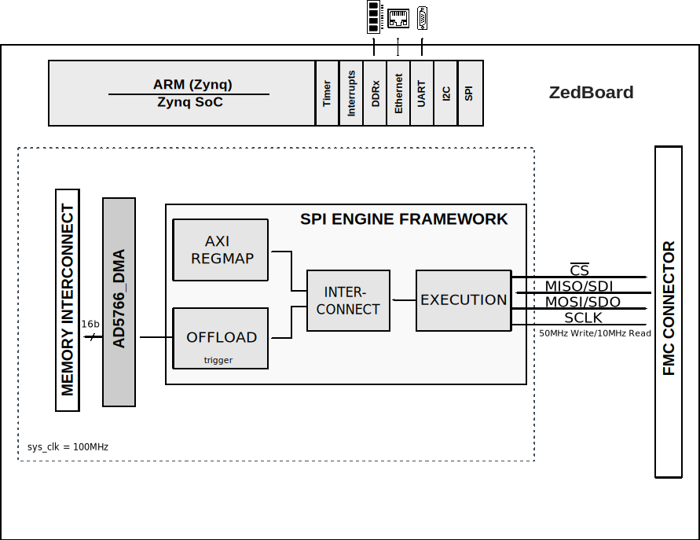

.. _ad5766_sdz:

AD5766-SDZ HDL project
===============================================================================

Overview
-------------------------------------------------------------------------------

The :adi:`AD5766`/ :adi:`AD5767` are 16-channel, 16-/12-bit, voltage output
Digital-to-Analog Converters (DAC). The DAC generates output voltage ranges from
an external 2.5 V reference. Depending on the span selected, the mid-point of
the output span can be adjusted allowing for a minimum output voltage as low as
−20 V or a maximum output voltage of up to +14 V.

The :adi:`AD5766`/ :adi:`AD5767` have integrated output buffers which can sink
or source up to 20 mA. This makes the AD5766/AD5767 suitable for Indium Phosphide
Mach Zehnder Modulator (InP-MZM) biasing applications.

The part incorporates a power-on reset circuit that ensures that the DAC outputs
power up to 0V and remain at this level until the output range of the DAC is
configured. The outputs of all DACs are updated through register configuration,
with the added functionality of user-selectable DAC channels to be simultaneously
updated.

The :adi:`AD5766`/ :adi:`AD5767` require four power supplies. AVCC is the analog
supply for the low voltage DAC circuitry. AVDD and AVSS are the positive and
negative high voltage power supplies for the output amplifiers. A VLOGIC supply
pin is provided to set the logic levels for the digital interface pins.
The :adi:`AD5766`/ :adi:`AD5767` utilize a versatile 4-wire serial interface
that operates at clock rates of up to 50 MHz for write mode and up to 10MHz for
readback and daisy-chain mode, and is compatible with SPIR, QSPI., MICROWIRE.
and DSP interface standards.

The :adi:`AD5766`/ :adi:`AD5767` are available in a 4mm x 4mm WLCSP package
and operates at the range of -40C to +105C.

Applications:

* Mach Zehnder Modulator Bias Control
* Analog Output Modules
* Process Control

Supported boards
-------------------------------------------------------------------------------

- :adi:`EVAL-AD5766`
- :adi:`EVAL-AD5767`

Supported devices
-------------------------------------------------------------------------------

- :adi:`AD5766`
- :adi:`AD5767`

Supported carriers
-------------------------------------------------------------------------------

- `ZedBoard <https://digilent.com/shop/zedboard-zynq-7000-arm-fpga-soc-development-board>`__ on FMC slot
- :adi:`SDP-I-FMC <EVAL-SDP-I-FMC>`

Block design
-------------------------------------------------------------------------------

Block diagram
~~~~~~~~~~~~~~~~~~~~~~~~~~~~~~~~~~~~~~~~~~~~~~~~~~~~~~~~~~~~~~~~~~~~~~~~~~~~~~~

The data path and clock domains are depicted in the below diagram:

Jumper setup
~~~~~~~~~~~~~~~~~~~~~~~~~~~~~~~~~~~~~~~~~~~~~~~~~~~~~~~~~~~~~~~~~~~~~~~~~~~~~~~

================== ================= ==========================================
Jumper/Solder link Default Position  Description
================== ================= ==========================================
LK1,LK2,LK3        A                 Supplied by the 3.3 V supply (J12)
LK4,LK5            B                 Supplied by the :adi:`ADP5071` power
                                     solution
LK6                B                 Positive and negative output rails power
                                     up simultaneously when EN2 is high
LK7                A                 Selects the :adi:`ADR4525` 2.5 V reference
LK8                B                 Supplied by the 3.3 V supply (J12)
LK9                A                 1.2 MHz switching frequency (default)
LK10               A                 Slowest slew rate (best noise performance)
LK11,LK12          Removed           Insert link to bypass the LC filter on the
                                     :adi:`ADP5071` positive output
SW1                Pos-2             ADP5070_VPOS = +8V, ADP5070_VNEG = -22V
================== ================= ==========================================

CPU/Memory interconnects addresses
~~~~~~~~~~~~~~~~~~~~~~~~~~~~~~~~~~~~~~~~~~~~~~~~~~~~~~~~~~~~~~~~~~~~~~~~~~~~~~~

The addresses are dependent on the architecture of the FPGA, having an offset
added to the base address from HDL (see more at :ref:`architecture cpu-intercon-addr`).

========================  ===========
Instance                  Zynq
========================  ===========
spi/axi                   0x44A0_0000
spi/axi_ad5766            0x44A1_0000
axi_ad5766_dac_dma        0x44A2_0000
========================  ===========

I2C connections
~~~~~~~~~~~~~~~~~~~~~~~~~~~~~~~~~~~~~~~~~~~~~~~~~~~~~~~~~~~~~~~~~~~~~~~~~~~~~~~

.. list-table::
   :widths: 20 20 20 20 20
   :header-rows: 1

   * - I2C type
     - I2C manager instance
     - Alias
     - Address
     - I2C subordinate
   * - PL
     - iic_fmc
     - axi_iic_fmc
     - 0x4162_0000
     - ---
   * - PL
     - iic_main
     - axi_iic_main
     - 0x4160_0000
     - ---

SPI connections
~~~~~~~~~~~~~~~~~~~~~~~~~~~~~~~~~~~~~~~~~~~~~~~~~~~~~~~~~~~~~~~~~~~~~~~~~~~~~~~

.. list-table::
   :widths: 25 25 25 25
   :header-rows: 1

   * - SPI type
     - SPI manager instance
     - SPI subordinate
     - CS
   * - PL
     - axi_spi_engine
     - ad5766
     - 0

GPIOs
~~~~~~~~~~~~~~~~~~~~~~~~~~~~~~~~~~~~~~~~~~~~~~~~~~~~~~~~~~~~~~~~~~~~~~~~~~~~~~~

The Software GPIO number is calculated as follows:

- Zynq-7000: if PS7 is used, then offset is 54

.. list-table::
   :widths: 25 25 25 25
   :header-rows: 2

   * - GPIO signal
     - Direction
     - HDL GPIO EMIO
     - Software GPIO
   * -
     - (from FPGA view)
     -
     - Zynq-7000
   * - reset
     - INOUT
     - 32
     - 86

Interrupts
~~~~~~~~~~~~~~~~~~~~~~~~~~~~~~~~~~~~~~~~~~~~~~~~~~~~~~~~~~~~~~~~~~~~~~~~~~~~~~~

Below are the Programmable Logic interrupts used in this project.

=================== === ========== ===========
Instance name       HDL Linux Zynq Actual Zynq
=================== === ========== ===========
axi_ad5766_dac_dma  13  57         89
spi                 12  56         88
=================== === ========== ===========

Building the HDL project
-------------------------------------------------------------------------------

The design is built upon ADI's generic HDL reference design framework.
ADI distributes the bit/elf files of these projects as part of the
:dokuwiki:`ADI Kuiper Linux <resources/tools-software/linux-software/kuiper-linux>`.
If you want to build the sources, ADI makes them available on the
:git-hdl:`HDL repository </>`. To get the source you must
`clone <https://git-scm.com/book/en/v2/Git-Basics-Getting-a-Git-Repository>`__
the HDL repository, and then build the project as follows:

**Linux/Cygwin/WSL**

.. shell::

   $cd hdl/projects/ad5766_sdz/zed
   $make

A more comprehensive build guide can be found in the :ref:`build_hdl` user guide.

Resources
-------------------------------------------------------------------------------

Hardware related
~~~~~~~~~~~~~~~~~~~~~~~~~~~~~~~~~~~~~~~~~~~~~~~~~~~~~~~~~~~~~~~~~~~~~~~~~~~~~~~

- Product datasheets:

  - :adi:`AD5766`
  - :adi:`AD5767`
- `UG-1070, Evaluation Board User Guide <https://www.analog.com/media/en/technical-documentation/user-guides/EVAL-AD5766SD2Z-5767SD2Z-UG-1070.pdf>`__

HDL related
~~~~~~~~~~~~~~~~~~~~~~~~~~~~~~~~~~~~~~~~~~~~~~~~~~~~~~~~~~~~~~~~~~~~~~~~~~~~~~~

- :git-hdl:`ad5766_sdz HDL project source code <projects/ad5766_sdz>`

.. list-table::
   :widths: 30 35 35
   :header-rows: 1

   * - IP name
     - Source code link
     - Documentation link
   * - AXI_AD5766
     - :git-hdl:`library/axi_ad5766`
     - ---
   * - AXI_CLKGEN
     - :git-hdl:`library/axi_clkgen`
     - :ref:`axi_clkgen`
   * - AXI_DMAC
     - :git-hdl:`library/axi_dmac`
     - :ref:`axi_dmac`
   * - AXI_HDMI_TX
     - :git-hdl:`library/axi_hdmi_tx`
     - :ref:`axi_hdmi_tx`
   * - AXI_I2S_ADI
     - :git-hdl:`library/axi_i2s_adi`
     - ---
   * - AXI_SPDIF_TX
     - :git-hdl:`library/axi_spdif_tx`
     - ---
   * - AXI_SYSID
     - :git-hdl:`library/axi_sysid`
     - :ref:`axi_sysid`
   * - AXI_SPI_ENGINE
     - :git-hdl:`library/spi_engine/axi_spi_engine`
     - :ref:`spi_engine axi`
   * - SPI_ENGINE_EXECUTION
     - :git-hdl:`library/spi_engine/spi_engine_execution`
     - :ref:`spi_engine execution`
   * - SPI_ENGINE_INTERCONNECT
     - :git-hdl:`library/spi_engine/spi_engine_interconnect`
     - :ref:`spi_engine interconnect`
   * - SYSID_ROM
     - :git-hdl:`library/sysid_rom`
     - :ref:`axi_sysid`
   * - UTIL_I2C-MIXER
     - :git-hdl:`library/util_i2c_mixer`
     - ---

- :ref:`SPI Engine Framework documentation <spi_engine>`

Software related
~~~~~~~~~~~~~~~~~~~~~~~~~~~~~~~~~~~~~~~~~~~~~~~~~~~~~~~~~~~~~~~~~~~~~~~~~~~~~~~

- :git-no-os:`AD5766 no-OS project <projects/ad5766-sdz>`
- :git-no-os:`AD5766 no-OS driver source code ad5766.c <drivers/dac/ad5766/ad5766.c>`
- :dokuwiki:`[Wiki] AD5766 no-OS driver doc. <resources/tools-software/uc-drivers/ad5766>`

.. include:: ../common/more_information.rst

.. include:: ../common/support.rst
