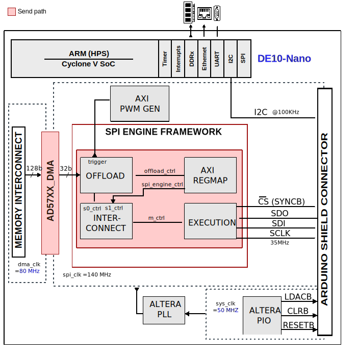
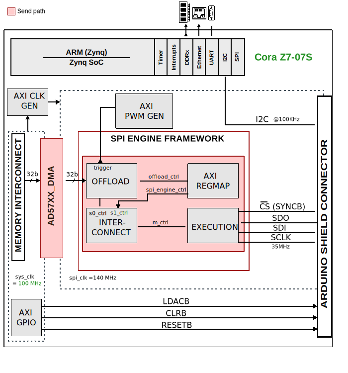

.. _ad57xx_ardz:

AD57XX_ARDZ HDL project
================================================================================

Overview
--------------------------------------------------------------------------------

This page documents the HDL reference design for the
:adi:`EVAL-AD5780ARDZ`, :adi:`EVAL-AD5781ARDZ` and :adi:`EVAL-AD5791ARDZ`
evaluation boards.

The :adi:`EVAL-AD5780ARDZ` facilitates fast prototyping of the
:adi:`AD5780` circuit, and can be substituted with either the :adi:`AD5760` or
:adi:`AD5790`, which must be ordered separately. Similarly, the
:adi:`EVAL-AD5781ARDZ` and :adi:`EVAL-AD5791ARDZ`
come with the :adi:`AD5781` and :adi:`AD5791` respectively.

The :adi:`AD5790`, :adi:`AD5791`, :adi:`AD5760`, :adi:`AD5780` and :adi:`AD5781`
are a family of precision, single-channel voltage output DACs, with resolutions
from 16-bits up to 20-bits. They offer guaranteed monotonic operation, and low
nonlinearity (down to 0.5 LSB INL and DNL)

The evaluation boards provide an on-board -14 V and +14 V dual power supply.
These evaluation boards also utilize external reference boards with an output
voltage of +10 V and -10 V. The eval boards are connected to the carrier board
through the Arduino Shield connector.

This project has a :ref:`spi_engine` instance to control and acquire data from
the DAC. This instance provides support for sending continuous samples at the
maximum sample rate.

Supported boards
-------------------------------------------------------------------------------

- :adi:`EVAL-AD5780ARDZ`
- :adi:`EVAL-AD5781ARDZ`
- :adi:`EVAL-AD5791ARDZ`

Supported devices
-------------------------------------------------------------------------------

- :adi:`AD5760`
- :adi:`AD5780`
- :adi:`AD5781`
- :adi:`AD5790`
- :adi:`AD5791`

Supported carriers
-------------------------------------------------------------------------------

- `Cora Z7S <https://digilent.com/shop/cora-z7-zynq-7000-single-core-for-arm-fpga-soc-development>`__
   Arduino shield connector
- :intel:`DE10-Nano <content/www/us/en/developer/topic-technology/edge-5g/hardware/fpga-de10-nano.html>`
   Arduino shield connector

Block design
-------------------------------------------------------------------------------

Block diagram
~~~~~~~~~~~~~~~~~~~~~~~~~~~~~~~~~~~~~~~~~~~~~~~~~~~~~~~~~~~~~~~~~~~~~~~~~~~~~~~

The data path and clock domains are depicted in the below diagrams:

   AD5780-ARDZ HDL design block diagram for the DE10-Nano

   AD5780-ARDZ HDL design block diagram for the Cora Z7S

CPU/Memory interconnects addresses
~~~~~~~~~~~~~~~~~~~~~~~~~~~~~~~~~~~~~~~~~~~~~~~~~~~~~~~~~~~~~~~~~~~~~~~~~~~~~~~

The addresses are dependent on the architecture of the FPGA, having an offset
added to the base address from HDL (see more at :ref:`architecture cpu-intercon-addr`).

========================  =================
Instance                  Zynq*/DE10-Nano**
========================  =================
spi_ad57xx_axi_regmap*    0x44A0_0000
ad57xx_tx_dma*            0x44A4_0000
trig_gen*                 0x44B0_0000
axi_ad57xx_clkgen*        0x44B1_0000
axi_dmac_0**              0x0003_0000
axi_spi_engine_0**        0x0004_0000
trig_gen**                0x0005_0000
spi_clk_pll_reconfig**    0x0006_0000
========================  =================

.. admonition:: Legend
   :class: note

   - ``*`` instantiated only for Cora Z7S
   - ``**`` instantiated only for DE10-Nano

I2C connections
~~~~~~~~~~~~~~~~~~~~~~~~~~~~~~~~~~~~~~~~~~~~~~~~~~~~~~~~~~~~~~~~~~~~~~~~~~~~~~~

.. list-table::
   :widths: 20 20 20 20 20
   :header-rows: 1

   * - I2C type
     - I2C manager instance
     - Alias
     - Address
     - I2C subordinate
   * - PL*
     - iic_ard
     - axi_ard_fmc
     - 0x4160_0000
     - 24AA32A
   * - PS**
     - i2c1
     - sys_hps_i2c1
     - ---
     - ---

.. admonition:: Legend
   :class: note

   - ``*`` instantiated only for Cora Z7S
   - ``**`` instantiated only for DE10-Nano

SPI connections
~~~~~~~~~~~~~~~~~~~~~~~~~~~~~~~~~~~~~~~~~~~~~~~~~~~~~~~~~~~~~~~~~~~~~~~~~~~~~~~

.. list-table::
   :widths: 25 25 25 25
   :header-rows: 1

   * - SPI type
     - SPI manager instance
     - SPI subordinate
     - CS
   * - PL
     - axi_spi_engine
     - AD57XX
     - 0

GPIOs
~~~~~~~~~~~~~~~~~~~~~~~~~~~~~~~~~~~~~~~~~~~~~~~~~~~~~~~~~~~~~~~~~~~~~~~~~~~~~~~

The Software GPIO number is calculated as follows:

- Cora Z7S: the offset is 54

.. list-table::
   :widths: 25 25 25 25
   :header-rows: 2

   * - GPIO signal
     - Direction
     - HDL GPIO EMIO
     - Software GPIO
   * -
     - (from FPGA view)
     -
     - Zynq-7000
   * - ad57xx_ardz_ldacb
     - INOUT
     - 34
     - 88
   * - ad57xx_ardz_clrb
     - INOUT
     - 33
     - 87
   * - ad57xx_ardz_resetb
     - INOUT
     - 32
     - 86

- DE10-Nano: the offset is 32

.. list-table::
   :widths: 25 25 25 25
   :header-rows: 2

   * - GPIO signal
     - Direction
     - HDL GPIO EMIO
     - Software GPIO
   * -
     - (from FPGA view)
     -
     - DE10-Nano
   * - ad57xx_ardz_ldacb
     - INOUT
     - 34
     - 2
   * - ad57xx_ardz_clrb
     - INOUT
     - 33
     - 1
   * - ad57xx_ardz_resetb
     - INOUT
     - 32
     - 0

Interrupts
~~~~~~~~~~~~~~~~~~~~~~~~~~~~~~~~~~~~~~~~~~~~~~~~~~~~~~~~~~~~~~~~~~~~~~~~~~~~~~~

Below are the Programmable Logic interrupts used in this project.

=================== === ========== ===========
Instance name       HDL Linux Zynq Actual Zynq
=================== === ========== ===========
ad57xx_tx_dma       13  57         89
spi_ad57xx          12  56         88
axi_iic_ard         11  55         87
=================== === ========== ===========

================ === =============== ================
Instance name    HDL Linux DE10-Nano Actual DE10-Nano
================ === =============== ================
axi_spi_engine_0 5   45               77
axi_dmac_0       4   44               76
================ === =============== ================

Building the HDL project
-------------------------------------------------------------------------------

The design is built upon ADI's generic HDL reference design framework.
ADI distributes the bit/elf files of these projects as part of the
:dokuwiki:`ADI Kuiper Linux <resources/tools-software/linux-software/kuiper-linux>`.
If you want to build the sources, ADI makes them available on the
:git-hdl:`HDL repository </>`. To get the source you must
`clone <https://git-scm.com/book/en/v2/Git-Basics-Getting-a-Git-Repository>`__
the HDL repository, and then build the project as follows:

**Linux/Cygwin/WSL**

.. shell::

   $cd hdl/projects/ad57xx_ardz/coraz7s
   $make

.. shell::

   $cd hdl/projects/ad57xx_ardz/de10nano
   $make

A more comprehensive build guide can be found in the :ref:`build_hdl` user guide.

Resources
-------------------------------------------------------------------------------

Hardware related
~~~~~~~~~~~~~~~~~~~~~~~~~~~~~~~~~~~~~~~~~~~~~~~~~~~~~~~~~~~~~~~~~~~~~~~~~~~~~~~

- Product datasheets:

  - :adi:`AD5760`
  - :adi:`AD5780`
  - :adi:`AD5781`
  - :adi:`AD5790`
  - :adi:`AD5791`

HDL related
~~~~~~~~~~~~~~~~~~~~~~~~~~~~~~~~~~~~~~~~~~~~~~~~~~~~~~~~~~~~~~~~~~~~~~~~~~~~~~~

- :git-hdl:`AD57XX_ARDZ HDL project source code <projects/ad57xx_ardz>`

.. list-table::
   :widths: 30 40 30
   :header-rows: 1

   * - IP name
     - Source code link
     - Documentation link
   * - AXI_CLKGEN
     - :git-hdl:`library/axi_clkgen` *
     - :ref:`axi_clkgen`
   * - AXI_DMAC
     - :git-hdl:`library/axi_dmac`
     - :ref:`axi_dmac`
   * - AXI_HDMI_TX
     - :git-hdl:`library/axi_hdmi_tx` **
     - :ref:`axi_hdmi_tx`
   * - AXI_PWM_GEN
     - :git-hdl:`library/axi_pwm_gen`
     - :ref:`axi_pwm_gen`
   * - AXI_SYSID
     - :git-hdl:`library/axi_sysid`
     - :ref:`axi_sysid`
   * - AXI_SPI_ENGINE
     - :git-hdl:`library/spi_engine/axi_spi_engine`
     - :ref:`spi_engine axi`
   * - SPI_ENGINE_EXECUTION
     - :git-hdl:`library/spi_engine/spi_engine_execution`
     - :ref:`spi_engine execution`
   * - SPI_ENGINE_INTERCONNECT
     - :git-hdl:`library/spi_engine/spi_engine_interconnect`
     - :ref:`spi_engine interconnect`
   * - SPI_ENGINE_OFFLOAD
     - :git-hdl:`library/spi_engine/spi_engine_offload`
     - :ref:`spi_engine offload`
   * - SYSID_ROM
     - :git-hdl:`library/sysid_rom`
     - :ref:`axi_sysid`

.. admonition:: Legend
   :class: note

   - ``*`` instantiated only for Cora Z7S
   - ``**`` instantiated only for DE10-Nano

- :ref:`SPI Engine Framework documentation <spi_engine>`

Software related
~~~~~~~~~~~~~~~~~~~~~~~~~~~~~~~~~~~~~~~~~~~~~~~~~~~~~~~~~~~~~~~~~~~~~~~~~~~~~~~

- :git-linux:`AD57XX Linux device tree socfpga_cyclone5_de10_nano_ad5791.dts <arch/arm/boot/dts/intel/socfpga/socfpga_cyclone5_de10_nano_ad5791.dts>`
- :git-linux:`AD57XX Linux driver ad5791.c <drivers/iio/dac/ad5791.c>`

.. include:: ../common/more_information.rst

.. include:: ../common/support.rst
