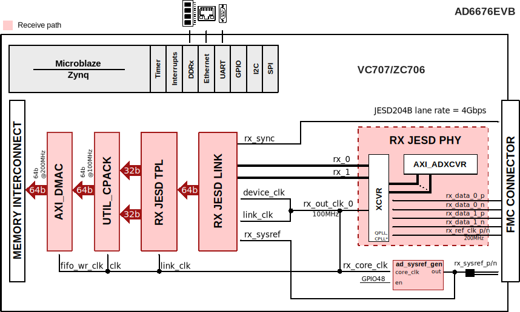

.. _ad6676evb:

AD6676EVB HDL project
===============================================================================

Overview
-------------------------------------------------------------------------------

The :adi:`AD6676-EBZ <EVAL-AD6676>` supports the :adi:`AD6676` highly integrated
IF subsystem that can digitize radio frequency (RF) bands up to 160 MHz in
width centered on an intermediate frequency (IF) of 70 MHz to 450 MHz.

Unlike traditional Nyquist IF sampling ADCs, the :adi:`AD6676` relies on a
tunable band-pass Σ-Δ ADC with a high oversampling ratio to eliminate the need
for band specific IF SAW filters and gain stages, resulting in significant
simplification of the wideband radio receiver architecture.

On-chip quadrature digital downconversion followed by selectable decimation
filters reduces the complex data rate to a manageable rate between 62.5 MSPS
to 266.7 MSPS. The 16-bit complex output data is transferred to the host via a
single or dual lane JESD204B interface supporting lane rates up to 5.333 Gbps.

Supported boards
-------------------------------------------------------------------------------

- :adi:`EVAL-AD6676` (also referred to as AD6676EVB/AD6676-EBZ)

Supported devices
-------------------------------------------------------------------------------

- :adi:`AD6676`

Supported carriers
-------------------------------------------------------------------------------

.. list-table::
   :widths: 35 35 30
   :header-rows: 1

   * - Evaluation board
     - Carrier
     - FMC slot
   * - :adi:`EVAL-AD6676`
     - :xilinx:`VC707` *
     - FMC1 HPC
   * -
     - :xilinx:`ZC706`
     - FMC HPC

.. admonition:: Legend
   :class: note

   - ``*`` removed; last release that supports this project on this carrier is
     :git-hdl:`hdl_2023_r2 <hdl_2023_r2:projects/ad6676evb/vc707>`

Block design
-------------------------------------------------------------------------------

Block diagram
~~~~~~~~~~~~~~~~~~~~~~~~~~~~~~~~~~~~~~~~~~~~~~~~~~~~~~~~~~~~~~~~~~~~~~~~~~~~~~~

The data path and clock domains are depicted in the below diagram:

Configuration modes
~~~~~~~~~~~~~~~~~~~~~~~~~~~~~~~~~~~~~~~~~~~~~~~~~~~~~~~~~~~~~~~~~~~~~~~~~~~~~~~

The only parameter of this project that can be configured is ``RX_JESD_L``:
number of lanes per link. Possible values: {1, 2}.

Clock scheme
~~~~~~~~~~~~~~~~~~~~~~~~~~~~~~~~~~~~~~~~~~~~~~~~~~~~~~~~~~~~~~~~~~~~~~~~~~~~~~~

By default, the evaluation board uses the local oscillator configured at 200 MHz.

- For external CLKIN signal source, remove both R95 and R100 (see the eval. board
  `schematic <https://wiki.analog.com/_media/resources/eval/user-guides/13039d_sch.pdf>`__
  for more details)
- For local oscillator CLKIN signal source, the Y1 quad frequency oscillator
  can be configured to use one of the frequencies: 125 MHz, 150 MHz, 200 MHz,
  250 MHz (check the eval. board schematic)

Limitations
^^^^^^^^^^^^^^^^^^^^^^^^^^^^^^^^^^^^^^^^^^^^^^^^^^^^^^^^^^^^^^^^^^^^^^^^^^^^^^^

The design has one JESD receive chain with 2 lanes. The JESD204B lane rates
for AD6676 are in range 3.072Gbps-5.333Gbps, depending on the
output data rate (:math:`F_{DATA\_IQ} = \frac{F_{ADC}}{Decim.}`) and the
number of lanes used, but in this configuration, with

| F\ :sub:`ADC` = 3200 MHz
| Decimation = 16
| L = 2

we have JESD204B lane rate = 4 GSPS

.. math::
   Lane Rate &= \frac{M * NP * \frac{10}{8} * \frac{F_{ADC}}{Decim.}}{L} \\
             &= \frac{40 * \frac{3200}{16}}{2} = 4000 MSPS

The JESD receive chain consists of a physical layer represented by an
XCVR module, a link layer represented by an RX JESD LINK module and
transport layer represented by a RX JESD TPL module. The link operates
in Subclass 1.

The link is set for full bandwidth mode and operate with the following
parameters:

- Used link layer encoder mode is 8B10B, defined in JESD204B, which uses ADI
  IP as Physical Layer
- RX_LANE_RATE: lane rate of the Rx link (MxFE to FPGA): 4 Gbps
- REF_CLK_RATE: the rate of the reference clock: 200 MHz
- M: 2 converters per link
- S: 1 sample per frame
- NP: 16 bits per sample, and converter resolution: 16 (N)
- F: 2 octets per frame in case of ``L=2``, and 4 in case of ``L=1``

For more details, check *Table 19, JESD204B Output Configurations* from the
:adi:`AD6676 data sheet`.

Deframer paramaters: L=2, M=2, F=2, S=1, NP=16

| REFCLK - 200 MHz (Lane Rate/20)
| DEVICE CLK - 100 MHz (Lane Rate/40)
| ADC CLK - 3200 MHz
| JESD204B Lane Rate - 4 Gbps

CPU/Memory interconnects addresses
~~~~~~~~~~~~~~~~~~~~~~~~~~~~~~~~~~~~~~~~~~~~~~~~~~~~~~~~~~~~~~~~~~~~~~~~~~~~~~~

The addresses are dependent on the architecture of the FPGA, having an offset
added to the base address from HDL (see more at :ref:`architecture cpu-intercon-addr`).

=============== ======================
Instance        Zynq/Microblaze/Virtex
=============== ======================
axi_ad6676_core 0x44A1_0000
axi_ad6676_xcvr 0x44A6_0000
axi_ad6676_jesd 0x44AA_0000
axi_ad6676_dma  0x7C42_0000
=============== ======================

SPI connections
~~~~~~~~~~~~~~~~~~~~~~~~~~~~~~~~~~~~~~~~~~~~~~~~~~~~~~~~~~~~~~~~~~~~~~~~~~~~~~~

.. list-table::
   :widths: 25 25 25 25
   :header-rows: 1

   * - SPI type
     - SPI manager instance
     - SPI subordinate
     - CS
   * - PS
     - SPI 0
     - AD6676
     - 0

GPIOs
~~~~~~~~~~~~~~~~~~~~~~~~~~~~~~~~~~~~~~~~~~~~~~~~~~~~~~~~~~~~~~~~~~~~~~~~~~~~~~~

.. list-table::
   :widths: 25 20 20 20 15
   :header-rows: 2

   * - GPIO signal
     - Direction
     - HDL GPIO EMIO
     - Software GPIO
     - Software GPIO
   * -
     - (from FPGA view)
     -
     - Zynq-7000
     - Zynq MP
   * - adc_oen
     - INOUT
     - 41
     - 95
     - 119
   * - adc_sela
     - INOUT
     - 40
     - 94
     - 118
   * - adc_selb
     - INOUT
     - 39
     - 93
     - 117
   * - adc_s0
     - INOUT
     - 38
     - 92
     - 116
   * - adc_s1
     - INOUT
     - 37
     - 91
     - 115
   * - adc_resetb
     - INOUT
     - 36
     - 90
     - 114
   * - adc_agc1
     - INOUT
     - 35
     - 89
     - 113
   * - adc_agc2
     - INOUT
     - 34
     - 88
     - 112
   * - adc_agc3
     - INOUT
     - 33
     - 87
     - 111
   * - adc_agc4
     - INOUT
     - 32
     - 86
     - 110

Interrupts
~~~~~~~~~~~~~~~~~~~~~~~~~~~~~~~~~~~~~~~~~~~~~~~~~~~~~~~~~~~~~~~~~~~~~~~~~~~~~~~

Below are the Programmable Logic interrupts used in this project.

================ === ========== ===========
Instance name    HDL Linux Zynq Actual Zynq
================ === ========== ===========
axi_ad6676_dma   13  57         89
axi_ad6676_jesd  12  56         88
================ === ========== ===========

Building the HDL project
-------------------------------------------------------------------------------

The design is built upon ADI's generic HDL reference design framework.
ADI distributes the bit/elf files of these projects as part of the
:dokuwiki:`ADI Kuiper Linux <resources/tools-software/linux-software/kuiper-linux>`.
If you want to build the sources, ADI makes them available on the
:git-hdl:`HDL repository </>`. To get the source you must
`clone <https://git-scm.com/book/en/v2/Git-Basics-Getting-a-Git-Repository>`__
the HDL repository.

**Linux/Cygwin/WSL**

Building the ZC706 project with the default configuration,
RX_JESD_L=2 lanes.

.. shell:: bash

   $cd hdl/projects/ad6676evb/zc706
   $make

Building the ZC706 project with the other available configuration,
with just **one lane**:

.. shell:: bash

   $cd hdl/projects/ad6676evb/zc706
   $make RX_JESD_L=1

The result of the build, if parameters were used, will be in a folder named
by the configuration used:
``hdl/projects/ad6676evb/$CARRIER/RXL1``.

A more comprehensive build guide can be found in the :ref:`build_hdl` user guide.

Resources
-------------------------------------------------------------------------------

Systems related
~~~~~~~~~~~~~~~~~~~~~~~~~~~~~~~~~~~~~~~~~~~~~~~~~~~~~~~~~~~~~~~~~~~~~~~~~~~~~~~

- :dokuwiki:`AD6676: Design Tools and Startup Guide using ACE <resources/eval/ad6676-wideband_rx_subsystem_ad6676ebz>`
- `AD6676 quick start guide using the evaluation software <https://wiki.analog.com/_media/resources/eval/user-guides/ad6676_evb_rev1_quickstartguide_2015_03_27.pdf>`__

Hardware related
~~~~~~~~~~~~~~~~~~~~~~~~~~~~~~~~~~~~~~~~~~~~~~~~~~~~~~~~~~~~~~~~~~~~~~~~~~~~~~~

-  Product datasheet: :adi:`AD6676`

HDL related
~~~~~~~~~~~~~~~~~~~~~~~~~~~~~~~~~~~~~~~~~~~~~~~~~~~~~~~~~~~~~~~~~~~~~~~~~~~~~~~

- :git-hdl:`AD6676EVB HDL project source code <projects/ad6676evb>`

.. list-table::
   :widths: 30 35 35
   :header-rows: 1

   * - IP name
     - Source code link
     - Documentation link
   * - AXI_CLKGEN
     - :git-hdl:`library/axi_clkgen`
     - :ref:`axi_clkgen`
   * - AXI_DMAC
     - :git-hdl:`library/axi_dmac`
     - :ref:`axi_dmac`
   * - AXI_HDMI_TX
     - :git-hdl:`library/axi_hdmi_tx`
     - ---
   * - AXI_SPDIF_TX
     - :git-hdl:`library/axi_spdif_tx`
     - ---
   * - AXI_SYSID
     - :git-hdl:`library/axi_sysid`
     - :ref:`axi_sysid`
   * - JESD204_TPL_ADC
     - :git-hdl:`library/jesd204/ad_ip_jesd204_tpl_adc`
     - :ref:`ad_ip_jesd204_tpl_adc`
   * - AXI_JESD204_RX
     - :git-hdl:`library/jesd204/axi_jesd204_rx`
     - :ref:`axi_jesd204_rx`
   * - JESD204_RX
     - :git-hdl:`library/jesd204/jesd204_rx`
     - :ref:`axi_jesd204_rx`
   * - SYSID_ROM
     - :git-hdl:`library/sysid_rom`
     - :ref:`axi_sysid`
   * - UTIL_CPACK2
     - :git-hdl:`library/util_pack/util_cpack2`
     - :ref:`util_cpack2`
   * - AXI_ADXCVR for AMD
     - :git-hdl:`library/xilinx/axi_adxcvr`
     - :ref:`axi_adxcvr amd`
   * - UTIL_ADXCVR for AMD
     - :git-hdl:`library/xilinx/util_adxcvr`
     - :ref:`util_adxcvr`

- :dokuwiki:`[Wiki] Generic JESD204B block designs <resources/fpga/docs/hdl/generic_jesd_bds>`
- :ref:`jesd204`

Software related
~~~~~~~~~~~~~~~~~~~~~~~~~~~~~~~~~~~~~~~~~~~~~~~~~~~~~~~~~~~~~~~~~~~~~~~~~~~~~~~

- Linux driver :git-linux:`drivers/iio/adc/ad6676.c`
- AD6676EVB VC707 Linux device tree :git-linux:`arch/microblaze/boot/dts/vc707_ad6676evb.dts`
- AD6676EVB ZC706 Linux device tree :git-linux:`arch/arm/boot/dts/xilinx/zynq-zc706-adv7511-ad6676-fmc.dts`
- :dokuwiki:`AD6676 Linux device driver documentation <resources/tools-software/linux-drivers/iio-adc/ad6676>`
- AD6676 no-OS driver :git-no-os:`drivers/adc/ad6676`
- AD6676 no-OS project :git-no-os:`projects/ad6676-ebz`
- :dokuwiki:`AD6676 No-OS driver documentation <resources/eval/user-guides/ad6676-ebz/software/baremetal>`

.. include:: ../common/more_information.rst

.. include:: ../common/support.rst
