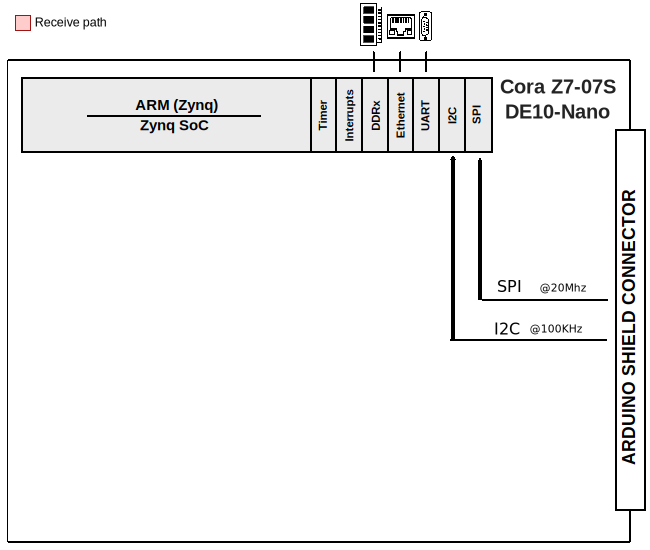

.. _ad7124_asdz:

AD7124-ASDZ HDL project
================================================================================

Overview
--------------------------------------------------------------------------------

The HDL reference design for the :adi:`AD7124-4` and :adi:`AD7124-8` provides a
4/8-Channel, Low Noise, Low Power, 24-Bit, Sigma-Delta ADC with PGA and
Reference.

The AD7124-4/8 offers output data rates from 1.17 SPS up to 19,200 SPS.
The AD7124-4/8 can achieve simultaneous 50 Hz and 60 Hz rejection when operating
at an output data rate of 25 SPS (single cycle settling), with rejection in
excess of 80 dB achieved at lower output data rates.

This project has a SPI instance to control and acquire data from the AD7124-4/8
24-bit precision ADC. This instance provides support for capturing continuous
samples at the maximum sample rate.

Supported boards
-------------------------------------------------------------------------------

- :adi:`EVAL-AD7124-4`
- :adi:`EVAL-AD7124-8`

Supported devices
-------------------------------------------------------------------------------

- :adi:`AD7124-4`
- :adi:`AD7124-8`

Supported carriers
-------------------------------------------------------------------------------

- :intel:`DE10-Nano <content/www/us/en/developer/topic-technology/edge-5g/hardware/fpga-de10-nano.html>` Arduino shield connector

Block design
-------------------------------------------------------------------------------

Block diagram
~~~~~~~~~~~~~~~~~~~~~~~~~~~~~~~~~~~~~~~~~~~~~~~~~~~~~~~~~~~~~~~~~~~~~~~~~~~~~~~

The data path and clock domains are depicted in the below diagram:

I2C connections
~~~~~~~~~~~~~~~~~~~~~~~~~~~~~~~~~~~~~~~~~~~~~~~~~~~~~~~~~~~~~~~~~~~~~~~~~~~~~~~

.. list-table::
   :widths: 20 20 20 20 20
   :header-rows: 1

   * - I2C type
     - I2C manager instance
     - Alias
     - Address
     - I2C subordinate
   * - PS
     - i2c1
     - sys_hps_i2c1
     - ---
     - ---

SPI connections
~~~~~~~~~~~~~~~~~~~~~~~~~~~~~~~~~~~~~~~~~~~~~~~~~~~~~~~~~~~~~~~~~~~~~~~~~~~~~~~

.. list-table::
   :widths: 25 25 25 25
   :header-rows: 1

   * - SPI type
     - SPI manager instance
     - SPI subordinate
     - CS
   * - PS
     - SPI
     - ad7124
     - 0

GPIOs
~~~~~~~~~~~~~~~~~~~~~~~~~~~~~~~~~~~~~~~~~~~~~~~~~~~~~~~~~~~~~~~~~~~~~~~~~~~~~~~

The Software GPIO number is calculated as follows:

- DE10-Nano: the offset is 32

.. list-table::
   :widths: 25 25 25 25
   :header-rows: 3

   * - GPIO signal
     - Direction
     - HDL GPIO EMIO
     - Software GPIO
   * -
     - (from FPGA view)
     -
     - DE10-Nano
   * - sync_err
     - INPUT
     - 32
     - 0
   * - spi_miso
     - INPUT
     - 33
     - 1

Building the HDL project
-------------------------------------------------------------------------------

The design is built upon ADI's generic HDL reference design framework.
ADI distributes the bit/elf files of these projects as part of the
:dokuwiki:`ADI Kuiper Linux <resources/tools-software/linux-software/kuiper-linux>`.
If you want to build the sources, ADI makes them available on the
:git-hdl:`HDL repository </>`. To get the source you must
`clone <https://git-scm.com/book/en/v2/Git-Basics-Getting-a-Git-Repository>`__
the HDL repository, and then build the project as follows:

**Linux/Cygwin/WSL**

.. shell::

   $cd hdl/projects/ad7124_asdz/de10nano
   $make

A more comprehensive build guide can be found in the :ref:`build_hdl` user guide.

Resources
-------------------------------------------------------------------------------

Hardware related
~~~~~~~~~~~~~~~~~~~~~~~~~~~~~~~~~~~~~~~~~~~~~~~~~~~~~~~~~~~~~~~~~~~~~~~~~~~~~~~

- Product datasheets:

  - :adi:`AD7124-4`
  - :adi:`AD7124-8`

Software related
~~~~~~~~~~~~~~~~~~~~~~~~~~~~~~~~~~~~~~~~~~~~~~~~~~~~~~~~~~~~~~~~~~~~~~~~~~~~~~~

- :git-linux:`AD7124 Linux driver ad7124.c <drivers/iio/adc/ad7124.c>`

.. include:: ../common/more_information.rst

.. include:: ../common/support.rst
