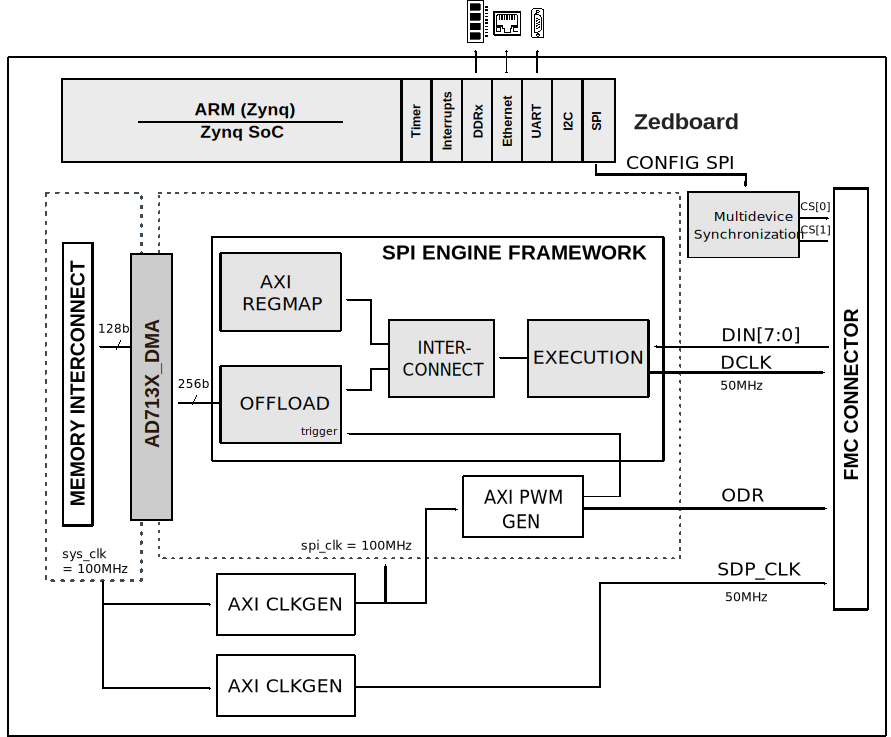

.. _ad7134_fmc:

AD7134-FMC HDL project
===============================================================================

Overview
-------------------------------------------------------------------------------

The :adi:`AD7134` is a quad channel, low noise, simultaneous sampling,
precision analog-to-digital converter (ADC), based on the continuous time
sigma-delta (CTSD) modulation scheme. The CTSD architecture inherently rejects
signals around the ADC aliasing frequency band, giving the device its inherent
antialiasing capability, and removes the need for a complex external
antialiasing filter.

The device has four independent converter channels in parallel, each with a
CTSD modulator and a digital decimation and filtering path. The bandwidth of
each ADC channel ranges from dc to 391.5 kHz, making the device an ideal
candidate for universal precision data acquisition solutions supporting a
breadth of sensor types, from temperature and pressure to vibration and shock.

It supports a wide range of ODR frequencies, from 0.01 kSPS to 1496 kSPS
with less than 0.01 SPS adjustment resolution, allowing the user to granularly
vary sampling speed to achieve coherent sampling. The adc offers three main
digital filter profile options: a wideband low ripple filter (2.5 kSPS to 374
kSPS), a fast responding sinc3 filter (0.01 kSPS to 1496 kSPS), and a balanced
sinc6 filter with an ODR range 2.5 kSPS to 1.496 MSPS.

The :adi:`AD7134` supports two device configuration schemes: serial peripheral
interface (SPI) and hardware pin configuration (pin control mode). The SPI
control mode offers access to all the features and configuration options
available on the chip. Pin control mode offers the benefit of simplifying the
device configuration, enabling the device to operate autonomously after power
-up operating in a standalone mode. In addition to the optional SPI, it has a
flexible and independent data interface for transmitting the ADC output data.

The EVAL-AD7134FMCZ evaluation kit features the AD7134 24-bit, 4-channel,
simultaneous sampling adc. Two on-board AD7134 ADCs are included to
demonstrate multidevice simultaneous sampling. The HDL reference design
provides all the interfaces necessary to interact with the device using a
Xilinx FPGA development board.

Supported boards
-------------------------------------------------------------------------------

-  :adi:`EVAL-AD7134FMCZ <EVAL-AD7134FMCZ>`

Supported devices
-------------------------------------------------------------------------------

-  :adi:`AD7134`

Supported carriers
-------------------------------------------------------------------------------

-  :xilinx:`ZedBoard <products/boards-and-kits/1-8dyf-11.html>` on FMC slot *

.. admonition:: Legend
   :class: note

   ``*`` FMC extender needed for connecting the EVAL board

Block design
-------------------------------------------------------------------------------

The reference design uses the SPI Engine Framework to interface with the two 
AD7134 ADCs. It only supports the slave mode for both devices with both DCLK 
and ODR generated by the FPGA. Each device sends data on 4 of the 8 DIN bits.

Block diagram
~~~~~~~~~~~~~~~~~~~~~~~~~~~~~~~~~~~~~~~~~~~~~~~~~~~~~~~~~~~~~~~~~~~~~~~~~~~~~~~

The data path and clock domains are depicted in the below diagrams:

Jumper setup
~~~~~~~~~~~~~~~~~~~~~~~~~~~~~~~~~~~~~~~~~~~~~~~~~~~~~~~~~~~~~~~~~~~~~~~~~~~~~~~

================== ========= ===================================
Jumper/Solder link Position  Description
================== ========= ===================================
JP14               Mounted   DEC0/DCLKIO (Device 1) [DCLK Input]
JP15               Mounted   DEC0/DCLKIO (Device 2) [DCLK Input]
JP16               Mounted   MODE (Device 1) [Slave Mode]
JP17               Mounted   MODE (Device 2) [Slave Mode]
================== ========= ===================================

CPU/Memory interconnects addresses
~~~~~~~~~~~~~~~~~~~~~~~~~~~~~~~~~~~~~~~~~~~~~~~~~~~~~~~~~~~~~~~~~~~~~~~~~~~~~~~

The addresses are dependent on the architecture of the FPGA, having an offset
added to the base address from HDL(see more at :ref:`architecture`).

========================  ===========
Instance                  Address
========================  ===========
dual_ad7134_axi_regmap    0x44A0_0000
axi_ad7134_dma            0x44A3_0000
axi_sdp_clkgen            0x44A4_0000
odr_generator             0x44B0_0000
axi_ad7134_clkgen         0x44B1_0000
========================  ===========

SPI connections
~~~~~~~~~~~~~~~~~~~~~~~~~~~~~~~~~~~~~~~~~~~~~~~~~~~~~~~~~~~~~~~~~~~~~~~~~~~~~~~

.. list-table::
   :widths: 25 25 25 25
   :header-rows: 1

   * - SPI type
     - SPI manager instance
     - SPI subordinate
     - CS
   * - PS
     - SPI 0
     - AD7134
     - 0
   * - PS
     - SPI 0
     - AD7134
     - 1

GPIOs
~~~~~~~~~~~~~~~~~~~~~~~~~~~~~~~~~~~~~~~~~~~~~~~~~~~~~~~~~~~~~~~~~~~~~~~~~~~~~~~

The Software GPIO number is calculated as follows:

-  Zynq-7000: if PS7 is used, then offset is 54

.. list-table::
   :widths: 25 25 25 25
   :header-rows: 2

   * - GPIO signal
     - Direction
     - HDL GPIO EMIO
     - Software GPIO
   * -
     - (from FPGA view)
     -
     - Zynq-7000
   * - ad713x_dclkmode
     - INOUT
     - 49
     - 103
   * - ad713x_pinbspi
     - INOUT
     - 48
     - 102
   * - ad713x_dclkio[1:0]
     - INOUT
     - 47:46
     - 101:100
   * - ad713x_gpio[7:0]
     - INOUT
     - 45:38
     - 99:92
   * - ad713x_mode[1:0]
     - INOUT
     - 37:36
     - 91:90
   * - ad713x_pdn[1:0]
     - INOUT
     - 35:34
     - 89:88
   * - ad713x_resetn[1:0]
     - INOUT
     - 33:32
     - 87:86   
     
Interrupts
~~~~~~~~~~~~~~~~~~~~~~~~~~~~~~~~~~~~~~~~~~~~~~~~~~~~~~~~~~~~~~~~~~~~~~~~~~~~~~~

Below are the Programmable Logic interrupts used in this project.

=============== === ========== ===========
Instance name   HDL Linux Zynq Actual Zynq
=============== === ========== ===========
axi_ad7134_dma  13  57         89
dual_ad7134     12  56         88
=============== === ========== ===========

Building the HDL project
-------------------------------------------------------------------------------

The design is built upon ADI's generic HDL reference design framework.
ADI does not distribute the bit/elf files of these projects so they
must be built from the sources available :git-hdl:`here </>`. To get
the source you must
`clone <https://git-scm.com/book/en/v2/Git-Basics-Getting-a-Git-Repository>`__
the HDL repository, and then build the project as follows:.

**Linux/Cygwin/WSL**

.. code-block::
   :linenos:

   user@analog:~$ cd hdl/projects/ad7134_fmc/zed
   user@analog:~/hdl/projects/ad7134_fmc/zed$ make

A more comprehensive build guide can be found in the :ref:`build_hdl`
user guide.

Resources
-------------------------------------------------------------------------------

Hardware related
~~~~~~~~~~~~~~~~~~~~~~~~~~~~~~~~~~~~~~~~~~~~~~~~~~~~~~~~~~~~~~~~~~~~~~~~~~~~~~~

-  Product datasheet: :adi:`AD7134`

-  `UG-1599: EVAL-AD7134FMCZ Board User Guide <https://www.analog.com/media/en/technical-documentation/user-guides/eval-ad7134fmcz-ug-1599.pdf>`__

HDL related
~~~~~~~~~~~~~~~~~~~~~~~~~~~~~~~~~~~~~~~~~~~~~~~~~~~~~~~~~~~~~~~~~~~~~~~~~~~~~~~

-  :git-hdl:`AD7134-FMC HDL project source code <projects/ad7134_fmc>`

.. list-table::
   :widths: 30 35 35
   :header-rows: 1

   * - IP name
     - Source code link
     - Documentation link
   * - AXI_CLKGEN
     - :git-hdl:`library/axi_clkgen`
     - :dokuwiki:`[Wiki] <resources/fpga/docs/axi_clkgen>`
   * - AXI_DMAC
     - :git-hdl:`library/axi_dmac`
     - :ref:`here <axi_dmac>`
   * - AXI_HDMI_TX
     - :git-hdl:`library/axi_hdmi_tx`
     - :dokuwiki:`[Wiki] <resources/fpga/docs/axi_hdmi_tx>`
   * - AXI_I2S_ADI
     - :git-hdl:`library/axi_i2s_adi`
     - ---
   * - AXI_PWM_GEN
     - :git-hdl:`library/axi_pwm_gen`
     - :dokuwiki:`[Wiki] <resources/fpga/docs/axi_pwm_gen>`
   * - AXI_SDDIF_TX
     - :git-hdl:`library/axi_spdif_tx`
     - ---
   * - AXI_SYSID
     - :git-hdl:`library/axi_sysid`
     - :dokuwiki:`[Wiki] <resources/fpga/docs/axi_sysid>`
   * - AXI_SPI_ENGINE
     - :git-hdl:`library/spi_engine/axi_spi_engine`
     - :ref:`here <spi_engine axi>`
   * - SPI_ENGINE_EXECUTION
     - :git-hdl:`library/spi_engine/spi_engine_execution`
     - :ref:`here <spi_engine execution>`
   * - SPI_ENGINE_INTERCONNECT
     - :git-hdl:`library/spi_engine/spi_engine_interconnect`
     - :ref:`here <spi_engine interconnect>`
   * - SPI_ENGINE_OFFLOAD
     - :git-hdl:`library/spi_engine/spi_engine_offload`
     - :ref:`here <spi_engine offload>`
   * - AXI_SYSID_ROM
     - :git-hdl:`library/sysid_rom`
     - :dokuwiki:`[Wiki] <resources/fpga/docs/axi_sysid>`
   * - UTIL_I2C_MIXER
     - :git-hdl:`library/util_i2c_mixer`
     - ---

-  :ref:`SPI Engine Framework documentation <spi_engine>`

Software related
~~~~~~~~~~~~~~~~~~~~~~~~~~~~~~~~~~~~~~~~~~~~~~~~~~~~~~~~~~~~~~~~~~~~~~~~~~~~~~~

-  :git-no-os:`AD7134-FMC No-OS project source code <projects/ad713x_fmcz>`

-  :git-no-os:`AD4134/AD7134 No-OS Driver source code <drivers/adc/ad713x>`

-  :dokuwiki:`AD4134/AD7134 No-OS Driver documentation <resources/tools-software/uc-drivers/ad713x>`

-  :dokuwiki:`How to build No-OS <resources/no-os/build>`

.. include:: ../common/more_information.rst

.. include:: ../common/support.rst
