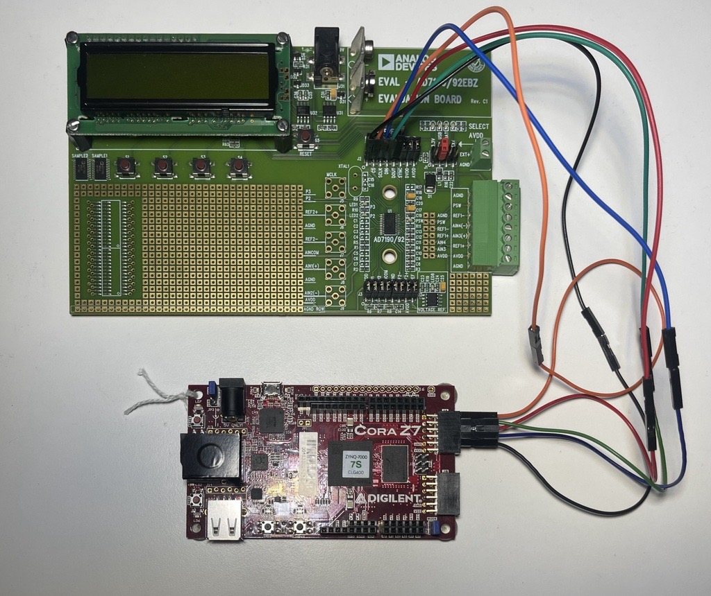
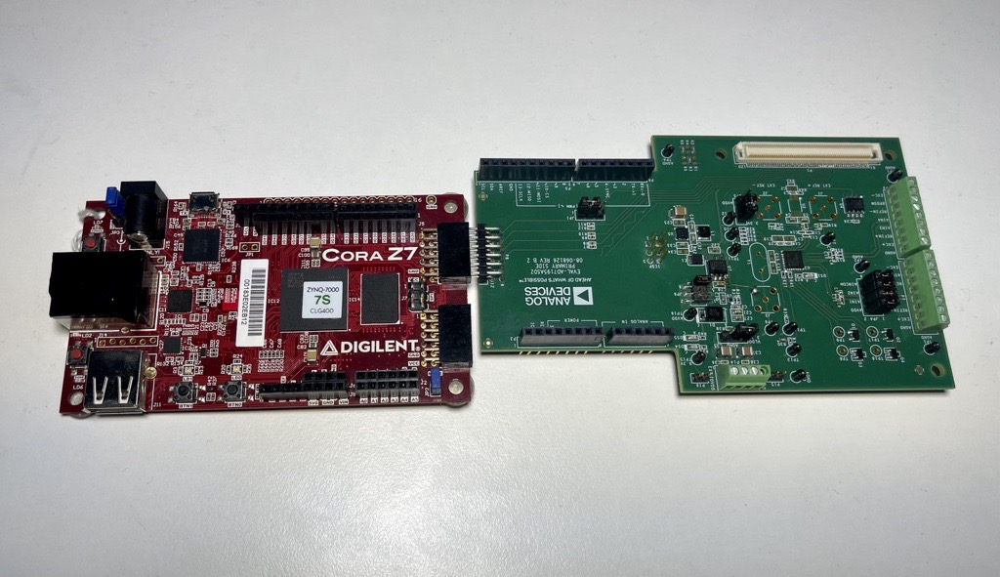

.. ad719x_asdz_ebz:

AD719x EBZ/ASDZ CORAZ7S HDL PROJECT
================================================================================

Overview
-------------------------------------------------------------------------------

The :part:`EVAL-AD719x` boards are a fully featured evaluation Board for 
:part:`AD719x` family. They can be operated in standalone mode or connected
directly to the PC(7190 EBZ) or connected via PMOD connector to a carrier(7193 
and 7195 ASDZ). The AD719x chips are low noise, complete analog front end for 
high precision measurement applications.

**Some specifications about the board, the chip, etc. Typically the
information found on the** https://www.analog.com/en/products/
**website**

Supported devices
-------------------------------------------------------------------------------

This project supports:

- :part:`EVAL-AD7190-EBZ`
- :part:`EVAL-AD7193-ASDZ`
- :part:`EVAL-AD7195-ASDZ`

Supported carriers
-------------------------------------------------------------------------------

- CORAZ7S_

Block design
-------------------------------------------------------------------------------

Block diagram
~~~~~~~~~~~~~~~~~~~~~~~~~~~~~~~~~~~~~~~~~~~~~~~~~~~~~~~~~~~~~~~~~~~~~~~~~~~~~~~

The data path and clock domains are depicted in
the below diagram:

.. image:: ../images/ad719x_block_diagram.png
   :width: 800
   :align: center
   :alt: AD719x/CORAZ7S block diagram

IP list
~~~~~~~~~~~~~~~~~~~~~~~~~~~~~~~~~~~~~~~~~~~~~~~~~~~~~~~~~~~~~~~~~~~~~~~~~~~~~~~

-  :git-hdl:`AXI_SYSID <master:library/axi_sysid>`
-  :git-hdl:`SYSID_ROM <master:library/sysid_rom>`

SPI connections
~~~~~~~~~~~~~~~~~~~~~~~~~~~~~~~~~~~~~~~~~~~~~~~~~~~~~~~~~~~~~~~~~~~~~~~~~~~~~~~

The SPI communication between CORAZ7S_ and the EVAL-AD719x will be realized
using the PMOD ports. More info at :ref:`putting-everything-together`

CPU/Memory interconnects addresses
~~~~~~~~~~~~~~~~~~~~~~~~~~~~~~~~~~~~~~~~~~~~~~~~~~~~~~~~~~~~~~~~~~~~~~~~~~~~~~~

For :part:`EVAL-AD719x`, given the simplicity of the project, we have don't have
to use any interface to connect to the CPU.

=========== ==========
Instance    Address
=========== ==========
\-          \-
=========== ==========

Building the HDL project
-------------------------------------------------------------------------------

The design is built upon ADI's generic HDL reference design framework.
ADI does not distribute the bit/elf files of these projects so they
must be built from the sources available :git-hdl:`here <master:/>`. To get
the source you must
`clone <https://git-scm.com/book/en/v2/Git-Basics-Getting-a-Git-Repository>`__
the HDL repository.

Then go to the **projects/ad719x/coraz7s** location and run the make command by
typing in your command prompt:

**Linux/Cygwin/WSL**

.. code-block::

   user@analog:~$ cd hdl/projects/ad719x_asdz/coraz7s
   user@analog:~/hdl/projects/cn0577/zed$ make
.. 
Check `this
guide <resources/tools-software/linux-software/kuiper-linux>`__ on
how to prepare your SD card with the proper boot files.
A more comprehensive build guide can be found in the :ref:`build_hdl` user guide.

Setup guide
-------------------------------------------------------------------------------

**EVAL-AD7190-EBZ**

..

**EVAL-AD7195-ASDZ**

..

Same setup for :part:`EVAL-AD7193-ASDZ`. For :part:`EVAL-AD7190-EBZ` you need an external
power supply of **5V**.

Hardware requirements
-------------------------------------------------------------------------------

The following components are needed for these projects:

- `EVAL-AD7190 <https://www.analog.com/en/design-center/evaluation-hardware-and-software/evaluation-boards-kits/EVAL-AD7190.html>`_ (EBZ version)
   - `CORAZ7S <https://digilent.com/reference/programmable-logic/cora-z7/start>`_
   - 5 \* jumper cable for the PMOD connection
   - Ethernet cable
   -  1 \* SD card (at least 16GB); follow `this guide </resources/tools-software/linux-software/kuiper-linux>`__
   - Power supply of 5V for the evaluation board
   - Power supply of 5V for the carrier
- `EVAL-AD7193 <https://www.analog.com/en/design-center/evaluation-hardware-and-software/evaluation-boards-kits/EVAL-AD7193.html>`_ (ASDZ version)
   - `CORAZ7S <https://digilent.com/reference/programmable-logic/cora-z7/start>`_
   - PMOD connection
   - Ethernet cable
   -  1 \* SD card (at least 16GB); follow `this guide </resources/tools-software/linux-software/kuiper-linux>`__
   - Power supply of 5V for the carrier
- `EVAL-AD7195 <https://www.analog.com/en/design-center/evaluation-hardware-and-software/evaluation-boards-kits/EVAL-AD7195.html>`_ (ASDZ version)
   - `CORAZ7S <https://digilent.com/reference/programmable-logic/cora-z7/start>`_
   - PMOD connection: JA on CORAZ7S and P8 and EVAL-AD7195
   - Ethernet cable
   -  1 \* SD card (at least 16GB); follow `this guide </resources/tools-software/linux-software/kuiper-linux>`__
   - Power supply of 5V for the carrier

Connections and hardware changes
~~~~~~~~~~~~~~~~~~~~~~~~~~~~~~~~~~~~~~~~~~~~~~~~~~~~~~~~~~~~~~~~~~~~~~~~~~~~~~~

.. warning::

   Please pay attention to the following hardware changes!

..

-  Only for EVAL-AD7190-EBZ:

   - jumper J1 should be placed in position **5V USB** (default one)
   - PMOD connection: JA on CORAZ7S and J2 on EVAL-AD7190-EBZ (for reference, see `CORAZ7S reference-manual, section 12 Pmod Connectors <https://digilent.com/reference/programmable-logic/cora-z7/reference-manual>`_ and the :git-hdl:`constraint file <https://github.com/analogdevicesinc/hdl/blob/master/projects/ad719x_asdz/coraz7s/system_constr.xdc>`_)

-  For EVAL-AD7193-ASDZ and EVAL-AD7195-ASDZ:
   
   - On which PMOD port should the board be placed
   - Other changes to the board and the carrier
   - AD719x connected to CORAZ7S_ on PMOD JA

.. _putting-everything-together:

Putting everything together
~~~~~~~~~~~~~~~~~~~~~~~~~~~~~~~~~~~~~~~~~~~~~~~~~~~~~~~~~~~~~~~~~~~~~~~~~~~~~~~

After having all the **Connections and hardware changes** done properly as
mentioned in the previous section, you may continue with the following steps:

For **EVAL-AD7190-EBZ**:

#. Connect the evaluation board using the 5 jumper wires
   to the carrier, thus connecting CORAZ7S_'s **PMOD JA** to 
   :part:`EVAL-AD7190-EBZ`'s **PMOD J2** (see pinout from the photo below):

   .. image:: ../images/ad7190_asdz_pmod_diagram.svg
      :width: 600
      :align: center
      :alt: AD7190/CORAZ7S PMOD
   ..
   
#. Prepare the SD card

   #. Prepare the latest Linux image from :dokuwiki:`this
      guide <resources/tools-software/linux-software/kuiper-linux>`
   #. From zynqmp-common folder of the boot partition, copy the Image file
      into the root folder of the partition
   #. From zynq-coraz7s-ad719x-asdz folder of the boot partition, copy the
      system.dtb and BOOT.BIN files into the root folder of the partition

#. Insert the SD card into the CORAZ7S_ SD card slot
#. Connect the UART port on the FPGA via USB Micro-B to PC
#. Place the jumper on **5V USB** on J1 on the evaluation board.
#. Connect the evaluation board to a 5Vdc 1A power supply on J51(Micro-B port)
#. Power on the evaluation board and the FPGA

For **EVAL-AD7193-ASDZ** and **EVAL-AD7195-ASDZ**:

#. Connect the evaluation board to CORAZ7S_'s **PMOD JA** 
   using the evaluation board  PMOD port (see pinout from the photo below):
   
#. Prepare the SD card

   #. Prepare the latest Linux image from :dokuwiki:`this
      guide <resources/tools-software/linux-software/kuiper-linux>`
   #. From zynqmp-common folder of the boot partition, copy the Image file
      into the root folder of the partition
   #. From zynq-coraz7s-ad719x-asdz folder of the boot partition, copy the
      system.dtb and BOOT.BIN files into the root folder of the partition

#. Insert the SD card into the CORAZ7S_ SD card slot
#. Connect the UART port on the FPGA via USB Micro-B to PC
#. Power on the evaluation board and the FPGA

Troubleshooting
~~~~~~~~~~~~~~~~~~~~~~~~~~~~~~~~~~~~~~~~~~~~~~~~~~~~~~~~~~~~~~~~~~~~~~~~~~~~~~~

#. Check if the voltage supply test points of the evaluation board has the
   correct value
#. Check if any LEDs on the :part:`EVAL-AD719x` board are lit up(especially the
   power LEDs). Reconnect the board to the PMOD connector of the carrier if not 
   lit up.
#. Check if the carrier is being supplied properly
#. Check inside the IIO Oscilloscope application if you connect to the CORAZ7S_ 
   via the Ethernet connection if it detects the right hardware(the carrier and
   the evaluation board) 

Resources
-------------------------------------------------------------------------------

\**\* MENTION THESE \**\*

-  Link to the project source code:

   - :git-hdl:`AD719x_ASDZ <master:projects/ad719x_asdz>`

-  Links to the wiki documentation of the IPs that are used in this
   project:

   - :dokuwiki:`AXI_SYSID & SYSID_ROM </resources/fpga/docs/axi_sysid>`

-  Links to the Linux driver and devicetree source code and wiki
   documentation:

   - :dokuwiki:`Linux Drivers </resources/tools-software/linux-drivers-all>`

More information
-------------------------------------------------------------------------------

-  :ref:`ADI HDL User guide <user_guide>`
-  :ref:`ADI HDL project architecture <architecture>`
-  :ref:`ADI HDL project build guide <build_hdl>`
  
Other relevant information:

-  :dokuwiki:`AD719x IIO Application </resources/tools-software/product-support-software/ad719x_mbed_iio_application>`
-  :dokuwiki:`AD7193 Pmod Xilinx FPGA Reference Design </resources/fpga/xilinx/pmod/ad7193>`
-  :dokuwiki:`How to prepare an SD
   card <resources/tools-software/linux-software/kuiper-linux>` with
   boot files
-  :dokuwiki:`ADI reference designs HDL user guide <resources/fpga/docs/hdl>`
-  :dokuwiki:`ADI HDL architecture <resources/fpga/docs/arch>` wiki page
-  :dokuwiki:`How to build an ADI HDL project <resources/fpga/docs/build>`
-  :ref:`ADI HDL User guide <user_guide>`
-  :ref:`ADI HDL project architecture <architecture>`
-  :ref:`ADI HDL project build guide <build_hdl>`

Support
-------------------------------------------------------------------------------

Analog Devices will provide **limited** online support for anyone using
the reference design with Analog Devices components via the
:ez:`fpga` FPGA reference designs forum.

It should be noted, that the older the tools' versions and release
branches are, the lower the chances to receive support from ADI
engineers.

.. |ad9783_zcu102_spi_pmod.svg| image:: ../images/ad9783_zcu102_spi_pmod.svg
   :width: 600
   :align: top
   :alt: AD9783-EBZ/ZCU102 SPI Pmod connection

.. _CORAZ7S: https://digilent.com/reference/programmable-logic/cora-z7/start