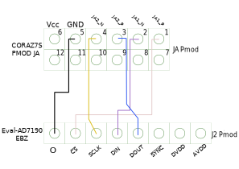

.. _ad719x_asdz:

AD719x-ASDZ HDL PROJECT
================================================================================

Overview
-------------------------------------------------------------------------------

The EVAL-AD719x boards are a fully featured evaluation Board for
AD719x chip family. They can be operated in standalone mode or connected
directly to the PC(:part:`EVAL-AD7190 <EVAL-AD7190>`) or connected via PMOD
connector to a carrier(:part:`EVAL-AD7193 <EVAL-AD7193>` and
:part:`EVAL-AD7195 <EVAL-AD7195>`). The AD719x chips are low noise, complete
analog front end for high precision measurement applications.

Supported boards
-------------------------------------------------------------------------------

- :part:`EVAL-AD7190 <EVAL-AD7190>`
- :part:`EVAL-AD7193 <EVAL-AD7193>`
- :part:`EVAL-AD7195 <EVAL-AD7195>`

Supported devices
-------------------------------------------------------------------------------

- :part:`AD7190`
- :part:`AD7193`
- :part:`AD7195`

Supported carriers
-------------------------------------------------------------------------------

.. list-table::
   :widths: 35 35 30
   :header-rows: 1

   * - Evaluation board
     - Carrier
     - Slot
   * - :part:`EVAL-AD7190 <EVAL-AD7190>`
     - CORAZ7S_ 
     - PMOD JA
   * - :part:`EVAL-AD7193 <EVAL-AD7193>`
     - CORAZ7S_
     - PMOD JA
   * - :part:`EVAL-AD7195 <EVAL-AD7195>`
     - CORAZ7S_
     - PMOD JA

Block design
-------------------------------------------------------------------------------

Block diagram
~~~~~~~~~~~~~~~~~~~~~~~~~~~~~~~~~~~~~~~~~~~~~~~~~~~~~~~~~~~~~~~~~~~~~~~~~~~~~~~

The data path and clock domains are depicted in the below diagram:

.. image:: ad719x_block_diagram.png
   :width: 800
   :align: center
   :alt: AD719x/CORAZ7S block diagram

SPI connections
~~~~~~~~~~~~~~~~~~~~~~~~~~~~~~~~~~~~~~~~~~~~~~~~~~~~~~~~~~~~~~~~~~~~~~~~~~~~~~~

.. list-table::
   :widths: 25 25 25 25
   :header-rows: 1

   * - SPI type
     - SPI manager instance
     - SPI subordinate
     - CS
   * - PS
     - SPI 0
     - AD719x
     - 0

Building the HDL project
-------------------------------------------------------------------------------

The design is built upon ADI's generic HDL reference design framework.
ADI does not distribute the bit/elf files of these projects so they
must be built from the sources available :git-hdl:`here <master:/>`. To get
the source you must
`clone <https://git-scm.com/book/en/v2/Git-Basics-Getting-a-Git-Repository>`__
the HDL repository.

Then go to the project location(**projects/ad719x/coraz7s**) and run the make 
command by typing in your command prompt:

**Linux/Cygwin/WSL**

.. code-block::

   user@analog:~$ cd hdl/projects/ad719x_asdz/coraz7s
   user@analog:~/hdl/projects/ad719x_asdz/coraz7s$ make

Check `this guide <resources/tools-software/linux-software/kuiper-linux>`__ on
how to prepare your SD card with the proper boot files.
A more comprehensive build guide can be found in the :ref:`build_hdl` user 
guide.

Software considerations 
-------------------------------------------------------------------------------

The SPI communication is changed because of hardware modifications, so the 
connection looks like this:

Resources
-------------------------------------------------------------------------------

Hardware related
~~~~~~~~~~~~~~~~~~~~~~~~~~~~~~~~~~~~~~~~~~~~~~~~~~~~~~~~~~~~~~~~~~~~~~~~~~~~~~~

-  Product datasheets:

   -  :part:`AD7190`
   -  :part:`AD7193`
   -  :part:`AD7195`
   -  :part:`EVAL-AD7190`
   -  :part:`EVAL-AD7193`
   -  :part:`EVAL-AD7195`

HDL related
~~~~~~~~~~~~~~~~~~~~~~~~~~~~~~~~~~~~~~~~~~~~~~~~~~~~~~~~~~~~~~~~~~~~~~~~~~~~~~~

-  :git-hdl:`AD719x-FMC HDL project source code <master:projects/ad719x_asdz>`

.. list-table::
   :widths: 30 35 35
   :header-rows: 1

   * - IP name
     - Source code link
     - Documentation link
   * - AXI_SYSID
     - :git-hdl:`library/axi_sysid <master:library/axi_sysid>`
     - :dokuwiki:`[Wiki] <resources/fpga/docs/axi_sysid>`
   * - SYSID_ROM
     - :git-hdl:`library/sysid_rom <master:library/sysid_rom>`
     - :dokuwiki:`[Wiki] <resources/fpga/docs/axi_sysid>`

- :dokuwiki:`AD7193 Pmod Xilinx FPGA Reference Design <resources/fpga/xilinx/pmod/ad7193>`

Software related
~~~~~~~~~~~~~~~~~~~~~~~~~~~~~~~~~~~~~~~~~~~~~~~~~~~~~~~~~~~~~~~~~~~~~~~~~~~~~~~

- :git-linux:`Driver <master:drivers/iio/adc/ad7192.c>`
- :dokuwiki:`AD7190 - Microcontroller No-OS Driver <resources/tools-software/uc-drivers/renesas/ad7190>`
- :dokuwiki:`Supported devices <resources/tools-software/uc-drivers/ad7193>`

.. include:: ../common/more_information.rst

.. include:: ../common/support.rst

.. _CORAZ7S: https://digilent.com/reference/programmable-logic/cora-z7/start