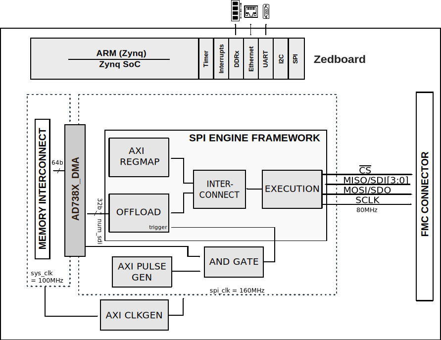

.. _ad738x_fmc:

AD738x_FMC HDL project
================================================================================

Overview
--------------------------------------------------------------------------------

The :adi:`AD7380`/ :adi:`AD7381` are a 16-bit and 14-bit pin-compatible family
of dual simultaneous sampling, high speed, low power, successive approximation
register (SAR) analog-to-digital converters (ADCs) that operate from a 3.3 V
power supply and feature throughput rates up to 4 MSPS.The analog input type is
differential for the :adi:`AD7380`, :adi:`AD7381`, :adi:`AD4680`, :adi:`AD4681`,
:adi:`AD7380-4`, :adi:`AD7389-4`, :adi:`AD7381-4` can accepts a wide common-mode
input voltage, and is sampled and converted on the falling edge of CS.

The :adi:`AD7383`, :adi:`AD7384`, :adi:`AD4682` and :adi:`AD4683` have the
pseudo-differential input while the :adi:`AD7386`, :adi:`AD7387`, :adi:`AD7388`,
:adi:`AD4684` and :adi:`AD4685` have single-ended input. The AD7380 family has
optional integrated on-chip oversampling blocks to improve dynamic range and
reduce noise at lower bandwidths. An internal 2.5 V reference is included.
Alternatively, an external reference up to 3.3 V can be used.

The conversion process and data acquisition use standard control inputs allowing
for easy interfacing to microprocessors or DSPs. It is compatible with 1.8 V,
2.5 V, and 3.3 V interfaces, using a separate logic supply.

The dual :adi:`AD7380`, :adi:`AD7381`, :adi:`AD4680`, :adi:`AD4681`,
:adi:`AD7383`, :adi:`AD7384`, :adi:`AD4682`, :adi:`AD4683`, :adi:`AD7386`,
:adi:`AD7387`, :adi:`AD7388`, :adi:`AD4684` and :adi:`AD4685` family are
available in a 16-lead 3mm x 3mm LFCSP package while the quad generics
:adi:`AD7380-4`, :adi:`AD7389-4`, and :adi:`AD7381-4` are available in
4mmx4mm LFCSP package. Both the duals and quad generic operate in specified
from -40°C to +125°C temperature range.

Applications:

* Motor control position feedback
* Motor control current sense
* Data acquisition system
* EDFA applications
* I and Q demodulation
* SONAR
* Power Quality

Supported boards
-------------------------------------------------------------------------------

- :adi:`EVAL-AD7380-4FMCZ`
- :adi:`EVAL-AD7383FMCZ`
- :adi:`EVAL-AD7386FMCZ`
- :adi:`EVAL-AD738xFMCZ`

Supported devices
-------------------------------------------------------------------------------

- :adi:`AD7380`
- :adi:`AD7380-4`
- :adi:`AD7381`
- :adi:`AD7381-4`
- :adi:`AD7383`
- :adi:`AD7383-4`
- :adi:`AD7384`
- :adi:`AD7384-4`
- :adi:`AD7386`
- :adi:`AD7387`
- :adi:`AD7388`
- :adi:`AD7388-4`
- :adi:`AD7389-4`
- :adi:`AD4680`
- :adi:`AD4681`
- :adi:`AD4682`
- :adi:`AD4683`
- :adi:`AD4684`
- :adi:`AD4685`

Supported carriers
-------------------------------------------------------------------------------

- `ZedBoard <https://digilent.com/shop/zedboard-zynq-7000-arm-fpga-soc-development-board>`__ on FMC slot

Block design
-------------------------------------------------------------------------------

Block diagram
~~~~~~~~~~~~~~~~~~~~~~~~~~~~~~~~~~~~~~~~~~~~~~~~~~~~~~~~~~~~~~~~~~~~~~~~~~~~~~~

The data path and clock domains are depicted in the below diagram:

Configuration modes
~~~~~~~~~~~~~~~~~~~~~~~~~~~~~~~~~~~~~~~~~~~~~~~~~~~~~~~~~~~~~~~~~~~~~~~~~~~~~~~~~

The ALERT_SPI_N configuration parameter defines if a known pin will operate as a
serial data output pin or alert indication pin. By default it is set to 0.
Depending on the required pin functionality, some hardware modifications need to
be done on the board and/or ``make`` command:

In case of the **Serial Data Output Pin** functionality:

.. shell:: bash

   $make ALERT_SPI_N=0

In case of the **Alert Indication Output Pin** functionality:

.. shell:: bash

   $make ALERT_SPI_N=1

The **NUM_OF_SDI** configuration parameter defines the number of SDI lines used:
**{1, 2, 4}**. By default is set to 1.

For the **ALERT** functionality, the following parameters will be used in make
command: ALERT_SPI_N.

For the **serial data output** functionality, the following parameters will be
used in make command: ALERT_SPI_N, NUM_OF_SDI.

Jumper setup
~~~~~~~~~~~~~~~~~~~~~~~~~~~~~~~~~~~~~~~~~~~~~~~~~~~~~~~~~~~~~~~~~~~~~~~~~~~~~~~

================== ================= ==========================================
Jumper/Solder link Default Position  Description
================== ================= ==========================================
LK1                1                 Use internal -2.5 V from U9 for AMP_PWR-
LK2                1                 Use internal 5 V from U8 for AMP_PWR+.
LK3                1                 Use 12 V power supply from FMC
LK4                3                 Use internal +3V3 from U3 for VREF
LK5                3                 Use internal 2.3 V from U6 for VLOGIC
JP1                1 (SMD RES)       Connect external SubMiniature Version B
                                     (SMB) Connector J1 to the A1 buffer
                                     amplifier
JP2                1 (SMD RES)       Connect internal signal from A2 to ADC U10
                                     input AINA-
JP3                1 (SMD RES)       Connect internal signal from A2 to ADC U10
                                     input AINA+
JP4                3 (SMD RES)       The REFIO pin is driven with the external
                                     on board reference
JP5                1 (SMD RES)       Use internal +3V3 from U2 for VCC.
JP6                1 (SMD RES)       Connect external SMB Connector J2 to the
                                     A1 buffer amplifier
================== ================= ==========================================

CPU/Memory interconnects addresses
~~~~~~~~~~~~~~~~~~~~~~~~~~~~~~~~~~~~~~~~~~~~~~~~~~~~~~~~~~~~~~~~~~~~~~~~~~~~~~~

The addresses are dependent on the architecture of the FPGA, having an offset
added to the base address from HDL (see more at :ref:`architecture cpu-intercon-addr`).

=========================  ===========
Instance                   Zynq
=========================  ===========
spi_ad738x_adc_axi_regmap  0x44A0_0000
axi_ad738x_dma             0x44A3_0000
spi_clkgen                 0x44A7_0000
spi_trigger_gen            0x44B0_0000
=========================  ===========

I2C connections
~~~~~~~~~~~~~~~~~~~~~~~~~~~~~~~~~~~~~~~~~~~~~~~~~~~~~~~~~~~~~~~~~~~~~~~~~~~~~~~

.. list-table::
   :widths: 20 20 20 20 20
   :header-rows: 1

   * - I2C type
     - I2C manager instance
     - Alias
     - Address
     - I2C subordinate
   * - PL
     - iic_fmc
     - axi_iic_fmc
     - 0x4162_0000
     - ---
   * - PL
     - iic_main
     - axi_iic_main
     - 0x4160_0000
     - ---

SPI connections
~~~~~~~~~~~~~~~~~~~~~~~~~~~~~~~~~~~~~~~~~~~~~~~~~~~~~~~~~~~~~~~~~~~~~~~~~~~~~~~

.. list-table::
   :widths: 25 25 25 25
   :header-rows: 1

   * - SPI type
     - SPI manager instance
     - SPI subordinate
     - CS
   * - PL
     - axi_spi_engine
     - ad738x
     - 0

GPIOs
~~~~~~~~~~~~~~~~~~~~~~~~~~~~~~~~~~~~~~~~~~~~~~~~~~~~~~~~~~~~~~~~~~~~~~~~~~~~~~~

The Software GPIO number is calculated as follows:

- Zynq-7000: if PS7 is used, then the offset is 54

.. list-table::
   :widths: 25 25 25 25 25 25
   :header-rows: 2

   * - GPIO signal
     - Direction
     - HDL GPIO EMIO
     - Software GPIO
     - Assigned value
     - Assigned value
   * -
     - (from FPGA view)
     -
     - Zynq-7000
     - ALERT_SPI_N=1
     - ALERT_SPI_N=0
   * - gpio[33]
     - OUT
     - 33
     - 87
     - sdid
     - 0
   * - gpio[32]
     - OUT
     - 32
     - 86
     - sdib
     - 0

Interrupts
~~~~~~~~~~~~~~~~~~~~~~~~~~~~~~~~~~~~~~~~~~~~~~~~~~~~~~~~~~~~~~~~~~~~~~~~~~~~~~~

Below are the Programmable Logic interrupts used in this project.

=================== === ========== ===========
Instance name       HDL Linux Zynq Actual Zynq
=================== === ========== ===========
axi_ad738x_dma      13  57         89
spi_ad738x_adc      12  56         88
=================== === ========== ===========

Building the HDL project
-------------------------------------------------------------------------------

The design is built upon ADI's generic HDL reference design framework.
ADI distributes the bit/elf files of these projects as part of the
:dokuwiki:`ADI Kuiper Linux <resources/tools-software/linux-software/kuiper-linux>`.
If you want to build the sources, ADI makes them available on the
:git-hdl:`HDL repository </>`. To get the source you must
`clone <https://git-scm.com/book/en/v2/Git-Basics-Getting-a-Git-Repository>`__
the HDL repository, and then build the project as follows:

**Linux/Cygwin/WSL**

.. shell::

   $cd hdl/projects/ad738x_fmc/zed
   $make ALERT_SPI_N=0 NUM_OF_SDI=4

The result of the build, if parameters were used, will be in a folder named
by the configuration used:

if the following command was run

``make ALERT_SPI_N=0 NUM_OF_SDI=4``

then the folder name will be:

``ALERTSPIN0_NUMOFSDI4``

A more comprehensive build guide can be found in the :ref:`build_hdl` user guide.

Resources
-------------------------------------------------------------------------------

Hardware related
~~~~~~~~~~~~~~~~~~~~~~~~~~~~~~~~~~~~~~~~~~~~~~~~~~~~~~~~~~~~~~~~~~~~~~~~~~~~~~~

- Product datasheets:

  - :adi:`AD7380`
  - :adi:`AD7380-4`
  - :adi:`AD7381`
  - :adi:`AD7381-4`
  - :adi:`AD7383`
  - :adi:`AD7383-4`
  - :adi:`AD7384`
  - :adi:`AD7384-4`
  - :adi:`AD7386`
  - :adi:`AD7387`
  - :adi:`AD7388`
  - :adi:`AD7388-4`
  - :adi:`AD7389-4`
  - :adi:`AD4680`
  - :adi:`AD4681`
  - :adi:`AD4682`
  - :adi:`AD4683`
  - :adi:`AD4684`
  - :adi:`AD4685`
- `UG-1304, Evaluation Board User Guide <https://www.analog.com/media/en/technical-documentation/user-guides/eval-ad7380fmcz-7381fmcz-ug-1304.pdf>`__

HDL related
~~~~~~~~~~~~~~~~~~~~~~~~~~~~~~~~~~~~~~~~~~~~~~~~~~~~~~~~~~~~~~~~~~~~~~~~~~~~~~~

- :git-hdl:`AD738x_FMC HDL project source code <projects/ad738x_fmc>`

.. list-table::
   :widths: 30 35 35
   :header-rows: 1

   * - IP name
     - Source code link
     - Documentation link
   * - AXI_CLKGEN
     - :git-hdl:`library/axi_clkgen`
     - :ref:`axi_clkgen`
   * - AXI_DMAC
     - :git-hdl:`library/axi_dmac`
     - :ref:`axi_dmac`
   * - AXI_HDMI_TX
     - :git-hdl:`library/axi_hdmi_tx`
     - :ref:`axi_hdmi_tx`
   * - AXI_I2S_ADI
     - :git-hdl:`library/axi_i2s_adi`
     - ---
   * - AXI_PWM_GEN
     - :git-hdl:`library/axi_pwm_gen`
     - :ref:`axi_pwm_gen`
   * - AXI_SPDIF_TX
     - :git-hdl:`library/axi_spdif_tx`
     - ---
   * - AXI_SYSID
     - :git-hdl:`library/axi_sysid`
     - :ref:`axi_sysid`
   * - AXI_SPI_ENGINE
     - :git-hdl:`library/spi_engine/axi_spi_engine`
     - :ref:`spi_engine axi`
   * - SPI_ENGINE_EXECUTION
     - :git-hdl:`library/spi_engine/spi_engine_execution`
     - :ref:`spi_engine execution`
   * - SPI_ENGINE_INTERCONNECT
     - :git-hdl:`library/spi_engine/spi_engine_interconnect`
     - :ref:`spi_engine interconnect`
   * - SPI_ENGINE_OFFLOAD
     - :git-hdl:`library/spi_engine/spi_engine_offload`
     - :ref:`spi_engine offload`
   * - SYSID_ROM
     - :git-hdl:`library/sysid_rom`
     - :ref:`axi_sysid`
   * - UTIL_I2C-MIXER
     - :git-hdl:`library/util_i2c_mixer`
     - ---

- :ref:`SPI Engine Framework documentation <spi_engine>`

Software related
~~~~~~~~~~~~~~~~~~~~~~~~~~~~~~~~~~~~~~~~~~~~~~~~~~~~~~~~~~~~~~~~~~~~~~~~~~~~~~~

- :git-no-os:`AD738X_FMC No-OS project <projects/ad738x_fmcz>`
- :dokuwiki:`AD738X_FMC - No-OS Driver [Wiki] <resources/eval/user-guides/ad738x>`
- AD7380 ZED Linux device tree :git-linux:`arch/arm/boot/dts/xilinx/zynq-zed-adv7511-ad7380.dts`

.. include:: ../common/more_information.rst

.. include:: ../common/support.rst
