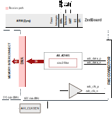

.. _ad7405_fmc:

AD7405-FMC HDL project
================================================================================

Overview
-------------------------------------------------------------------------------

The :adi:`EVAL-AD7405` is a full-featured evaluation board
designed to allow the user to easily evaluate all features of the :adi:`AD7405`
isolated analog-to-digital converter (ADC).

The provided HDL reference design supports the :adi:`AD7405`, :adi:`AD7403` and
:adi:`ADuM7701` devices.
One of the main differences between these devices is the type of the digital
data lines. In the case of :adi:`ADuM7701` and :adi:`AD7403`, it is single-ended,
and for :adi:`AD7405` is differential.

Supported boards
-------------------------------------------------------------------------------

- :adi:`EVAL-AD7405`
- :adi:`EVAL-AD7403`
- :adi:`EVAL-ADuM7701`

Supported devices
-------------------------------------------------------------------------------

- :adi:`AD7405`
- :adi:`AD7403`
- :adi:`ADuM7701`

Supported carriers
-------------------------------------------------------------------------------

.. list-table::
   :widths: 35 35 30
   :header-rows: 1

   * - Evaluation board
     - Carrier
     - FMC slot
   * - :adi:`EVAL-AD7405`
     - `ZedBoard <https://digilent.com/shop/zedboard-zynq-7000-arm-fpga-soc-development-board>`__
     - FMC-LPC
   * - :adi:`EVAL-AD7403`
     - `ZedBoard <https://digilent.com/shop/zedboard-zynq-7000-arm-fpga-soc-development-board>`__
     - FMC-LPC
   * - :adi:`EVAL-ADuM7701`
     - `ZedBoard <https://digilent.com/shop/zedboard-zynq-7000-arm-fpga-soc-development-board>`__
     - FMC-LPC

Block design
-------------------------------------------------------------------------------

Block diagram
~~~~~~~~~~~~~~~~~~~~~~~~~~~~~~~~~~~~~~~~~~~~~~~~~~~~~~~~~~~~~~~~~~~~~~~~~~~~~~~

The data path and clock domains are depicted in the below diagrams:

Block design for the differential signals (:adi:`AD7405`)
^^^^^^^^^^^^^^^^^^^^^^^^^^^^^^^^^^^^^^^^^^^^^^^^^^^^^^^^^^^^^^^^^^^^^^^^^^^^^^^

Block design for the single-ended signals (:adi:`ADuM7701` and :adi:`AD7403`)
^^^^^^^^^^^^^^^^^^^^^^^^^^^^^^^^^^^^^^^^^^^^^^^^^^^^^^^^^^^^^^^^^^^^^^^^^^^^^^^

Configuration modes
~~~~~~~~~~~~~~~~~~~~~~~~~~~~~~~~~~~~~~~~~~~~~~~~~~~~~~~~~~~~~~~~~~~~~~~~~~~~~~~

- LVDS_CMOS_N: specific to the type of the data and clock signals

   - 0 - Single-ended data and clock signals (default)
   - 1 - Differential data and clock signals

CPU/Memory interconnects addresses
~~~~~~~~~~~~~~~~~~~~~~~~~~~~~~~~~~~~~~~~~~~~~~~~~~~~~~~~~~~~~~~~~~~~~~~~~~~~~~~

The addresses are dependent on the architecture of the FPGA, having an offset
added to the base address from HDL (see more at :ref:`architecture cpu-intercon-addr`).

==================== ===============
Instance             Zynq/Microblaze
==================== ===============
axi_ad7405           0x44A0_0000
axi_ad7405_dma       0x44A3_0000
axi_adc_clkgen       0x44A4_0000
==================== ===============

Interrupts
~~~~~~~~~~~~~~~~~~~~~~~~~~~~~~~~~~~~~~~~~~~~~~~~~~~~~~~~~~~~~~~~~~~~~~~~~~~~~~~

Below are the Programmable Logic interrupts used in this project.

================ === ========== ===========
Instance name    HDL Linux Zynq Actual Zynq
================ === ========== ===========
axi_ad7405_dma   13  57         89
================ === ========== ===========

Building the HDL project
-------------------------------------------------------------------------------

The design is built upon ADI's generic HDL reference design framework.
ADI distributes the bit/elf files of these projects as part of the
:dokuwiki:`ADI Kuiper Linux <resources/tools-software/linux-software/kuiper-linux>`.
If you want to build the sources, ADI makes them available on the
:git-hdl:`HDL repository </>`. To get the source you must
`clone <https://git-scm.com/book/en/v2/Git-Basics-Getting-a-Git-Repository>`__
the HDL repository.

Default (Single-ended data and clock signals):

.. shell::

   $cd hdl/projects/ad7405/zed
   $make

If differential data and clock signals are desired:

.. shell::

   $cd hdl/projects/ad7405/zed
   $make LVDS_CMOS_N=1

A more comprehensive build guide can be found in the :ref:`build_hdl` user guide.

Resources
-------------------------------------------------------------------------------

Systems related
~~~~~~~~~~~~~~~~~~~~~~~~~~~~~~~~~~~~~~~~~~~~~~~~~~~~~~~~~~~~~~~~~~~~~~~~~~~~~~~

- :dokuwiki:`[Wiki] ADuM7701 - Reference Design <resources/eval/user-guides/adum770x>`

Hardware related
~~~~~~~~~~~~~~~~~~~~~~~~~~~~~~~~~~~~~~~~~~~~~~~~~~~~~~~~~~~~~~~~~~~~~~~~~~~~~~~

- Product datasheets:

  - :adi:`AD7405`
  - :adi:`AD7403`
  - :adi:`ADuM7701`

- `UG-690, EVAL-AD7405FMCZ User Guide <https://www.analog.com/media/en/technical-documentation/user-guides/EVAL-AD7405FMCZ_UG-690.pdf>`__
- `UG-683, EVAL-AD7403FMCZ User Guide <https://www.analog.com/media/en/technical-documentation/user-guides/EVAL-AD7403FMCZ%20_UG-683.pdf>`__
- `UG-1525, EV-ADuM7701-8FMCZ User Guide <https://www.analog.com/media/en/technical-documentation/user-guides/EV-ADuM7701-8FMCZ-UG-1525.pdf>`__

HDL related
~~~~~~~~~~~~~~~~~~~~~~~~~~~~~~~~~~~~~~~~~~~~~~~~~~~~~~~~~~~~~~~~~~~~~~~~~~~~~~~

- :git-hdl:`AD7405-FMC HDL project source code <projects/ad7405_fmc>`

.. list-table::
   :widths: 30 35 35
   :header-rows: 1

   * - IP name
     - Source code link
     - Documentation link
   * - AXI_AD7405
     - :git-hdl:`library/axi_ad7405`
     - ---
   * - AXI_CLKGEN
     - :git-hdl:`library/axi_clkgen`
     - :ref:`axi_clkgen`
   * - AXI_DMAC
     - :git-hdl:`library/axi_dmac`
     - :ref:`axi_dmac`
   * - AXI_HDMI_TX
     - :git-hdl:`library/axi_hdmi_tx`
     - :ref:`axi_hdmi_tx`
   * - AXI_I2S_ADI
     - :git-hdl:`library/axi_i2s_adi`
     - ---
   * - AXI_SPDIF_TX
     - :git-hdl:`library/axi_spdif_tx`
     - ---
   * - AXI_SYSID
     - :git-hdl:`library/axi_sysid`
     - :ref:`axi_sysid`
   * - SYSID_ROM
     - :git-hdl:`library/sysid_rom`
     - :ref:`axi_sysid`
   * - UTIL_DEC256SINC24B
     - :git-hdl:`library/util_dec256sinc24b`
     - ---
   * - UTIL_I2C_MIXER
     - :git-hdl:`library/util_i2c_mixer`
     - ---
   * - UTIL_CDC
     - :git-hdl:`library/util_cdc`
     - ---

Software related
~~~~~~~~~~~~~~~~~~~~~~~~~~~~~~~~~~~~~~~~~~~~~~~~~~~~~~~~~~~~~~~~~~~~~~~~~~~~~~~

* No-OS driver at :git-no-os:`legacy/adum7701_fmc`
* Linux driver at :git-linux:`drivers/iio/adc/admc_adc.c`

.. include:: ../common/more_information.rst

.. include:: ../common/support.rst
