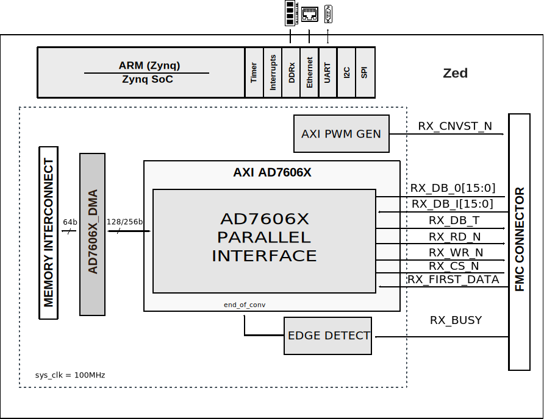

.. _ad7606x_fmcz:

AD7606X-FMCZ HDL project
===============================================================================

Overview
-------------------------------------------------------------------------------

The :part:`AD7606` is a 8-/6-/4-Channel DAS with 16-Bit, Bipolar Input, 
Simultaneous Sampling ADC. Each part contains analog input clamp protection, a
second-order antialiasing filter, a track-and-hold amplifier, a 16-bit charge
redistribution successive approximation analog-to-digital converter (ADC), a 
flexible digital filter, a 2.5 V reference and reference buffer, and high speed
serial and parallel interfaces. The :part:`AD7606` operate from a single 5 V 
supply and can accommodate ±10 V and ±5 V true bipolar input signals while
sampling at throughput rates up to 200 kSPS for all channels. The input clamp
protection circuitry can tolerate voltages up to ±16.5 V. The AD7606 has 1 MΩ
analog input impedance regardless of sampling frequency. The single supply
operation, on-chip filtering, and high input impedance eliminate the need for
driver op amps and external bipolar supplies.

The :part:`AD7606C` is a directly pin replacement (software and hardware) for
both AD7608 and AD7609, with higher input impedance, throughput rate and 
extended temperature range with additional features such as 16/18-bit sample 
size, system gain/offset/phase calibration, sensor disconnect detection, 
lower Vdrive operation, diagnostics, additional oversampling ratios and per
channel analog input range selection with bipolar differential, bipolar
single-ended and unipolar single-ended options.

The :part:`EVAL-AD7606B-FMCZ <EVAL-AD7606B-FMCZ>` and 
:part:`EVAL-AD7606C-18 <EVAL-AD7606C-18>` evaluation boards are designed to 
help users to easily evaluate the features of :part:`AD7606B`, 
:part:`AD7606C-16` and :part:`AD7606C-18` analog-to-digital converters (ADCs).

Supported boards
-------------------------------------------------------------------------------

-  :part:`EVAL-AD7606B <EVAL-AD7606B>`
-  :part:`EVAL-AD7606C-16/18 <EVAL-AD7606-16/18>`

Supported devices
-------------------------------------------------------------------------------

-  :part:`AD7606B`
-  :part:`AD7606C-16`
-  :part:`AD7606C-18`
-  :part:`ADP7118`
-  :part:`ADR4525`

Supported carriers
-------------------------------------------------------------------------------

-  :xilinx:`ZedBoard` on FMC slot
-  :xilinx:`SDP-H1` on FMC slot

Block design
-------------------------------------------------------------------------------

The data path of the HDL design is simple as follows:

-  the parallel interface is controlled by the axi_ad7606x IP core
-  the serial interface is controlled by the SPI Engine Framework
-  data is written into memory by a DMA (axi_dmac core)
-  all the control pins of the device are driven by GPIO's

Block diagram
~~~~~~~~~~~~~~~~~~~~~~~~~~~~~~~~~~~~~~~~~~~~~~~~~~~~~~~~~~~~~~~~~~~~~~~~~~~~~~~

AD7616_SDZ serial interface
^^^^^^^^^^^^^^^^^^^^^^^^^^^^^^^^^^^^^^^^^^^^^^^^^^^^^^^^^^^^^^^^^^^^^^^^^^^^^^^

.. image:: ../images/ad7606x_fmc/ad7606x_serial_hdl.svg
   :width: 800
   :align: center
   :alt: AD7606X_FMC using the serial interface block diagram

AD7616_SDZ parallel interface
^^^^^^^^^^^^^^^^^^^^^^^^^^^^^^^^^^^^^^^^^^^^^^^^^^^^^^^^^^^^^^^^^^^^^^^^^^^^^^^

   Configuration modes
~~~~~~~~~~~~~~~~~~~~~~~~~~~~~~~~~~~~~~~~~~~~~~~~~~~~~~~~~~~~~~~~~~~~~~~~~~~~~~~

The INTF configuration parameter defines the interface type (Serial or
Parallel). By default it is set to 0. Depending on the required interface mode,
some hardware modifications need to be done on the board and/or make command:

In case of the **PARALLEL** interface:

.. code-block::

   make INTF=0

In case of the **SERIAL** interface:

.. code-block::

   make INTF=1

.. note::

   This switch is a *hardware* switch. Please rebuild the  design if the
   variable has been changed.

   -   JP5 - Position A - Serial interface
   -   JP5 - Position B - Parallel interface

The DEV_CONFIG configuration parameter defines the device which will be used:
-  Options: 0 - AD7606B, 1 - AD7606C-16, 2 - AD7606C-18. 
By default it is set to 0.

The NUM_OF_SDI configuration parameter defines the number of SDI lines used:
-  Options: 1, 2, 4, 8. 
By default is set to 8.

The SIMPLE_STATUS_CRC configuration parameter defines the ADC Read Mode used:
-  Options: SIMPLE(0), STATUS(1), CRC(2), CRC_STATUS(3). 
By default is set to 0.

The EXT_CLK configuration parameter defines the external clock option for
the ADC clock:
-  Options: 0 - No, 1 - Yes. 
By default is set to 0.

Jumper setup
~~~~~~~~~~~~~~~~~~~~~~~~~~~~~~~~~~~~~~~~~~~~~~~~~~~~~~~~~~~~~~~~~~~~~~~~~~~~~~~

================== ================ ====================================
Jumper/Solder link Default Position Description
================== ================ ====================================
JP1                A                The STBY pin is tied to VDRIVE
JP2                A                12V supply from the carrier
JP3                A                3.3V supply from the ADP7118
JP4                A                ±10V range is selected
JP5                A                Serial interface
JP6                B                The internal reference is disabled, and the external 
                                    reference is selected. P5 must be inserted if using 
                                    the on-board U1 device
JP7                B                Connects the V1- line to the J5 SMB connector
JP8,JP10           A                Bypasses the amplifier mezzanine card
JP9,JP11           A                Bypasses the amplifier mezzanine card
JP12               B                Connects the V2- line to the J6 SMB connector
JP13               B                Connects the V3- line to the J7 SMB connector
JP14               B                Connects the V4- line to the J8 SMB connector
P13                Inserted         Connects the V5- line to ground
P14                Inserted         Connects the V8- line to ground
P15                Inserted         Connects the V6- line to ground
P16                Inserted         Connects the V7- line to ground
S1                 On               Controls the OS0, OS1, and OS2 pins
================== ================ ====================================

IP list
~~~~~~~~~~~~~~~~~~~~~~~~~~~~~~~~~~~~~~~~~~~~~~~~~~~~~~~~~~~~~~~~~~~~~~~~~~~~~~~

