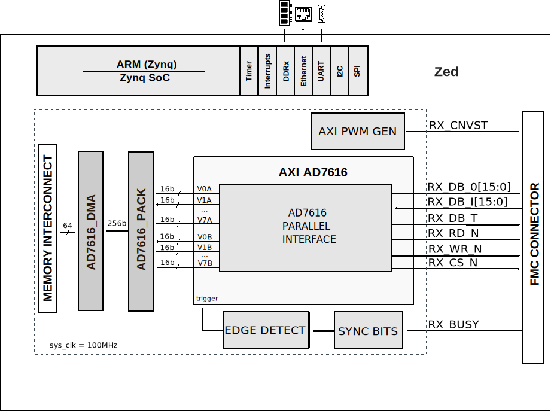

.. _ad7616_sdz:

AD7616-SDZ HDL project
===============================================================================

Overview
-------------------------------------------------------------------------------

The :adi:`AD7616` is a 16-bit, data acquisition system (DAS) that supports
dual simultaneous sampling of 16 channels. It operates from a single 5 V supply
and can accommodate ±10 V, ±5 V, and ±2.5 V true bipolar input signals while
sampling at throughput rates up to 1 MSPS per channel pair with 90 dB SNR.
Higher SNR performance can be achieved with the on-chip oversampling mode;
92 dB for an oversampling ratio of 2.

The input clamp protection circuitry can tolerate voltages up to ±20 V.
The :adi:`AD7616` has 1 MΩ analog input impedance regardless of sampling
frequency. The single supply operation, on-chip filtering, and high input
impedance eliminate the need for driver op-amps and external bipolar supplies.

Each device contains analog input clamp protection, a dual, 16-bit charge
redistribution successive approximation analog-to-digital converter (ADC),
a flexible digital filter, a 2.5 V reference and reference buffer, and
high-speed serial and parallel interfaces.

Supported boards
-------------------------------------------------------------------------------

-  :adi:`EVAL-AD7616 <EVAL-AD7616>`

Supported devices
-------------------------------------------------------------------------------

-  :adi:`AD7616`

Supported carriers
-------------------------------------------------------------------------------

-  :xilinx:`ZedBoard <products/boards-and-kits/1-8dyf-11.html>` on FMC slot
-  :xilinx:`ZC706` on FMC LPC slot

Other required hardware
-------------------------------------------------------------------------------

-   :adi:`SDP-I-FMC <EVAL-SDP-I-FMC>`

Block design
-------------------------------------------------------------------------------

The data path of the HDL design is simple as follows:

-  the parallel interface is controlled by the axi_ad7616 IP core
-  the serial interface is controlled by the SPI Engine Framework
-  data is written into memory by a DMA (axi_dmac core)
-  all the control pins of the device are driven by GPIOs

Block diagram
~~~~~~~~~~~~~~~~~~~~~~~~~~~~~~~~~~~~~~~~~~~~~~~~~~~~~~~~~~~~~~~~~~~~~~~~~~~~~~~

The data path and clock domains are depicted in the below diagrams:

AD7616_SDZ serial interface
^^^^^^^^^^^^^^^^^^^^^^^^^^^^^^^^^^^^^^^^^^^^^^^^^^^^^^^^^^^^^^^^^^^^^^^^^^^^^^^

AD7616_SDZ parallel interface
^^^^^^^^^^^^^^^^^^^^^^^^^^^^^^^^^^^^^^^^^^^^^^^^^^^^^^^^^^^^^^^^^^^^^^^^^^^^^^^

Configuration modes
~~~~~~~~~~~~~~~~~~~~~~~~~~~~~~~~~~~~~~~~~~~~~~~~~~~~~~~~~~~~~~~~~~~~~~~~~~~~~~~

The SER_PAR_N configuration parameter defines the interface type (Serial or
Parallel). By default it is set to 1. Depending on the required interface mode,
some hardware modifications need to be done on the board and/or make command:

In case of the **PARALLEL** interface:

.. code-block::

   make SER_PAR_N=0

In case of the **SERIAL** interface:

.. code-block::

   make SER_PAR_N=1

.. note::

   This switch is a *hardware* switch. Please rebuild the  design if the
   variable has been changed.

   -   SL5 - unmounted - Parallel interface
   -   SL5 - mounted - Serial interface

Jumper setup
~~~~~~~~~~~~~~~~~~~~~~~~~~~~~~~~~~~~~~~~~~~~~~~~~~~~~~~~~~~~~~~~~~~~~~~~~~~~~~~

================== ========= ====================================
Jumper/Solder link Position  Description
================== ========= ====================================
SL1                Unmounted Channel Sequencer Enable
SL2                Unmounted RC Enable Input
SL3                Mounted   Selects 2 MISO mode
SL4                Unmounted Oversampling Ratio Selection OS2
SL5                Mounted   If mounted, selects serial interface
SL6                Unmounted Oversampling Ratio Selection OS1
SL7                Unmounted Oversampling Ratio Selection OS0
LK40               A         Onboard 5v0 power supply selected
LK41               A         Onboard 3v3 power supply selected
================== ========= ====================================

CPU/Memory interconnects addresses
~~~~~~~~~~~~~~~~~~~~~~~~~~~~~~~~~~~~~~~~~~~~~~~~~~~~~~~~~~~~~~~~~~~~~~~~~~~~~~~

The addresses are dependent on the architecture of the FPGA, having an offset
added to the base address from HDL(see more at :ref:`architecture`).

========================  ===========
Instance                  Address
========================  ===========
axi_ad7616_dma            0x44A3_0000
spi_clkgen                0x44A7_0000
ad7616_pwm_gen            0x44B0_0000
spi_ad7616_axi_regmap **  0x44A0_0000
axi_ad7616 *              0x44A8_0000
========================  ===========

.. admonition:: Legend
   :class: note

   -   ``*`` instantiated only for SER_PAR_N=0 (parallel interface)
   -   ``**`` instantiated only for SER_PAR_N=1 (serial interface)

I2C connections
~~~~~~~~~~~~~~~~~~~~~~~~~~~~~~~~~~~~~~~~~~~~~~~~~~~~~~~~~~~~~~~~~~~~~~~~~~~~~~~

.. list-table::
   :widths: 20 20 20 20 20
   :header-rows: 1

   * - I2C type
     - I2C manager instance
     - Alias
     - Address
     - I2C subordinate
   * - PL
     - iic_fmc
     - axi_iic_fmc
     - 0x4162_0000
     - ---
   * - PL
     - iic_main
     - axi_iic_main
     - 0x4160_0000
     - ---

SPI connections
~~~~~~~~~~~~~~~~~~~~~~~~~~~~~~~~~~~~~~~~~~~~~~~~~~~~~~~~~~~~~~~~~~~~~~~~~~~~~~~

.. list-table::
   :widths: 25 25 25 25
   :header-rows: 1

   * - SPI type
     - SPI manager instance
     - SPI subordinate
     - CS
   * - PL
     - axi_spi_engine
     - AD7616
     - 0

GPIOs
~~~~~~~~~~~~~~~~~~~~~~~~~~~~~~~~~~~~~~~~~~~~~~~~~~~~~~~~~~~~~~~~~~~~~~~~~~~~~~~

The Software GPIO number is calculated as follows:

-  Zynq-7000: if PS7 is used, then offset is 54

.. list-table::
   :widths: 25 25 25 25
   :header-rows: 2

   * - GPIO signal
     - Direction
     - HDL GPIO EMIO
     - Software GPIO
   * -
     - (from FPGA view)
     -
     - Zynq-7000
   * - adc_reset_n
     - OUT
     - 43
     - 97
   * - adc_hw_rngsel[1:0]
     - OUT
     - 42:41
     - 96:95
   * - adc_os[2:0] **
     - OUT
     - 40:38
     - 94:92
   * - adc_seq_en
     - OUT
     - 37
     - 91
   * - adc_burst **
     - OUT
     - 36
     - 90
   * - adc_chsel[2:0]
     - OUT
     - 35:33
     - 89:87
   * - adc_crcen **
     - OUT
     - 32
     - 86

.. admonition:: Legend
   :class: note

   -   ``**`` instantiated only for SER_PAR_N=1 (serial interface)

Interrupts
~~~~~~~~~~~~~~~~~~~~~~~~~~~~~~~~~~~~~~~~~~~~~~~~~~~~~~~~~~~~~~~~~~~~~~~~~~~~~~~

Below are the Programmable Logic interrupts used in this project.

=============== === ========== ===========
Instance name   HDL Linux Zynq Actual Zynq
=============== === ========== ===========
axi_ad7616_dma  13  57         89
spi_ad7616 **   12  56         88
axi_ad7616 *    10  54         87
=============== === ========== ===========

.. admonition:: Legend
   :class: note

   -   ``*`` instantiated only for SER_PAR_N=0 (parallel interface)
   -   ``**`` instantiated only for SER_PAR_N=1 (serial interface)

Building the HDL project
-------------------------------------------------------------------------------

The design is built upon ADI's generic HDL reference design framework.
ADI does not distribute the bit/elf files of these projects so they
must be built from the sources available :git-hdl:`here </>`. To get
the source you must
`clone <https://git-scm.com/book/en/v2/Git-Basics-Getting-a-Git-Repository>`__
the HDL repository, and then build the project as follows:.

**Linux/Cygwin/WSL**

.. code-block::
   :linenos:

   user@analog:~$ cd hdl/projects/ad7616_sdz/zed
   user@analog:~/hdl/projects/ad7616_sdz/zed$ make SER_PAR_N=0

The result of the build, if parameters were used, will be in a folder named
by the configuration used:

if the following command was run

``make SER_PAR_N=0``

then the folder name will be:

``SERPARN0``

A more comprehensive build guide can be found in the :ref:`build_hdl` user guide.

Connections and hardware changes
~~~~~~~~~~~~~~~~~~~~~~~~~~~~~~~~~~~~~~~~~~~~~~~~~~~~~~~~~~~~~~~~~~~~~~~~~~~~~~~

.. warning::

   **The following hardware changes are required:**

   (**Please note:** Because of the **SDP-I-FMC** the level of the **VADJ** in
   the carrier board needs to be set to **3.3V**.

   Depending on the required interface mode, some hardware modifications need to
   be done.

   -   **SL5** - unmounted - Parallel interface
   -   **SL5** - mounted - Serial interface

Resources
-------------------------------------------------------------------------------

Hardware related
~~~~~~~~~~~~~~~~~~~~~~~~~~~~~~~~~~~~~~~~~~~~~~~~~~~~~~~~~~~~~~~~~~~~~~~~~~~~~~~

-  Product datasheet: :adi:`AD7616`

-  `UG-1012, Evaluation Board User Guide <https://www.analog.com/media/en/technical-documentation/user-guides/EVAL-AD7616SDZ-7616-PSDZ-UG-1012.pdf>`__

HDL related
~~~~~~~~~~~~~~~~~~~~~~~~~~~~~~~~~~~~~~~~~~~~~~~~~~~~~~~~~~~~~~~~~~~~~~~~~~~~~~~

-  :git-hdl:`AD7616_SDZ HDL project source code <projects/ad7616_sdz>`

.. list-table::
   :widths: 30 35 35
   :header-rows: 1

   * - IP name
     - Source code link
     - Documentation link
   * - AD_EDGE_DETECT
     - :git-hdl:`library/common/ad_edge_detect.v`
     - ---
   * - AXI_AD7616
     - :git-hdl:`library/axi_ad7616` *
     - :dokuwiki:`[Wiki] <resources/fpga/docs/axi_ad7616>`
   * - AXI_CLKGEN
     - :git-hdl:`library/axi_clkgen`
     - :dokuwiki:`[Wiki] <resources/fpga/docs/axi_clkgen>`
   * - AXI_DMAC
     - :git-hdl:`library/axi_dmac`
     - :ref:`here <axi_dmac>`
   * - AXI_HDMI_TX
     - :git-hdl:`library/axi_hdmi_tx`
     - :dokuwiki:`[Wiki] <resources/fpga/docs/axi_hdmi_tx>`
   * - AXI_I2S_ADI
     - :git-hdl:`library/axi_i2s_adi`
     - ---
   * - AXI_PWM_GEN
     - :git-hdl:`library/axi_pwm_gen`
     - :dokuwiki:`[Wiki] <resources/fpga/docs/axi_pwm_gen>`
   * - AXI_SPDIF_TX
     - :git-hdl:`library/axi_spdif_tx`
     - ---
   * - AXI_SPI_ENGINE
     - :git-hdl:`library/spi_engine/axi_spi_engine`  **
     - :ref:`here <spi_engine axi>`
   * - AXI_SYSID
     - :git-hdl:`library/axi_sysid`
     - :dokuwiki:`[Wiki] <resources/fpga/docs/axi_sysid>`
   * - SPI_ENGINE_EXECUTION
     - :git-hdl:`library/spi_engine/spi_engine_execution` **
     - :ref:`here <spi_engine execution>`
   * - SPI_ENGINE_INTERCONNECT
     - :git-hdl:`library/spi_engine/spi_engine_interconnect` **
     - :ref:`here <spi_engine interconnect>`
   * - SPI_ENGINE_OFFLOAD
     - :git-hdl:`library/spi_engine/spi_engine_offload` **
     - :ref:`here <spi_engine offload>`
   * - SYNC_BITS
     - :git-hdl:`library/util_cdc/sync_bits.v`
     - ---
   * - SYSID_ROM
     - :git-hdl:`library/sysid_rom`
     - :dokuwiki:`[Wiki] <resources/fpga/docs/axi_sysid>`

.. admonition:: Legend
   :class: note

   -   ``*`` instantiated only for SER_PAR_N=0 (parallel interface)
   -   ``**`` instantiated only for SER_PAR_N=1 (serial interface)

-  :ref:`SPI Engine Framework documentation <spi_engine>`

Software related
~~~~~~~~~~~~~~~~~~~~~~~~~~~~~~~~~~~~~~~~~~~~~~~~~~~~~~~~~~~~~~~~~~~~~~~~~~~~~~~

-  :git-no-os:`AD7616_SDZ No-OS project source code <projects/ad7616-sdz>`

-  :dokuwiki:`How to build No-OS <resources/no-os/build>`

.. include:: ../common/more_information.rst

.. include:: ../common/support.rst
