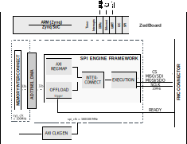

.. _ad77681evb:

AD77681EVB HDL project
=================================================================================

Overview
---------------------------------------------------------------------------------

The :adi:`AD7768-1`/:adi:`ADAQ7768-1` is a low power, high performance, Σ-Δ
analog-to-digital converter (ADC), with a Σ-Δ modulator and digital filter for
precision conversion of both AC and DC signals. The :adi:`AD7768-1` is a single
channel version of the AD7768, an 8-channel, simultaneously sampling, Σ-Δ ADC.
The :adi:`AD7768-1` provides a single configurable and reusable data acquisition
footprint, which establishes a new industry standard in combined AC and DC
performance and enables instrumentation and industrial system designers to design
across multiple measurement variants for both isolated and nonisolated
applications.

The :adi:`AD7768-1` achieves a 108.5 dB dynamic range when using the low ripple,
finite impulse response (FIR) digital filter at 256 kSPS, giving 110.8 kHz input
bandwidth (BW), combined with ±1.1 ppm integral nonlinearity (INL), ±30 µV
offset error, and ±30 ppm gain error. Wider bandwidth, up to 500 kHz Nyquist,
204 kHz, −3 dB, is available using the sinc5 filter, enabling a view of signals
over an extended range.

A 1.024 MHz sinc5 filter path exists for users seeking an even higher output
data rate. This path is quantization noise limited; therefore, it is best suited
for customers requiring minimum latency for control loops or implementing custom
digital filtering on an external field programmable gate array (FPGA) or digital
signal processor (DSP).

Supported boards
-------------------------------------------------------------------------------

- :adi:`EVAL-AD7768-1`
- :adi:`EVAL-ADAQ7768-1`

Supported devices
-------------------------------------------------------------------------------

- :adi:`AD7768-1`
- :adi:`ADAQ7768-1`

Supported carriers
-------------------------------------------------------------------------------

- `ZedBoard <https://digilent.com/shop/zedboard-zynq-7000-arm-fpga-soc-development-board>`__ on FMC slot

Block design
-------------------------------------------------------------------------------

Block diagram
~~~~~~~~~~~~~~~~~~~~~~~~~~~~~~~~~~~~~~~~~~~~~~~~~~~~~~~~~~~~~~~~~~~~~~~~~~~~~~~

The data path and clock domains are depicted in the below diagram:

CPU/Memory interconnects addresses
~~~~~~~~~~~~~~~~~~~~~~~~~~~~~~~~~~~~~~~~~~~~~~~~~~~~~~~~~~~~~~~~~~~~~~~~~~~~~~~

The addresses are dependent on the architecture of the FPGA, having an offset
added to the base address from HDL(see more at :ref:`architecture cpu-intercon-addr`).

=========================  ===========
Instance                   Zynq
=========================  ===========
spi_adc_axi_regmap         0x44A0_0000
axi_ad77681_dma            0x44A3_0000
spi_clkgen                 0x44A7_0000
=========================  ===========

I2C connections
~~~~~~~~~~~~~~~~~~~~~~~~~~~~~~~~~~~~~~~~~~~~~~~~~~~~~~~~~~~~~~~~~~~~~~~~~~~~~~~

.. list-table::
   :widths: 20 20 20 20 20
   :header-rows: 1

   * - I2C type
     - I2C manager instance
     - Alias
     - Address
     - I2C subordinate
   * - PL
     - iic_fmc
     - axi_iic_fmc
     - 0x4162_0000
     - ---
   * - PL
     - iic_main
     - axi_iic_main
     - 0x4160_0000
     - ---

SPI connections
~~~~~~~~~~~~~~~~~~~~~~~~~~~~~~~~~~~~~~~~~~~~~~~~~~~~~~~~~~~~~~~~~~~~~~~~~~~~~~~

.. list-table::
   :widths: 25 25 25 25
   :header-rows: 1

   * - SPI type
     - SPI manager instance
     - SPI subordinate
     - CS
   * - PL
     - spi_ad77681
     - ad77681
     - 0

GPIOs
~~~~~~~~~~~~~~~~~~~~~~~~~~~~~~~~~~~~~~~~~~~~~~~~~~~~~~~~~~~~~~~~~~~~~~~~~~~~~~~

The Software GPIO number is calculated as follows:

- Zynq-7000: if PS7 is used, then offset is 54

.. list-table::
   :widths: 25 25 25 25
   :header-rows: 2

   * - GPIO signal
     - Direction
     - HDL GPIO EMIO
     - Software GPIO
   * -
     - (from FPGA view)
     -
     - Zynq-7000
   * - ad77681_reset
     - OUT
     - 32
     - 86
   * - ad77681_sync_out
     - INOUT
     - 33
     - 87
   * - ad77681_sync_in
     - INOUT
     - 34
     - 88
   * - ad77681_gpio
     - INOUT
     - 35-38
     - 89-92

Interrupts
~~~~~~~~~~~~~~~~~~~~~~~~~~~~~~~~~~~~~~~~~~~~~~~~~~~~~~~~~~~~~~~~~~~~~~~~~~~~~~~

Below are the Programmable Logic interrupts used in this project.

====================== === ========== ===========
Instance name          HDL Linux Zynq Actual Zynq
====================== === ========== ===========
axi_ad77681_dma        13  57         89
spi_ad77681/axi_regmap 12  56         88
====================== === ========== ===========

Building the HDL project
-------------------------------------------------------------------------------

The design is built upon ADI's generic HDL reference design framework.
ADI distributes the bit/elf files of these projects as part of the
:dokuwiki:`ADI Kuiper Linux <resources/tools-software/linux-software/kuiper-linux>`.
If you want to build the sources, ADI makes them available on the
:git-hdl:`HDL repository </>`. To get the source you must
`clone <https://git-scm.com/book/en/v2/Git-Basics-Getting-a-Git-Repository>`__
the HDL repository, and then build the project as follows:

**Linux/Cygwin/WSL**

.. shell::

   $cd hdl/projects/ad77681evb/zed
   $make

A more comprehensive build guide can be found in the :ref:`build_hdl` user guide.

Resources
-------------------------------------------------------------------------------

Systems related
~~~~~~~~~~~~~~~~~~~~~~~~~~~~~~~~~~~~~~~~~~~~~~~~~~~~~~~~~~~~~~~~~~~~~~~~~~~~~~~

- `UG-1260, User Guide | EV-AD7768-1FMCZ <https://www.analog.com/media/en/technical-documentation/user-guides/ev-ad7768-1fmcz-ug-1260.pdf>`__

Hardware related
~~~~~~~~~~~~~~~~~~~~~~~~~~~~~~~~~~~~~~~~~~~~~~~~~~~~~~~~~~~~~~~~~~~~~~~~~~~~~~~

- Product datasheets:

  - :adi:`AD7768-1`
  - :adi:`ADAQ7768-1`

HDL related
~~~~~~~~~~~~~~~~~~~~~~~~~~~~~~~~~~~~~~~~~~~~~~~~~~~~~~~~~~~~~~~~~~~~~~~~~~~~~~~

- :git-hdl:`ad77681evb HDL project source code <projects/ad77681evb>`
- :dokuwiki:`[Wiki] AD7768-1 User Guide <resources/eval/user-guides/ad7768-1>`

.. list-table::
   :widths: 30 40 30
   :header-rows: 1

   * - IP name
     - Source code link
     - Documentation link
   * - AXI_CLKGEN
     - :git-hdl:`library/axi_clkgen`
     - :ref:`axi_clkgen`
   * - AXI_DMAC
     - :git-hdl:`library/axi_dmac`
     - :ref:`axi_dmac`
   * - AXI_HDMI_TX
     - :git-hdl:`library/axi_hdmi_tx`
     - :ref:`axi_hdmi_tx`
   * - AXI_I2S_ADI
     - :git-hdl:`library/axi_i2s_adi`
     - ---
   * - AXI_SPDIF_TX
     - :git-hdl:`library/axi_spdif_tx`
     - ---
   * - AXI_SYSID
     - :git-hdl:`library/axi_sysid`
     - :ref:`axi_sysid`
   * - AXI_SPI_ENGINE
     - :git-hdl:`library/spi_engine/axi_spi_engine`
     - :ref:`spi_engine axi`
   * - SPI_ENGINE_EXECUTION
     - :git-hdl:`library/spi_engine/spi_engine_execution`
     - :ref:`spi_engine execution`
   * - SPI_ENGINE_INTERCONNECT
     - :git-hdl:`library/spi_engine/spi_engine_interconnect`
     - :ref:`spi_engine interconnect`
   * - SPI_ENGINE_OFFLOAD
     - :git-hdl:`library/spi_engine/spi_engine_offload`
     - :ref:`spi_engine offload`
   * - SYSID_ROM
     - :git-hdl:`library/sysid_rom`
     - :ref:`axi_sysid`
   * - UTIL_I2C_MIXER
     - :git-hdl:`library/util_i2c_mixer`
     - ---

- :ref:`SPI Engine Framework documentation <spi_engine>`

Software related
~~~~~~~~~~~~~~~~~~~~~~~~~~~~~~~~~~~~~~~~~~~~~~~~~~~~~~~~~~~~~~~~~~~~~~~~~~~~~~~

- :git-linux:`AD7768-1 Linux driver source code <drivers/iio/adc/ad7768-1.c>`
- AD7768-1 Linux device tree :git-linux:`zynq-zed-adv7511-ad7768-1-evb.dts <arch/arm/boot/dts/xilinx/zynq-zed-adv7511-ad7768-1-evb.dts>`

.. include:: ../common/more_information.rst

.. include:: ../common/support.rst
