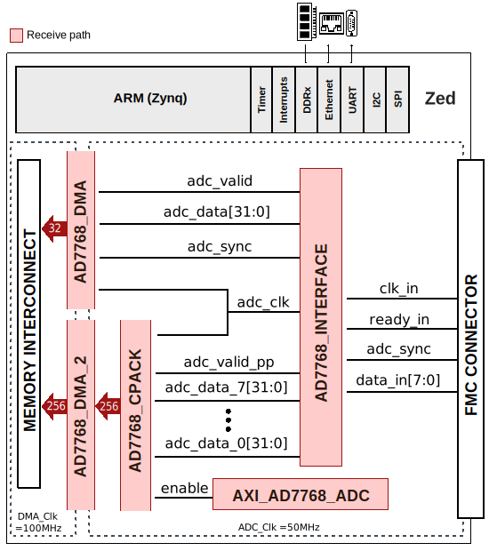

.. _ad7768evb:

AD7768-EVB HDL project
====================================================================================

Overview
------------------------------------------------------------------------------------

The :adi:`EVAL-AD7768FMCZ` / :adi:`EVAL-AD7768-4FMCZ` evaluation kit features the
:adi:`AD7768` / :adi:`AD7768-4` 24-bit, 256 kSPS, analog-to-digital converter (ADC).
A 7 V to 9 V external bench top supply is regulated to 5 V and 3.3 V to  supply the
:adi:`AD7768` / :adi:`AD7768-4` and support components.
The :adi:`AD7768` / :adi:`AD7768-4` are 8-channel and 4-channel simultaneous
sampling sigma-delta (Σ-Δ) analog-to-digital converters (ADCs), respectively, with a
Σ-Δ modulator and digital filter per channel, enabling synchronized sampling of ac
and dc signals. The :adi:`AD7768` / :adi:`AD7768-4` achieve 108 dB dynamic range at
a maximum input bandwidth of 110.8 kHz, combined with typical performance of ±2 ppm
integral nonlinearity (INL), ±50 μV offset error, and ±30 ppm gain error.

The :adi:`AD7768` / :adi:`AD7768-4` user can trade off input bandwidth, output data
rate, and power dissipation, and select one of three power modes to optimize for
noise targets and power consumption. The flexibility of the
:adi:`AD7768` / :adi:`AD7768-4` allows it to become a reusable platform for low
power dc and high performance ac measurement module.
The :adi:`AD7768` / :adi:`AD7768-4` has three modes: fast mode (256 kSPS maximum,
110.8 kHz input bandwidth, 51.5 mW per channel), median mode (128 kSPS maximum,
55.4 kHz input bandwidth, 27.5 mW per channel) and low power mode (32 kSPS maximum,
13.8 kHz input bandwidth, 9.375 mW per channel). The :adi:`AD7768` / :adi:`AD7768-4`
offers extensive digital filtering capabilities, such as a wideband, low ±0.005 dB
pass-band ripple, antialiasing low-pass filter with sharp roll-off, and 105 dB
attenuation at the Nyquist frequency. Frequency domain measurements can use the
wideband linear phase filter. This filter has a flat pass band (±0.005 dB ripple)
from dc to 102.4 kHz at 256 kSPS, from dc to 51.2 kHz at 128 kSPS, or from dc to
12.8 kHz at 32 kSPS.

The :adi:`AD7768` / :adi:`AD7768-4` also offers sinc response via a sinc5 filter,
a low latency path for low bandwidth, and low noise measurements. The wideband and
sinc5 filters can be selected and run on a per channel basis. Within these filter
options, the user can improve the dynamic range by selecting from decimation rates
of ×32, ×64, ×128, ×256, ×512, and ×1024. The ability to vary the decimation
filtering optimizes noise performance to the required input bandwidth. Embedded
analog functionality on each ADC channel makes design easier, such as a precharge
buffer on each analog input that reduces analog input current and a precharge
reference buffer per channel reduces input current and glitches on the reference
input terminals.

The device operates with a 5 V AVDD1A and AVDD1B supply, a 2.25 V to 5.0 V AVDD2A
and AVDD2B supply, and a 2.5 V to 3.3 V or 1.8 V IOVDD supply (see the 1.8 V IOVDD
Operation section for specific requirements for operating at 1.8 V IOVDD).
The device requires an external reference; the absolute input reference voltage
range is 1 V to AVDD1 − AVSS. The specified operating temperature range is −40°C
to +105°C. The device is housed in a 10 mm × 10 mm 64-lead LQFP package with a
12 mm × 12 mm printed circuit board (PCB) footprint.

Supported boards
-------------------------------------------------------------------------------

- :adi:`EVAL-AD7768`
- :adi:`EVAL-AD7768-4`

Supported devices
-------------------------------------------------------------------------------

- :adi:`AD7768`
- :adi:`AD7768-4`

Supported carriers
---------------------------------------------------------------------------------

- `ZedBoard <https://digilent.com/shop/zedboard-zynq-7000-arm-fpga-soc-development-board>`__ on FMC slot

Block design
-------------------------------------------------------------------------------

Block diagram
~~~~~~~~~~~~~~~~~~~~~~~~~~~~~~~~~~~~~~~~~~~~~~~~~~~~~~~~~~~~~~~~~~~~~~~~~~~~~~~

The data path and clock domains are depicted in the below diagram:

Jumper setup
~~~~~~~~~~~~~~~~~~~~~~~~~~~~~~~~~~~~~~~~~~~~~~~~~~~~~~~~~~~~~~~~~~~~~~~~~~~~~~~

================== ========= ======================================
Jumper/Solder link Position  Description
================== ========= ======================================
LK1                B         LK1 selects the input voltage source.
                             Position B: J1 is selected.
LK2                B         Position B: external power supply from
                             either J1 or J3.
SL4A               B         Crystal oscillator or LVDS option.
================== ========= ======================================

CPU/Memory interconnects addresses
~~~~~~~~~~~~~~~~~~~~~~~~~~~~~~~~~~~~~~~~~~~~~~~~~~~~~~~~~~~~~~~~~~~~~~~~~~~~~~~

The addresses are dependent on the architecture of the FPGA, having an offset
added to the base address from HDL(see more at :ref:`architecture cpu-intercon-addr`).

=========================  ===========
Instance                   Zynq
=========================  ===========
axi_ad7768_adc             0x43C0_0000
ad7768_dma                 0x7C40_0000
ad7768_dma_2               0x7C48_0000
=========================  ===========

I2C connections
~~~~~~~~~~~~~~~~~~~~~~~~~~~~~~~~~~~~~~~~~~~~~~~~~~~~~~~~~~~~~~~~~~~~~~~~~~~~~~~

.. list-table::
   :widths: 20 20 20 20 20
   :header-rows: 1

   * - I2C type
     - I2C manager instance
     - Alias
     - Address
     - I2C subordinate
   * - PL
     - iic_fmc
     - axi_iic_fmc
     - 0x4162_0000
     - ---
   * - PL
     - iic_main
     - axi_iic_main
     - 0x4160_0000
     - ---

GPIOs
~~~~~~~~~~~~~~~~~~~~~~~~~~~~~~~~~~~~~~~~~~~~~~~~~~~~~~~~~~~~~~~~~~~~~~~~~~~~~~~

The Software GPIO number is calculated as follows:

- Zynq-7000: if PS7 is used, then offset is 54

.. list-table::
   :widths: 25 25 25 25
   :header-rows: 2

   * - GPIO signal
     - Direction
     - HDL GPIO EMIO
     - Software GPIO
   * -
     - (from FPGA view)
     -
     - Zynq-7000
   * - gpio_1_mode_3
     - INOUT
     - 51
     - 105
   * - gpio_1_mode_2
     - INOUT
     - 50
     - 104
   * - gpio_1_mode_1
     - INOUT
     - 49
     - 103
   * - gpio_0_mode_0
     - INOUT
     - 48
     - 102
   * - reset_n
     - OUT
     - 32
     - 86

Interrupts
~~~~~~~~~~~~~~~~~~~~~~~~~~~~~~~~~~~~~~~~~~~~~~~~~~~~~~~~~~~~~~~~~~~~~~~~~~~~~~~

Below are the Programmable Logic interrupts used in this project.

=============== === ========== ===========
Instance name   HDL Linux Zynq Actual Zynq
=============== === ========== ===========
ad7768_dma      13  57         89
ad7768_dma_2    10  54         87
=============== === ========== ===========

Building the HDL project
-------------------------------------------------------------------------------

The design is built upon ADI's generic HDL reference design framework.
ADI distributes the bit/elf files of these projects as part of the
:dokuwiki:`ADI Kuiper Linux <resources/tools-software/linux-software/kuiper-linux>`.
If you want to build the sources, ADI makes them available on the
:git-hdl:`HDL repository </>`. To get the source you must
`clone <https://git-scm.com/book/en/v2/Git-Basics-Getting-a-Git-Repository>`__
the HDL repository, and then build the project as follows:

**Linux/Cygwin/WSL**

.. shell::

   $cd hdl/projects/ad7768evb/zed
   $make

A more comprehensive build guide can be found in the :ref:`build_hdl` user guide.

Resources
-------------------------------------------------------------------------------

Hardware related
~~~~~~~~~~~~~~~~~~~~~~~~~~~~~~~~~~~~~~~~~~~~~~~~~~~~~~~~~~~~~~~~~~~~~~~~~~~~~~~

- Product datasheets:
  - :adi:`AD7768`
  - :adi:`AD7768-4`
- :adi:`UG-917, Evaluation Board User Guide <media/en/technical-documentation/user-guides/EVAL-AD7768FMCZ_UG-917.pdf>`
- :adi:`UG-921, Evaluation Board User Guide <media/en/technical-documentation/user-guides/EVAL-AD7768-4FMCZ-UG-921.pdf>`

HDL related
~~~~~~~~~~~~~~~~~~~~~~~~~~~~~~~~~~~~~~~~~~~~~~~~~~~~~~~~~~~~~~~~~~~~~~~~~~~~~~~

- :git-hdl:`AD7768-EVB HDL project source code <projects/ad7768evb>`
- :dokuwiki:`[Wiki] AD7768-EVB Bare Metal Quick Start Guide <resources/eval/user-guides/ad7768-ebz/software/baremetal>`

.. list-table::
   :widths: 30 35 35
   :header-rows: 1

   * - IP name
     - Source code link
     - Documentation link
   * - AXI_AD7768
     - :git-hdl:`library/axi_ad7768`
     - :ref:`axi_ad7768`
   * - AXI_CLKGEN
     - :git-hdl:`library/axi_clkgen`
     - :ref:`axi_clkgen`
   * - AXI_DMAC
     - :git-hdl:`library/axi_dmac`
     - :ref:`axi_dmac`
   * - AXI_HDMI_TX
     - :git-hdl:`library/axi_hdmi_tx`
     - :ref:`axi_hdmi_tx`
   * - AXI_I2S_ADI
     - :git-hdl:`library/axi_i2s_adi`
     - ---
   * - AXI_SPDIF_TX
     - :git-hdl:`library/axi_spdif_tx`
     - ---
   * - AXI_SYSID
     - :git-hdl:`library/axi_sysid`
     - :ref:`axi_sysid`
   * - SYSID_ROM
     - :git-hdl:`library/sysid_rom`
     - :ref:`axi_sysid`
   * - UTIL_I2C_MIXER
     - :git-hdl:`library/util_i2c_mixer`
     - ---
   * - UTIL_CPACK2
     - :git-hdl:`library/util_pack/util_cpack2 <library/util_pack/util_cpack2>`
     - :ref:`util_cpack2`

Software related
~~~~~~~~~~~~~~~~~~~~~~~~~~~~~~~~~~~~~~~~~~~~~~~~~~~~~~~~~~~~~~~~~~~~~~~~~~~~~~~

- :git-linux:`AD7768 Linux driver source code <drivers/iio/adc/ad7768.c>`
- :git-no-os:`AD7768 No-OS project source code <projects/ad7768-evb>`
- :dokuwiki:`[Wiki] AD7768 IIO Precision ADC Linux Driver <resources/tools-software/linux-drivers/iio-adc/ad7768>`

.. include:: ../common/more_information.rst

.. include:: ../common/support.rst
