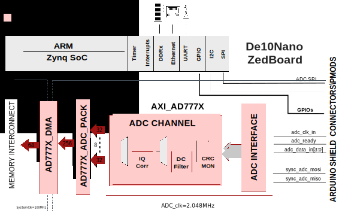
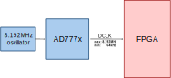

.. _ad777x_ardz:

AD777X-ARDZ HDL project
===============================================================================

Overview
-------------------------------------------------------------------------------

The EVAL-AD7770-ARDZ / EVAL-AD7771-ARDZ / EVAL-AD7779-ARDZ evaluation kit 
features the :adi:`AD7770`, :adi:`AD7771`, and :adi:`AD7779` 24-bit, 
analog-to-digital converters (ADCs).

The AD777x is an 8-channel, simultaneous sampling analog-to-digital converter 
(ADC). Eight full Σ-Δ ADCs are on-chip. The AD777x provides an ultralow input 
current to allow direct sensor connection. Each input channel has a 
programmable gain stage allowing gains of 1, 2, 4, and 8 to map lower amplitude
sensor outputs into the full-scale ADC input range, maximizing the dynamic 
range of the signal chain.

Supported boards
-------------------------------------------------------------------------------

-  EVAL-AD7770-ARDZ
-  EVAL-AD7771-ARDZ
-  EVAL-AD7779-ARDZ

Supported devices
-------------------------------------------------------------------------------

-  :adi:`AD7770`
-  :adi:`AD7771`
-  :adi:`AD7779`

Supported carriers
-------------------------------------------------------------------------------

.. list-table::
   :widths: 35 35 30
   :header-rows: 1

   * - Evaluation board
     - Carrier
     - FMC slot
   * - EVAL-AD7770-ARDZ
     - :xilinx:`ZedBoard <products/boards-and-kits/1-8dyf-11.html>`
     - PMOD-JA, PMOD-JB, PMOD-JC
   * - EVAL-AD7771-ARDZ
     - :xilinx:`ZedBoard <products/boards-and-kits/1-8dyf-11.html>`
     - PMOD-JA, PMOD-JB, PMOD-JC
   * - EVAL-AD7779-ARDZ
     - :xilinx:`ZedBoard <products/boards-and-kits/1-8dyf-11.html>`
     - PMOD-JA, PMOD-JB, PMOD-JC
   * - EVAL-AD7770-ARDZ
     - :intel:`De10-Nano <content/www/us/en/developer/topic-technology/edge-5g/hardware/fpga-de10-nano.html>`
     - Arduino shield connector
   * - EVAL-AD7771-ARDZ
     - :intel:`De10-Nano <content/www/us/en/developer/topic-technology/edge-5g/hardware/fpga-de10-nano.html>`
     - Arduino shield connector
   * - EVAL-AD7779-ARDZ
     - :intel:`De10-Nano <content/www/us/en/developer/topic-technology/edge-5g/hardware/fpga-de10-nano.html>`
     - Arduino shield connector

Block design
-------------------------------------------------------------------------------

Block diagram
~~~~~~~~~~~~~~~~~~~~~~~~~~~~~~~~~~~~~~~~~~~~~~~~~~~~~~~~~~~~~~~~~~~~~~~~~~~~~~~

The data path and clock domains are depicted in the below diagram:

Clock scheme
~~~~~~~~~~~~~~~~~~~~~~~~~~~~~~~~~~~~~~~~~~~~~~~~~~~~~~~~~~~~~~~~~~~~~~~~~~~~~~~

CPU/Memory interconnects addresses
~~~~~~~~~~~~~~~~~~~~~~~~~~~~~~~~~~~~~~~~~~~~~~~~~~~~~~~~~~~~~~~~~~~~~~~~~~~~~~~

==============  ===========
Instance        Zynq
==============  ===========
axi_ad777x_adc  0x43C0_0000
ad777x_dma      0x7C48_0000
==============  ===========

SPI connections
~~~~~~~~~~~~~~~~~~~~~~~~~~~~~~~~~~~~~~~~~~~~~~~~~~~~~~~~~~~~~~~~~~~~~~~~~~~~~~~

.. list-table::
   :widths: 25 25 25 25
   :header-rows: 1

   * - SPI type
     - SPI manager instance
     - SPI subordinate
     - CS
   * - PS*
     - SPI 0
     - AD777x
     - 0
   * - PL**
     - sys_spi 
     - AD777x
     - 0

.. admonition:: Legend
   :class: note

   -  ``*``  only for ZedBoard
   -  ``**`` only for De10-Nano

GPIOs
~~~~~~~~~~~~~~~~~~~~~~~~~~~~~~~~~~~~~~~~~~~~~~~~~~~~~~~~~~~~~~~~~~~~~~~~~~~~~~~

.. list-table::
   :widths: 25 20 20 20 15
   :header-rows: 2

   * - GPIO signal
     - Direction
     - HDL GPIO EMIO
     - Software GPIO
     - Software GPIO
   * -
     - (from FPGA view)
     -
     - Zynq-7000
     - Cyclone V
   * - RESET_N
     - OUT
     - 39
     - 93
     - 7 
   * - GPIO2
     - INOUT
     - 38
     - 92
     - 6
   * - GPIO1
     - INOUT
     - 37
     - 91
     - 5
   * - GPIO0
     - INOUT
     - 36
     - 90
     - 4
   * - SDP_MCLK 
     - OUT
     - 35
     - 89
     - 3
   * - SDP_CONVST  
     - OUT
     - 34
     - 88
     - 2
   * - START_N  
     - OUT
     - 33
     - 87
     - 1
   * - ALERT  
     - IN
     - 32
     - 86
     - 0

Interrupts
~~~~~~~~~~~~~~~~~~~~~~~~~~~~~~~~~~~~~~~~~~~~~~~~~~~~~~~~~~~~~~~~~~~~~~~~~~~~~~~

================ === ========== =========== =============== ================
Instance name    HDL Linux Zynq Actual Zynq Linux Cyclone V Actual Cyclone V
================ === ========== =========== =============== ================
ad777x_dma*      10  54         86          -               -
ad777x_dma**     5   -          -           45              77
================ === ========== =========== =============== ================

.. admonition:: Legend
   :class: note

   -  ``*``  only for ZedBoard
   -  ``**`` only for De10-Nano

Building the HDL project
-------------------------------------------------------------------------------

The design is built upon ADI's generic HDL reference design framework.
ADI distributes the bit/elf files of these projects as part of the
:dokuwiki:`ADI Kuiper Linux <resources/tools-software/linux-software/kuiper-linux>`.
If you want to build the sources, ADI makes them available on the
:git-hdl:`HDL repository </>`. To get the source you must
`clone <https://git-scm.com/book/en/v2/Git-Basics-Getting-a-Git-Repository>`__
the HDL repository.

**Linux/Cygwin/WSL**

Make for ZedBoard project:

.. code-block::
   :linenos:

   user@analog:~$ cd hdl/projects/ad777x_ardz/zed
   user@analog:~/hdl/projects/ad777x_ardz/zed$ make

Make for De10Nano project:

.. code-block::
   :linenos:

   user@analog:~$ cd hdl/projects/ad777x_ardz/de10nano
   user@analog:~/hdl/projects/ad777x_ardz/de10nano$ make

A more comprehensive build guide can be found in the :ref:`build_hdl` user guide.

Resources
-------------------------------------------------------------------------------

Hardware related
~~~~~~~~~~~~~~~~~~~~~~~~~~~~~~~~~~~~~~~~~~~~~~~~~~~~~~~~~~~~~~~~~~~~~~~~~~~~~~~

-  Product datasheets:

   -  :adi:`AD7770`
   -  :adi:`AD7771`
   -  :adi:`AD7779`

HDL related
~~~~~~~~~~~~~~~~~~~~~~~~~~~~~~~~~~~~~~~~~~~~~~~~~~~~~~~~~~~~~~~~~~~~~~~~~~~~~~~

-  :git-hdl:`AD777X-ARDZ HDL project source code <projects/ad777x_ardz>`

.. list-table::
   :widths: 30 35 35
   :header-rows: 1

   * - IP name
     - Source code link
     - Documentation link
   * - AXI_AD777x
     - :git-hdl:`library/axi_ad777x`
     - :ref:`here <axi_ad777x>`
   * - AXI_CLKGEN*
     - :git-hdl:`library/axi_clkgen`
     - :ref:`here <axi_clkgen>`
   * - AXI_DMAC
     - :git-hdl:`library/axi_dmac`
     - :ref:`here <axi_dmac>`
   * - AXI_HDMI_TX
     - :git-hdl:`library/axi_hdmi_tx`
     - :ref:`here <axi_hdmi_tx>`
   * - AXI_I2S_ADI*
     - :git-hdl:`library/axi_i2s_adi`
     - —
   * - AXI_SPDIF_TX*
     - :git-hdl:`library/axi_spdif_tx`
     - 	—
   * - AXI_SYSID
     - :git-hdl:`library/axi_sysid`
     - :ref:`here <axi_sysid>`
   * - SYSID_ROM
     - :git-hdl:`library/sysid_rom`
     - :ref:`here <axi_sysid>`
   * - UTIL_I2C_MIXER*
     - :git-hdl:`library/util_i2c_mixer`
     - 	—
   * - UTIL_CPACK2
     - :git-hdl:`library/util_pack/util_cpack2`
     - :ref:`here <util_cpack2>`

.. admonition:: Legend
   :class: note

   -  ``*``  only for ZedBoard

.. include:: ../common/more_information.rst

.. include:: ../common/support.rst
