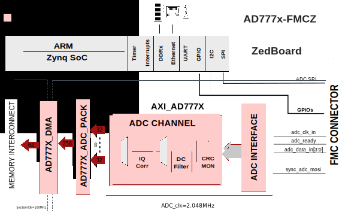

.. _ad777x_fmcz:

AD777X-FMCZ HDL project
===============================================================================

Overview
-------------------------------------------------------------------------------

The EVAL-AD7770 / EVAL-AD7771 / EVAL-AD7779 evaluation kit
features the :adi:`AD7770`, :adi:`AD7771`, and :adi:`AD7779` 24-bit,
analog-to-digital converters (ADCs).

The AD777x is an 8-channel, simultaneous sampling analog-to-digital converter
(ADC). Eight full Σ-Δ ADCs are on-chip. The AD777x provides an ultralow input
current to allow direct sensor connection. Each input channel has a
programmable gain stage allowing gains of 1, 2, 4, and 8 to map lower amplitude
sensor outputs into the full-scale ADC input range, maximizing the dynamic
range of the signal chain.

Supported boards
-------------------------------------------------------------------------------

- :adi:`EVAL-AD7770/1/9 <EVAL-AD7770-AD7779>`

Supported devices
-------------------------------------------------------------------------------

- :adi:`AD7770`
- :adi:`AD7771`
- :adi:`AD7779`

Supported carriers
-------------------------------------------------------------------------------

.. list-table::
   :widths: 35 35 30
   :header-rows: 1

   * - Evaluation board
     - Carrier
     - FMC slot
   * - EVAL-AD7770-ARDZ
     - `ZedBoard <https://digilent.com/shop/zedboard-zynq-7000-arm-fpga-soc-development-board>`__
     - FMC LPC
   * - EVAL-AD7771-ARDZ
     - `ZedBoard <https://digilent.com/shop/zedboard-zynq-7000-arm-fpga-soc-development-board>`__
     - FMC LPC
   * - EVAL-AD7779-ARDZ
     - `ZedBoard <https://digilent.com/shop/zedboard-zynq-7000-arm-fpga-soc-development-board>`__
     - FMC LPC

Block design
-------------------------------------------------------------------------------

Block diagram
~~~~~~~~~~~~~~~~~~~~~~~~~~~~~~~~~~~~~~~~~~~~~~~~~~~~~~~~~~~~~~~~~~~~~~~~~~~~~~~

The data path and clock domains are depicted in the below diagram:

Clock scheme
~~~~~~~~~~~~~~~~~~~~~~~~~~~~~~~~~~~~~~~~~~~~~~~~~~~~~~~~~~~~~~~~~~~~~~~~~~~~~~~

CPU/Memory interconnects addresses
~~~~~~~~~~~~~~~~~~~~~~~~~~~~~~~~~~~~~~~~~~~~~~~~~~~~~~~~~~~~~~~~~~~~~~~~~~~~~~~

==============  ===========
Instance        Zynq
==============  ===========
axi_ad777x_adc  0x43C0_0000
ad777x_dma      0x7C48_0000
==============  ===========

SPI connections
~~~~~~~~~~~~~~~~~~~~~~~~~~~~~~~~~~~~~~~~~~~~~~~~~~~~~~~~~~~~~~~~~~~~~~~~~~~~~~~

.. list-table::
   :widths: 25 25 25 25
   :header-rows: 1

   * - SPI type
     - SPI manager instance
     - SPI subordinate
     - CS
   * - PS
     - SPI 0
     - AD777x
     - 0

GPIOs
~~~~~~~~~~~~~~~~~~~~~~~~~~~~~~~~~~~~~~~~~~~~~~~~~~~~~~~~~~~~~~~~~~~~~~~~~~~~~~~

.. list-table::
   :widths: 25 25 25 25
   :header-rows: 2

   * - GPIO signal
     - Direction
     - HDL GPIO EMIO
     - Software GPIO
   * -
     - (from FPGA view)
     -
     - Zynq-7000
   * - RESET_N
     - OUT
     - 39
     - 93
   * - GPIO2
     - INOUT
     - 38
     - 92
   * - SDP_MCLK
     - OUT
     - 35
     - 89
   * - SDP_CONVST
     - OUT
     - 34
     - 88
   * - START_N
     - OUT
     - 33
     - 87
   * - ALERT
     - IN
     - 32
     - 86

Interrupts
~~~~~~~~~~~~~~~~~~~~~~~~~~~~~~~~~~~~~~~~~~~~~~~~~~~~~~~~~~~~~~~~~~~~~~~~~~~~~~~

================ === ========== ===========
Instance name    HDL Linux Zynq Actual Zynq
================ === ========== ===========
ad777x_dma       10  54         86
================ === ========== ===========

Building the HDL project
-------------------------------------------------------------------------------

The design is built upon ADI's generic HDL reference design framework.
ADI distributes the bit/elf files of these projects as part of the
:dokuwiki:`ADI Kuiper Linux <resources/tools-software/linux-software/kuiper-linux>`.
If you want to build the sources, ADI makes them available on the
:git-hdl:`HDL repository </>`. To get the source you must
`clone <https://git-scm.com/book/en/v2/Git-Basics-Getting-a-Git-Repository>`__
the HDL repository.

**Linux/Cygwin/WSL**

Building the ZedBoard project:

.. shell::

   $cd hdl/projects/ad777x_fmcz/zed
   $make

A more comprehensive build guide can be found in the :ref:`build_hdl` user guide.

Resources
-------------------------------------------------------------------------------

Hardware related
~~~~~~~~~~~~~~~~~~~~~~~~~~~~~~~~~~~~~~~~~~~~~~~~~~~~~~~~~~~~~~~~~~~~~~~~~~~~~~~

- Product datasheets:

  - :adi:`AD7770`
  - :adi:`AD7771`
  - :adi:`AD7779`

HDL related
~~~~~~~~~~~~~~~~~~~~~~~~~~~~~~~~~~~~~~~~~~~~~~~~~~~~~~~~~~~~~~~~~~~~~~~~~~~~~~~

- :git-hdl:`AD777X-FMCZ HDL project source code <projects/ad777x_fmcz>`

.. list-table::
   :widths: 30 35 35
   :header-rows: 1

   * - IP name
     - Source code link
     - Documentation link
   * - AXI_AD777x
     - :git-hdl:`library/axi_ad777x`
     - :ref:`axi_ad777x`
   * - AXI_CLKGEN
     - :git-hdl:`library/axi_clkgen`
     - :ref:`axi_clkgen`
   * - AXI_DMAC
     - :git-hdl:`library/axi_dmac`
     - :ref:`axi_dmac`
   * - AXI_HDMI_TX
     - :git-hdl:`library/axi_hdmi_tx`
     - :ref:`axi_hdmi_tx`
   * - AXI_I2S_ADI
     - :git-hdl:`library/axi_i2s_adi`
     - —
   * - AXI_SPDIF_TX
     - :git-hdl:`library/axi_spdif_tx`
     - 	—
   * - AXI_SYSID
     - :git-hdl:`library/axi_sysid`
     - :ref:`axi_sysid`
   * - SYSID_ROM
     - :git-hdl:`library/sysid_rom`
     - :ref:`axi_sysid`
   * - UTIL_I2C_MIXER
     - :git-hdl:`library/util_i2c_mixer`
     - 	—
   * - UTIL_CPACK2
     - :git-hdl:`library/util_pack/util_cpack2`
     - :ref:`util_cpack2`

.. include:: ../common/more_information.rst

.. include:: ../common/support.rst
