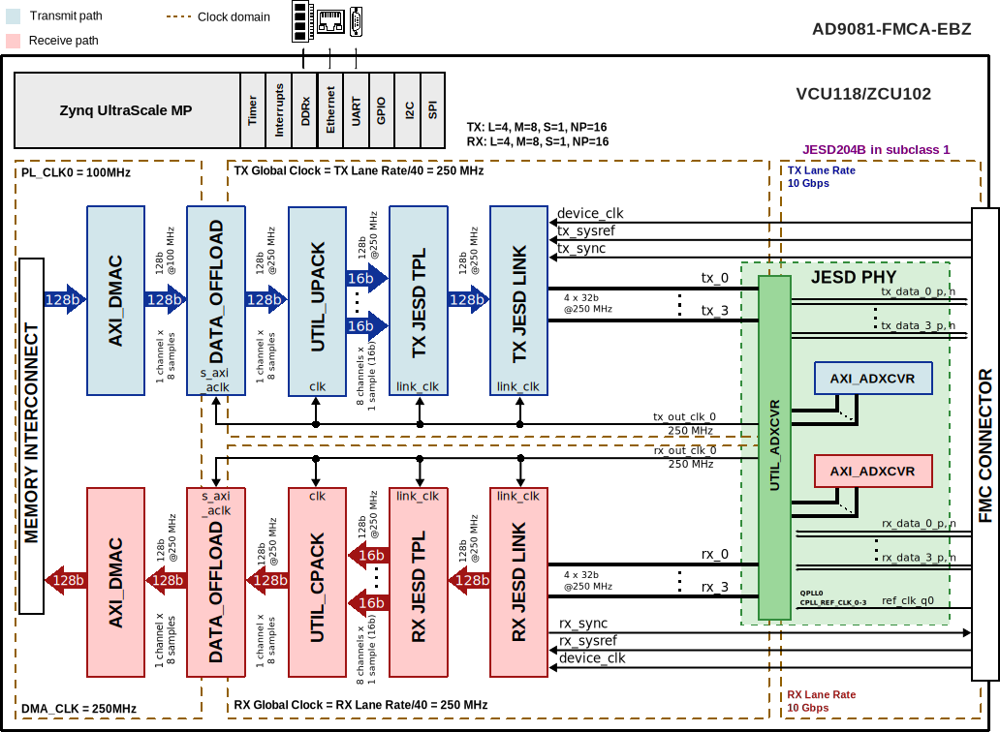
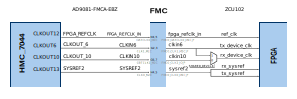
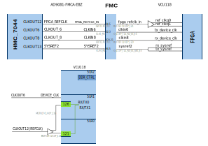

.. _ad9081_fmca_ebz:

AD9081/AD9082/AD9986/AD9988 HDL project
===============================================================================

Overview
-------------------------------------------------------------------------------

The :adi:`AD9081-FMCA-EBZ <EVAL-AD9081>` / :adi:`AD9082-FMCA-EBZ <EVAL-AD9082>`
reference design (also known as Single MxFE) is a processor based
(e.g. Microblaze) embedded system.
This reference design works with :adi:`EVAL-AD9986` and
:adi:`EVAL-AD9988` as well.
The design consists from a receive and a transmit chain.

The receive chain transports the captured samples from ADC to the system
memory (DDR). Before transferring the data to DDR the samples are stored
in a buffer implemented on block rams from the FPGA fabric
(:git-hdl:`util_adcfifo <library/util_adcfifo>`).
The space allocated in the buffer for each channel
depends on the number of currently active channels. It goes up to M x
64k samples if a single channel is selected or 64k samples per channel
if all channels are selected.

The transmit chain transports samples from the system memory to the DAC
devices. Before streaming out the data to the DAC through the JESD link
the samples first are loaded into a buffer
(:git-hdl:`util_dacfifo <library/util_dacfifo>`) which will
cyclically stream the samples at the tx_device_clk data rate. The space
allocated in the transmit buffer for each channel depends on the number
of currently active channels. It goes up to M x 64k samples if a single
channel is selected or 64k samples per channel if all channels are
selected.

All cores from the receive and transmit chains are programmable through
an AXI-Lite interface.

The transmit and receive chains can operate at different data rates
having separate rx_device_clk/tx_device_clk and corresponding lane rates
but must share the same reference clock.

Supported boards
-------------------------------------------------------------------------------

- :adi:`AD9081-FMCA-EBZ <EVAL-AD9081>`
- :adi:`AD9082-FMCA-EBZ <EVAL-AD9082>`
- :adi:`EVAL-AD9988`
- :adi:`EVAL-AD9986`

Supported devices
-------------------------------------------------------------------------------

- :adi:`AD9081`
- :adi:`AD9082`
- :adi:`AD9986`
- :adi:`AD9988`

Supported carriers
-------------------------------------------------------------------------------

.. note::

   :adi:`EVAL-AD9988` can be an alternative to
   :adi:`AD9081-FMCA-EBZ <EVAL-AD9081>` and :adi:`EVAL-AD9986`
   can be an alternative to :adi:`AD9082-FMCA-EBZ <EVAL-AD9082>`.

   Both :adi:`AD9081` and :adi:`AD9988` have MxFE Quad, 16-bit, 12 GSPS RF DAC
   & Quad, 12-bit, 4 GSPS RF ADC,

   The same goes for :adi:`AD9082` and :adi:`AD9986`, both have MxFE Quad,
   16-bit, 12 GSPS RF DAC & Dual, 12-bit, 6 GSPS RF ADC.

.. list-table::
   :widths: 35 35 30
   :header-rows: 1

   * - Evaluation board
     - Carrier
     - FMC slot
   * - :adi:`AD9081-FMCA-EBZ <EVAL-AD9081>`
     - :intel:`A10SoC <content/www/us/en/products/details/fpga/development-kits/arria/10-sx.html>`
     - FMCA
   * -
     - :intel:`FM87 <content/www/us/en/products/details/fpga/development-kits/agilex/si-agi027.html>`
     - FMCA
   * -
     - :xilinx:`VCK190`
     - FMCP1 (J51)
   * -
     - :xilinx:`VPK180`
     - FMCP1
   * -
     - :xilinx:`VCU118`
     - FMC+
   * -
     - :xilinx:`VCU128` *
     - FMC+
   * -
     - :xilinx:`ZCU102`
     - FMC HPC0
   * -
     - :xilinx:`ZC706`
     - FMC HPC

.. admonition:: Legend
   :class: note

   - ``*`` removed; last release that supports this project on this carrier is
     :git-hdl:`hdl_2023_r2 <hdl_2023_r2:projects/ad9081_fmca_ebz/vcu128>`

.. list-table::
   :widths: 35 35 30
   :header-rows: 1

   * - Evaluation board
     - Carrier
     - FMC slot
   * - :adi:`AD9082-FMCA-EBZ <EVAL-AD9082>`
     - :xilinx:`VCK190`
     - FMCP1 (J51)
   * -
     - :xilinx:`VPK180`
     - FMCP1
   * -
     - :xilinx:`VCU118`
     - FMC+
   * -
     - :xilinx:`ZCU102`
     - FMC HPC0
   * -
     - :xilinx:`ZC706`
     - FMC HPC

.. warning::

   When using
   :intel:`A10SoC <content/www/us/en/products/details/fpga/development-kits/arria/10-sx.html>`
   in your setup, the following reworks are required **on the evaluation
   board**:

   - To avoid using an external clock source and fully rely on the HMC7044
     clock chip, rotate the C6D/C4D caps in C5D/C3D position
     (Please note: In the latest version of the board, this is now the
     default configuration, so this configuration step **might not
     be needed anymore**).
   - If LEDS V1P0_LED and VINT_LED are not on, please **depopulate R22M
     and populate R2M**

   For the carrier,
   :intel:`A10SoC <content/www/us/en/products/details/fpga/development-kits/arria/10-sx.html>`,
   the following reworks are mandatory:
   :dokuwiki:`[Wiki] FMC Pin Connection Configuration <resources/eval/user-guides/ad9081/quickstart/a10soc#fmc_pin_connection_configuration_change>`

.. warning::
   For
   :intel:`FM87 <content/www/us/en/products/details/fpga/development-kits/agilex/si-agi027.html>`
   setups, the following reworks are required on the evaluation board:

   - C39B, C40B: 50 ohm

   For the carrier
   :intel:`FM87 <content/www/us/en/products/details/fpga/development-kits/agilex/si-agi027.html>`,
   the following reworks are required:

   - R1433, R1434: 50 ohm
   - R1777, R1778: 50 ohm
   - C2488, C4289:  0 ohm
   - R1231, R1234: 1k ohm
   - R1230, R1233: 1k ohm

Block design
-------------------------------------------------------------------------------

Block diagram
~~~~~~~~~~~~~~~~~~~~~~~~~~~~~~~~~~~~~~~~~~~~~~~~~~~~~~~~~~~~~~~~~~~~~~~~~~~~~~~

The data path and clock domains are depicted in the below diagrams:

Example block design for Single link; M=8; L=4
^^^^^^^^^^^^^^^^^^^^^^^^^^^^^^^^^^^^^^^^^^^^^^^^^^^^^^^^^^^^^^^^^^^^^^^^^^^^^^^

The Rx links (ADC Path) operate with the following parameters:

- Rx Deframer parameters: L=4, M=8, F=4, S=1, NP=16, N=16 (Quick Config 0x0A)
- Sample Rate: 250 MSPS
- Dual link: No
- RX_DEVICE_CLK: 250 MHz (Lane Rate/40)
- REF_CLK: 500MHz (Lane Rate/20)
- JESD204B Lane Rate: 10Gbps
- QPLL0 or CPLL

The Tx links (DAC Path) operate with the following parameters:

- Tx Framer parameters: L=4, M=8, F=4, S=1, NP=16, N=16 (Quick Config 0x09)
- Sample Rate: 250 MSPS
- Dual link: No
- TX_DEVICE_CLK: 250 MHz (Lane Rate/40)
- REF_CLK: 500MHz (Lane Rate/20)
- JESD204B Lane Rate: 10Gbps
- QPLL0 or CPLL

If AD9081-FMCA-EBZ has an 122.88MHz local oscillator, then the Lane rate will
be 9.8304 Gbps and the Global clocks = 245.76 MHz.

Corresponding device tree:
:git-linux:`zynqmp-zcu102-rev10-ad9081.dts <arch/arm64/boot/dts/xilinx/zynqmp-zcu102-rev10-ad9081.dts>`.

Example block design for Single link; M=4; L=8
^^^^^^^^^^^^^^^^^^^^^^^^^^^^^^^^^^^^^^^^^^^^^^^^^^^^^^^^^^^^^^^^^^^^^^^^^^^^^^^

.. image:: ad9081_204b_M4L8.svg
   :width: 800
   :align: center
   :alt: AD9081-FMCA-EBZ JESD204B M=4 L=8 block diagram

The Rx links are set for full bandwidth mode and operate with the
following parameters:

- Rx Deframer parameters: L=8, M=4, F=1, S=1, NP=16, N=16 (Quick Config 0x12)
- Sample Rate: 1550 MSPS
- Dual link: No
- RX_DEVICE_CLK: 387.5 MHz (Lane Rate/40)
- REF_CLK: 775MHz (Lane Rate/20)
- JESD204B Lane Rate: 15.5Gbps
- QPLL0

The Tx links are set for full bandwidth mode and operate with the
following parameters:

- Tx Framer parameters: L=8, M=4, F=1, S=1, NP=16, N=16 (Quick Config 0x11)
- Sample Rate: 1550 MSPS
- Dual link: No
- TX_DEVICE_CLK: 387.5 MHz (Lane Rate/40)
- REF_CLK: 775MHz (Lane Rate/20)
- JESD204B Lane Rate: 15.5Gbps
- QPLL0

Example block design for Single link; M=2; L=8; JESD204C
^^^^^^^^^^^^^^^^^^^^^^^^^^^^^^^^^^^^^^^^^^^^^^^^^^^^^^^^^^^^^^^^^^^^^^^^^^^^^^^

.. note::

   In 2019_R2 release, the AMD JESD Physical layer IP Core is used,
   however in newer versions it is replaced with ADI's util_adxcvr IP core.

.. image:: ad9081_204c_M2L8.svg
   :width: 800
   :align: center
   :alt: AD9081-FMCA-EBZ JESD204C M=2 L=8 block diagram

.. warning::

   **Build instructions:**

   The project must be built with the following parameters:

   .. shell:: bash

      $make JESD_MODE=64B66B \
      $     RX_LANE_RATE=16.5 \
      $     TX_LANE_RATE=16.5 \
      $     RX_JESD_M=2       \
      $     RX_JESD_L=8       \
      $     RX_JESD_S=2       \
      $     RX_JESD_NP=16     \
      $     TX_JESD_M=2       \
      $     TX_JESD_L=8       \
      $     TX_JESD_S=4       \
      $     TX_JESD_NP=8

  In the case of :adi:`VCU118` board, a CORUNDUM parameter is also available,
  which enables or disables the Corundum Network Stack. By default it is
  disabled, set to 0. To enable it, set the value to 1.

The Rx link is operating with the following parameters:

- Rx Deframer parameters: L=8, M=2, F=1, S=2, NP=16, N=16 (Quick Config 0x13)
- Sample Rate: 4000 MSPS
- Dual link: No
- RX_DEVICE_CLK: 250 MHz (Lane Rate/66)
- REF_CLK: 500 MHz (Lane Rate/33)
- JESD204C Lane Rate: 16.5Gbps
- QPLL1

The Tx link is operating with the following parameters:

- Tx Framer parameters: L=8, M=2, F=1, S=4, NP=8, N=8 (Quick Config 0x13)
- Sample Rate: 8000 MSPS
- Dual link: No
- TX_DEVICE_CLK: 250 MHz (Lane Rate/66)
- REF_CLK: 500 MHz (Lane Rate/33)
- JESD204C Lane Rate: 16.5Gbps
- QPLL1

Configuration modes
~~~~~~~~~~~~~~~~~~~~~~~~~~~~~~~~~~~~~~~~~~~~~~~~~~~~~~~~~~~~~~~~~~~~~~~~~~~~~~~

The block design supports configuration of parameters and scales.

We have listed a couple of examples at section
`Building the HDL project`_ and the default modes
for each project.

.. note::

   The parameters for Rx or Tx links can be changed from the
   **system_project.tcl** file, located in
   hdl/projects/ad9081_fmca_ebz/$CARRIER/system_project.tcl

.. important::

   For JESD204B:

   .. math::

      Lane Rate = \frac{IQ Sample Rate * M * NP * \frac{10}{8}}{L}

   For JESD204C:

   .. math::

      Lane Rate = \frac{IQ Sample Rate * M * NP * \frac{66}{64}}{L}

The following are the parameters of this project that can be configured:

- JESD_MODE: used link layer encoder mode

  - 64B66B - 64b66b link layer defined in JESD204C, uses AMD IP as Physical
    Layer
  - 8B10B - 8b10b link layer defined in JESD204B, uses ADI IP as Physical
    Layer
- RX_LANE_RATE: lane rate of the Rx link (MxFE to FPGA)
- TX_LANE_RATE: lane rate of the Tx link (FPGA to MxFE)
- REF_CLK_RATE: the rate of the reference clock
- DEVICE_CLK_RATE: the rate of the device clock (Intel only)
- [RX/TX]_JESD_M: number of converters per link
- [RX/TX]_JESD_L: number of lanes per link
- [RX/TX]_JESD_S: number of samples per frame
- [RX/TX]_JESD_NP: number of bits per sample
- [RX/TX]_NUM_LINKS: number of links
- [RX/TX]_TPL_WIDTH
- TDD_SUPPORT: set to 1, adds the TDD; enables external synchronization
  through TDD. Must be set to 1 when SHARED_DEVCLK=1
- SHARED_DEVCLK
- TDD_CHANNEL_CNT
- TDD_SYNC_WIDTH
- TDD_SYNC_INT
- TDD_SYNC_EXT
- TDD_SYNC_EXT_CDC: if enabled, the CDC circuitry for the external sync signal
  is added
- [RX/TX]_KS_PER_CHANNEL: Number of samples stored in internal buffers in
  kilosamples per converter (M)
- [ADC/DAC]_DO_MEM_TYPE
- Check out this guide on more details regarding these parameters: :ref:`axi_tdd`
- CORUNDUM: enables the Corundum Network Stack

Clock scheme
~~~~~~~~~~~~~~~~~~~~~~~~~~~~~~~~~~~~~~~~~~~~~~~~~~~~~~~~~~~~~~~~~~~~~~~~~~~~~~~

The clock sources depend on the carrier that is used:

:xilinx:`ZCU102`
^^^^^^^^^^^^^^^^^^^^^^^^^^^^^^^^^^^^^^^^^^^^^^^^^^^^^^^^^^^^^^^^^^^^^^^^^^^^^^^

:xilinx:`VCU118`
^^^^^^^^^^^^^^^^^^^^^^^^^^^^^^^^^^^^^^^^^^^^^^^^^^^^^^^^^^^^^^^^^^^^^^^^^^^^^^^

Limitations
^^^^^^^^^^^^^^^^^^^^^^^^^^^^^^^^^^^^^^^^^^^^^^^^^^^^^^^^^^^^^^^^^^^^^^^^^^^^^^^

.. warning::

   For the parameter selection, the following restrictions apply:

   - NP = 8, 12, 16
   - F = 1, 2, 3, 4, 6, 8
   - :ref:`JESD204B/C Link Rx peripheral > restrictions <axi_jesd204_rx restrictions>`
   - :ref:`JESD204B/C Link Tx peripheral > restrictions <axi_jesd204_tx restrictions>`

CPU/Memory interconnects addresses
~~~~~~~~~~~~~~~~~~~~~~~~~~~~~~~~~~~~~~~~~~~~~~~~~~~~~~~~~~~~~~~~~~~~~~~~~~~~~~~

The addresses are dependent on the architecture of the FPGA, having an offset
added to the base address from HDL (see more at :ref:`architecture cpu-intercon-addr`).

Depending on the values of parameters $INTF_CFG, $ADI_PHY_SEL and $TDD_SUPPORT,
some IPs are instatiated and some are not.

Check-out the table below to find out the conditions.

==================== ================================= =============== =========== ============
Instance             Depends on parameter              Zynq/Microblaze ZynqMP      Versal
==================== ================================= =============== =========== ============
axi_mxfe_rx_xcvr     $INTF_CFG!="TX" & $ADI_PHY_SEL==1 0x44A6_0000     0x84A6_0000 0xA4A6_00000
rx_mxfe_tpl_core     $INTF_CFG!="TX"                   0x44A1_0000     0x84A1_0000 0xA4A1_00000
axi_mxfe_rx_jesd     $INTF_CFG!="TX"                   0x44A9_0000     0x84A9_0000 0xA4A9_00000
axi_mxfe_rx_dma      $INTF_CFG!="TX"                   0x7C42_0000     0x9C42_0000 0xBC42_00000
mxfe_rx_data_offload $INTF_CFG!="TX"                   0x7C45_0000     0x9C45_0000 0xBC45_00000
axi_mxfe_tx_xcvr     $INTF_CFG!="RX" & $ADI_PHY_SEL==1 0x44B6_0000     0x84B6_0000 0xA4B6_00000
tx_mxfe_tpl_core     $INTF_CFG!="RX"                   0x44B1_0000     0x84B1_0000 0xA4B1_00000
axi_mxfe_tx_jesd     $INTF_CFG!="RX"                   0x44B9_0000     0x84B9_0000 0xA4B9_00000
axi_mxfe_tx_dma      $INTF_CFG!="RX"                   0x7C43_0000     0x9C43_0000 0xBC43_00000
mxfe_tx_data_offload $INTF_CFG!="RX"                   0x7C44_0000     0x9C44_0000 0xBC44_00000
axi_tdd_0            $TDD_SUPPORT==1                   0x7C46_0000     0x9C46_0000 0xBC46_00000
==================== ================================= =============== =========== ============

In case of :adi:`VCU118`, additional CPU interconnects may be present in the
system.

=================== ==================== ===========
Instance            Depends on parameter Microblaze
=================== ==================== ===========
corundum_core       $CORUNDUM==1         0x5000_0000
corundum_gpio_reset $CORUNDUM==1         0x5200_0000
=================== ==================== ===========

For the Intel carriers, only a part of the CPU interrupts are specified,
as the rest depend on the values of $TX_NUM_OF_LANES and $TRANSCEIVER_TYPE
(see :git-hdl:`projects/ad9081_fmca_ebz/common/ad9081_fmca_ebz_qsys.tcl`
for more details).

===============================  ===========
Instance                         Intel
===============================  ===========
mxfe_rx_jesd204.link_reconfig    0x000C_0000
mxfe_rx_jesd204.link_management  0x000C_4000
mxfe_tx_jesd204.link_reconfig    0x000C_8000
mxfe_tx_jesd204.link_management  0x000C_C000
mxfe_rx_tpl.s_axi                0x000D_2000
mxfe_tx_tpl.s_axi                0x000D_4000
mxfe_rx_dma.s_axi                0x000D_8000
mxfe_tx_dma.s_axi                0x000D_C000
mxfe_gpio.s1                     0x000E_0000
===============================  ===========

SPI connections
~~~~~~~~~~~~~~~~~~~~~~~~~~~~~~~~~~~~~~~~~~~~~~~~~~~~~~~~~~~~~~~~~~~~~~~~~~~~~~~

.. list-table::
   :widths: 25 25 25 25
   :header-rows: 1

   * - SPI type
     - SPI manager instance
     - SPI subordinate
     - CS
   * - PS
     - spi0
     - AD9081
     - 0
   * - PS
     - spi1
     - HMC7044
     - 0

GPIOs
~~~~~~~~~~~~~~~~~~~~~~~~~~~~~~~~~~~~~~~~~~~~~~~~~~~~~~~~~~~~~~~~~~~~~~~~~~~~~~~

===========  =========  =======  =========  ===================  ======
GPIO signal  Direction  HDL no.  Zynq-7000  Zynq UltraScale+ MP  Versal
===========  =========  =======  =========  ===================  ======
txen[1:0]    OUT        59:58    113:112    137:136              27:26
rxen[1:0]    OUT        57:56    111:110    135:134              25:24
rstb         OUT        55       109        133                  23
hmc_sync     OUT        54       108        132                  22
irqb[1:0]    IN         53:52    107:106    131:130              21:20
agc3[1:0]    IN         51:50    105:104    129:128              19:18
agc2[1:0]    IN         49:48    103:102    127:126              17:16
agc1[1:0]    IN         47:46    101:100    125:124              15:14
agc0[1:0]    IN         45:44    99:98      123:122              13:12
hmc_gpio1    INOUT      43       97         121                  11
gpio[10:0]   INOUT      42:32    96:86      120:110              10:0
===========  =========  =======  =========  ===================  ======

.. admonition:: Legend
   :class: note

   - GPIO signal = name of the GPIO in the HDL project
   - Direction = from the FPGA point of view
   - HDL no. = HDL GPIO EMIO
   - Zynq-7000, Zynq UltraScale+ MP, Versal are Software GPIOs, to be used in
     device trees

Interrupts
~~~~~~~~~~~~~~~~~~~~~~~~~~~~~~~~~~~~~~~~~~~~~~~~~~~~~~~~~~~~~~~~~~~~~~~~~~~~~~~

Below are the Programmable Logic interrupts used in this project.

================ === ========== =========== ============ =============
Instance name    HDL Linux Zynq Actual Zynq Linux ZynqMP Actual ZynqMP
================ === ========== =========== ============ =============
axi_mxfe_rx_dma  13  57         89          109          141
axi_mxfe_tx_dma  12  56         88          108          140
axi_mxfe_rx_jesd 11  55         87          107          139
axi_mxfe_tx_jesd 10  54         86          106          138
================ === ========== =========== ============ =============

In case of :adi:`VCU118`, additional interrupts may be present in the system.

================ ======
Instance name    HDL MB
================ ======
corundum_core    5
================ ======

Building the HDL project
-------------------------------------------------------------------------------

The design is built upon ADI's generic HDL reference design framework.
ADI distributes the bit/elf files of these projects as part of the
:dokuwiki:`ADI Kuiper Linux <resources/tools-software/linux-software/kuiper-linux>`.
If you want to build the sources, ADI makes them available on the
:git-hdl:`HDL repository </>`. To get the source you must
`clone <https://git-scm.com/book/en/v2/Git-Basics-Getting-a-Git-Repository>`__
the HDL repository.

Then go to the :git-hdl:`projects/ad9081_fmca_ebz` or
(:git-hdl:`projects/ad9082_fmca_ebz`, for :adi:`AD9082-FMCA-EBZ <EVAL-AD9082>`)
location and run the make command by typing in you command prompt:

Example for building the project with parameters:

**Linux/Cygwin/WSL**

.. shell::

   $cd hdl/projects/ad9081_fmca_ebz/zcu102
   $make RX_LANE_RATE=2.5 TX_LANE_RATE=2.5 \
   $     RX_JESD_L=8 RX_JESD_M=4 RX_JESD_S=1 \
   $     RX_JESD_NP=16 TX_JESD_L=8 TX_JESD_M=4 \
   $     TX_JESD_S=1 TX_JESD_NP=16

The following dropdowns contain tables with the parameters that can be used to
configure this project, depending on the carrier used.
Where a cell contains a --- (dash) it means that the parameter doesn't exist
for that project (ad9081_fmca_ebz/$carrier or ad9082_fmca_ebz/$carrier).

.. warning::

   For the parameter selection, the following restrictions apply:

   - NP = 8, 12, 16
   - F = 1, 2, 3, 4, 6, 8
   - :ref:`JESD204B/C Link Rx peripheral > restrictions <axi_jesd204_rx restrictions>`
   - :ref:`JESD204B/C Link Tx peripheral > restrictions <axi_jesd204_tx restrictions>`

   ``NP`` notation is equivalent with ``N'``

.. collapsible:: Default values of the ``make`` parameters for AD9081-FMCA-EBZ

   +-------------------+--------------------------------------------------------------------------+
   | Parameter         |      Default value of the parameters depending on carrier                |
   |                   +----------+----------+--------+--------+--------+--------+-------+--------+
   |                   |   A10SoC |     FM87 | VCK190 | VPK180 | VCU118 | VCU128 | ZC706 | ZCU102 |
   +===================+==========+==========+========+========+========+========+=======+========+
   | JESD_MODE         |      --- |   64B66B | 64B66B | 64B66B |  8B10B |  8B10B | 8B10B |  8B10B |
   +-------------------+----------+----------+--------+--------+--------+--------+-------+--------+
   | RX_LANE_RATE      |       10 |       15 |  24.75 |  24.75 |     10 |     10 |    10 |     10 |
   +-------------------+----------+----------+--------+--------+--------+--------+-------+--------+
   | TX_LANE_RATE      |       10 |       15 |  24.75 |  24.75 |     10 |     10 |    10 |     10 |
   +-------------------+----------+----------+--------+--------+--------+--------+-------+--------+
   | REF_CLK_RATE      |      250 |      375 |    375 |    --- |    375 |    --- |   --- |    --- |
   +-------------------+----------+----------+--------+--------+--------+--------+-------+--------+
   | DEVICE_CLK_RATE   |      250 |      375 |    --- |    --- |    --- |    --- |   --- |    --- |
   +-------------------+----------+----------+--------+--------+--------+--------+-------+--------+
   | RX_JESD_M         |        8 |        8 |      8 |      8 |      8 |      8 |     8 |      8 |
   +-------------------+----------+----------+--------+--------+--------+--------+-------+--------+
   | RX_JESD_L         |        4 |        8 |      8 |      8 |      4 |      4 |     4 |      4 |
   +-------------------+----------+----------+--------+--------+--------+--------+-------+--------+
   | RX_JESD_S         |        1 |        1 |      2 |      2 |      1 |      1 |     1 |      1 |
   +-------------------+----------+----------+--------+--------+--------+--------+-------+--------+
   | RX_JESD_NP        |       16 |       16 |     12 |     12 |     16 |     16 |    16 |     16 |
   +-------------------+----------+----------+--------+--------+--------+--------+-------+--------+
   | RX_NUM_LINKS      |        1 |       1  |      1 |      1 |      1 |      1 |     1 |      1 |
   +-------------------+----------+----------+--------+--------+--------+--------+-------+--------+
   | RX_TPL_WIDTH      |      --- |      --- |    --- |    --- |    --- |    --- |   --- |     {} |
   +-------------------+----------+----------+--------+--------+--------+--------+-------+--------+
   | TX_JESD_M         |        8 |        8 |      8 |      8 |      8 |      8 |     8 |      8 |
   +-------------------+----------+----------+--------+--------+--------+--------+-------+--------+
   | TX_JESD_L         |        4 |        8 |      8 |      8 |      4 |      4 |     4 |      4 |
   +-------------------+----------+----------+--------+--------+--------+--------+-------+--------+
   | TX_JESD_S         |        1 |        1 |      2 |      2 |      1 |      1 |     1 |      1 |
   +-------------------+----------+----------+--------+--------+--------+--------+-------+--------+
   | TX_JESD_NP        |       16 |       16 |     12 |     12 |     16 |     16 |    16 |     16 |
   +-------------------+----------+----------+--------+--------+--------+--------+-------+--------+
   | TX_NUM_LINKS      |        1 |        1 |      1 |      1 |      1 |      1 |     1 |      1 |
   +-------------------+----------+----------+--------+--------+--------+--------+-------+--------+
   | TX_TPL_WIDTH      |      --- |      --- |    --- |    --- |    --- |    --- |   --- |     {} |
   +-------------------+----------+----------+--------+--------+--------+--------+-------+--------+
   | TDD_SUPPORT       |      --- |      --- |    --- |    --- |    --- |    --- |   --- |      0 |
   +-------------------+----------+----------+--------+--------+--------+--------+-------+--------+
   | SHARED_DEVCLK     |      --- |      --- |    --- |    --- |    --- |    --- |   --- |      0 |
   +-------------------+----------+----------+--------+--------+--------+--------+-------+--------+
   | TDD_CHANNEL_CNT   |      --- |      --- |    --- |    --- |    --- |    --- |   --- |      2 |
   +-------------------+----------+----------+--------+--------+--------+--------+-------+--------+
   | TDD_SYNC_WIDTH    |      --- |      --- |    --- |    --- |    --- |    --- |   --- |     32 |
   +-------------------+----------+----------+--------+--------+--------+--------+-------+--------+
   | TDD_SYNC_INT      |      --- |      --- |    --- |    --- |    --- |    --- |   --- |      1 |
   +-------------------+----------+----------+--------+--------+--------+--------+-------+--------+
   | TDD_SYNC_EXT      |      --- |      --- |    --- |    --- |    --- |    --- |   --- |      0 |
   +-------------------+----------+----------+--------+--------+--------+--------+-------+--------+
   | TDD_SYNC_EXT_CDC  |      --- |      --- |    --- |    --- |    --- |    --- |   --- |      0 |
   +-------------------+----------+----------+--------+--------+--------+--------+-------+--------+
   | RX_KS_PER_CHANNEL |       16 |       32 |     64 |     64 |     64 |  16384 |   --- |    --- |
   +-------------------+----------+----------+--------+--------+--------+--------+-------+--------+
   | TX_KS_PER_CHANNEL |       16 |       32 |     64 |     64 |     64 |  16384 |   --- |    --- |
   +-------------------+----------+----------+--------+--------+--------+--------+-------+--------+
   | ADC_DO_MEM_TYPE   |      --- |      --- |    --- |    --- |    --- |      2 |   --- |    --- |
   +-------------------+----------+----------+--------+--------+--------+--------+-------+--------+
   | DAC_DO_MEM_TYPE   |      --- |      --- |    --- |    --- |    --- |      2 |   --- |    --- |
   +-------------------+----------+----------+--------+--------+--------+--------+-------+--------+
   | CORUNDUM          |      --- |      --- |    --- |    --- |      0 |    --- |   --- |    --- |
   +-------------------+----------+----------+--------+--------+--------+--------+-------+--------+

.. collapsible:: Default values of the ``make`` parameters for AD9082-FMCA-EBZ

   +-------------------+--------------------------------------------------------+
   | Parameter         | Default value of the parameters                        |
   |                   |            depending on carrier                        |
   |                   +--------+--------+--------+--------------+--------------+
   |                   | VCK190 | VPK180 | VCU118 |        ZC706 |       ZCU102 |
   +===================+========+========+========+==============+==============+
   | JESD_MODE         | 64B66B | 64B66B |  8B10B | :red:`8B10B*`| :red:`8B10B*`|
   +-------------------+--------+--------+--------+--------------+--------------+
   | RX_LANE_RATE      |  24.75 |  24.75 |     15 |           10 |           15 |
   +-------------------+--------+--------+--------+--------------+--------------+
   | TX_LANE_RATE      |  24.75 |  24.75 |     15 |           10 |           15 |
   +-------------------+--------+--------+--------+--------------+--------------+
   | REF_CLK_RATE      |    375 |    375 |    --- |          --- |          --- |
   +-------------------+--------+--------+--------+--------------+--------------+
   | RX_JESD_M         |      4 |      4 |      4 |            8 |            4 |
   +-------------------+--------+--------+--------+--------------+--------------+
   | RX_JESD_L         |      8 |      8 |      8 |            4 |            8 |
   +-------------------+--------+--------+--------+--------------+--------------+
   | RX_JESD_S         |      4 |      4 |      1 |            1 |            1 |
   +-------------------+--------+--------+--------+--------------+--------------+
   | RX_JESD_NP        |     12 |     12 |     16 |           16 |           16 |
   +-------------------+--------+--------+--------+--------------+--------------+
   | RX_NUM_LINKS      |      1 |      1 |      1 |            1 |            1 |
   +-------------------+--------+--------+--------+--------------+--------------+
   | RX_TPL_WIDTH      |    --- |    --- |    --- |          --- |           {} |
   +-------------------+--------+--------+--------+--------------+--------------+
   | TX_JESD_M         |      4 |      4 |      4 |            8 |            4 |
   +-------------------+--------+--------+--------+--------------+--------------+
   | TX_JESD_L         |      8 |      8 |      8 |            4 |            8 |
   +-------------------+--------+--------+--------+--------------+--------------+
   | TX_JESD_S         |      8 |      8 |      1 |            1 |            1 |
   +-------------------+--------+--------+--------+--------------+--------------+
   | TX_JESD_NP        |     12 |     12 |     16 |           16 |           16 |
   +-------------------+--------+--------+--------+--------------+--------------+
   | TX_NUM_LINKS      |      1 |      1 |      1 |            1 |            1 |
   +-------------------+--------+--------+--------+--------------+--------------+
   | TX_TPL_WIDTH      |    --- |    --- |    --- |          --- |           {} |
   +-------------------+--------+--------+--------+--------------+--------------+
   | RX_KS_PER_CHANNEL |     64 |     64 |     64 |          --- |          --- |
   +-------------------+--------+--------+--------+--------------+--------------+
   | TX_KS_PER_CHANNEL |     64 |     64 |     64 |          --- |          --- |
   +-------------------+--------+--------+--------+--------------+--------------+

   .. admonition:: Legend
      :class: note

      ``*`` --- for this carrier only the 8B10B mode is supported

The result of the build, if parameters were used, will be in a folder named
by the configuration used:

if the following command was run

``make RX_LANE_RATE=2.5 TX_LANE_RATE=2.5 RX_JESD_L=8 RX_JESD_M=4 RX_JESD_S=1 RX_JESD_NP=16 TX_JESD_L=8 TX_JESD_M=4 TX_JESD_S=1 TX_JESD_NP=16``

then the folder name will be:

``RXRATE2_5_TXRATE2_5_RXL8_RXM4_RXS1_RXNP16_TXL8_TXM4_TXS1_TXNP16``
because of truncation of some keywords so the name will not exceed the limits
of the Operating System (``JESD``, ``LANE``, etc. are removed) of 260
characters.

In case of the :adi:`VCU118`, if the Corundum Network Stack needs to be added,
run the make command such as:

``make CORUNDUM=1``

.. note::

   Other build parameters may be added to the make command as shown in the
   previous example with multiple prameters when using the Corundum system.

A more comprehensive build guide can be found in the :ref:`build_hdl` user guide.

Software considerations
-------------------------------------------------------------------------------

ADC - crossbar config
~~~~~~~~~~~~~~~~~~~~~~~~~~~~~~~~~~~~~~~~~~~~~~~~~~~~~~~~~~~~~~~~~~~~~~~~~~~~~~~

Due to physical constraints, Rx lanes are reordered as described in the
following table.

e.g physical lane 2 from ADC connects to logical lane 7
from the FPGA. Therefore the crossbar from the device must be set
accordingly.

============ ===========================
ADC phy Lane FPGA Rx lane / Logical Lane
============ ===========================
0            2
1            0
2            7
3            6
4            5
5            4
6            3
7            1
============ ===========================

DAC - crossbar config
~~~~~~~~~~~~~~~~~~~~~~~~~~~~~~~~~~~~~~~~~~~~~~~~~~~~~~~~~~~~~~~~~~~~~~~~~~~~~~~

Due to physical constraints, Tx lanes are reordered as described in the
following table.

e.g physical lane 2 from DAC connects to logical lane 7
from the FPGA. Therefore the crossbar from the device must be set
accordingly.

============ ===========================
DAC phy lane FPGA Tx lane / Logical lane
============ ===========================
0            0
1            2
2            7
3            6
4            1
5            5
6            4
7            3
============ ===========================

Resources
-------------------------------------------------------------------------------

Systems related
~~~~~~~~~~~~~~~~~~~~~~~~~~~~~~~~~~~~~~~~~~~~~~~~~~~~~~~~~~~~~~~~~~~~~~~~~~~~~~~

- :dokuwiki:`[Wiki] AD9081 & AD9082 & AD9988 & AD9986 Prototyping Platform User Guide <resources/eval/user-guides/ad9081_fmca_ebz>`
- Here you can find all the quick start guides on wiki documentation
  :dokuwiki:`[Wiki] AD9081/AD9082/AD9986/AD9988 Quick Start Guides <resources/eval/user-guides/ad9081_fmca_ebz/quickstart>`

Here you can find the quick start guides available for these evaluation boards:

.. list-table::
   :widths: 20 10 20 20 10 10 10
   :header-rows: 1

   * - Evaluation board
     - Zynq-7000
     - Zynq UltraScale+ MP
     - Microblaze
     - Versal
     - Arria 10
     - FM87
   * - AD9081/AD9082/AD9986/AD9988
     - :dokuwiki:`ZC706 <resources/eval/user-guides/ad9081_fmca_ebz/quickstart/zynq>`
     - :dokuwiki:`ZCU102 <resources/eval/user-guides/ad9081_fmca_ebz/quickstart/zynqmp>`
     - :dokuwiki:`VCU118 <resources/eval/user-guides/ad9081_fmca_ebz/quickstart/microblaze>`
     - :dokuwiki:`VCK190/VMK180/VPK180 <resources/eval/user-guides/ad9081_fmca_ebz/quickstart/versal>`
     - :dokuwiki:`A10SoC <resources/eval/user-guides/ad9081/quickstart/a10soc>`
     - :dokuwiki:`FM87 <resources/eval/user-guides/ad9081/quickstart/fm87>`

Hardware related
~~~~~~~~~~~~~~~~~~~~~~~~~~~~~~~~~~~~~~~~~~~~~~~~~~~~~~~~~~~~~~~~~~~~~~~~~~~~~~~

- Product datasheets:

  - :adi:`AD9081`
  - :adi:`AD9082`
  - :adi:`AD9988`
  - :adi:`AD9986`
- `UG-1578, Device User Guide <https://www.analog.com/media/en/technical-documentation/user-guides/ad9081-ad9082-ug-1578.pdf>`__
- `UG-1829, Evaluation Board User Guide <https://www.analog.com/media/en/technical-documentation/user-guides/ad9081-fmca-ebz-9082-fmca-ebz-ug-1829.pdf>`__

HDL related
~~~~~~~~~~~~~~~~~~~~~~~~~~~~~~~~~~~~~~~~~~~~~~~~~~~~~~~~~~~~~~~~~~~~~~~~~~~~~~~

- :git-hdl:`AD9081_FMCA_EBZ HDL project source code <projects/ad9081_fmca_ebz>`
- :git-hdl:`AD9082_FMCA_EBZ HDL project source code <projects/ad9082_fmca_ebz>`

.. list-table::
   :widths: 30 35 35
   :header-rows: 1

   * - IP name
     - Source code link
     - Documentation link
   * - AXI_DMAC
     - :git-hdl:`library/axi_dmac`
     - :ref:`axi_dmac`
   * - AXI_SYSID
     - :git-hdl:`library/axi_sysid`
     - :ref:`axi_sysid`
   * - SYSID_ROM
     - :git-hdl:`library/sysid_rom`
     - :ref:`axi_sysid`
   * - UTIL_CPACK2
     - :git-hdl:`library/util_pack/util_cpack2`
     - :ref:`util_cpack2`
   * - UTIL_UPACK2
     - :git-hdl:`library/util_pack/util_upack2`
     - :ref:`util_upack2`
   * - UTIL_ADXCVR for AMD
     - :git-hdl:`library/xilinx/util_adxcvr`
     - :ref:`util_adxcvr`
   * - AXI_ADXCVR for Intel
     - :git-hdl:`library/intel/axi_adxcvr`
     - :ref:`axi_adxcvr intel`
   * - AXI_ADXCVR for AMD
     - :git-hdl:`library/xilinx/axi_adxcvr`
     - :ref:`axi_adxcvr amd`
   * - AXI_JESD204_RX
     - :git-hdl:`library/jesd204/axi_jesd204_rx`
     - :ref:`axi_jesd204_rx`
   * - AXI_JESD204_TX
     - :git-hdl:`library/jesd204/axi_jesd204_tx`
     - :ref:`axi_jesd204_tx`
   * - JESD204_TPL_ADC
     - :git-hdl:`library/jesd204/ad_ip_jesd204_tpl_adc`
     - :ref:`ad_ip_jesd204_tpl_adc`
   * - JESD204_TPL_DAC
     - :git-hdl:`library/jesd204/ad_ip_jesd204_tpl_dac`
     - :ref:`ad_ip_jesd204_tpl_dac`
   * - CORUNDUM_CORE
     - :git-hdl:`library/corundum/corundum_core`
     - :ref:`corundum_core`
   * - ETHERNET_CORE
     - :git-hdl:`library/corundum/ethernet`
     - :ref:`corundum_ethernet_core`

- :dokuwiki:`[Wiki] Generic JESD204B block designs <resources/fpga/docs/hdl/generic_jesd_bds>`
- :ref:`jesd204`

Software related
~~~~~~~~~~~~~~~~~~~~~~~~~~~~~~~~~~~~~~~~~~~~~~~~~~~~~~~~~~~~~~~~~~~~~~~~~~~~~~~

- :dokuwiki:`[Wiki] AD9081-FMCA-EBZ Linux driver wiki page <resources/tools-software/linux-drivers/iio-mxfe/ad9081>`
- Python support:

  - `AD9081 class documentation <https://analogdevicesinc.github.io/pyadi-iio/devices/adi.ad9081.html>`__
  - `PyADI-IIO documentation <https://analogdevicesinc.github.io/pyadi-iio/>`__

.. include:: ../common/more_information.rst

.. include:: ../common/support.rst
