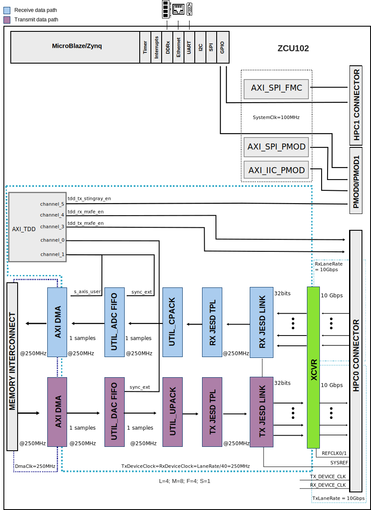

.. _ad9081_fmca_ebz_x_band:

X-Band Platform HDL project
===============================================================================

.. warning::

   This project extends the AD9081-FMCA-EBZ project. This documentation focuses
   on the specific extensions made for this system.

   For a more detailed description of the configuration parameters and system
   capabilities, check the :ref:`ad9081_fmca_ebz` documentation.

Overview
-------------------------------------------------------------------------------

The  :adi:`X-Band Development Platform <x-band-development-platform>` contains
one MxFE® software defined, direct RF sampling transceivers,
:dokuwiki:`X-Band to C-Band Up/Down Converter <resources/eval/user-guides/stingray>`,
and a :dokuwiki:`X/Ku Band analog phased array <resources/eval/user-guides/xud1a>`
proto-typing platform.
The target application is phased array radars, electronic warfare, and
ground-based SATCOM, specifically a X Band 32 transmit/32 receive channel hybrid
beamforming phased array radar.

The :adi:`X-Band Development Platform <x-band-development-platform>` highlights
a complete system solution. It is intended as a testbed for demonstrating hybrid
beamforming phased array radar as well as the implementation of system level
calibrations, beamforming algorithms, and other signal processing algorithms.
The system is designed to mate with a :xilinx:`ZCU102` Evaluation Board from
Xilinx®, which features the Zynq® UltraScale+™ MPSoC FPGA, with provided
reference software, HDL code, and MATLAB system-level interfacing software.

Supported boards
-------------------------------------------------------------------------------

- :adi:`X-Band Phased Array Platform <x-band-development-platform>`
- :adi:`AD9081-FMCA-EBZ <EVAL-AD9081>`
- :dokuwiki:`ADAR1000EVAL1Z (Stingray) <resources/eval/user-guides/stingray>`
- :dokuwiki:`ADXUD1AEBZ <resources/eval/user-guides/xud1a>`

Supported devices
-------------------------------------------------------------------------------

- :adi:`AD9081`
- :adi:`ADAR1000`

Supported carriers
-------------------------------------------------------------------------------

.. list-table::
   :widths: 35 35 30
   :header-rows: 1

   * - Evaluation board
     - Carrier
     - FMC slot
   * - :adi:`X-Band Phased Array Platform <x-band-development-platform>`
     - :xilinx:`ZCU102`
     - FMC HPC0 + FMC HPC1 + PM0D0 + PMOD1

Block design
-------------------------------------------------------------------------------

Block diagram
~~~~~~~~~~~~~~~~~~~~~~~~~~~~~~~~~~~~~~~~~~~~~~~~~~~~~~~~~~~~~~~~~~~~~~~~~~~~~~~

Example block design for Single link; M=8; L=4
^^^^^^^^^^^^^^^^^^^^^^^^^^^^^^^^^^^^^^^^^^^^^^^^^^^^^^^^^^^^^^^^^^^^^^^^^^^^^^^

The Rx links (ADC Path) operate with the following parameters:

- Rx Deframer parameters: L=4, M=8, F=4, S=1, NP=16, N=16 (Quick
   Config 0x0A)
- Sample Rate: 250 MSPS
- Dual link: No
- RX_DEVICE_CLK: 250 MHz (Lane Rate/40)
- REF_CLK: 500MHz (Lane Rate/20)
- JESD204B Lane Rate: 10Gbps
- QPLL0 or CPLL

The Tx links (DAC Path) operate with the following parameters:

- Tx Framer parameters: L=4, M=8, F=4, S=1, NP=16, N=16 (Quick Config
   0x09)
- Sample Rate: 250 MSPS
- Dual link: No
- TX_DEVICE_CLK: 250 MHz (Lane Rate/40)
- REF_CLK: 500MHz (Lane Rate/20)
- JESD204B Lane Rate: 10Gbps
- QPLL0 or CPLL

Configuration modes
~~~~~~~~~~~~~~~~~~~~~~~~~~~~~~~~~~~~~~~~~~~~~~~~~~~~~~~~~~~~~~~~~~~~~~~~~~~~~~~

The following are the parameters of this project that can be configured:

- JESD_MODE: used link layer encoder mode

   - 64B66B - 64b66b link layer defined in JESD204C, uses AMD IP as Physical
      Layer
   - 8B10B  - 8b10b link layer defined in JESD204B, uses ADI IP as Physical
      Layer

- RX_LANE_RATE: lane rate of the Rx link (MxFE to FPGA)
- TX_LANE_RATE: lane rate of the Tx link (FPGA to MxFE)
- [RX/TX]_JESD_M: number of converters per link
- [RX/TX]_JESD_L: number of lanes per link
- [RX/TX]_JESD_S: number of samples per frame
- [RX/TX]_JESD_NP: number of bits per sample
- [RX/TX]_NUM_LINKS: number of links
- TDD_SUPPORT: set to 1, adds the TDD; enables external synchronization through
   TDD. Must be set to 1 when SHARED_DEVCLK=1
- SHARED_DEVCLK
- TDD_CHANNEL_CNT
- TDD_SYNC_WIDTH
- TDD_SYNC_INT
- TDD_SYNC_EXT
- TDD_SYNC_EXT_CDC: if enabled, the CDC circuitry for the external sync signal
   is added
- [RX/TX]_KS_PER_CHANNEL: Number of samples stored in internal buffers in
   kilosamples per converter (M)
- Check out this guide on more details regarding these parameters:
   :ref:`axi_tdd`

CPU/Memory interconnects addresses
~~~~~~~~~~~~~~~~~~~~~~~~~~~~~~~~~~~~~~~~~~~~~~~~~~~~~~~~~~~~~~~~~~~~~~~~~~~~~~~

The addresses are dependent on the architecture of the FPGA, having an offset
added to the base address from HDL (see more at :ref:`architecture cpu-intercon-addr`).

==================== ===========
Instance             ZynqMP
==================== ===========
rx_mxfe_tpl_core     0x84A1_0000
axi_mxfe_rx_xcvr     0x84A6_0000
axi_mxfe_rx_jesd     0x84A9_0000
tx_mxfe_tpl_core     0x84B1_0000
axi_mxfe_tx_xcvr     0x84B6_0000
axi_mxfe_tx_jesd     0x84B9_0000
axi_iic_pmod         0x8510_0000
axi_spi_pmod         0x8520_0000
axi_spi_fmc          0x8530_0000
axi_mxfe_rx_dma      0x9C42_0000
axi_mxfe_tx_dma      0x9C43_0000
mxfe_tx_data_offload 0x9C44_0000
mxfe_rx_data_offload 0x9C45_0000
axi_tdd_0            0x9C46_0000
==================== ===========

I2C connections
~~~~~~~~~~~~~~~~~~~~~~~~~~~~~~~~~~~~~~~~~~~~~~~~~~~~~~~~~~~~~~~~~~~~~~~~~~~~~~~

.. list-table::
   :widths: 20 20 20 20 20 20
   :header-rows: 1

   * - I2C type
     - I2C manager instance
     - Alias
     - Address
     - Device Address
     - I2C subordinate
   * - PL
     - axi_iic
     - axi_i2c_pmod
     - 0x8510_0000
     - 0x6A ``ADDR1=NC,ADDR0=NC``
     - LTC2992

SPI connections
~~~~~~~~~~~~~~~~~~~~~~~~~~~~~~~~~~~~~~~~~~~~~~~~~~~~~~~~~~~~~~~~~~~~~~~~~~~~~~~

.. list-table::
   :widths: 25 25 25 25
   :header-rows: 1

   * - SPI type
     - SPI manager instance
     - SPI subordinate
     - CS
   * - PS
     - spi0
     - AD9081
     - 0
   * - PS
     - spi1
     - HMC7044
     - 0
   * - PL
     - axi_spi_pmod
     - ADAR1000_CSB_1
     - 1
   * - PL
     - axi_spi_pmod
     - ADAR1000_CSB_2
     - 2
   * - PL
     - axi_spi_pmod
     - ADAR1000_CSB_3
     - 3
   * - PL
     - axi_spi_pmod
     - ADAR1000_CSB_4
     - 4
   * - PL
     - axi_spi_pmod
     - LTC2314
     - 5
   * - PL
     - axi_spi_fmc
     - ADF4371
     - 6

GPIOs
~~~~~~~~~~~~~~~~~~~~~~~~~~~~~~~~~~~~~~~~~~~~~~~~~~~~~~~~~~~~~~~~~~~~~~~~~~~~~~~

====================== ================ ============== ==============
GPIO signal            Direction        HDL GPIO EMIO  Software GPIO
                       (from FPGA view)                Zynq MP
====================== ================ ============== ==============
gpio_o_86_ms           OUT              86             163
gpio_o_85_ms           OUT              85             162
pmod0_6_6_RX_LOAD      OUT              84             161
pmod0_5_4_TX_LOAD      OUT              83             160
pmod0_0_1_PA_ON        OUT              81             159
gpio_o_78_ms           OUT              78             155
fmc_bob_xud1_imu_rst   OUT              77             154
tdd_sync               IN               76             153
fmc_bob_xud1_imu_gpio2 INOUT            75             152
fmc_bob_xud1_imu_gpio1 INOUT            74             151
fmc_bob_xud1_imu_gpio0 INOUT            73             150
fmc_bob_xud1_gpio5     INOUT            72             149
fmc_bob_xud1_gpio4     INOUT            71             148
fmc_bob_xud1_gpio3     INOUT            70             147
fmc_bob_xud1_gpio2     INOUT            69             146
fmc_bob_xud1_gpio1     INOUT            68             145
fmc_bob_xud1_gpio0     INOUT            67             144
fpga_syncout_1_n       INOUT            63             141
fpga_syncout_1_p       INOUT            62             140
fpga_syncin_1_n        INOUT            61             139
fpga_syncin_1_p        INOUT            60             138
txen[1:0]              OUT              59:58          137:136
rxen[1:0]              OUT              57:56          135:134
rstb                   OUT              55             133
hmc_sync               OUT              54             132
irqb[1:0]              IN               53:52          131:130
agc3[1:0]              IN               51:50          129:128
agc2[1:0]              IN               49:48          127:126
agc1[1:0]              IN               47:46          125:124
agc0[1:0]              IN               45:44          123:122
hmc_gpio1              INOUT            43             121
gpio[10:0]             INOUT            42:32          120:110
====================== ================ ============== ==============

Interrupts
~~~~~~~~~~~~~~~~~~~~~~~~~~~~~~~~~~~~~~~~~~~~~~~~~~~~~~~~~~~~~~~~~~~~~~~~~~~~~~~

Below are the Programmable Logic interrupts used in this project.

================ ===  ============ =============
Instance name    HDL  Linux ZynqMP Actual ZynqMP
================ ===  ============ =============
axi_spi_pmod     15   111          143
axi_iic_pmod     14   110          142
axi_mxfe_rx_dma  13   109          141
axi_mxfe_tx_dma  12   108          140
axi_mxfe_rx_jesd 11   107          139
axi_mxfe_tx_jesd 10   106          138
axi_spi_fmc      9    105          137
================ ===  ============ =============

Building the HDL project
-------------------------------------------------------------------------------

The design is built upon ADI's generic HDL reference design framework.
ADI distributes the bit/elf files of these projects as part of the
:dokuwiki:`ADI Kuiper Linux <resources/tools-software/linux-software/kuiper-linux>`.
If you want to build the sources, ADI makes them available on the
:git-hdl:`HDL repository </>`. To get the source you must
`clone <https://git-scm.com/book/en/v2/Git-Basics-Getting-a-Git-Repository>`__
the HDL repository.

**Linux/Cygwin/WSL**

.. shell::

   $cd hdl/projects/ad9081_fmca_ebz_x_band/zcu102
   $make

A more comprehensive build guide can be found in the :ref:`build_hdl` user guide.

.. warning::

   All the details regarding the build parameters can be found on the
   :ref:`AD9081/AD9082/AD9986/AD9988 HDL project page <ad9081_fmca_ebz>`

Software considerations
-------------------------------------------------------------------------------

When trying to capture a large amount of data make sure to increase the
max_block_size by using the steps described on the
:dokuwiki:`IIO System Considerations Tips & Tricks page <resources/tools-software/linux-software/libiio_tips_tricks>`.

Resources
-------------------------------------------------------------------------------

Systems related
~~~~~~~~~~~~~~~~~~~~~~~~~~~~~~~~~~~~~~~~~~~~~~~~~~~~~~~~~~~~~~~~~~~~~~~~~~~~~~~

- :dokuwiki:`[Wiki] ADAR1000EVAL1Z (STINGRAY) ANALOG BEAMFORMING FRONT-END  <resources/eval/user-guides/stingray/userguide>`

Hardware related
~~~~~~~~~~~~~~~~~~~~~~~~~~~~~~~~~~~~~~~~~~~~~~~~~~~~~~~~~~~~~~~~~~~~~~~~~~~~~~~

- Product datasheets:

  - :adi:`AD9081`
  - :adi:`ADAR1000`

- :dokuwiki:`[Wiki] X-Band Platform Hardware <resources/eval/user-guides/x-band-platform/hardware>`
- :adi:`AD9081-FMCA-EBZ <EVAL-AD9081>`
- :dokuwiki:`ADAR1000EVAL1Z (Stingray) <resources/eval/user-guides/stingray>`
- :dokuwiki:`ADXUD1AEBZ <resources/eval/user-guides/xud1a>`

HDL related
~~~~~~~~~~~~~~~~~~~~~~~~~~~~~~~~~~~~~~~~~~~~~~~~~~~~~~~~~~~~~~~~~~~~~~~~~~~~~~~

- :git-hdl:`AD9081_FMCA_EBZ_X_BAND HDL project source code <projects/ad9081_fmca_ebz_x_band>`

.. list-table::
   :widths: 30 35 35
   :header-rows: 1

   * - IP name
     - Source code link
     - Documentation link
   * - AXI_DMAC
     - :git-hdl:`library/axi_dmac`
     - :ref:`axi_dmac`
   * - AXI_SYSID
     - :git-hdl:`library/axi_sysid`
     - :ref:`axi_sysid`
   * - AXI_TDD
     - :git-hdl:`library/axi_tdd`
     - :ref:`axi_tdd`
   * - DATA_OFFLOAD
     - :git-hdl:`library/data_offload`
     - :ref:`data_offload`
   * - JESD204_TPL_ADC
     - :git-hdl:`library/jesd204/ad_ip_jesd204_tpl_adc`
     - :ref:`ad_ip_jesd204_tpl_adc`
   * - JESD204_TPL_DAC
     - :git-hdl:`library/jesd204/ad_ip_jesd204_tpl_dac`
     - :ref:`ad_ip_jesd204_tpl_dac`
   * - AXI_JESD204_RX
     - :git-hdl:`library/jesd204/axi_jesd204_rx`
     - :ref:`axi_jesd204_rx`
   * - AXI_JESD204_TX
     - :git-hdl:`library/jesd204/axi_jesd204_tx`
     - :ref:`axi_jesd204_tx`
   * - JESD204
     - :git-hdl:`library/jesd204`
     - :ref:`jesd204`
   * - JESD204_VERSAL_GT_ADAPTER_RX
     - :git-hdl:`library/jesd204/jesd204_versal_gt_adapter_rx`
     - ---
   * - JESD204_VERSAL_GT_ADAPTER_TX
     - :git-hdl:`library/jesd204/jesd204_versal_gt_adapter_tx`
     - ---
   * - SYSID_ROM
     - :git-hdl:`library/sysid_rom`
     - :ref:`axi_sysid`
   * - UTIL_ADCFIFO
     - :git-hdl:`library/util_adcfifo`
     - ---
   * - UTIL_DACFIFO
     - :git-hdl:`library/util_dacfifo`
     - ---
   * - UTIL_DO_RAM
     - :git-hdl:`library/util_do_ram`
     - ---
   * - UTIL_HBM
     - :git-hdl:`library/util_hbm`
     - ---
   * - UTIL_CPACK2
     - :git-hdl:`library/util_pack/util_cpack2`
     - :ref:`util_cpack2`
   * - UTIL_UPACK2
     - :git-hdl:`library/util_pack/util_upack2`
     - :ref:`util_upack2`
   * - AXI_ADXCVR for AMD
     - :git-hdl:`library/xilinx/axi_adxcvr`
     - :ref:`axi_adxcvr amd`
   * - UTIL_ADXCVR for AMD
     - :git-hdl:`library/xilinx/util_adxcvr`
     - :ref:`util_adxcvr`
   * - JESD204_TPL_DAC
     - :git-hdl:`library/jesd204/ad_ip_jesd204_tpl_dac`
     - :ref:`ad_ip_jesd204_tpl_dac`

- :dokuwiki:`[Wiki] Generic JESD204B block designs <resources/fpga/docs/hdl/generic_jesd_bds>`
- :ref:`jesd204`

Software related
~~~~~~~~~~~~~~~~~~~~~~~~~~~~~~~~~~~~~~~~~~~~~~~~~~~~~~~~~~~~~~~~~~~~~~~~~~~~~~~

- :dokuwiki:`[Wiki] X-Band Platform Software  <resources/eval/user-guides/x-band-platform/software>`
- :dokuwiki:`[Wiki] AD9081-FMCA-EBZ Linux driver wiki page <resources/tools-software/linux-drivers/iio-mxfe/ad9081>`

- Stingray devicetrees:

  - :git-linux:`zynqmp-zcu102-rev10-stingray-vcxo100.dts<arch/arm64/boot/dts/xilinx/zynqmp-zcu102-rev10-stingray-vcxo100.dts>`
  - :git-linux:`zynqmp-zcu102-rev10-stingray.dts<arch/arm64/boot/dts/xilinx/zynqmp-zcu102-rev10-stingray.dts>`
  - :git-linux:`zynqmp-zcu102-rev10-stingray-direct-clk.dts<arch/arm64/boot/dts/xilinx/zynqmp-zcu102-rev10-stingray-direct-clk.dts>`
  - :git-linux:`zynqmp-zcu102-rev10-stingray-vcxo100-direct-clk.dts<arch/arm64/boot/dts/xilinx/zynqmp-zcu102-rev10-stingray-vcxo100-direct-clk.dts>`

- Python support:

  - `AD9081 class documentation <https://analogdevicesinc.github.io/pyadi-iio/devices/adi.ad9081.html>`__
  - `PyADI-IIO documentation <https://analogdevicesinc.github.io/pyadi-iio/>`__

.. include:: ../common/more_information.rst

.. include:: ../common/support.rst
