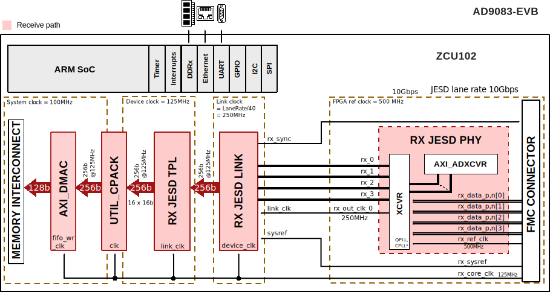
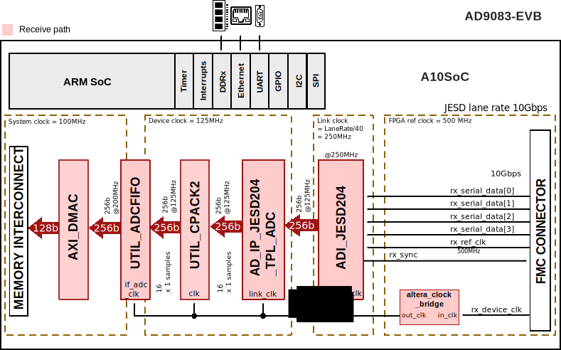

.. _ad9083_evb:

AD9083-EVB HDL Project
===============================================================================

Overview
-------------------------------------------------------------------------------

The :git-hdl:`AD9083_EVB <projects/ad9083_evb>` reference design is a
processor-based embedded system. The design consists of a receive chain; the
receive chain transports the captured samples from ADC to the system memory
(DDR). The :adi:`AD9083-EVB <EVAL-AD9083>` evaluation board includes all the
support circuitry required to operate the :adi:`AD9083` in various modes and
configurations.

The :adi:`AD9083` is a 16-bit, 16 channel with 125 MHz bandwidth per channel
(2 GSPS total) analog-to-digital converter (ADC) featuring an on-chip
programmable, single-pole antialiasing filter and termination resistor that
is designed for low power, small size, and ease of use. The digital outputs
are designed to use the JESD204B standard, in subclass 1 or 0. The current
HDL design supports only subclass 1 operations.

Supported boards
-------------------------------------------------------------------------------

- :adi:`EVAL-AD9083`

Supported devices
-------------------------------------------------------------------------------

- :adi:`AD9083`

Supported carriers
-------------------------------------------------------------------------------

.. list-table::
   :widths: 35 35 30
   :header-rows: 1

   * - Evaluation board
     - Carrier
     - FMC slot
   * - :adi:`AD9083-EVB <EVAL-AD9083>`
     - :intel:`A10SoC <content/www/us/en/products/details/fpga/arria/10/sx/products.html>`
     - FMCA :red:`using FMC extender`
   * -
     - :xilinx:`ZCU102`
     - FMC HPC0

Block design
-------------------------------------------------------------------------------

The digital outputs are designed to use the JESD204B standard, in subclass 1
or 0. The current HDL design supports only subclass 1 operations (deterministic
latency being a system requirement).

Block diagram
~~~~~~~~~~~~~~~~~~~~~~~~~~~~~~~~~~~~~~~~~~~~~~~~~~~~~~~~~~~~~~~~~~~~~~~~~~~~~~~

The data path and clock domains are depicted in the below diagrams:

ZCU102
^^^^^^^^^^^^^^^^^^^^^^^^^^^^^^^^^^^^^^^^^^^^^^^^^^^^^^^^^^^^^^^^^^^^^^^^^^^^^^^

A10SoC
^^^^^^^^^^^^^^^^^^^^^^^^^^^^^^^^^^^^^^^^^^^^^^^^^^^^^^^^^^^^^^^^^^^^^^^^^^^^^^^

Configuration modes
~~~~~~~~~~~~~~~~~~~~~~~~~~~~~~~~~~~~~~~~~~~~~~~~~~~~~~~~~~~~~~~~~~~~~~~~~~~~~~~

The following are the parameters of this project that can be configured,
followed by the default configuration:

- RX_JESD_L: number of lanes per link; by default 4
- RX_JESD_M: number of converters per link; by default 16
- RX_JESD_S: number of samples per frame; by default 1

Other JESD204B output configuration modes can be found in the :adi:`AD9083`
data sheet, at Table 24.

Clock scheme
~~~~~~~~~~~~~~~~~~~~~~~~~~~~~~~~~~~~~~~~~~~~~~~~~~~~~~~~~~~~~~~~~~~~~~~~~~~~~~~

The AD9083 PLL reference clock, the FPGA reference clock and the FPGA global
clock are provided by the on-board :adi:`AD9528` JESD204B clock generator.

The device clock and the link clock have different sources, and in this case,
the link clock is double the device clock.

.. math::
   Lane Rate &= \frac{IQ Sample Rate * M * NP * \frac{10}{8}}{L} = 10Gbps

   Link Clock &= \frac{LaneRate}{40} = 250Mbps

   Device Clock &= \frac{LinkClock}{2} = 125Mbps

CPU/Memory interconnects addresses
~~~~~~~~~~~~~~~~~~~~~~~~~~~~~~~~~~~~~~~~~~~~~~~~~~~~~~~~~~~~~~~~~~~~~~~~~~~~~~~

The addresses are dependent on the architecture of the FPGA, having an offset
added to the base address from HDL (see more at :ref:`architecture cpu-intercon-addr`).

=================== =========== ===========
Instance            ZynqMP      A10Soc
=================== =========== ===========
rx_ad9083_tpl_core  0x84A0_0000 0x0005_0000
axi_ad9083_rx_xcvr  0x84A6_0000 0x0004_8000
axi_ad9083_rx_jesd  0x84AA_0000 0x0004_0000
axi_ad9083_rx_dma   0x9C40_0000 0x0004_C000
=================== =========== ===========

SPI connections
~~~~~~~~~~~~~~~~~~~~~~~~~~~~~~~~~~~~~~~~~~~~~~~~~~~~~~~~~~~~~~~~~~~~~~~~~~~~~~~

.. list-table::
   :widths: 25 25 25 25
   :header-rows: 1

   * - SPI type
     - SPI manager instance
     - SPI subordinate
     - CS
   * - PS
     - SPI 0
     - AD9083
     - 0
   * - PS
     - SPI 0
     - AD9528
     - 1

GPIOs
~~~~~~~~~~~~~~~~~~~~~~~~~~~~~~~~~~~~~~~~~~~~~~~~~~~~~~~~~~~~~~~~~~~~~~~~~~~~~~~

.. list-table::
   :widths: 25 20 20 20 15
   :header-rows: 2

   * - GPIO signal
     - Direction
     - HDL GPIO EMIO
     - Software GPIO
     - Software GPIO
   * -
     - (from FPGA view)
     -
     - Zynq-7000
     - Zynq MP
   * - refsel
     - INOUT
     - 34
     - 181:150
     - 205:174
   * - rstb
     - INOUT
     - 33
     - 149:118
     - 173:142
   * - pwdn
     - INOUT
     - 32
     - 86
     - 110

.. note::

   For A10SoC project, the GPIO numbers coincide with the HDL GPIO EMIO number
   (column 3 from the table).

Interrupts
~~~~~~~~~~~~~~~~~~~~~~~~~~~~~~~~~~~~~~~~~~~~~~~~~~~~~~~~~~~~~~~~~~~~~~~~~~~~~~~

Below are the Programmable Logic interrupts used in this project.

================== === ============ ============= ======
Instance name      HDL Linux ZynqMP Actual ZynqMP A10SoC
================== === ============ ============= ======
axi_ad9083_rx_dma  13  109          141           ---
axi_ad9083_rx_jesd 12  108          140           ---
axi_ad9083_dma     12  ---          ---           31
ad9083_jesd204     11  ---          ---           32
================== === ============ ============= ======

Building the HDL project
-------------------------------------------------------------------------------

The design is built upon ADI's generic HDL reference design framework.
ADI distributes the bit/elf files of these projects as part of the
:dokuwiki:`ADI Kuiper Linux <resources/tools-software/linux-software/kuiper-linux>`.
If you want to build the sources, ADI makes them available on the
:git-hdl:`HDL repository </>`. To get the source you must
`clone <https://git-scm.com/book/en/v2/Git-Basics-Getting-a-Git-Repository>`__
the HDL repository.

Then go to the hdl/projects/$eval_board/$carrier location and run the make
command.

**Linux/Cygwin/WSL**

Building the project on ZCU102 without parameters, will use the default
configuration, meaning L = 4, M = 16 and L = 1.

.. shell::

   $cd hdl/projects/ad9083_evb/zcu102
   $make

Example of running the ``make`` command with parameters:

.. shell::

   $cd hdl/projects/ad9083_evb/zcu102
   $make RX_JESD_L=4 RX_JESD_M=16

The result of the build, if parameters were used, will be in a folder named
by the configuration used:

if the following command was run

``make RX_JESD_L=4 RX_JESD_M=16``

then the folder name will be:

``RXL4_RXM16``
because of truncation of some keywords so the name will not exceed the limits
of the Operating System (``JESD``, ``LANE``, etc. are removed) of 260
characters.

A more comprehensive build guide can be found in the :ref:`build_hdl` user guide.

Resources
-------------------------------------------------------------------------------

Systems related
~~~~~~~~~~~~~~~~~~~~~~~~~~~~~~~~~~~~~~~~~~~~~~~~~~~~~~~~~~~~~~~~~~~~~~~~~~~~~~~

- Another quick start guide using this evaluation board (but not using our HDL
  code) is
  :dokuwiki:`AD9083-EVB evaluation using the ADS80V3EBZ capture board <resources/eval/ad9083>`

Hardware related
~~~~~~~~~~~~~~~~~~~~~~~~~~~~~~~~~~~~~~~~~~~~~~~~~~~~~~~~~~~~~~~~~~~~~~~~~~~~~~~

- Product datasheet: :adi:`AD9083`
- `AD9083-EVB schematic <https://wiki.analog.com/_media/resources/eval/ad9083/02_059760b.pdf>`__

HDL related
~~~~~~~~~~~~~~~~~~~~~~~~~~~~~~~~~~~~~~~~~~~~~~~~~~~~~~~~~~~~~~~~~~~~~~~~~~~~~~~

- :git-hdl:`AD9083-EVB HDL project source code <projects/ad9083_evb>`

.. list-table::
   :widths: 30 35 35
   :header-rows: 1

   * - IP name
     - Source code link
     - Documentation link
   * - AXI_DMAC
     - :git-hdl:`library/axi_dmac`
     - :ref:`axi_dmac`
   * - AXI_SYSID
     - :git-hdl:`library/axi_sysid`
     - :ref:`axi_sysid`
   * - SYSID_ROM
     - :git-hdl:`library/sysid_rom`
     - :ref:`axi_sysid`
   * - UTIL_CPACK2
     - :git-hdl:`library/util_pack/util_cpack2`
     - :ref:`util_cpack2`
   * - UTIL_ADCFIFO
     - :git-hdl:`library/util_adcfifo` *
     - ---
   * - UTIL_ADXCVR
     - :git-hdl:`library/xilinx/util_adxcvr` **
     - :ref:`util_adxcvr`
   * - AXI_ADXCVR
     - :git-hdl:`library/xilinx/axi_adxcvr` **
     - :ref:`axi_adxcvr amd`
   * - AXI_JESD204_RX
     - :git-hdl:`library/jesd204/axi_jesd204_rx`
     - :ref:`axi_jesd204_rx`
   * - JESD204_TPL_ADC
     - :git-hdl:`library/jesd204/ad_ip_jesd204_tpl_adc`
     - :ref:`ad_ip_jesd204_tpl_adc`

.. note::

   - ``*`` - used only in A10SoC project
   - ``**`` - used only in ZCU102 project

- :dokuwiki:`[Wiki] Generic JESD204B block designs <resources/fpga/docs/hdl/generic_jesd_bds>`
- :ref:`jesd204`

Software related
~~~~~~~~~~~~~~~~~~~~~~~~~~~~~~~~~~~~~~~~~~~~~~~~~~~~~~~~~~~~~~~~~~~~~~~~~~~~~~~

- :dokuwiki:`Linux driver documentation <resources/tools-software/linux-drivers/iio-adc/ad9083>`
- AD9083-EVB/ZCU102 Linux device tree :git-linux:`arch/arm64/boot/dts/xilinx/zynqmp-zcu102-rev10-ad9083-fmc-ebz.dts`
- AD9083-EVB/A10SoC Linux device tree :git-linux:`arch/arm/boot/dts/intel/socfpga/socfpga_arria10_socdk_ad9083_fmc_ebz.dts`

.. include:: ../common/more_information.rst

.. include:: ../common/support.rst
