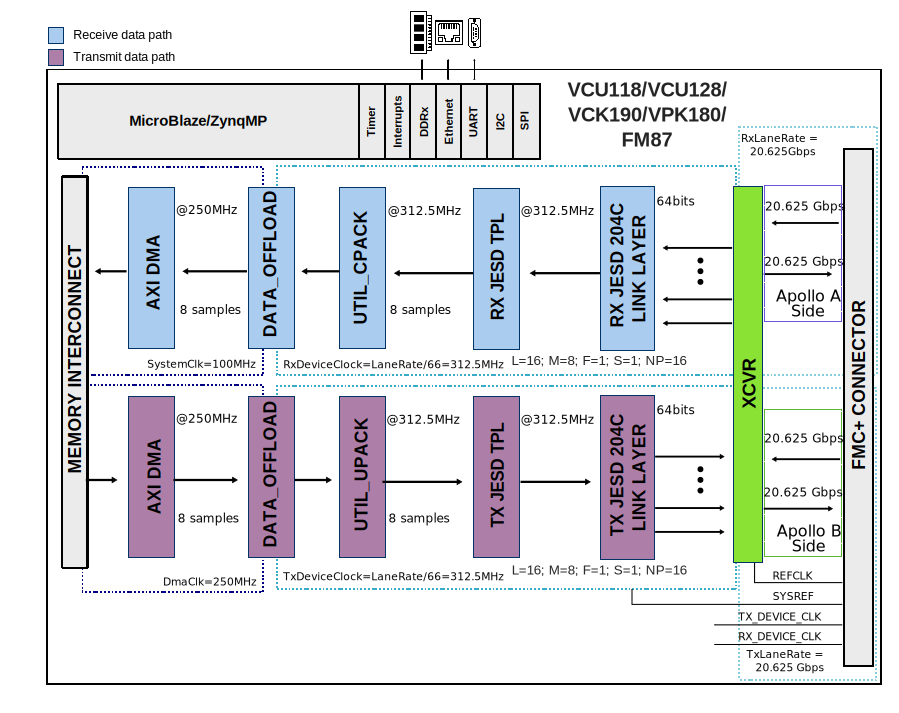
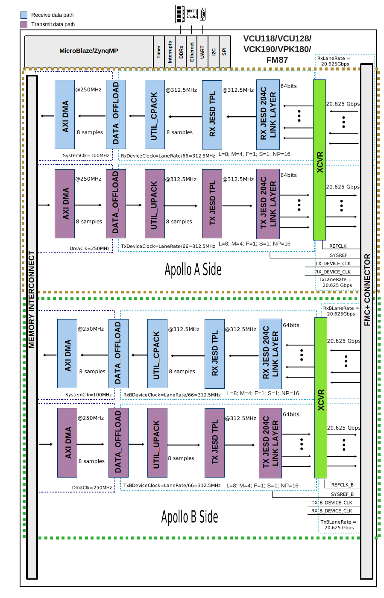
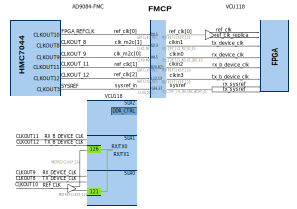

.. _ad9084_ebz:

AD9084-EBZ HDL project
===============================================================================

Overview
-------------------------------------------------------------------------------

The :adi:`AD9084-EBZ <EVAL-AD9084>` reference design
(also known as Apollo) is a processor based
(e.g. Microblaze) embedded system.
This reference design works with :adi:`EVAL-AD9084`.
The design consists from a receive and a transmit chain.

The **receive chain** transports the captured samples from ADC to the system
memory (DDR). Before transferring the data to DDR, the samples are stored
in a buffer implemented on BRAMs from the FPGA fabric
(:git-hdl:`util_adcfifo <library/util_adcfifo>`).
The space allocated in the buffer for each channel
depends on the number of currently active channels. It goes up to M x
64k samples if a single channel is selected or 64k samples per channel
if all channels are selected.

The **transmit chain** transports samples from the system memory to the DAC
devices. Before streaming out the data to the DAC through the JESD link,
the samples first are loaded into a buffer
(:git-hdl:`util_dacfifo <library/util_dacfifo>`) which will
cyclically stream the samples at the ``tx_device_clk`` data rate. The space
allocated in the transmit buffer for each channel depends on the number
of currently active channels. It goes up to M x 64k samples if a single
channel is selected or 64k samples per channel if all channels are
selected.

All cores from the receive and transmit chains are programmable through
an AXI-Lite interface.

The transmit and receive chains can operate at different data rates
having separate ``rx_device_clk``/``tx_device_clk`` and corresponding lane rates
but must share the same reference clock.

Supported boards
-------------------------------------------------------------------------------

- :adi:`AD9084-EBZ <EVAL-AD9084>` evaluation board

Supported devices
-------------------------------------------------------------------------------

- :adi:`AD9084`

Supported carriers
-------------------------------------------------------------------------------

.. list-table::
   :widths: 25 25 25 25
   :header-rows: 1

   * - Evaluation board
     - Carrier
     - FMC slot
     - Maximum number of lanes
   * - :adi:`AD9084-EBZ <EVAL-AD9084>`
     - :intel:`FM87 <content/www/us/en/products/details/fpga/development-kits/agilex/si-agi027.html>`
     - FMCB
     - 16 (8 per Apollo side)
   * -
     - :xilinx:`VCU118`
     - FMC+
     - 24 (12 per Apollo side)
   * -
     - :xilinx:`VCK190`
     - FMC2
     - 8 (4 per Apollo side)
   * -
     - :xilinx:`VPK180`
     - FMC+
     - 8 (4 per Apollo side)

Block design
-------------------------------------------------------------------------------

.. important::

   The Apollo chip is split into two sides, each side having up to 12 JESD
   lanes and 4 converters:

   - Side A
   - Side B

   The ``ASYMMETRIC_A_B_MODE`` parameter is used to enable the asymmetric A/B
   mode where each Apollo side has a separate JESD link inside the block design.

   If the ASYMMETRIC_A_B_MODE parameter is set to 0, the block design will merge
   the two sides into a single link.

   Given the following JESD204 configuration and assuming that
   **ASYMMETRIC_A_B_MODE = 0**:

   - L = 8
   - M = 4
   - S = 1
   - N = NP = 16
   - **NUM_LINKS = 2**

   The resulted design will configure each Apollo side with the following
   parameters, but will merge the two sides into a single JESD link inside the
   design:

   - L = 8
   - M = 4
   - S = 1
   - N = NP = 16

   If however, **NUM_LINKS = 1**, the design will configure each side with the
   following parameters:

   - L = 4
   - M = 2
   - S = 1
   - N = NP = 16

   Given the following JESD204 configuration and assuming that
   **ASYMMETRIC_A_B_MODE = 1**:

   - L = 8
   - M = 4
   - S = 1
   - N = NP = 16
   - **NUM_LINKS is ignored**

   The resulted design will configure each Apollo side with the following
   parameters, each having it's own JESD link inside the design:

   - L = 8
   - M = 4
   - S = 1
   - N = NP = 16

Block diagram
~~~~~~~~~~~~~~~~~~~~~~~~~~~~~~~~~~~~~~~~~~~~~~~~~~~~~~~~~~~~~~~~~~~~~~~~~~~~~~~

The data path and clock domains are depicted in the below diagrams:

Example block design for ASYMMETRIC_A_B_MODE=0; M=4; L=8; NUM_LINKS=2; JESD204C
^^^^^^^^^^^^^^^^^^^^^^^^^^^^^^^^^^^^^^^^^^^^^^^^^^^^^^^^^^^^^^^^^^^^^^^^^^^^^^^

.. warning::

   **Build instructions:**

   The project must be built with the following parameters:

   .. shell:: bash
      :no-path:

      $make JESD_MODE=64B66B  \
      $     RX_LANE_RATE=20.625 \
      $     TX_LANE_RATE=20.625 \
      $     RX_JESD_M=4       \
      $     RX_JESD_L=8       \
      $     RX_JESD_S=1       \
      $     RX_JESD_NP=16     \
      $     RX_NUM_LINKS=2    \
      $     TX_JESD_M=4       \
      $     TX_JESD_L=8       \
      $     TX_JESD_S=1       \
      $     TX_JESD_NP=16     \
      $     TX_NUM_LINKS=2    \
      $     ASYMMETRIC_A_B_MODE=0

The Rx link is operating with the following parameters on each Apollo side:

- Rx Deframer parameters: L=8, M=4, F=1, S=1, NP=16, N=16 (Mode 47)
- Sample Rate: 2500 MSPS
- RX_DEVICE_CLK: 312.5 MHz (Lane Rate/66)
- REF_CLK: 625 MHz (Lane Rate/33)
- JESD204C Lane Rate: 20.625 Gbps
- QPLL1

The Tx link is operating with the following parameters:

- Tx Framer parameters: L=8, M=4, F=1, S=1, NP=16, N=16 (Mode 47)
- Sample Rate: 2500 MSPS
- Dual link: No
- TX_DEVICE_CLK: 312.5 MHz (Lane Rate/66)
- REF_CLK: 625 MHz (Lane Rate/33)
- JESD204C Lane Rate: 20.625 Gbps
- QPLL1

.. important::

  Because of the two Apollo sides, the total number of lanes in the design is
  16 and the total number of converters is 8.

Example block design for ASYMMETRIC_A_B_MODE=1; M=4; L=8; JESD204C
^^^^^^^^^^^^^^^^^^^^^^^^^^^^^^^^^^^^^^^^^^^^^^^^^^^^^^^^^^^^^^^^^^^^^^^^^^^^^^^

.. warning::

   **Build instructions:**

   The project must be built with the following parameters:

   .. shell:: bash
      :no-path:

      $make JESD_MODE=64B66B  \
      $     RX_LANE_RATE=20.625 \
      $     TX_LANE_RATE=20.625 \
      $     RX_JESD_M=4       \
      $     RX_JESD_L=8       \
      $     RX_JESD_S=1       \
      $     RX_JESD_NP=16     \
      $     TX_JESD_M=4       \
      $     TX_JESD_L=8       \
      $     TX_JESD_S=1       \
      $     TX_JESD_NP=16     \
      $     ASYMMETRIC_A_B_MODE=1 \
      $     RX_B_LANE_RATE=20.625 \
      $     TX_B_LANE_RATE=20.625 \
      $     RX_B_JESD_M=4     \
      $     RX_B_JESD_L=8     \
      $     RX_B_JESD_S=1     \
      $     RX_B_JESD_NP=16   \
      $     TX_B_JESD_M=4     \
      $     TX_B_JESD_L=8     \
      $     TX_B_JESD_S=1     \
      $     TX_B_JESD_NP=16

The Rx link is operating with the following parameters on each Apollo side:

- Rx Deframer parameters: L=8, M=4, F=1, S=1, NP=16, N=16 (Mode 47)
- Sample Rate: 2500 MSPS
- RX_DEVICE_CLK: 312.5 MHz (Lane Rate/66)
- REF_CLK: 625 MHz (Lane Rate/33)
- JESD204C Lane Rate: 20.625 Gbps
- QPLL1

The Tx link is operating with the following parameters:

- Tx Framer parameters: L=8, M=4, F=1, S=1, NP=16, N=16 (Mode 47)
- Sample Rate: 2500 MSPS
- Dual link: No
- TX_DEVICE_CLK: 312.5 MHz (Lane Rate/66)
- REF_CLK: 625 MHz (Lane Rate/33)
- JESD204C Lane Rate: 20.625 Gbps
- QPLL1

Configuration modes
~~~~~~~~~~~~~~~~~~~~~~~~~~~~~~~~~~~~~~~~~~~~~~~~~~~~~~~~~~~~~~~~~~~~~~~~~~~~~~~

The block design supports configuration of parameters and scales.

We have listed a couple of examples at section :ref:`ad9084_ebz build` and
the default modes for each project.

.. note::

   The parameters for Rx or Tx links can be changed from the
   **system_project.tcl** file, located in
   hdl/projects/ad9084_ebz/$CARRIER/system_project.tcl

.. important::

   For JESD204B:

   .. math::

      Lane Rate = \frac{IQ Sample Rate * M * NP * \frac{10}{8}}{L}

   For JESD204C:

   .. math::

      Lane Rate = \frac{IQ Sample Rate * M * NP * \frac{66}{64}}{L}

The following are the parameters of this project that can be configured:

- JESD_MODE: used link layer encoder mode

  - 64B66B - 64b66b link layer defined in JESD204C, uses ADI IP as Physical
    Layer (except for Versal / Intel)
  - 8B10B - 8b10b link layer defined in JESD204B, uses ADI IP as Physical
    Layer
- HSCI_ENABLE: enables the HSCI IP (Xilinx only)
- ASYMMETRIC_A_B_MODE: enables the asymmetric A/B mode where each Apollo side
  has a separate JESD link (Xilinx only)
- RX_LANE_RATE: lane rate of the Rx link (MxFE to FPGA)
  (A or A&B link if ASYMMETRIC_A_B_MODE = 0)
- TX_LANE_RATE: lane rate of the Tx link (FPGA to MxFE)
  (A or A&B link if ASYMMETRIC_A_B_MODE = 0)
- REF_CLK_RATE: the rate of the reference clock (Versal and Intel only)
- DEVICE_CLK_RATE: the rate of the device clock (Intel only)
- [RX/TX]_JESD_M: number of converters per link
  (A or A&B link if ASYMMETRIC_A_B_MODE = 0)
- [RX/TX]_JESD_L: number of lanes per link
  (A or A&B link if ASYMMETRIC_A_B_MODE = 0)
- [RX/TX]_JESD_S: number of samples per frame
  (A or A&B link if ASYMMETRIC_A_B_MODE = 0)
- [RX/TX]_JESD_NP: number of bits per sample
  (A or A&B link if ASYMMETRIC_A_B_MODE = 0)
- [RX/TX]_NUM_LINKS: number of links
  (A or A&B link if ASYMMETRIC_A_B_MODE = 0)
- [RX/TX]_KS_PER_CHANNEL: Number of samples stored in internal buffers in
  kilosamples per converter (M) (A or A&B link if ASYMMETRIC_A_B_MODE = 0)
- RX_B_LANE_RATE: lane rate of the Rx link (MxFE to FPGA) (B link)
- TX_B_LANE_RATE: lane rate of the Tx link (FPGA to MxFE) (B link)
- [RX/TX]_B_JESD_M: number of converters per link (B link)
- [RX/TX]_B_JESD_L: number of lanes per link (B link)
- [RX/TX]_B_JESD_S: number of samples per frame (B link)
- [RX/TX]_B_JESD_NP: number of bits per sample (B link)
- [RX/TX]_B_NUM_LINKS: number of links (B link)
- [RX/TX]_B_KS_PER_CHANNEL: Number of samples stored in internal buffers in
  kilosamples per converter (M) (B link)

Clock scheme
~~~~~~~~~~~~~~~~~~~~~~~~~~~~~~~~~~~~~~~~~~~~~~~~~~~~~~~~~~~~~~~~~~~~~~~~~~~~~~~

The clock sources depend on the carrier that is used:

:xilinx:`VCU118`
^^^^^^^^^^^^^^^^^^^^^^^^^^^^^^^^^^^^^^^^^^^^^^^^^^^^^^^^^^^^^^^^^^^^^^^^^^^^^^^

Limitations
^^^^^^^^^^^^^^^^^^^^^^^^^^^^^^^^^^^^^^^^^^^^^^^^^^^^^^^^^^^^^^^^^^^^^^^^^^^^^^^

.. warning::

   For the parameter selection, the following restrictions apply:

   - NP = 8, 12, 16
   - F = 1, 2, 3, 4, 6, 8
   - :ref:`JESD204B/C Link Rx peripheral > restrictions <axi_jesd204_rx restrictions>`
   - :ref:`JESD204B/C Link Tx peripheral > restrictions <axi_jesd204_tx restrictions>`

CPU/Memory interconnects addresses
~~~~~~~~~~~~~~~~~~~~~~~~~~~~~~~~~~~~~~~~~~~~~~~~~~~~~~~~~~~~~~~~~~~~~~~~~~~~~~~

The addresses are dependent on the architecture of the FPGA, having an offset
added to the base address from HDL
(see more at :ref:`architecture cpu-intercon-addr`).

Depending on the values of parameters $ASYMMETRIC_A_B_MODE, $ADI_PHY_SEL
and $HSCI_ENABLE,
some IPs are instatiated and some are not.

Check-out the table below to find out the conditions.

========================= ========================================= =============== ============
Instance                  Depends on parameter                      Microblaze      ZynqMP
========================= ========================================= =============== ============
apollo_rx_xcvr            $ADI_PHY_SEL==1                            0x44A6_0000    N/A
apollo_rx_jesd                                                       0x44A9_0000    0xA4A9_0000
rx_apollo_tpl_core                                                   0x44A1_0000    0xA4A1_0000
apollo_rx_dma                                                        0x7C42_0000    0xBC42_0000
apollo_rx_data_offload                                               0x7C45_0000    0xBC45_0000
apollo_rx_b_xcvr          $ADI_PHY_SEL==1 & $ASYMMETRIC_A_B_MODE==1  0x44AA_0000    N/A
apollo_rx_b_jesd          $ASYMMETRIC_A_B_MODE==1                    0x44AC_0000    0xA4AC_0000
rx_b_apollo_tpl_core      $ASYMMETRIC_A_B_MODE==1                    0x44AB_0000    0xA4AB_0000
apollo_rx_b_dma           $ASYMMETRIC_A_B_MODE==1                    0x7C47_0000    0xBC47_0000
apollo_rx_b_data_offload  $ASYMMETRIC_A_B_MODE==1                    0x7C4A_0000    0xBC4A_0000
apollo_tx_xcvr            $ADI_PHY_SEL==1                            0x44B6_0000    N/A
apollo_tx_jesd                                                       0x44B9_0000    0xA4B9_0000
tx_apollo_tpl_core                                                   0x44B1_0000    0xA4B1_0000
apollo_tx_dma                                                        0x7C43_0000    0xBC43_0000
apollo_tx_data_offload                                               0x7C44_0000    0xBC44_0000
apollo_tx_b_xcvr          $ADI_PHY_SEL==1 & $ASYMMETRIC_A_B_MODE==1  0x44BA_0000    N/A
apollo_tx_b_jesd          $ASYMMETRIC_A_B_MODE==1                    0x44BC_0000    0xA4BC_0000
tx_b_apollo_tpl_core      $ASYMMETRIC_A_B_MODE==1                    0x44BB_0000    0xA4BB_0000
apollo_tx_b_dma           $ASYMMETRIC_A_B_MODE==1                    0x7C48_0000    0xBC48_0000
apollo_tx_b_data_offload  $ASYMMETRIC_A_B_MODE==1                    0x7C49_0000    0xBC44_0000
axi_hsci                  $HSCI_ENABLE==1                            0x7C50_0000    0xBC50_0000
axi_hsci_clkgen           $HSCI_ENABLE==1                            0x44AD_0000    0xA4AD_0000
axi_spi_2                                                            0x44A8_0000    0xA4A8_0000
========================= ========================================= =============== ============

For the Intel carriers, only a part of the CPU interrupts are specified,
as the rest depend on the values of $TX_NUM_OF_LANES
(see :git-hdl:`projects/ad9084_ebz/common/ad9084_ebz_qsys.tcl`
for more details).

==================================  ===========
Instance                            Intel
==================================  ===========
apollo_rx_jesd204.link_reconfig     0x000C_0000
apollo_rx_jesd204.link_management   0x000C_4000
apollo_tx_jesd204.link_reconfig     0x000C_8000
apollo_tx_jesd204.link_management   0x000C_C000
apollo_rx_tpl.s_axi                 0x000D_2000
apollo_tx_tpl.s_axi                 0x000D_4000
apollo_rx_dma.s_axi                 0x000D_8000
apollo_tx_dma.s_axi                 0x000D_C000
apollo_gpio.s1                      0x000E_0000
apollo_spi.spi_control_port         0x000E_A000
==================================  ===========

SPI connections
~~~~~~~~~~~~~~~~~~~~~~~~~~~~~~~~~~~~~~~~~~~~~~~~~~~~~~~~~~~~~~~~~~~~~~~~~~~~~~~

.. list-table::
   :widths: 25 25 25 25
   :header-rows: 1

   * - SPI type
     - SPI manager instance
     - SPI subordinate
     - CS
   * - PS
     - spi0
     - ADF4382
     - 0
   * - PS
     - spi0
     - HMC7044
     - 1
   * - PL
     - axi_spi_2
     - AD9084
     - 0

GPIOs
~~~~~~~~~~~~~~~~~~~~~~~~~~~~~~~~~~~~~~~~~~~~~~~~~~~~~~~~~~~~~~~~~~~~~~~~~~~~~~~

The following table lists the GPIO signals used in this project that
are connected to the Apollo evaluation board and are common between
all the carriers.

.. list-table::
   :widths: 20 20 20 20 20
   :header-rows: 2

   * - Apollo GPIO signal
     - Direction
     - HDL GPIO EMIO
     - Software GPIO
     - Software GPIO
   * -
     - (from FPGA view)
     -
     - Microblaze
     - ZynqMP
   * - resetb
     - OUT
     - 62
     - 62
     - 30
   * - trig_b[1:0]
     - OUT
     - 61:60
     - 61:60
     - 29:28
   * - trig_a[1:0]
     - OUT
     - 59:58
     - 59:58
     - 27:26
   * - trig_in
     - IN
     - 53
     - 53
     - 21
   * - aux_gpio
     - INOUT
     - 48
     - 48
     - 16
   * - gpio[30:15]
     - INOUT
     - 47:32
     - 47:32
     - 15:0

The following table lists the GPIO signals that are only present
in the Versal projects.

They are used from the linux kernel to
control the reset sequence of the GTY/GTYP transceivers.

.. list-table::
   :widths: 40 20 20 20
   :header-rows: 2

   * - Versal transceivers GPIO signal
     - Direction
     - HDL GPIO EMIO
     - Software GPIO
   * -
     - (from FPGA view)
     -
     - ZynqMP
   * - tx_reset_datapath
     - IN
     - 71
     - 39
   * - rx_reset_datapath
     - IN
     - 70
     - 38
   * - tx_reset_pll_and_datapath
     - IN
     - 69
     - 37
   * - rx_reset_pll_and_datapath
     - IN
     - 68
     - 36
   * - gt_reset
     - IN
     - 67
     - 35
   * - mst_resetdone
     - OUT
     - 66
     - 34
   * - tx_resetdone
     - OUT
     - 65
     - 33
   * - rx_resetdone
     - OUT
     - 64
     - 32
   * - tx_b_reset_datapath
     - IN
     - 79
     - 47
   * - rx_b_reset_datapath
     - IN
     - 78
     - 46
   * - tx_b_reset_pll_and_datapath
     - IN
     - 77
     - 45
   * - rx_b_reset_pll_and_datapath
     - IN
     - 76
     - 44
   * - gt_b_reset
     - IN
     - 75
     - 43
   * - mst_b_resetdone
     - OUT
     - 74
     - 42
   * - tx_b_resetdone
     - OUT
     - 73
     - 41
   * - rx_b_resetdone
     - OUT
     - 72
     - 40

The following table lists the GPIOs that are only preset on the Intel
carriers.

.. list-table::
   :widths: 40 20 20 20
   :header-rows: 2

   * - Intel GPIO signal
     - Direction
     - HDL GPIO EMIO
     - Software GPIO
   * -
     - (from FPGA view)
     -
     - ZynqMP
   * - tx_fifo_bypass_bypass
     - IN
     - 63
     - 31

Interrupts
~~~~~~~~~~~~~~~~~~~~~~~~~~~~~~~~~~~~~~~~~~~~~~~~~~~~~~~~~~~~~~~~~~~~~~~~~~~~~~~

Below are the Programmable Logic interrupts used in this project.

==================== === ================ ============
Instance name        HDL Linux Microblaze Linux ZynqMP
==================== === ================ ============
axi_apollo_rx_dma    13  13               97
axi_apollo_tx_dma    12  12               96
axi_apollo_rx_jesd   11  11               95
axi_apollo_tx_jesd   10  10               94
axi_spi_2            9   9                93
axi_apollo_rx_b_dma  4   4                88
axi_apollo_tx_b_dma  3   3                87
axi_apollo_rx_b_jesd 2   2                86
axi_apollo_tx_b_jesd 1   1                85
==================== === ================ ============

.. _ad9084_ebz build:

Building the HDL project
-------------------------------------------------------------------------------

The design is built upon ADI's generic HDL reference design framework.
ADI distributes the bit/elf files of these projects as part of the
:dokuwiki:`ADI Kuiper Linux <resources/tools-software/linux-software/kuiper-linux>`.
If you want to build the sources, ADI makes them available on the
:git-hdl:`HDL repository </>`. To get the source you must
`clone <https://git-scm.com/book/en/v2/Git-Basics-Getting-a-Git-Repository>`__
the HDL repository.

Then go to the :git-hdl:`projects/ad9084_ebz`
location and run the make command by typing in you command prompt:

Example for building the project with parameters:

**Linux/Cygwin/WSL**

.. shell:: bash

  $cd hdl/projects/ad9084_ebz/vck190
  $make RX_LANE_RATE=2.5 TX_LANE_RATE=2.5     \
  $     RX_JESD_L=8 RX_JESD_M=4 RX_JESD_S=1   \
  $     RX_JESD_NP=16 TX_JESD_L=8 TX_JESD_M=4 \
  $     TX_JESD_S=1 TX_JESD_NP=16

The following dropdowns contain tables with the parameters that can be used to
configure this project, depending on the carrier used.
Where a cell contains a --- (dash) it means that the parameter doesn't exist
for that project (ad9084_ebz/$carrier).

.. warning::

   For the parameter selection, the following restrictions apply:

   - NP = 8, 12, 16
   - F = 1, 2, 3, 4, 6, 8
   - :ref:`JESD204B/C Link Rx peripheral > restrictions <axi_jesd204_rx restrictions>`
   - :ref:`JESD204B/C Link Tx peripheral > restrictions <axi_jesd204_tx restrictions>`

   ``NP`` notation is equivalent with ``N'``

.. collapsible:: Default values of the make parameters for AD9084-EBZ

   +---------------------+-----------------------------------+
   | Parameter           | Default value of the parameters   |
   |                     +--------+--------+--------+--------+
   |                     |  FM87  | VCU118 | VCK190 | VPK180 |
   +=====================+========+========+========+========+
   | JESD_MODE           | 64B66B | 64B66B | 64B66B | 64B66B |
   +---------------------+--------+--------+--------+--------+
   | ENABLE_HSCI         |:red:`-`|      1 |     1* |     1* |
   +---------------------+--------+--------+--------+--------+
   | REF_CLK_RATE*       |  312.5 |    --- |  312.5 |  312.5 |
   +---------------------+--------+--------+--------+--------+
   | DEVICE_CLK_RATE**   |  312.5 |    --- |    --- |    --- |
   +---------------------+--------+--------+--------+--------+
   | RX_LANE_RATE        | 20.625 | 20.625 | 20.625 | 20.625 |
   +---------------------+--------+--------+--------+--------+
   | TX_LANE_RATE        | 20.625 | 20.625 | 20.625 | 20.625 |
   +---------------------+--------+--------+--------+--------+
   | RX_JESD_M           |      4 |      4 |      4 |      4 |
   +---------------------+--------+--------+--------+--------+
   | RX_JESD_L           |      8 |      8 |      4 |      4 |
   +---------------------+--------+--------+--------+--------+
   | RX_JESD_S           |      1 |      1 |      1 |      1 |
   +---------------------+--------+--------+--------+--------+
   | RX_JESD_NP          |     16 |     16 |     16 |     16 |
   +---------------------+--------+--------+--------+--------+
   | RX_NUM_LINKS        |      2 |      1 |      2 |      2 |
   +---------------------+--------+--------+--------+--------+
   | TX_JESD_M           |      4 |      4 |      4 |      4 |
   +---------------------+--------+--------+--------+--------+
   | TX_JESD_L           |      8 |      8 |      4 |      4 |
   +---------------------+--------+--------+--------+--------+
   | TX_JESD_S           |      1 |      1 |      1 |      1 |
   +---------------------+--------+--------+--------+--------+
   | TX_JESD_NP          |     16 |     16 |     16 |     16 |
   +---------------------+--------+--------+--------+--------+
   | TX_NUM_LINKS        |      2 |      1 |      2 |      2 |
   +---------------------+--------+--------+--------+--------+
   | RX_KS_PER_CHANNEL   |     16 |     32 |     64 |     64 |
   +---------------------+--------+--------+--------+--------+
   | TX_KS_PER_CHANNEL   |     16 |     32 |     64 |     64 |
   +---------------------+--------+--------+--------+--------+
   | ASYMMETRIC_A_B_MODE |:red:`-`|      1 |      0 |      0 |
   +---------------------+--------+--------+--------+--------+
   | RX_B_LANE_RATE      |:red:`-`| 20.625 | 20.625 | 20.625 |
   +---------------------+--------+--------+--------+--------+
   | TX_B_LANE_RATE      |:red:`-`| 20.625 | 20.625 | 20.625 |
   +---------------------+--------+--------+--------+--------+
   | RX_B_JESD_M         |:red:`-`|      4 |      4 |      4 |
   +---------------------+--------+--------+--------+--------+
   | RX_B_JESD_L         |:red:`-`|      8 |      4 |      4 |
   +---------------------+--------+--------+--------+--------+
   | RX_B_JESD_S         |:red:`-`|      1 |      1 |      1 |
   +---------------------+--------+--------+--------+--------+
   | RX_B_JESD_NP        |:red:`-`|     16 |     16 |     16 |
   +---------------------+--------+--------+--------+--------+
   | TX_B_JESD_M         |:red:`-`|      4 |      4 |      4 |
   +---------------------+--------+--------+--------+--------+
   | TX_B_JESD_L         |:red:`-`|      8 |      4 |      4 |
   +---------------------+--------+--------+--------+--------+
   | TX_B_JESD_S         |:red:`-`|      1 |      1 |      1 |
   +---------------------+--------+--------+--------+--------+
   | TX_B_JESD_NP        |:red:`-`|     16 |     16 |     16 |
   +---------------------+--------+--------+--------+--------+
   | RX_B_KS_PER_CHANNEL |:red:`-`|     32 |     64 |     64 |
   +---------------------+--------+--------+--------+--------+
   | TX_B_KS_PER_CHANNEL |:red:`-`|     32 |     64 |     64 |
   +---------------------+--------+--------+--------+--------+
   | ADC_DO_MEM_TYPE     |    --- |    --- |    --- |    --- |
   +---------------------+--------+--------+--------+--------+
   | DAC_DO_MEM_TYPE     |    --- |    --- |    --- |    --- |
   +---------------------+--------+--------+---------+-------+

   .. admonition:: Legend
      :class: note

      :red:`-` --- this feature is not supported

      `*` --- can be disabled

The result of the build, if parameters were used, will be in a folder named
by the configuration used:

if the following command was run

``make RX_LANE_RATE=2.5 TX_LANE_RATE=2.5 RX_JESD_L=8 RX_JESD_M=4 RX_JESD_S=1
RX_JESD_NP=16 TX_JESD_L=8 TX_JESD_M=4 TX_JESD_S=1 TX_JESD_NP=16``

then the folder name will be:

``RXRATE2_5_TXRATE2_5_RXL8_RXM4_RXS1_RXNP16_TXL8_TXM4_TXS1_TXNP16``
because of truncation of some keywords so the name will not exceed the limits
of the Operating System (``JESD``, ``LANE``, etc. are removed) of 260
characters.

A more comprehensive build guide can be found in the :ref:`build_hdl`
user guide.

Software considerations
-------------------------------------------------------------------------------

ADC - crossbar config
~~~~~~~~~~~~~~~~~~~~~~~~~~~~~~~~~~~~~~~~~~~~~~~~~~~~~~~~~~~~~~~~~~~~~~~~~~~~~~~

Due to physical constraints, Rx lanes are reordered as described in the
following table.

e.g physical lane 2 from ADC from A side connects to logical lane 1
from the VCU118. Therefore the crossbar from the device must be set
accordingly.

============== =============== =============== ===============
ADC A phy Lane VCU118          VCK190 / VPK180 FM87
============== =============== =============== ===============
0              7               5               11
1              5               1               9
2              1               3               8
3              2               7               10
4              11              N/C             7
5              3               N/C             3
6              8               N/C             1
7              9               N/C             5
8              10              N/C             N/C
9              6               N/C             N/C
10             4               N/C             N/C
11             0               N/C             N/C
============== =============== =============== ===============

============== =============== =============== ===============
ADC B phy Lane VCU118          VCK190 / VPK180 FM87
============== =============== =============== ===============
0              10              1               11
1              6               7               9
2              4               10              8
3              0               3               5
4              3               N/C             3
5              2               N/C             10
6              5               N/C             7
7              7               N/C             1
8              8               N/C             N/C
9              1               N/C             N/C
10             11              N/C             N/C
11             9               N/C             N/C
============== =============== =============== ===============

DAC - crossbar config
~~~~~~~~~~~~~~~~~~~~~~~~~~~~~~~~~~~~~~~~~~~~~~~~~~~~~~~~~~~~~~~~~~~~~~~~~~~~~~~

Due to physical constraints, Tx lanes are reordered as described in the
following table.

e.g physical lane 2 from DAC from A side connects to logical lane 9
from the VCU118. Therefore the crossbar from the device must be set
accordingly.

============== =============== =============== ===============
DAC A phy Lane VCU118          VCK190 / VPK180 FM87
============== =============== =============== ===============
0              10              11              2
1              8               3               1
2              9               8               5
3              11              9               7
4              5               N/C             9
5              1               N/C             8
6              3               N/C             3
7              7               N/C             11
8              4               N/C             N/C
9              6               N/C             N/C
10             2               N/C             N/C
11             0               N/C             N/C
============== =============== =============== ===============

============== =============== =============== ===============
DAC B phy Lane VCU118          VCK190 / VPK180 FM87
============== =============== =============== ===============
0              4               3               9
1              6               2               11
2              2               5               1
3              0               7               8
4              1               N/C             7
5              7               N/C             5
6              10              N/C             2
7              3               N/C             3
8              5               N/C             N/C
9              8               N/C             N/C
10             9               N/C             N/C
11             11              N/C             N/C
============== =============== =============== ===============

Resources
-------------------------------------------------------------------------------

Systems related
~~~~~~~~~~~~~~~~~~~~~~~~~~~~~~~~~~~~~~~~~~~~~~~~~~~~~~~~~~~~~~~~~~~~~~~~~~~~~~~

- :dokuwiki:`[Wiki] AD9084 Prototyping Platform User Guide <resources/eval/user-guides/ad9084_ebz>`
- Here you can find all the quick start guides on wiki documentation
  :dokuwiki:`[Wiki] AD9084 Quick Start Guides <resources/eval/user-guides/ad9084_ebz/quickstart>`

Here you can find the quick start guides available for these evaluation boards:

.. list-table::
   :widths: 20 20 40 20
   :header-rows: 1

   * - Evaluation board
     - Microblaze
     - Versal
     - Agilex 7
   * - AD9084
     - :dokuwiki:`VCU118 <resources/eval/user-guides/ad9084_ebz/quickstart/microblaze>`
     - :dokuwiki:`VCK190/VMK180/VPK180 <resources/eval/user-guides/ad9084_ebz/quickstart/versal>`
     - :dokuwiki:`FM87 <resources/eval/user-guides/ad9084_ebz/quickstart/fm87>`

Hardware related
~~~~~~~~~~~~~~~~~~~~~~~~~~~~~~~~~~~~~~~~~~~~~~~~~~~~~~~~~~~~~~~~~~~~~~~~~~~~~~~

- Product datasheet: :adi:`AD9084`

  - :adi:`UG-1578, AD9084/AD9088 Device User Guide <media/en/technical-documentation/user-guides/ad9084-ad9088-device-ug-2300.pdf>`
  - :adi:`UG-2326, Evaluating the AD9084 Apollo MxFE Quad, 16-Bit 28GSPS RF DAC and Quad 12-Bit, 20GSPS RF ADC <media/en/technical-documentation/user-guides/eval-ad9084-ug-2326.pdf>`

HDL related
~~~~~~~~~~~~~~~~~~~~~~~~~~~~~~~~~~~~~~~~~~~~~~~~~~~~~~~~~~~~~~~~~~~~~~~~~~~~~~~

- :git-hdl:`ad9084_ebz HDL project source code <projects/ad9084_ebz>`

.. list-table::
   :widths: 30 35 35
   :header-rows: 1

   * - IP name
     - Source code link
     - Documentation link
   * - AXI_DMAC
     - :git-hdl:`library/axi_dmac`
     - :ref:`axi_dmac`
   * - AXI_SYSID
     - :git-hdl:`library/axi_sysid`
     - :ref:`axi_sysid`
   * - SYSID_ROM
     - :git-hdl:`library/sysid_rom`
     - :ref:`axi_sysid`
   * - UTIL_CPACK2
     - :git-hdl:`library/util_pack/util_cpack2`
     - :ref:`util_cpack2`
   * - UTIL_UPACK2
     - :git-hdl:`library/util_pack/util_upack2`
     - :ref:`util_upack2`
   * - UTIL_ADXCVR for AMD
     - :git-hdl:`library/xilinx/util_adxcvr`
     - :ref:`util_adxcvr`
   * - AXI_ADXCVR for Intel
     - :git-hdl:`library/intel/axi_adxcvr`
     - :ref:`axi_adxcvr intel`
   * - AXI_ADXCVR for AMD
     - :git-hdl:`library/xilinx/axi_adxcvr`
     - :ref:`axi_adxcvr amd`
   * - AXI_JESD204_RX
     - :git-hdl:`library/jesd204/axi_jesd204_rx`
     - :ref:`axi_jesd204_rx`
   * - AXI_JESD204_TX
     - :git-hdl:`library/jesd204/axi_jesd204_tx`
     - :ref:`axi_jesd204_tx`
   * - JESD204_TPL_ADC
     - :git-hdl:`library/jesd204/ad_ip_jesd204_tpl_adc`
     - :ref:`ad_ip_jesd204_tpl_adc`
   * - JESD204_TPL_DAC
     - :git-hdl:`library/jesd204/ad_ip_jesd204_tpl_dac`
     - :ref:`ad_ip_jesd204_tpl_dac`

- :ref:`generic_jesd_bds`
- :ref:`jesd204`

Software related
~~~~~~~~~~~~~~~~~~~~~~~~~~~~~~~~~~~~~~~~~~~~~~~~~~~~~~~~~~~~~~~~~~~~~~~~~~~~~~~

- :dokuwiki:`[Wiki] AD9084-EBZ Linux driver wiki page <resources/tools-software/linux-drivers/ad9084>`
- Python support:

  - `AD9084 class documentation <https://analogdevicesinc.github.io/pyadi-iio/devices/adi.ad9084.html>`__
  - `PyADI-IIO documentation <https://analogdevicesinc.github.io/pyadi-iio/>`__

.. include:: ../common/more_information.rst

.. include:: ../common/support.rst
