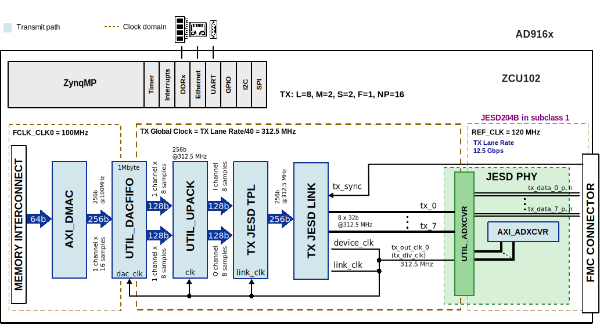

.. _ad916x_fmc:

AD916x-FMC HDL project
================================================================================

Overview
--------------------------------------------------------------------------------

The :adi:`AD9161` /:adi:`AD9162` /:adi:`AD9163` /:adi:`AD9164` is a high
performance, 16-bit (64-63-62)/11-bit (61) resolution digital-to-analog
converter (DAC) that supports data rates to 6 GSPS.

The DAC core is based on a quad-switch architecture coupled with a 2x
interpolator filter that enables an effective DAC update rate of up to 12 GSPS
in some modes. The high dynamic range and bandwidth makes this DAC ideally
suited for the most demanding high speed radio frequency (RF) DAC applications.

In baseband mode, these DACs provide wide analog bandwidth capability combined
with high dynamic range to support DOCSIS 3.1 cable infrastructure compliance.
They can be configured for lower data rates and converter clocking to reduce
overall system power and ease filtering requirements.The output current is
programmable from 8 mA to 38.76 mA.

The data interface consists of up to eight :ref:`jesd204` serializer/deserializer
(SERDES) lanes, which are programmable in terms of lane speed and number of
lanes to enable application flexibility. A serial peripheral interface (SPI)
configures the DACs and monitors the status of all registers.

Supported boards
--------------------------------------------------------------------------------

- :adi:`EVAL-AD916x`

Supported devices
--------------------------------------------------------------------------------

- :adi:`AD9164`
- :adi:`AD9163`
- :adi:`AD9162`
- :adi:`AD9161`
- :adi:`AD9508`
- :adi:`ADF4355`

Supported carriers
-------------------------------------------------------------------------------

- :xilinx:`ZCU102` on HPC0

Block design
-------------------------------------------------------------------------------

Block diagram
~~~~~~~~~~~~~~~~~~~~~~~~~~~~~~~~~~~~~~~~~~~~~~~~~~~~~~~~~~~~~~~~~~~~~~~~~~~~~~~

The data path and clock domains are depicted in the below diagram:

Configuration modes
~~~~~~~~~~~~~~~~~~~~~~~~~~~~~~~~~~~~~~~~~~~~~~~~~~~~~~~~~~~~~~~~~~~~~~~~~~~~~~~

The configuration parameters that can be set along with the **make** command
are:

- **ADI_DAC_DEVICE**: specifies the DAC device

  - **AD9161 (default)**
  - AD9162
  - AD9163
  - AD9164

- **ADI_DAC_MODE**: specifies the JESD operation mode

  - **08 (default)**
  - can vary from 01 to 08 depending on the selected device (ADI_DAC_DEVICE)

- **ADI_LANE_RATE**: specifies the lane rate (**supported only on the ZCU102 carrier**)

  - **12.5 GHz(default)**
  - 4.16 GHz

If the desired parameters are not listed in any of the supported modes the user
can configure them trough ``make`` parameters (according to the datasheet):

- **M**:  number of converters per link (**set by the ADI_DAC_MODE (default)**)
- **L**:  number of lanes per link (**set by the ADI_DAC_MODE (default)**)
- **S**:  number of samples per frame (**set by the ADI_DAC_MODE (default)**)
- **F**:  number of octets per frame (**set by the ADI_DAC_MODE (default)**)
- **HD**: high-density (**set by the ADI_DAC_MODE (default)**)
- **N**:  converter resolution (**set by the ADI_DAC_MODE (default)**)
- **NP**: number of bits per sample (**set by the ADI_DAC_MODE (default)**)

Jumper setup
~~~~~~~~~~~~~~~~~~~~~~~~~~~~~~~~~~~~~~~~~~~~~~~~~~~~~~~~~~~~~~~~~~~~~~~~~~~~~~~

The :adi:`EVAL-AD916x` can be tested using the on-board clock generator or using
and external clock source. Below is described the jumper setup: 

================== ========= ===============================
Jumper/Solder link Position  Description
================== ========= ===============================
J61                Mounted   Use the onboard clk. generator
J61                Unmounted Use external clk. source
================== ========= ===============================

For example, building the project for :adi:`AD9163` in MODE 2 (2 lanes with 12.5
GHz lane rate) (see :git-hdl:`projects/ad916x_fmc/common/config.tcl` for more
details) requires an external clock source and jumper J61 removed.

CPU/Memory interconnects addresses
~~~~~~~~~~~~~~~~~~~~~~~~~~~~~~~~~~~~~~~~~~~~~~~~~~~~~~~~~~~~~~~~~~~~~~~~~~~~~~~

The addresses are dependent on the architecture of the FPGA, having an offset
added to the base address from HDL (see more at :ref:`architecture cpu-intercon-addr`).

========================  ===========
Instance                  DE10-Nano
========================  ===========
dac_dma                   0x7c420000
dac_jesd204_link          0x44A90000
dac_jesd204_transport     0x44A04000
dac_jesd204_xcvr          0x44A60000
========================  ===========

SPI connections
~~~~~~~~~~~~~~~~~~~~~~~~~~~~~~~~~~~~~~~~~~~~~~~~~~~~~~~~~~~~~~~~~~~~~~~~~~~~~~~

.. list-table::
   :widths: 25 25 25 25
   :header-rows: 1

   * - SPI type
     - SPI manager instance
     - SPI subordinate
     - CS
   * - PS
     - SPI 0
     - AD9508
     - 1
   * - PS
     - SPI 0
     - ADF4355
     - 1
   * - PS
     - SPI 0
     - AD916x chip
     - 1

GPIOs
~~~~~~~~~~~~~~~~~~~~~~~~~~~~~~~~~~~~~~~~~~~~~~~~~~~~~~~~~~~~~~~~~~~~~~~~~~~~~~~

The Software GPIO number is calculated as follows:

- ZCU102: the offset is 78 (PS8)

.. list-table::
   :widths: 25 25 25 25
   :header-rows: 2

   * - GPIO signal
     - Direction
     - HDL GPIO EMIO
     - Software GPIO
   * -
     - (from FPGA view)
     -
     - ZCU102
   * - dac_ctrl[1:0]
     - INOUT
     - 25:24
     - 103:104

Interrupts
~~~~~~~~~~~~~~~~~~~~~~~~~~~~~~~~~~~~~~~~~~~~~~~~~~~~~~~~~~~~~~~~~~~~~~~~~~~~~~~

Below are the Programmable Logic interrupts used in this project.

================ === =============== ================
Instance name    HDL Linux ZynqMP    Actual ZynqMP
================ === =============== ================
dac_dma          10  106             138
dac_jesd204_link 12  108             140
================ === =============== ================

Building the HDL project
-------------------------------------------------------------------------------

The design is built upon ADI's generic HDL reference design framework.
ADI distributes the bit/elf files of these projects as part of the
:dokuwiki:`ADI Kuiper Linux <resources/tools-software/linux-software/kuiper-linux>`.
If you want to build the sources, ADI makes them available on the
:git-hdl:`HDL repository </>`. To get the source you must
`clone <https://git-scm.com/book/en/v2/Git-Basics-Getting-a-Git-Repository>`__
the HDL repository, and then build the project as follows:

**Linux/Cygwin/WSL**

.. shell::

   $cd hdl/projects/ad916x_fmc/zcu102
   $make

**AD916x** supports various modes for JESD. By default, when running the above
command, it will build the project for :adi:`AD9161` in Mode 8, which has the
following JESD parameters: L=8, M=2, S=2, F=1, N=16, NP=16 at a lane rate of
12.5 GHz. In order to build other mods for other devices (e.g. :adi:`AD9163`
in Mode 2, which has a lane rate of 12.5 GHz), you can specify this by using
the **ADI_LANE_RATE**, **ADI_DAC_DEVICE**, **ADI_DAC_MODE** this way:

.. shell::

   $cd hdl/projects/ad916x_fmc/zcu102
   $make ADI_LANE_RATE=12.5 ADI_DAC_DEVICE=AD9163 ADI_DAC_MODE=02

You can also overwrite some JESD parameters if desired, like is presented in
the following example (the value of the parameters is random for the example,
please check the datasheet to see the exact values):

.. shell::

   $cd hdl/projects/ad916x_fmc/zcu102
   $make ADI_LANE_RATE=12.5 ADI_DAC_DEVICE=AD9161 ADI_DAC_MODE=08 S=2 F=3 L=4

For the other mods, check :git-hdl:`projects/ad916x_fmc/common/config.tcl`.

A more comprehensive build guide can be found in the :ref:`build_hdl` user guide.

Resources
-------------------------------------------------------------------------------

Hardware related
~~~~~~~~~~~~~~~~~~~~~~~~~~~~~~~~~~~~~~~~~~~~~~~~~~~~~~~~~~~~~~~~~~~~~~~~~~~~~~~

- Product datasheets:

  - :adi:`AD9164`
  - :adi:`AD9163`
  - :adi:`AD9162`
  - :adi:`AD9161`

- `UG-1526, AD9161/AD9162/AD9163/AD9164 User Guide <https://www.analog.com/media/en/technical-documentation/user-guides/AD9161-9162-9163-9164-UG-1526.pdf>`__

HDL related
~~~~~~~~~~~~~~~~~~~~~~~~~~~~~~~~~~~~~~~~~~~~~~~~~~~~~~~~~~~~~~~~~~~~~~~~~~~~~~~

- :git-hdl:`AD916x-FMC HDL project source code <projects/ad916x_fmc>`

.. list-table::
   :widths: 30 35 35
   :header-rows: 1

   * - IP name
     - Source code link
     - Documentation link
   * - AXI_DMAC
     - :git-hdl:`library/axi_dmac`
     - :ref:`axi_dmac`
   * - AXI_SYSID
     - :git-hdl:`library/axi_sysid`
     - :ref:`axi_sysid`
   * - AXI_JESD204_TX
     - :git-hdl:`library/jesd204/axi_jesd204_tx`
     - :ref:`axi_jesd204_tx`
   * - AXI_ADXCVR for AMD
     - :git-hdl:`library/xilinx/axi_adxcvr`
     - :ref:`axi_adxcvr amd`
   * - JESD204_TPL_DAC
     - :git-hdl:`library/jesd204/ad_ip_jesd204_tpl_dac`
     - :ref:`ad_ip_jesd204_tpl_dac`
   * - SYSID_ROM
     - :git-hdl:`library/sysid_rom`
     - :ref:`axi_sysid`
   * - UTIL_ADXCVR for AMD
     - :git-hdl:`library/xilinx/util_adxcvr`
     - :ref:`util_adxcvr`
   * - UTIL_DACFIFO
     - :git-hdl:`library/util_dacfifo`
     - :ref:`util_rfifo`
   * - UTIL_UPACK2
     - :git-hdl:`library/util_pack/util_upack2`
     - :ref:`util_upack2`

- :ref:`jesd204`

Software related
~~~~~~~~~~~~~~~~~~~~~~~~~~~~~~~~~~~~~~~~~~~~~~~~~~~~~~~~~~~~~~~~~~~~~~~~~~~~~~~

Linux support:

- :git-linux:`Linux driver ad9162.c <drivers/iio/adc/ad9162.c>`
- Linux devicetrees:

  - (AD9164) :git-linux:`Linux device tree (MODE 8) adi-ad9164-fmc-ebz.dtsi <arch/arm64/boot/dts/xilinx/adi-ad9164-fmc-ebz.dtsi>`
  - (AD9164) :git-linux:`Linux device tree (MODE 8) zynqmp-zcu102-rev10-ad9164-fmc-ebz_m2_s2.dts <arch/arm64/boot/dts/xilinx/zynqmp-zcu102-rev10-ad9164-fmc-ebz_m2_s2.dts>`
  - (AD9163) :git-linux:`Linux device tree (MODE 8) adi-ad9163-fmc-ebz.dtsi <arch/arm64/boot/dts/xilinx/adi-ad9163-fmc-ebz.dtsi>`
  - (AD9163) :git-linux:`Linux device tree (MODE 8) zynqmp-zcu102-rev10-ad9163-fmc-ebz_m2_l8.dts <arch/arm64/boot/dts/xilinx/zynqmp-zcu102-rev10-ad9164-fmc-ebz_m2_l8.dts>`
  - (AD9163) :git-linux:`Linux device tree (MODE 2) zynqmp-zcu102-rev10-ad9163-fmc-ebz_m2_l2_s1_f1.dts <arch/arm64/boot/dts/xilinx/zynqmp-zcu102-rev10-ad9164-fmc-ebz_m2_l2_s1_f1.dts>`
  - (AD9162) :git-linux:`Linux device tree (MODE 8) adi-ad9162-fmc-ebz.dtsi <arch/arm64/boot/dts/xilinx/adi-ad9162-fmc-ebz.dtsi>`
  - (AD9162) :git-linux:`Linux device tree (MODE 8) zynqmp-zcu102-rev10-ad9162-fmc-ebz_m2_s2.dts <arch/arm64/boot/dts/xilinx/zynqmp-zcu102-rev10-ad9162-fmc-ebz_m2_s2.dts>`
  - (AD9161) :git-linux:`Linux device tree (MODE 8) adi-ad9161-fmc-ebz.dtsi <arch/arm64/boot/dts/xilinx/adi-ad9161-fmc-ebz.dtsi>`
  - (AD9161) :git-linux:`Linux device tree (MODE 8) zynqmp-zcu102-rev10-ad9161-fmc-ebz_m2_s2.dts <arch/arm64/boot/dts/xilinx/zynqmp-zcu102-rev10-ad9161-fmc-ebz_m2_s2.dts>`

- :dokuwiki:`[Wiki] AD916X DAC Linux Driver wiki page <resources/tools-software/linux-drivers/iio-pll/ad9162>`

.. include:: ../common/more_information.rst

.. include:: ../common/support.rst
