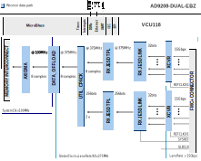
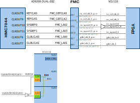

.. _ad9208_dual_ebz:

AD9208-DUAL-EBZ HDL Project
===============================================================================

Overview
-------------------------------------------------------------------------------

The :adi:`AD9208-DUAL-EBZ <EVAL-AD9208>` evaluation board features the
:adi:`AD9208` dual, 14-bit, 3 GSPS ADC.

The reference design is a processor-based (e.g. Microblaze) embedded system.
The device interfaces to the FPGA transceivers followed by the individual
JESD204B and ADC cores. The cores are programmable through an AXI-Lite
interface. The samples are passed to the system memory (DDR).

The device has an on-chip buffer and a sample-andhold circuit designed for
low power, small size, and ease of use. This product is designed to support
communications applications capable of direct sampling wide bandwidth analog
signals of up to 5 GHz. The -3 dB bandwidth of the ADC input is 9 GHz.

The :adi:`AD9208` is optimized for wide input bandwidth, high sampling
rate, excellent linearity, and low power in a small package. The dual ADC
cores feature a multistage, differential pipelined architecture with integrated
output error correction logic. Each ADC features wide bandwidth inputs
supporting a variety of user-selectable input ranges.

The user can configure the Subclasss 1 JESD204B-based high-speed serialized
output in a variety of 1-lane, 2-lane, 4-lane, and 8-lane configurations,
depending on the DDC configuration and the acceptable lane rate of the receiving
logic device. Multidevice synchronization is supported through the SYSREF± and
SYNCINB± input pins. The :adi:`AD9208` has flexible power-down options that
allow significant power savings when desired. All of these features can
be programmed using a 3-wire serial port interface (SPI).

Features:

- Up to 4 channels available
- JESD204B (Subclass 1) coded serial digital outputs
- 2 integrated, wideband digital processors per channel
- Phase coherent NCO switching
- 9 GHz analog input full power bandwidth (-3 dB)

Supported boards
-------------------------------------------------------------------------------

- :adi:`EVAL-AD9208`

Supported devices
-------------------------------------------------------------------------------

- :adi:`AD9208`

Supported carriers
-------------------------------------------------------------------------------

- :xilinx:`VCU118` on FMC+

Block design
-------------------------------------------------------------------------------

The design has two JESD receive chains, each having 8 lanes at rate of 15Gbps.
The JESD receive chain consists of a physical layer represented by an XCVR
module, a link layer represented by an RX JESD LINK module and transport
layer represented by a RX JESD TPL module. The links operate in Subclass 1
by using the SYSREF signal to edge align the internal local multiframe clock
and to release the received data in the same moment from all lanes.
Therefore ensuring that data from all channels is synchronized at the
application layer.

Both links are set for full bandwidth mode and operate with the following parameters:

- Deframer paramaters: L=8, M=2, F=1, S=2, NP=16
- GLBLCLK - 375MHz (Lane Rate/40)
- REFCLK - 750MHz (Lane Rate/20)
- SYSREF - 1.46MHz (DEVCLK/2048)
- DEVCLK - 3000MHz
- JESD204B Lane Rate - 15Gbps

Both transport layer components present on their output 256 bits at once
on every clock cycle, representing 8 samples per converter. The two receive
chains are merged together and transferred to the DDR with a single DMA. An
ADC buffer is used to store 65k samples per converter in the fabric before
transferring it with the DMA.

Block diagram
~~~~~~~~~~~~~~~~~~~~~~~~~~~~~~~~~~~~~~~~~~~~~~~~~~~~~~~~~~~~~~~~~~~~~~~~~~~~~~~

The data path and clock domains are depicted in the below diagram:

Configuration modes
~~~~~~~~~~~~~~~~~~~~~~~~~~~~~~~~~~~~~~~~~~~~~~~~~~~~~~~~~~~~~~~~~~~~~~~~~~~~~~~

This project **supports only one JESD204 configuration**, as follows (the
values cannot be changed):

- JESD204B subclass 1, uses ADI IP as Physical Layer
- RX_LANE_RATE: lane rate of the Rx link (MxFE to FPGA)
- TX_LANE_RATE: lane rate of the Tx link (FPGA to MxFE)
- REF_CLK_RATE: the rate of the reference clock
- L: number of lanes per link: 8
- M: number of converters per link: 2
- S: number of samples per frame: 2
- NP: number of bits per sample: 16
- F: octets per frame: 1
- K: frames per multiframe: 32

Clock scheme
~~~~~~~~~~~~~~~~~~~~~~~~~~~~~~~~~~~~~~~~~~~~~~~~~~~~~~~~~~~~~~~~~~~~~~~~~~~~~~~

Both physical layer transceiver modules receive the same reference clock from
the clock chip SCLKOUT8 output. The global clock (LaneRate/40) it is received
directly from the clock chip SCLKOUT9 output.

CPU/Memory interconnects addresses
~~~~~~~~~~~~~~~~~~~~~~~~~~~~~~~~~~~~~~~~~~~~~~~~~~~~~~~~~~~~~~~~~~~~~~~~~~~~~~~

The addresses are dependent on the architecture of the FPGA, having an offset
added to the base address from HDL (see more at :ref:`architecture cpu-intercon-addr`).

==================== =============== =========== ============
Instance             Zynq/Microblaze ZynqMP      Versal
==================== =============== =========== ============
rx_ad9208_0_tpl_core 0x44A1_0000     0x84A1_0000 0xA4A1_00000
axi_ad9208_0_xcvr    0x44A6_0000     0x84A6_0000 0xA4A6_00000
axi_ad9208_0_jesd    0x44A9_0000     0x84A9_0000 0xA4A9_00000
axi_ad9208_1_xcvr    0x44B6_0000     0x84B6_0000 0xA4B6_00000
rx_ad9208_1_tpl_core 0x44B1_0000     0x84B1_0000 0xA4B1_00000
axi_ad9208_1_jesd    0x44B9_0000     0x84B9_0000 0xA4B9_00000
axi_ad9208_dma       0x7C42_0000     0x9C42_0000 0xBC42_00000
==================== =============== =========== ============

SPI connections
~~~~~~~~~~~~~~~~~~~~~~~~~~~~~~~~~~~~~~~~~~~~~~~~~~~~~~~~~~~~~~~~~~~~~~~~~~~~~~~

.. list-table::
   :widths: 25 25 25 25
   :header-rows: 1

   * - SPI type
     - SPI manager instance
     - SPI subordinate
     - CS
   * - PS
     - SPI 0
     - HMC7044
     - 0
   * - PS
     - SPI 0
     - AD9208 A
     - 1
   * - PS
     - SPI 0
     - AD9208 B
     - 2

GPIOs
~~~~~~~~~~~~~~~~~~~~~~~~~~~~~~~~~~~~~~~~~~~~~~~~~~~~~~~~~~~~~~~~~~~~~~~~~~~~~~~

.. list-table::
   :widths: 25 20 20 20 15
   :header-rows: 2

   * - GPIO signal
     - Direction
     - HDL GPIO EMIO
     - Software GPIO
     - Software GPIO
   * -
     - (from FPGA view)
     -
     - Zynq-7000
     - Zynq MP
   * - adc0_fda
     - INOUT
     - 42
     - 96
     - 120
   * - adc0_fdb
     - INOUT
     - 41
     - 95
     - 119
   * - adc1_fda
     - INOUT
     - 40
     - 94
     - 118
   * - adc1_fdb
     - INOUT
     - 39
     - 93
     - 117
   * - adc0_gpio_a1
     - INOUT
     - 38
     - 92
     - 116
   * - adc1_gpio_a1
     - INOUT
     - 37
     - 91
     - 115
   * - adc0_gpio_b1
     - INOUT
     - 36
     - 90
     - 114
   * - adc1_gpio_b1
     - INOUT
     - 35
     - 89
     - 113
   * - adc0_pdwn
     - INOUT
     - 34
     - 88
     - 112
   * - adc1_pdwn
     - INOUT
     - 33
     - 87
     - 111
   * - hmc_sync_req
     - INOUT
     - 32
     - 86
     - 110

Interrupts
~~~~~~~~~~~~~~~~~~~~~~~~~~~~~~~~~~~~~~~~~~~~~~~~~~~~~~~~~~~~~~~~~~~~~~~~~~~~~~~

Below are the Programmable Logic interrupts used in this project.

================= === ========== =========== ============ =============
Instance name     HDL Linux Zynq Actual Zynq Linux ZynqMP Actual ZynqMP
================= === ========== =========== ============ =============
axi_ad9208_dma    12  56         88          108          140
axi_ad9208_0_jesd 11  55         87          107          139
axi_ad9208_1_jesd 10  54         86          106          138
================= === ========== =========== ============ =============

Building the HDL project
-------------------------------------------------------------------------------

The design is built upon ADI's generic HDL reference design framework.
ADI distributes the bit/elf files of these projects as part of the
:dokuwiki:`ADI Kuiper Linux <resources/tools-software/linux-software/kuiper-linux>`.
If you want to build the sources, ADI makes them available on the
:git-hdl:`HDL repository </>`. To get the source you must
`clone <https://git-scm.com/book/en/v2/Git-Basics-Getting-a-Git-Repository>`__
the HDL repository.

Then go to the hdl/projects/ad9208_dual_ebz/vcu118 location and run the make
command.

**Linux/Cygwin/WSL**

.. shell::

   $cd hdl/projects/ad9208_dual_ebz/vcu118
   $make

A more comprehensive build guide can be found in the :ref:`build_hdl` user guide.

Resources
-------------------------------------------------------------------------------

Systems related
~~~~~~~~~~~~~~~~~~~~~~~~~~~~~~~~~~~~~~~~~~~~~~~~~~~~~~~~~~~~~~~~~~~~~~~~~~~~~~~

- :dokuwiki:`AD9208-DUL-EBZ Virtex UltraScale+ quick start guide <resources/eval/user-guides/ad9208_dual_ebz/quickstart/vcu118>`

Hardware related
~~~~~~~~~~~~~~~~~~~~~~~~~~~~~~~~~~~~~~~~~~~~~~~~~~~~~~~~~~~~~~~~~~~~~~~~~~~~~~~

- Product datasheets:

  - :adi:`AD9208`
  - :adi:`HMC7044`
  - :adi:`AD9689`

- Schematic for the evaluation board can be found `here <https://wiki.analog.com/_media/resources/eval/user-guides/ad9208_dual_ebz/quickstart/ad9208-dual-ebz.zip>`__

HDL related
~~~~~~~~~~~~~~~~~~~~~~~~~~~~~~~~~~~~~~~~~~~~~~~~~~~~~~~~~~~~~~~~~~~~~~~~~~~~~~~

- :git-hdl:`AD9208_DUAL_EBZ HDL project source code <projects/ad9208_dual_ebz>`

.. list-table::
   :widths: 30 35 35
   :header-rows: 1

   * - IP name
     - Source code link
     - Documentation link
   * - AXI_DMAC
     - :git-hdl:`library/axi_dmac`
     - :ref:`axi_dmac`
   * - AXI_SYSID
     - :git-hdl:`library/axi_sysid`
     - :ref:`axi_sysid`
   * - SYSID_ROM
     - :git-hdl:`library/sysid_rom`
     - :ref:`axi_sysid`
   * - UTIL_CPACK2
     - :git-hdl:`library/util_pack/util_cpack2`
     - :ref:`util_cpack2`
   * - UTIL_ADCFIFO
     - :git-hdl:`library/util_adcfifo`
     - ---
   * - UTIL_ADXCVR for AMD
     - :git-hdl:`library/xilinx/util_adxcvr`
     - :ref:`util_adxcvr`
   * - AXI_ADXCVR for AMD
     - :git-hdl:`library/xilinx/axi_adxcvr`
     - :ref:`axi_adxcvr amd`
   * - AXI_JESD204_RX
     - :git-hdl:`library/jesd204/axi_jesd204_rx`
     - :ref:`axi_jesd204_rx`
   * - JESD204_TPL_ADC
     - :git-hdl:`library/jesd204/ad_ip_jesd204_tpl_adc`
     - :ref:`ad_ip_jesd204_tpl_adc`

- :dokuwiki:`[Wiki] Generic JESD204B block designs <resources/fpga/docs/hdl/generic_jesd_bds>`
- :ref:`jesd204`

Software related
~~~~~~~~~~~~~~~~~~~~~~~~~~~~~~~~~~~~~~~~~~~~~~~~~~~~~~~~~~~~~~~~~~~~~~~~~~~~~~~

- :git-linux:`AD9208-DUAL-EBZ/VCU118 Linux device tree <arch/microblaze/boot/dts/vcu118_dual_ad9208.dts>`
- :git-linux:`AD9208-DUAL-EBZ Linux driver <drivers/iio/adc/ad9208.c>`
- :git-no-os:`AD9208-DUAL-EBZ no-OS project <projects/ad9208>`
- :git-no-os:`AD9208-DUAL-EBZ no-OS driver <drivers/adc/ad9208>`

.. include:: ../common/more_information.rst

.. include:: ../common/support.rst
