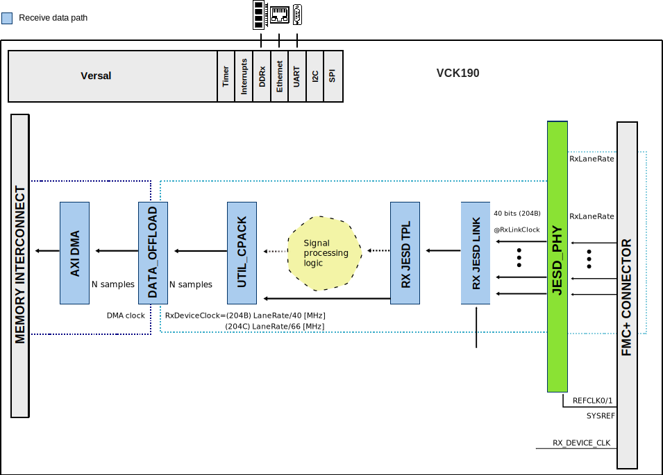
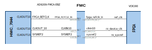

.. _ad9209_fmca_ebz:

AD9209-FMCA-EBZ HDL project
================================================================================

Overview
-------------------------------------------------------------------------------

The :git-hdl:`AD9209-FMCA-EBZ <projects/ad9209_fmca_ebz>` reference design is
a processor-based embedded system. This reference design works with
:adi:`AD9081-FMCA-EBZ <EVAL-AD9081>` (RX only) /
:adi:`AD9082-FMCA-EBZ <EVAL-AD9082>` (RX only) / :adi:`EVAL-AD9986` (RX only) /
:adi:`EVAL-AD9988` (RX only).

This design consists of one receive chain. Thus, only the RX path would be used
when the evaulation board is either EVAL-AD9081/AD9082/AD9986/AD9988.

The receive chain transports the captured samples from ADC to the system
memory (DDR). Before transferring the data to DDR the samples are stored in a
buffer implemented on block RAMs from the FPGA fabric
(:git-hdl:`util_adcfifo <library/util_adcfifo>`).
The space allocated in the buffer for each channel depends on the number of
currently active channels. It goes up to M x 64k samples if a single channel
is selected or 64k samples per channel, if all channels are selected.

All cores from the receive chain are programmable through an AXI-Lite interface.

Supported boards
-------------------------------------------------------------------------------

- :adi:`AD9081-FMCA-EBZ <EVAL-AD9081>` *
- :adi:`AD9082-FMCA-EBZ <EVAL-AD9082>` *
- :adi:`EVAL-AD9988` *
- :adi:`EVAL-AD9986` *

.. note::

   **\*** - only the RX path is used!

Supported devices
-------------------------------------------------------------------------------

- :adi:`AD9209`
- :adi:`AD9081`
- :adi:`AD9082`
- :adi:`AD9986`
- :adi:`AD9988`

Supported carriers
-------------------------------------------------------------------------------

- :xilinx:`VCK190` on FMC0

Block design
-------------------------------------------------------------------------------

Block diagram
~~~~~~~~~~~~~~~~~~~~~~~~~~~~~~~~~~~~~~~~~~~~~~~~~~~~~~~~~~~~~~~~~~~~~~~~~~~~~~~

The data path and clock domains are depicted in the below diagram:

Configuration modes
~~~~~~~~~~~~~~~~~~~~~~~~~~~~~~~~~~~~~~~~~~~~~~~~~~~~~~~~~~~~~~~~~~~~~~~~~~~~~~~

The block design supports configuration of parameters and scales.

We have listed a couple of examples at section
`Building the HDL project`_ and the default modes
for each project.

.. note::

   The parameters for Rx links can be changed from the
   **system_project.tcl** file, located in
   hdl/projects/ad9209_fmca_ebz/vck190/system_project.tcl

.. important::

   For JESD204B:

   .. math::

      Lane Rate = \frac{IQ Sample Rate * M * NP * \frac{10}{8}}{L}

   For JESD204C:

   .. math::

      Lane Rate = \frac{IQ Sample Rate * M * NP * \frac{66}{64}}{L}

The following are the parameters of this project that can be configured:

- JESD_MODE: used link layer encoder mode

  - 64B66B - 64b66b link layer defined in JESD204C, uses AMD IP as Physical Layer
  - 8B10B - 8b10b link layer defined in JESD204B, uses ADI IP as Physical Layer

- RX_LANE_RATE: lane rate of the Rx link (MxFE to FPGA)
- REF_CLK_RATE: the rate of the reference clock
- RX_JESD_M: number of converters per link
- RX_JESD_L: number of lanes per link
- RX_JESD_S: number of samples per frame
- RX_JESD_NP: number of bits per sample
- RX_NUM_LINKS: number of links
- RX_KS_PER_CHANNEL: Number of samples stored in internal buffers in
  kilosamples per converter (M)

Clock scheme
~~~~~~~~~~~~~~~~~~~~~~~~~~~~~~~~~~~~~~~~~~~~~~~~~~~~~~~~~~~~~~~~~~~~~~~~~~~~~~~

Only the channels presented in the clocking selection are relevant. For
the rest, you can either disable them or just put a divided frequency of
the source clock.

Limitations
^^^^^^^^^^^^^^^^^^^^^^^^^^^^^^^^^^^^^^^^^^^^^^^^^^^^^^^^^^^^^^^^^^^^^^^^^^^^^^^

.. warning::

   For the parameter selection, the following restrictions apply:

   - NP = 8, 12, 16
   - F = 1, 2, 3, 4, 6, 8
   - :ref:`JESD204B/C Link Rx peripheral > restrictions <axi_jesd204_rx restrictions>`

CPU/Memory interconnects addresses
~~~~~~~~~~~~~~~~~~~~~~~~~~~~~~~~~~~~~~~~~~~~~~~~~~~~~~~~~~~~~~~~~~~~~~~~~~~~~~~

The addresses are dependent on the architecture of the FPGA, having an offset
added to the base address from HDL (see more at :ref:`architecture cpu-intercon-addr`).

====================  ============
Instance              Versal
====================  ============
rx_mxfe_tpl_core      0xA4A1_00000
axi_mxfe_rx_jesd      0xA4A9_00000
axi_mxfe_rx_dma       0xBC42_00000
mxfe_rx_data_offload  0xBC45_00000
====================  ============

SPI connections
~~~~~~~~~~~~~~~~~~~~~~~~~~~~~~~~~~~~~~~~~~~~~~~~~~~~~~~~~~~~~~~~~~~~~~~~~~~~~~~

.. list-table::
   :widths: 25 25 25 25
   :header-rows: 1

   * - SPI type
     - SPI manager instance
     - SPI subordinate
     - CS
   * - PS
     - spi0
     - AD9081
     - 0
   * - PS
     - spi1
     - HMC7044
     - 0

GPIOs
~~~~~~~~~~~~~~~~~~~~~~~~~~~~~~~~~~~~~~~~~~~~~~~~~~~~~~~~~~~~~~~~~~~~~~~~~~~~~~~

===========  =========  =======  =======
GPIO signal  Direction  HDL no.  Versal
===========  =========  =======  =======
rxen[1:0]    OUT        57:56    25:24
rstb         OUT        55       23
hmc_sync     OUT        54       22
irqb[1:0]    IN         53:52    21:20
agc3[1:0]    IN         51:50    19:18
agc2[1:0]    IN         49:48    17:16
agc1[1:0]    IN         47:46    15:14
agc0[1:0]    IN         45:44    13:12
hmc_gpio1    INOUT      43       11
gpio[10:0]   INOUT      42:32    10:0
===========  =========  =======  =======

.. admonition:: Legend
   :class: note

   - GPIO signal = name of the GPIO in the HDL project
   - Direction = from the FPGA point of view
   - HDL no. = HDL GPIO EMIO
   - Versal = Software GPIOs, to be used in device trees

Interrupts
~~~~~~~~~~~~~~~~~~~~~~~~~~~~~~~~~~~~~~~~~~~~~~~~~~~~~~~~~~~~~~~~~~~~~~~~~~~~~~~

Below are the Programmable Logic interrupts used in this project.

================ === ============ =============
Instance name    HDL Linux Versal Actual Versal
================ === ============ =============
axi_mxfe_rx_dma  13  109          141
axi_mxfe_rx_jesd 11  107          139
================ === ============ =============

Building the HDL project
-------------------------------------------------------------------------------

The design is built upon ADI's generic HDL reference design framework.
ADI does not distribute the bit/elf files of these projects so they
must be built from the sources available :git-hdl:`here <>`. To get
the source you must
`clone <https://git-scm.com/book/en/v2/Git-Basics-Getting-a-Git-Repository>`__
the HDL repository.

Example for building the project with parameters:

**Linux/Cygwin/WSL**

.. shell::

   $cd hdl/projects/ad9209_fmca_ebz/vck190
   $make RX_LANE_RATE=16.5 \
   $     RX_JESD_L=8 \
   $     RX_JESD_M=4 \
   $     RX_JESD_S=1 \
   $     RX_JESD_NP=16

The following dropdowns contain tables with the parameters that can be used to
configure this project, depending on the carrier used.

.. warning::

   For the parameter selection, the following restrictions apply:

   - NP = 8, 12, 16
   - F = 1, 2, 3, 4, 6, 8
   - :ref:`JESD204B/C Link Rx peripheral > restrictions <axi_jesd204_rx restrictions>`

   ``NP`` notation is equivalent with ``N'``

.. collapsible:: Default values of the make parameters for AD9209-FMCA-EBZ

   +-------------------+---------+
   | Parameter         | Default |
   |                   +---------+
   |                   |  VCK190 |
   +===================+=========+
   | JESD_MODE         |  64B66B |
   +-------------------+---------+
   | RX_LANE_RATE      |   24.75 |
   +-------------------+---------+
   | REF_CLK_RATE      |     375 |
   +-------------------+---------+
   | RX_JESD_M         |       4 |
   +-------------------+---------+
   | RX_JESD_L         |       8 |
   +-------------------+---------+
   | RX_JESD_S         |       4 |
   +-------------------+---------+
   | RX_JESD_NP        |      12 |
   +-------------------+---------+
   | RX_NUM_LINKS      |       1 |
   +-------------------+---------+
   | RX_KS_PER_CHANNEL |      64 |
   +-------------------+---------+

A more comprehensive build guide can be found in the :ref:`build_hdl` user guide.

Software considerations
-------------------------------------------------------------------------------

ADC - crossbar config
~~~~~~~~~~~~~~~~~~~~~~~~~~~~~~~~~~~~~~~~~~~~~~~~~~~~~~~~~~~~~~~~~~~~~~~~~~~~~~~

Due to physical constraints, Rx lanes are reordered as described in the
following table.

e.g physical lane 2 from ADC connects to logical lane 7
from the FPGA. Therefore the crossbar from the device must be set
accordingly.

============ ===========================
ADC phy Lane FPGA Rx lane / Logical Lane
============ ===========================
0            2
1            0
2            7
3            6
4            5
5            4
6            3
7            1
============ ===========================

Resources
-------------------------------------------------------------------------------

Systems related
~~~~~~~~~~~~~~~~~~~~~~~~~~~~~~~~~~~~~~~~~~~~~~~~~~~~~~~~~~~~~~~~~~~~~~~~~~~~~~~

- :dokuwiki:`[Wiki] AD9081 & AD9082 & AD9988 & AD9986 Prototyping Platform User Guide <resources/eval/user-guides/ad9081_fmca_ebz>`
- Here you can find all the quick start guides on wiki documentation
  :dokuwiki:`[Wiki] AD9081/AD9082/AD9986/AD9988 Quick Start Guides <resources/eval/user-guides/ad9081_fmca_ebz/quickstart>`
- :dokuwiki:`AD9209-FMCA-EBZ Quick start guide on VCK190 <resources/eval/user-guides/ad9081_fmca_ebz/quickstart/versal>`

Hardware related
~~~~~~~~~~~~~~~~~~~~~~~~~~~~~~~~~~~~~~~~~~~~~~~~~~~~~~~~~~~~~~~~~~~~~~~~~~~~~~~

- Product datasheets:

  - :adi:`AD9209`
  - :adi:`AD9081`
  - :adi:`AD9082`
  - :adi:`AD9988`
  - :adi:`AD9986`

- :adi:`UG-1578, Device User Guide <media/en/technical-documentation/user-guides/ad9081-ad9082-ug-1578.pdf>`
- :adi:`UG-1829, Evaluation Board User Guide <media/en/technical-documentation/user-guides/ad9081-fmca-ebz-9082-fmca-ebz-ug-1829.pdf>`

HDL related
~~~~~~~~~~~~~~~~~~~~~~~~~~~~~~~~~~~~~~~~~~~~~~~~~~~~~~~~~~~~~~~~~~~~~~~~~~~~~~~

- :git-hdl:`AD9209_FMCA_EBZ HDL project source code <projects/ad9209_fmca_ebz>`

.. list-table::
   :widths: 30 35 35
   :header-rows: 1

   * - IP name
     - Source code link
     - Documentation link
   * - AXI_DMAC
     - :git-hdl:`library/axi_dmac`
     - :ref:`axi_dmac`
   * - AXI_SYSID
     - :git-hdl:`library/axi_sysid`
     - :ref:`axi_sysid`
   * - DATA_OFFLOAD
     - :git-hdl:`library/data_offload`
     - :ref:`data_offload`
   * - SYSID_ROM
     - :git-hdl:`library/sysid_rom`
     - :ref:`axi_sysid`
   * - UTIL_CPACK2
     - :git-hdl:`library/util_pack/util_cpack2`
     - :ref:`util_cpack2`
   * - AXI_JESD204_RX
     - :git-hdl:`library/jesd204/axi_jesd204_rx`
     - :ref:`axi_jesd204_rx`
   * - JESD204_TPL_ADC
     - :git-hdl:`library/jesd204/ad_ip_jesd204_tpl_adc`
     - :ref:`ad_ip_jesd204_tpl_adc`

- :dokuwiki:`[Wiki] Generic JESD204B block designs <resources/fpga/docs/hdl/generic_jesd_bds>`
- :ref:`jesd204`

Software related
~~~~~~~~~~~~~~~~~~~~~~~~~~~~~~~~~~~~~~~~~~~~~~~~~~~~~~~~~~~~~~~~~~~~~~~~~~~~~~~

- AD9209/VCK190 Linux device tree at :git-linux:`arch/arm64/boot/dts/xilinx/versal-vck190-reva-ad9209.dts`
- :dokuwiki:`[Wiki] AD9081-FMCA-EBZ Linux driver wiki page <resources/tools-software/linux-drivers/iio-mxfe/ad9081>`
  applies to the AD9209-FMCA-EBZ board as well, just the RX side
- Python support:

  - :external+pyadi-iio:py:mod:`AD9081 class documentation <adi.ad9081>`
  - :external+pyadi-iio:doc:`index`

.. include:: ../common/more_information.rst

.. include:: ../common/support.rst
