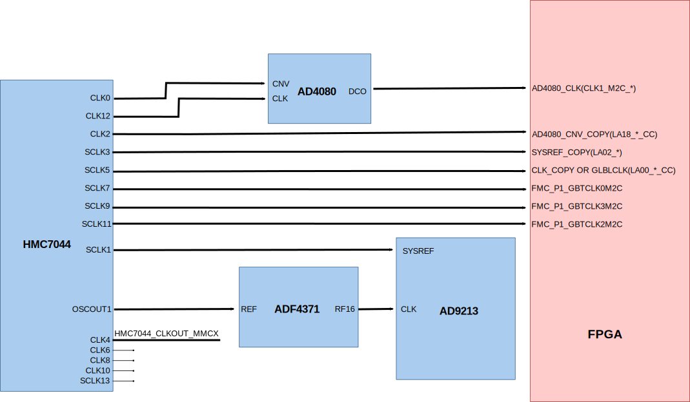

.. _ad9213_ad4080:

AD9213-AD4080(EVAL-ADMX6001-EBZ) HDL project
===============================================================================

Overview
-------------------------------------------------------------------------------
The :adi:`EVB-ADMX6001-EBZ <EVB-ADMX6001-EBZ>` is a reference design of a
DC-coupled single channel 10GSPS digitizer featuring the low noise 12-bit
high-speed ADC :adi:`AD9213 <AD9213>` and the 20-bit precision ADC
:adi:`AD4080 <AD4080>`. The dual-path design achieves true low noise
digitization in the broad band from DC to 5GHz. By biasing the ADC driver
ADL5580 with the precision DAC LTC2664, it is capable of handling unipolar
and bipolar signals at various DC levels, maximizing utility of the input
dynamic range of :adi:`AD9213 <AD9213>`.
This design is ideal for high performance time-domain instruments such as
time-of-flight mass spectrometry (TOFMS), distributed fiber optic sensing
(DFOS), and digital oscilloscope.

The :adi:`EVB-ADMX6001-EBZ <EVB-ADMX6001-EBZ>` reference design is a
processor based (e.g. Microblaze) embedded system.

The design implements a high-speed receive chain using JESD204B and a
precision data path using the custom interface IP :ref:`axi_ad408x`.

The receive chain transports the captured samples from ADC to the system
memory (DDR). Before transferring the data to DDR the samples are stored
in a buffer implemented on block rams from the FPGA fabric
(:git-hdl:`util_adcfifo <library/util_adcfifo>`).

All cores from the receive chain are programmable through
an AXI-Lite interface.

Supported boards
-------------------------------------------------------------------------------

- :adi:`EVB-ADMX6001-EBZ <EVB-ADMX6001-EBZ>`

Supported devices
-------------------------------------------------------------------------------

- :adi:`AD9213`
- :adi:`AD4080`

Supported carriers
-------------------------------------------------------------------------------

.. list-table::
   :widths: 35 35 30
   :header-rows: 1

   * - Evaluation board
     - Carrier
     - FMC slot
   * - :adi:`EVB-ADMX6001-EBZ <EVB-ADMX6001-EBZ>`
     - :xilinx:`VCU118`
     - FMC+

Block design
-------------------------------------------------------------------------------

Block diagram
~~~~~~~~~~~~~~~~~~~~~~~~~~~~~~~~~~~~~~~~~~~~~~~~~~~~~~~~~~~~~~~~~~~~~~~~~~~~~~~

The data path and clock domains are depicted in the below diagrams:

.. image:: ad9213_ad4080_hdl_block_diagram.svg
   :width: 800
   :align: center
   :alt: ADMX6001-EVB JESD204B M=1 L=16 block diagram

.. important::

   The Rx links (ADC Path) operate with the following parameters:

   - Rx parameters: L=16, M=1, F=2, S=16, NP=16, N=16
   - Sample Rate: 10 GSPS
   - Dual link: No
   - RX_DEVICE_CLK: 312.25 MHz (Lane Rate/40)
   - REF_CLK: 625 MHz (Lane Rate/20)
   - JESD204B Lane Rate: 12.5 Gbps
   - QPLL0

.. math::
   Lane Rate = Sample Rate*\frac{M}{L}*N'* \frac{10}{8}

Clock scheme
~~~~~~~~~~~~~~~~~~~~~~~~~~~~~~~~~~~~~~~~~~~~~~~~~~~~~~~~~~~~~~~~~~~~~~~~~~~~~~~

CPU/Memory interconnects addresses
~~~~~~~~~~~~~~~~~~~~~~~~~~~~~~~~~~~~~~~~~~~~~~~~~~~~~~~~~~~~~~~~~~~~~~~~~~~~~~~

The addresses are dependent on the architecture of the FPGA, having an offset
added to the base address from HDL (see more at :ref:`architecture cpu-intercon-addr`).

Check-out the table below to find out the conditions.

====================  ===============
Instance              Zynq/Microblaze
====================  ===============
axi_ad4080_adc        0x44A0_0000
axi_ad4080_dma        0x44A3_0000
axi_ad9213_xcvr       0x44A6_0000
rx_ad9213_tpl_core    0x44A1_0000
axi_ad9213_jesd       0x44A9_0000
hmc7044_spi           0x44A7_1000
ad4080_spi            0x44A7_2000
adl5580_spi           0x44A7_3000
ltc2664_spi           0x44A7_4000
axi_ad9213_dma        0x44B0_0000
====================  ===============

SPI connections
~~~~~~~~~~~~~~~~~~~~~~~~~~~~~~~~~~~~~~~~~~~~~~~~~~~~~~~~~~~~~~~~~~~~~~~~~~~~~~~

.. list-table::
   :widths: 25 25 25 25
   :header-rows: 1

   * - SPI type
     - SPI manager instance
     - SPI subordinate
     - CS
   * - PL
     - axi_spi
     - AD9213
     - 0
   * - PL
     - hmc7044_spi
     - HMC7044
     - 0
   * - PL
     - hmc7044_spi
     - ADF4371
     - 1
   * - PL
     - ltc2664_spi
     - LTC2664
     - 0
   * - PL
     - adl5580_spi
     - ADL5580
     - 0
   * - PL
     - ad4080_spi
     - AD4080
     - 0

GPIOs
~~~~~~~~~~~~~~~~~~~~~~~~~~~~~~~~~~~~~~~~~~~~~~~~~~~~~~~~~~~~~~~~~~~~~~~~~~~~~~~

.. list-table::
   :widths: 25 20 20
   :header-rows: 2

   * - GPIO signal
     - Direction
     - HDL GPIO EMIO
   * -
     - (from FPGA view)
     -
   * - ltc2664_tgp
     - INOUT
     - 55
   * - ltc2664_clr
     - INOUT
     - 54
   * - ltc2664_ldac
     - INOUT
     - 53
   * - adl5580_en
     - INOUT
     - 52
   * - ada4945_disable
     - INOUT
     - 51
   * - adg5419_ctrl
     - INOUT
     - 50
   * - adrf5203_ctrl[3:0]
     - INOUT
     - 49:47
   * - hmc7044_sync_req
     - INOUT
     - 46
   * - ad9213_rstb
     - INOUT
     - 45
   * - dig_ext_gpio[2:0]
     - INOUT
     - 44:43
   * - dig_ext_p
     - INOUT
     - 42
   * - dig_ext_hsdig_ext_n_n
     - INOUT
     - 41
   * - dig_ext_hs_p
     - INOUT
     - 40
   * - dig_ext_hs_n
     - INOUT
     - 39
   * - ad4080_gpio[3:2]
     - INOUT
     - 38:37
   * - ad9213_gpio[4:0]
     - INOUT
     - 36:32

Interrupts
~~~~~~~~~~~~~~~~~~~~~~~~~~~~~~~~~~~~~~~~~~~~~~~~~~~~~~~~~~~~~~~~~~~~~~~~~~~~~~~

Below are the Programmable Logic interrupts used in this project.

================ ===========
Instance name    IRQ number
================ ===========
axi_ad9213_jesd  6
axi_ad4080_dma   7
axi_ad9213_dma   8
hmc7044_spi      12
ad4080_spi       13
adl5580_spi      14
ltc2664_spi      15
================ ===========

Building the HDL project
-------------------------------------------------------------------------------

The design is built upon ADI's generic HDL reference design framework.
ADI distributes the bit/elf files of these projects as part of the
:dokuwiki:`ADI Kuiper Linux <resources/tools-software/linux-software/kuiper-linux>`.
If you want to build the sources, ADI makes them available on the
:git-hdl:`HDL repository </>`. To get the source you must
`clone <https://git-scm.com/book/en/v2/Git-Basics-Getting-a-Git-Repository>`__
the HDL repository.

Then go to the :git-hdl:`projects/ad9213_ad4080` location and run the make
command by typing in your command prompt:

**Linux/Cygwin/WSL**

.. shell::

   $cd hdl/projects/ad9213_ad4080/vcu118
   $make

A more comprehensive build guide can be found in the :ref:`build_hdl` user guide.

Resources
-------------------------------------------------------------------------------

Hardware related
~~~~~~~~~~~~~~~~~~~~~~~~~~~~~~~~~~~~~~~~~~~~~~~~~~~~~~~~~~~~~~~~~~~~~~~~~~~~~~~

- Product datasheet: :adi:`AD9213`
- Product datasheet: :adi:`AD4080`
- :adi:`AD9213 device data sheet <media/en/technical-documentation/data-sheets/AD9213.pdf>`
- :adi:`AD4080 device data sheet <media/en/technical-documentation/data-sheets/AD4080.pdf>`
- :adi:`Evaluation Board <en/resources/evaluation-hardware-and-software/evaluation-boards-kits/eval-admx6001-ebz.html>`

HDL related
~~~~~~~~~~~~~~~~~~~~~~~~~~~~~~~~~~~~~~~~~~~~~~~~~~~~~~~~~~~~~~~~~~~~~~~~~~~~~~~

- :git-hdl:`AD9213-AD4080(EVAL-ADMX6001-EBZ) HDL project source code <projects/ad9213_ad4080>`

.. list-table::
   :widths: 30 35 35
   :header-rows: 1

   * - IP name
     - Source code link
     - Documentation link
   * - AXI_DMAC
     - :git-hdl:`library/axi_dmac`
     - :ref:`axi_dmac`
   * - AXI_SYSID
     - :git-hdl:`library/axi_sysid`
     - :ref:`axi_sysid`
   * - JESD204_TPL_ADC
     - :git-hdl:`library/jesd204/ad_ip_jesd204_tpl_adc`
     - :ref:`ad_ip_jesd204_tpl_adc`
   * - AXI_JESD204_RX
     - :git-hdl:`library/jesd204/axi_jesd204_rx`
     - :ref:`axi_jesd204_rx`
   * - JESD204_RX
     - :git-hdl:`library/jesd204/jesd204_rx`
     - :ref:`jesd204_rx`
   * - SYSID_ROM
     - :git-hdl:`library/sysid_rom`
     - :ref:`axi_sysid`
   * - UTIL_ADCFIFO
     - :git-hdl:`library/util_adcfifo`
     - :ref:`util_adcfifo`
   * - AXI_ADXCVR
     - :git-hdl:`library/xilinx/axi_adxcvr`
     - :ref:`axi_adxcvr amd`
   * - UTIL_ADXCVR
     - :git-hdl:`library/xilinx/util_adxcvr`
     - :ref:`util_adxcvr`
   * - AXI_AD408X
     - :git-hdl:`library/axi_ad408x`
     - :ref:`axi_ad408x`
   * - AXI_CLKGEN
     - :git-hdl:`library/axi_clkgen`
     - :ref:`axi_clkgen`
   * - AXI_HDMI_TX
     - :git-hdl:`library/axi_hdmi_tx`
     - :ref:`axi_hdmi_tx`
   * - AXI_I2S_ADI
     - :git-hdl:`library/axi_i2s_adi`
     - :ref:`axi_i2s_adi`
   * - AXI_SPDIF_TX
     - :git-hdl:`library/axi_spdif_tx`
     - :ref:`axi_spdif_tx`
   * - UTIL_I2C_MIXER
     - :git-hdl:`library/util_i2c_mixer`
     - :ref:`util_i2c_mixer`

- :dokuwiki:`[Wiki] Generic JESD204B block designs <resources/fpga/docs/hdl/generic_jesd_bds>`
- :ref:`jesd204`

.. include:: ../common/more_information.rst

.. include:: ../common/support.rst
