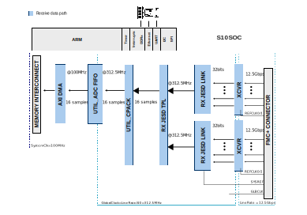
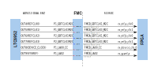

.. _ad9213_dual_ebz:

AD9213-DUAL-EBZ HDL Project
===============================================================================

Overview
-------------------------------------------------------------------------------

The :adi:`EVAL-AD9213-DUAL-EBZ` platform includes two :adi:`AD9213`
single, 12-bit, 10 GSPS, radio frequency (RF) analog-to-digital converters (ADC)
with the JESD204B interface. The two 10 GSPS data converters are interleaved to
sample at 20 GSPS enabled by their built-in multi-chip synchronization
capability.

The :adi:`ADF4377`, high performance, ultra-low jitter, dual output
integer-N phased locked loop (PLL) with an integrated voltage-controlled
oscillator (VCO), supports the interleaving. The :adi:`LTC6955`, low jitter,
fanout clock buffer, and the :adi:`LTC6952` JESD204B clock generation and
distribution IC enable a clocking architecture built for multi-channel
scalability.

The reference design is a processor based (e.g. ARM) embedded system. The device
interfaces to the FPGA transceivers followed by the individual JESD204B and ADC
cores. The cores are programmable through an AXI-Lite interface. The samples are
initially captured by :git-hdl:`UTIL_ADCFIFO <library/util_adcfifo>` and then
passed to the system memory (DDR). The user can capture up to 1048576 samples
per channel, if both channels are selected or 2097152 per channel if only
one channel is selected or in the case the data is considered single
channel interposed. The platform allows users to direct sample L, S, and
C bands, all while supporting up to 8GHz of IBW per channel.

Features:

- 20GSPS sample rate through interleaving supporting up to 8 GHz of
  instantaneous BW
- Multi-chip synchronization (MCS) at 10GSPS using a scalable reference
  distribution architecture
- Input network supporting a wde analog frequency range DC - 9GHz
- Compact layout scheme that can be quickly adopted into a customer application

Supported boards
-------------------------------------------------------------------------------

- :adi:`EVAL-AD9213-DUAL-EBZ`

Supported devices
-------------------------------------------------------------------------------

- :adi:`AD9213`

Supported carriers
-------------------------------------------------------------------------------

- :intel:`S10SoC <content/www/us/en/products/details/fpga/development-kits/stratix/10-sx.html>`

Block design
-------------------------------------------------------------------------------

The design has two JESD receive chains, each having 16 lanes at rates of up
to 12.5Gbps. The JESD receive chain consists of a Physical layer, represented
by an XCVR module, a Link layer represented by an RX JESD LINK module.
The Transport layer is common and is represented by a RX JESD TPL module.
The links operate in Subclass 1 by using the SYSREF signal to edge-align the
internal Local Multi-Frame Clock and to release the received data in the same
moment from all lanes, therefore ensuring that data from all channels is
synchronized at the Application layer.

Both links are set for full bandwidth mode and operate with the following
parameters:

- Deframer paramaters: L=16, M=1, F=2, S=16, NP=16
- GLBLCLK - 312.5 MHz (Lane Rate/40)
- REFCLK - 312.5 MHz (Lane Rate/40)
- SYSREF - 6.25 MHz (DEVCLK/2000)
- DEVCLK - 10 GHz
- JESD204B Lane Rate - 12.5 Gbps

The transport layer component presents on its output 1024 bits at once on every
clock cycle, representing 16 samples per converter.
The typical UTIL CPACK/UPACK IP does not meet timing in this design, so a
custom one was implemented in the *system_top.v* module. An ADC buffer is
used to store 1024k samples per converter in the fabric before transferring
it with the DMA.

Block diagram
~~~~~~~~~~~~~~~~~~~~~~~~~~~~~~~~~~~~~~~~~~~~~~~~~~~~~~~~~~~~~~~~~~~~~~~~~~~~~~~

The data path and clock domains are depicted in the below diagram:

Configuration modes
~~~~~~~~~~~~~~~~~~~~~~~~~~~~~~~~~~~~~~~~~~~~~~~~~~~~~~~~~~~~~~~~~~~~~~~~~~~~~~~

This project **supports only one JESD204B configuration**, as follows (the
values cannot be changed):

- JESD204B subclass 1, uses ADI IP as Physical Layer
- RX_LANE_RATE: lane rate of the Rx link (MxFE to FPGA)
- REF_CLK_RATE: the rate of the reference clock
- L: number of lanes per link: 16
- M: number of converters per link: 1
- S: number of samples per frame: 16
- NP: number of bits per sample: 16
- F: octets per frame: 2
- K: frames per multiframe: 32

Clocking scheme
~~~~~~~~~~~~~~~~~~~~~~~~~~~~~~~~~~~~~~~~~~~~~~~~~~~~~~~~~~~~~~~~~~~~~~~~~~~~~~~

Both physical layer transceiver modules receive two reference clocks from
LTC6952 OUT4-7 outputs. The global device clock (LaneRate/40) is received
directly from the OUT8 output and SYSREF is received from OUT9 output of the
LTC6952. Internally to the FPGA, REFCLK1 for both transceivers (from OUT5 and
OUT7 of the eval pcb) is unused and not connected.

CPU/Memory interconnects addresses
~~~~~~~~~~~~~~~~~~~~~~~~~~~~~~~~~~~~~~~~~~~~~~~~~~~~~~~~~~~~~~~~~~~~~~~~~~~~~~~

===============================  ===========
Instance                         S10SoC
===============================  ===========
ad9213_rx_0.link_pll_reconfig    0x0006_0000
ad9213_rx_0.phy_reconfig_0       0x0004_0000
ad9213_rx_0.phy_reconfig_1       0x0004_2000
ad9213_rx_0.phy_reconfig_2       0x0004_4000
ad9213_rx_0.phy_reconfig_3       0x0004_6000
ad9213_rx_0.phy_reconfig_4       0x0004_8000
ad9213_rx_0.phy_reconfig_5       0x0004_A000
ad9213_rx_0.phy_reconfig_6       0x0004_C000
ad9213_rx_0.phy_reconfig_7       0x0004_E000
ad9213_rx_0.phy_reconfig_8       0x0005_0000
ad9213_rx_0.phy_reconfig_9       0x0005_2000
ad9213_rx_0.phy_reconfig_10      0x0005_4000
ad9213_rx_0.phy_reconfig_11      0x0005_6000
ad9213_rx_0.phy_reconfig_12      0x0005_8000
ad9213_rx_0.phy_reconfig_13      0x0005_A000
ad9213_rx_0.phy_reconfig_14      0x0005_C000
ad9213_rx_0.phy_reconfig_15      0x0005_E000
ad9213_rx_1.link_pll_reconfig    0x000A_0000
ad9213_rx_1.phy_reconfig_0       0x0008_0000
ad9213_rx_1.phy_reconfig_1       0x0008_2000
ad9213_rx_1.phy_reconfig_2       0x0008_4000
ad9213_rx_1.phy_reconfig_3       0x0008_6000
ad9213_rx_1.phy_reconfig_4       0x0008_8000
ad9213_rx_1.phy_reconfig_5       0x0008_A000
ad9213_rx_1.phy_reconfig_6       0x0008_C000
ad9213_rx_1.phy_reconfig_7       0x0008_E000
ad9213_rx_1.phy_reconfig_8       0x0009_0000
ad9213_rx_1.phy_reconfig_9       0x0009_2000
ad9213_rx_1.phy_reconfig_10      0x0009_4000
ad9213_rx_1.phy_reconfig_11      0x0009_6000
ad9213_rx_1.phy_reconfig_12      0x0009_8000
ad9213_rx_1.phy_reconfig_13      0x0009_A000
ad9213_rx_1.phy_reconfig_14      0x0009_C000
ad9213_rx_1.phy_reconfig_15      0x0009_E000
ad9213_rx_0.link_reconfig        0x000C_0000
ad9213_rx_0.link_management      0x000C_4000
ad9213_rx_1.link_reconfig        0x000C_8000
ad9213_rx_1.link_management      0x000C_C000
axi_ad9213_dual_tpl.s_axi        0x000D_0000
axi_ad9213_dma.s_axi             0x000D_2000
ltc_spi.spi_control_port         0x0000_0200
adf4377_spi.spi_control_port     0x0000_0400
ad9213_dual_pio.s1               0x0000_0800
===============================  ===========

SPI connections
~~~~~~~~~~~~~~~~~~~~~~~~~~~~~~~~~~~~~~~~~~~~~~~~~~~~~~~~~~~~~~~~~~~~~~~~~~~~~~~

.. list-table::
   :widths: 20 25 25 15
   :header-rows: 2

   * - SPI type
     - SPI manager instance
     - SPI subordinate
     - CS
   * - Stratix 10
     - Stratix 10
     -
     -
   * - PL
     - SYS_SPI/AXI_SPI
     - AD9213_0
     - 0
   * - PL
     - SYS_SPI/AXI_SPI
     - AD9213_1
     - 1
   * - PL
     - LTC_SPI/AXI_SPI
     - LTC6952
     - 0
   * - PL
     - LTC_SPI/AXI_SPI
     - LTC6946
     - 1
   * - PL
     - ADF4377_SPI/AXI_SPI
     - ADF4377_0
     - 0
   * - PL
     - ADF4377_SPI/AXI_SPI
     - ADF4377_1
     - 1

GPIOs
~~~~~~~~~~~~~~~~~~~~~~~~~~~~~~~~~~~~~~~~~~~~~~~~~~~~~~~~~~~~~~~~~~~~~~~~~~~~~~~

.. list-table::
   :widths: 25 20 20 15
   :header-rows: 2

   * - GPIO signal
     - Direction
     - HDL GPIO EMIO
     - Software GPIO
   * -
     - (from FPGA view)
     -
     - Stratix 10
   * - ad9213_a_rst
     - INOUT
     - 32
     - 0
   * - ad9213_b_rst
     - INOUT
     - 33
     - 1
   * - adc_swap
     - INOUT
     - 34
     - 2

Interrupts
~~~~~~~~~~~~~~~~~~~~~~~~~~~~~~~~~~~~~~~~~~~~~~~~~~~~~~~~~~~~~~~~~~~~~~~~~~~~~~~

Below are the Programmable Logic interrupts used in this project.

================= === ======
Instance name     HDL S10SoC
================= === ======
ad9213_rx_0       11  28
ad9213_rx_1       12  29
axi_ad9213_dma    13  30
ad9213_dual_pio   15  32
adf4377_spi       16  33
ltc_spi           17  34
================= === ======

Building the HDL project
-------------------------------------------------------------------------------

The design is built upon ADI's generic HDL reference design framework.
ADI distributes the bit/elf files of these projects as part of the
:dokuwiki:`ADI Kuiper Linux <resources/tools-software/linux-software/kuiper-linux>`.
If you want to build the sources, ADI makes them available on the
:git-hdl:`HDL repository </>`. To get the source you must
`clone <https://git-scm.com/book/en/v2/Git-Basics-Getting-a-Git-Repository>`__
the HDL repository.

Then go to the hdl/projects/ad9213_dual_ebz/s10soc location and run the make
command.

**Linux/Cygwin/WSL**

.. shell::

   $cd hdl/projects/ad9213_dual_ebz/s10soc
   $make

A more comprehensive build guide can be found in the :ref:`build_hdl` user guide.

Resources
-------------------------------------------------------------------------------

Systems related
~~~~~~~~~~~~~~~~~~~~~~~~~~~~~~~~~~~~~~~~~~~~~~~~~~~~~~~~~~~~~~~~~~~~~~~~~~~~~~~

- :dokuwiki:`Quick Start Guide for Initial Bring-Up of the AD9213-Dual-EBZ ADC Evaluation Board With the Intel Stratix10 FPGA Board <resources/eval/user-guides/ad9213_dual_ebz/quickstart>`

Hardware related
~~~~~~~~~~~~~~~~~~~~~~~~~~~~~~~~~~~~~~~~~~~~~~~~~~~~~~~~~~~~~~~~~~~~~~~~~~~~~~~

- Product datasheet: :adi:`AD9213`

- The schematic for the evaluation board can be found
  :dokuwiki:`here <_media/resources/eval/02_049155d_top.pdf>`

HDL related
~~~~~~~~~~~~~~~~~~~~~~~~~~~~~~~~~~~~~~~~~~~~~~~~~~~~~~~~~~~~~~~~~~~~~~~~~~~~~~~

- :git-hdl:`AD9213_DUAL_EBZ HDL project source code <projects/ad9213_dual_ebz>`

.. list-table::
   :widths: 30 35 35
   :header-rows: 1

   * - IP name
     - Source code link
     - Documentation link
   * - AXI_DMAC
     - :git-hdl:`library/axi_dmac`
     - :ref:`axi_dmac`
   * - AXI_SYSID
     - :git-hdl:`library/axi_sysid`
     - :ref:`axi_sysid`
   * - SYSID_ROM
     - :git-hdl:`library/sysid_rom`
     - :ref:`axi_sysid`
   * - UTIL_ADCFIFO
     - :git-hdl:`library/util_adcfifo`
     - ---
   * - ADI_JESD204 for Intel
     - :git-hdl:`library/intel/adi_jesd204`
     - ---
   * - AXI_ADXCVR for Intel
     - :git-hdl:`library/intel/axi_adxcvr`
     - :ref:`axi_adxcvr intel`
   * - JESD204_TPL_ADC
     - :git-hdl:`library/jesd204/ad_ip_jesd204_tpl_adc`
     - :ref:`ad_ip_jesd204_tpl_adc`

- :dokuwiki:`[Wiki] Generic JESD204B block designs <resources/fpga/docs/hdl/generic_jesd_bds>`
- :ref:`jesd204`

Software related
~~~~~~~~~~~~~~~~~~~~~~~~~~~~~~~~~~~~~~~~~~~~~~~~~~~~~~~~~~~~~~~~~~~~~~~~~~~~~~~

- :dokuwiki:`[Wiki] Stratix 10 SoC Development Kit Linux Quick Start Guide <resources/eval/user-guides/ad9213_dual_ebz/software>`

.. include:: ../common/more_information.rst

.. include:: ../common/support.rst
