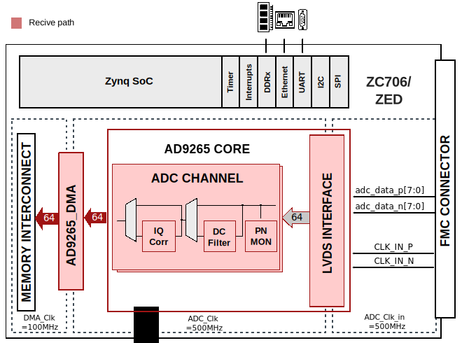

.. _ad9265_fmc:

AD9265-FMC HDL project
================================================================================

Overview
-------------------------------------------------------------------------------

The :adi:`AD9265` is a 16-bit, 125 MSPS analog-to-digital converter (ADC). The
:adi:`AD9265` is designed to support communications applications where high
performance combined with low cost, small size, and versatility is desired. The
ADC core features a multistage, differential pipelined architecture with
integrated output error correction logic to provide 16-bit accuracy at 125 MSPS
data rates and guarantees no missing codes over the full operating temperature
range. The ADC output data format is either parallel 1.8 V CMOS or LVDS (DDR).
A data output clock is provided to ensure proper latch timing with receiving
logic. The board also provides other options to drive the clock and analog
inputs of the ADC.

Supported boards
-------------------------------------------------------------------------------

- :adi:`EVAL-AD9265`

Supported devices
-------------------------------------------------------------------------------

- :adi:`AD9265`

Supported carriers
-------------------------------------------------------------------------------

.. list-table::
   :widths: 35 35 30
   :header-rows: 1

   * - Evaluation board
     - Carrier
     - FMC slot
   * - :adi:`EVAL-AD9265-FMC-500EBZ <EVAL-AD9265>`
     - :xilinx:`ZC706`
     - FMC LPC
   * -
     - `ZedBoard <https://digilent.com/shop/zedboard-zynq-7000-arm-fpga-soc-development-board>`__
     - FMC LPC

Block design
-------------------------------------------------------------------------------

Block diagram
~~~~~~~~~~~~~~~~~~~~~~~~~~~~~~~~~~~~~~~~~~~~~~~~~~~~~~~~~~~~~~~~~~~~~~~~~~~~~~~

Clock scheme
~~~~~~~~~~~~~~~~~~~~~~~~~~~~~~~~~~~~~~~~~~~~~~~~~~~~~~~~~~~~~~~~~~~~~~~~~~~~~~~

There are 3 ways to configure the clock source for :adi:`AD9265`:

- External passive clock (default)
- Optional active clock path using the :adi:`AD9517`
- Optional oscillator

For more details, check :adi:`AD9265` schematic.

CPU/Memory interconnects addresses
~~~~~~~~~~~~~~~~~~~~~~~~~~~~~~~~~~~~~~~~~~~~~~~~~~~~~~~~~~~~~~~~~~~~~~~~~~~~~~~

The addresses are dependent on the architecture of the FPGA, having an offset
added to the base address from HDL (see more at :ref:`architecture cpu-intercon-addr`).

==================== ===============
Instance             Zynq/Microblaze
==================== ===============
axi_ad9265           0x44A0_0000
axi_ad9265_dma       0x44A3_0000
==================== ===============

SPI connections
~~~~~~~~~~~~~~~~~~~~~~~~~~~~~~~~~~~~~~~~~~~~~~~~~~~~~~~~~~~~~~~~~~~~~~~~~~~~~~~

.. list-table::
   :widths: 25 25 25 25
   :header-rows: 1

   * - SPI type
     - SPI manager instance
     - SPI subordinate
     - CS
   * - PS
     - SPI 0
     - AD9517
     - 1

Interrupts
~~~~~~~~~~~~~~~~~~~~~~~~~~~~~~~~~~~~~~~~~~~~~~~~~~~~~~~~~~~~~~~~~~~~~~~~~~~~~~~

Below are the Programmable Logic interrupts used in this project.

.. list-table::
   :widths: 30 10 15 15
   :header-rows: 1

   * - Instance name
     - HDL
     - Linux Zynq
     - Actual Zynq
   * - axi_ad9265_dma
     - 13
     - 57
     - 89

Building the HDL project
-------------------------------------------------------------------------------

The design is built upon ADI's generic HDL reference design framework.
ADI distributes the bit/elf files of these projects as part of the
:dokuwiki:`ADI Kuiper Linux <resources/tools-software/linux-software/kuiper-linux>`.
If you want to build the sources, ADI makes them available on the
:git-hdl:`HDL repository </>`. To get the source you must
`clone <https://git-scm.com/book/en/v2/Git-Basics-Getting-a-Git-Repository>`__
the HDL repository.

Then go to the project location (**projects/ad9265_fmc/carrier**) and run the
make command by typing in your command prompt(this example :xilinx:`ZC706`):

**Linux/Cygwin/WSL**

.. shell::

   $cd hdl/projects/ad9265_fmc/zc706
   $make

A more comprehensive build guide can be found in the :ref:`build_hdl` user guide.

Resources
-------------------------------------------------------------------------------

Systems related
~~~~~~~~~~~~~~~~~~~~~~~~~~~~~~~~~~~~~~~~~~~~~~~~~~~~~~~~~~~~~~~~~~~~~~~~~~~~~~~

Here you can find the quick start guides available for these evaluation boards:

.. list-table::
   :widths: 20 10
   :header-rows: 1

   * - Evaluation board
     - Zynq-7000
   * - AD9265-FMC
     - :dokuwiki:`ZC706 <resources/fpga/xilinx/fmc/ad9265>`

Hardware related
~~~~~~~~~~~~~~~~~~~~~~~~~~~~~~~~~~~~~~~~~~~~~~~~~~~~~~~~~~~~~~~~~~~~~~~~~~~~~~~

- Product datasheets: :adi:`AD9265`
- :dokuwiki:`[Wiki] Evaluating AD9265, user guide <resources/eval/ad9265-fmc-125ebz>`

HDL related
~~~~~~~~~~~~~~~~~~~~~~~~~~~~~~~~~~~~~~~~~~~~~~~~~~~~~~~~~~~~~~~~~~~~~~~~~~~~~~~

- :git-hdl:`AD9265-FMC HDL project source code <projects/ad9265_fmc>`

.. list-table::
   :widths: 30 35 35
   :header-rows: 1

   * - IP name
     - Source code link
     - Documentation link
   * - AXI_AD9265
     - :git-hdl:`library/axi_ad9265`
     - :ref:`axi_ad9265`
   * - AXI_DMAC
     - :git-hdl:`library/axi_dmac`
     - :ref:`axi_dmac`
   * - AXI_CLKGEN
     - :git-hdl:`library/axi_clkgen`
     - :ref:`axi_clkgen`
   * - AXI_HDMI_TX
     - :git-hdl:`library/axi_hdmi_tx`
     - :ref:`axi_hdmi_tx`
   * - AXI_SPDIF_TX
     - :git-hdl:`library/axi_spdif_tx`
     - ---
   * - AXI_I2S_ADI
     - :git-hdl:`library/axi_i2s_adi`
     - ---
   * - AXI_SYSID
     - :git-hdl:`library/axi_sysid`
     - :ref:`axi_sysid`
   * - SYSID_ROM
     - :git-hdl:`library/sysid_rom`
     - :ref:`axi_sysid`
   * - UTIL_I2C_MIXER
     - :git-hdl:`library/util_i2c_mixer`
     - :ref:`spi_engine offload`

Software related
~~~~~~~~~~~~~~~~~~~~~~~~~~~~~~~~~~~~~~~~~~~~~~~~~~~~~~~~~~~~~~~~~~~~~~~~~~~~~~~

- :git-linux:`Linux device tree zynq-zc706-adv7511-ad9265-fmc-125ebz.dts <arch/arm/boot/dts/zynq-zc706-adv7511-ad9265-fmc-125ebz.dts>`
- :git-linux:`Linux device tree zynq-zed-adv7511-ad9265-fmc-125ebz.dts <arch/arm/boot/dts/zynq-zed-adv7511-ad9265-fmc-125ebz.dts>`
- :git-no-os:`No-Os device driver <drivers/adc/ad9265>`
- :git-no-os:`No-Os project <projects/ad9265-fmc-125ebz>`
- :git-linux:`Linux driver ad9467.c <drivers/iio/adc/ad9467.c>`
  (used for AD9265-FMC as well)

.. include:: ../common/more_information.rst

.. include:: ../common/support.rst
