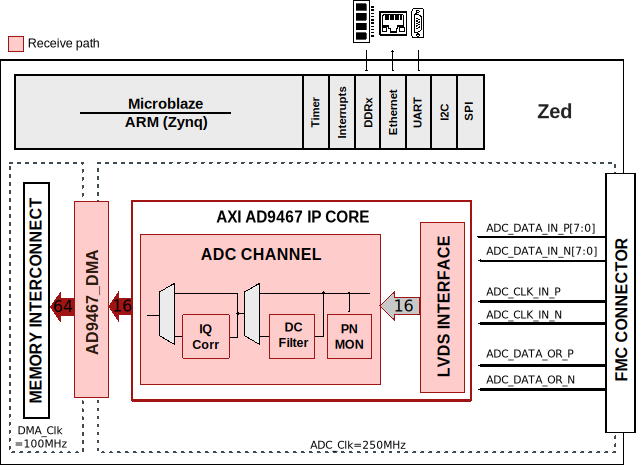

.. _ad9467_fmc:

AD9467-FMC HDL project
===============================================================================

Overview
-------------------------------------------------------------------------------

The :adi:`AD9467` chip used on :adi:`EVAL-AD9467` is a 16-bit, monolithic, IF
sampling analog-to-digital converter (ADC) with a conversion rate of up
to 250 MSPS. This reference design includes a data capture interface and
the external DDR-DRAM interface for sample storage. It allows
programming the device and monitoring its internal status registers. The
board also provides other options to drive the clock and analog inputs
of the ADC. This can be done by programming the :adi:`AD9517-4` clock chip
and/or setting up the :adi:`ADL5565` differential amplifier, respectively.

Supported boards
-------------------------------------------------------------------------------

- :adi:`AD9467-FMC-250EBZ <EVAL-AD9467>` also referred to as EVAL-AD9467

Supported devices
-------------------------------------------------------------------------------

- :adi:`AD9467`

Supported carriers
-------------------------------------------------------------------------------

- :xilinx:`KC705` LPC slot *
- `ZedBoard <https://digilent.com/shop/zedboard-zynq-7000-arm-fpga-soc-development-board>`__
- :xilinx:`ZCU102` FMC HPC0

.. admonition:: Legend
   :class: note

   - ``*`` removed; last release that supports this project on this carrier is
     :git-hdl:`hdl_2023_r2 <hdl_2023_r2:projects/ad9467_fmc/kc705>`

Block design
-------------------------------------------------------------------------------

The PN9/PN23 sequences are not compatible with O.150. Please use the
equations given in the reference design. They follow the polynomial
equations as in O.150, but ONLY the MSB is inverted.

The :adi:`AD9467` drives the interleaved first byte (D15:D1) on the rising edge
and second byte (D14:D0) on the falling edge of DCO clock. However, in
certain frequencies the captured data (from IDDR) seems to be reverse.
If that occurs, try setting the "capture select" bit (register 0x0A, bit to 0).

VADJ setting
~~~~~~~~~~~~~~~~~~~~~~~~~~~~~~~~~~~~~~~~~~~~~~~~~~~~~~~~~~~~~~~~~~~~~~~~~~~~~~~

.. warning::

   For ZedBoard, the VADJ must be set to 2.5V.

   For ZCU102, the :adi:`EVAL-AD9467` it has on board EEPROM that will be read
   as per VITA 57.1 FMC standards. It provides information to set the VADJ to 
   1.8V. There are onboard level shifters on the :adi:`EVAL-AD9467` to accomodate 
   the change in VADJ.

Block diagram
~~~~~~~~~~~~~~~~~~~~~~~~~~~~~~~~~~~~~~~~~~~~~~~~~~~~~~~~~~~~~~~~~~~~~~~~~~~~~~~

Project block diagram
^^^^^^^^^^^^^^^^^^^^^^^^^^^^^^^^^^^^^^^^^^^^^^^^^^^^^^^^^^^^^^^^^^^^^^^^^^^^^^^

The data path and clock domains are depicted in the below diagram:

AD9467 FMC card block diagram
^^^^^^^^^^^^^^^^^^^^^^^^^^^^^^^^^^^^^^^^^^^^^^^^^^^^^^^^^^^^^^^^^^^^^^^^^^^^^^^

The block diagram of the AD9467-FMC evaluation board is depicted below:

The reference design is built on an ARM/Microblaze based system tailored
for Linux.

Through an SPI interface, the software can access the :adi:`AD9467` and the
:adi:`AD9517-4` registers, having the possibility to initialize and configure
the ADC and/or clock chip.

The :git-hdl:`LVDS interface <library/axi_ad9467/axi_ad9467_if.v>` captures
and buffers data from the ADC. The DMA interface then transfers the samples
to the external DDR-DRAM. The capture is initiated by the software. The status
of capture (overflow, over the range) are reported back to the software.

Clock selection
~~~~~~~~~~~~~~~~~~~~~~~~~~~~~~~~~~~~~~~~~~~~~~~~~~~~~~~~~~~~~~~~~~~~~~~~~~~~~~~

The board provides 3 possible clock paths for clocking the :adi:`AD9467`
(some of them require hardware changes), as follows:

Default clock input
^^^^^^^^^^^^^^^^^^^^^^^^^^^^^^^^^^^^^^^^^^^^^^^^^^^^^^^^^^^^^^^^^^^^^^^^^^^^^^^

The **default clock input** circuitry is derived from a simple
transformer-coupled circuit using a high bandwidth 1:1 impedance ratio
transformer (T201) that adds a very low amount of jitter to the clock
path. The clock input (J201) is 50 Ohm terminated and AC-coupled to
handle single-ended sine wave types of inputs. The transformer
converts the single-ended input to a differential signal that is
clipped before entering the ADC clock inputs.

Crystal oscillator
^^^^^^^^^^^^^^^^^^^^^^^^^^^^^^^^^^^^^^^^^^^^^^^^^^^^^^^^^^^^^^^^^^^^^^^^^^^^^^^

The evaluation board can be set up to be clocked from the **crystal
oscillator**, Y200. This oscillator is a low phase noise oscillator from
Vectron (VCC6-QCD-250M000).

- Install C205 and C206
- Remove C202

Jumper P200 is used to disable the oscillator from running.

Clock generator AD9517
^^^^^^^^^^^^^^^^^^^^^^^^^^^^^^^^^^^^^^^^^^^^^^^^^^^^^^^^^^^^^^^^^^^^^^^^^^^^^^^

A **differential LVPECL or LVDS clock driver** can also be used to clock
the ADC input using the AD9517.

- Populate (C304, C305) for LVPECL clock driver **or** (C306, C307) for
  LVDS clock driver, with 0.1 µF capacitors
- Remove C209 and C210 to disconnect the default clock path inputs

The :adi:`AD9517` has many SPI-selectable options that are set to a default
mode of operation. Consult the :adi:`AD9517` data sheet for more information
about these and other options.

.. warning::

   Please make sure you have removed or inserted the appropriate components
   on the board to select the desired clock path.

   C302 and C303 are not installed as indicated in the Schematic and BOM.

CPU/Memory interconnects addresses
~~~~~~~~~~~~~~~~~~~~~~~~~~~~~~~~~~~~~~~~~~~~~~~~~~~~~~~~~~~~~~~~~~~~~~~~~~~~~~~

The addresses are dependent on the architecture of the FPGA, having an offset
added to the base address from HDL (see more at :ref:`architecture cpu-intercon-addr`).

==================== =============== ===========
Instance             Zynq/Microblaze ZynqMP
==================== =============== ===========
axi_ad9467           0x44A0_0000     0x84A0_0000
axi_ad9467_dma       0x44A3_0000     0x84A3_0000
==================== =============== ===========

SPI connections
~~~~~~~~~~~~~~~~~~~~~~~~~~~~~~~~~~~~~~~~~~~~~~~~~~~~~~~~~~~~~~~~~~~~~~~~~~~~~~~

Depending on the carrier, the SPI connections are as follows:

.. list-table::
   :widths: 25 25 25 25
   :header-rows: 1

   * - SPI type
     - SPI manager instance
     - SPI subordinate
     - CS
   * - PS
     - spi0
     - AD9467
     - 0
   * - PS
     - spi0
     - AD9517-4
     - 1
   * - MicroBlaze
     - spi_*
     - AD9467
     - 0

Interrupts
~~~~~~~~~~~~~~~~~~~~~~~~~~~~~~~~~~~~~~~~~~~~~~~~~~~~~~~~~~~~~~~~~~~~~~~~~~~~~~~

Below are the Programmable Logic interrupts used in this project.

================ ====== ====== ========== =========== ========
Instance name    HDL PS HDL MB Linux Zynq Actual Zynq Linux MB
================ ====== ====== ========== =========== ========
axi_ad9467_dma   13     12     57         89          12
================ ====== ====== ========== =========== ========

Building the HDL project
-------------------------------------------------------------------------------

The design is built upon ADI's generic HDL reference design framework.
ADI distributes the bit/elf files of these projects as part of the
:dokuwiki:`ADI Kuiper Linux <resources/tools-software/linux-software/kuiper-linux>`.
If you want to build the sources, ADI makes them available on the
:git-hdl:`HDL repository </>`. To get the source you must
`clone <https://git-scm.com/book/en/v2/Git-Basics-Getting-a-Git-Repository>`__
the HDL repository.

Then go to the :git-hdl:`projects/ad9467_fmc <projects/ad9467_fmc>`
location and run the make command by typing in your command prompt:

**Linux/Cygwin/WSL**

.. shell::

   $cd hdl/projects/ad9467_fmc/zed
   $make

A more comprehensive build guide can be found in the :ref:`build_hdl` user guide.

Resources
-------------------------------------------------------------------------------

Systems related
~~~~~~~~~~~~~~~~~~~~~~~~~~~~~~~~~~~~~~~~~~~~~~~~~~~~~~~~~~~~~~~~~~~~~~~~~~~~~~~

- :dokuwiki:`AD9467-FMC Quick Start Guide <resources/fpga/xilinx/fmc/ad9467>`

Hardware related
~~~~~~~~~~~~~~~~~~~~~~~~~~~~~~~~~~~~~~~~~~~~~~~~~~~~~~~~~~~~~~~~~~~~~~~~~~~~~~~

- Product datasheet: :adi:`AD9467`
- The schematic of the new board can be found
  :dokuwiki:`here <_media/resources/fpga/xilinx/fmc/02-041710-01-c-1.pdf>`
  (for older versions,
  :dokuwiki:`here <_media/resources/fpga/xilinx/fmc/9467fmc01c_sch.pdf>`)

HDL related
~~~~~~~~~~~~~~~~~~~~~~~~~~~~~~~~~~~~~~~~~~~~~~~~~~~~~~~~~~~~~~~~~~~~~~~~~~~~~~~

- :git-hdl:`AD9467_FMC HDL project source code <projects/ad9467_fmc>`

.. list-table::
   :widths: 30 35 35
   :header-rows: 1

   * - IP name
     - Source code link
     - Documentation link
   * - AXI_AD9467
     - :git-hdl:`library/axi_ad9467`
     - :ref:`axi_ad9467`
   * - AXI_CLKGEN
     - :git-hdl:`library/axi_clkgen`
     - :ref:`axi_clkgen`
   * - AXI_DMAC
     - :git-hdl:`library/axi_dmac`
     - :ref:`axi_dmac`
   * - AXI_HDMI_TX *
     - :git-hdl:`library/axi_hdmi_tx`
     - :ref:`axi_hdmi_tx`
   * - AXI_I2S_ADI *
     - :git-hdl:`library/axi_i2s_adi`
     - ---
   * - AXI_SPDIF_TX *
     - :git-hdl:`library/axi_spdif_tx`
     - ---
   * - AXI_SYSID
     - :git-hdl:`library/axi_sysid`
     - :ref:`axi_sysid`
   * - SYSID_ROM
     - :git-hdl:`library/sysid_rom`
     - :ref:`axi_sysid`
   * - UTIL_I2C_MIXER *
     - :git-hdl:`library/util_i2c_mixer`
     - ---

.. admonition:: Legend
   :class: note

   - ``*`` instantiated only for Zedboard

Software related
~~~~~~~~~~~~~~~~~~~~~~~~~~~~~~~~~~~~~~~~~~~~~~~~~~~~~~~~~~~~~~~~~~~~~~~~~~~~~~~

- :git-linux:`AD9467-FMC KC705 Linux device tree (2023_R2 release) <2023_R2:arch/microblaze/boot/dts/kc705_ad9467_fmc.dts>`
- :git-linux:`AD9467-FMC ZedBoard Linux device tree zynq-zed-adv7511-ad9467-fmc-250ebz.dts <arch/arm/boot/dts/xilinx/zynq-zed-adv7511-ad9467-fmc-250ebz.dts>`
- :git-linux:`AD9467-FMC ZCU102 Linux device tree zynqmp-zcu102-rev10-ad9467-fmc-250ebz.dts <arch/arm64/boot/dts/xilinx/zynqmp-zcu102-rev10-ad9467-fmc-250ebz.dts>`
- :git-linux:`AD9467-FMC KC705 Linux device tree (2023_R2 release) <2023_R2:arch/microblaze/boot/dts/kc705_ad9467_fmc.dts>`
- :git-linux:`Linux driver ad9467.c <drivers/iio/adc/ad9467.c>`
- :dokuwiki:`[Wiki] AD9467-FMC on ZedBoard using ACE </resources/eval/ad9467-fmc-250ebz-zedboard>`
- :git-no-os:`AD9467 no-OS project <projects/ad9467>` and
  :git-no-os:`AD9467 no-OS driver <drivers/adc/ad9467>`

.. include:: ../common/more_information.rst

.. include:: ../common/support.rst
