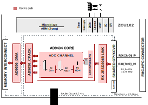
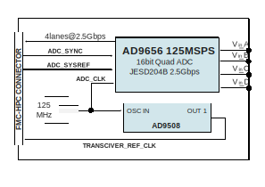

.. _ad9656_fmc:

AD9656-FMC HDL project
================================================================================

Overview
-------------------------------------------------------------------------------

The :adi:`AD9656` is a quad 16-bit, 125 MSPS analog-to-digital converter (ADC)
featuring an on-chip sample and hold circuit. It is designed to be low cost, low
power and compact, making it easy to use.

:adi:`AD9656` operates at a conversion rate of up to 125 MSPS, optimized for
excellent dynamic performance and low power consumption, which is crucial for
applications requiring a small package size. It requires a single 1.8 V power
supply and supports LVPECL, CMOS, and LVDS-compatible sample rate clocks for
full performance. The ADC does not need external reference or driver components
for many applications. It also includes features to enhance flexibility and
reduce system costs, such as a programmable output clock, data alignment
and digital test pattern generation.

An on-chip phase-locked loop (PLL) allows users to provide a single ADC sampling
clock. The PLL multiplies the ADC sampling clock to produce the corresponding
JESD204B data rate clock. The configurable JESD204B output block supports up to
8.0 Gbps per lane. JESD204B output block supports one, two, and four lane
configurations. The SPI control offers a wide range of flexible features to meet
specific system requirements

Supported boards
-------------------------------------------------------------------------------

- :adi:`EVAL-AD9656`

Supported devices
-------------------------------------------------------------------------------

- :adi:`AD9656`

Supported carriers
-------------------------------------------------------------------------------

.. list-table::
   :widths: 35 35 30
   :header-rows: 1

   * - Evaluation board
     - Carrier
     - FMC slot
   * - :adi:`EVAL-AD9656`
     - :xilinx:`ZCU102`
     - FMC HPC0

Block design
-------------------------------------------------------------------------------

Block diagram
~~~~~~~~~~~~~~~~~~~~~~~~~~~~~~~~~~~~~~~~~~~~~~~~~~~~~~~~~~~~~~~~~~~~~~~~~~~~~~~

The Rx links (ADC Path) operate with the following parameters:

- Rx Deframer parameters: L=4, M=4, S=1, NP=16, N=16
- Dual link: No
- RX_DEVICE_CLK: 62.5 MHz
- REF_CLK: 125MHz
- JESD204B Lane Rate: 10Gbps
- Line Rate (LaneRate/4): 2.5Gbps
- QPLL0 or CPLL

AD9656 FMC Card block diagram
~~~~~~~~~~~~~~~~~~~~~~~~~~~~~~~~~~~~~~~~~~~~~~~~~~~~~~~~~~~~~~~~~~~~~~~~~~~~~~~

Clock scheme
~~~~~~~~~~~~~~~~~~~~~~~~~~~~~~~~~~~~~~~~~~~~~~~~~~~~~~~~~~~~~~~~~~~~~~~~~~~~~~~

The :adi:`AD9656` ADC's default clock input is from an on-board 125MHz crystal
oscillator, which goes through a transformer-coupled circuit to minimize jitter.
The :adi:`AD9656` has an internal clock divider (ratios 1-8) for higher
frequency clocks.

There are two ways to configure the clock source for :adi:`AD9656`:

#. Default Configuration (On-board Oscillator):

   - The board uses a 125MHz crystal oscillator (Y801) through a
     transformer-coupled input network.

#. Using an External Clock Source:

   - Remove C302 (optional) and Jumper J304: This disables the on-board
     oscillator.
   - Attach the external clock source to the SMA connector labeled
     CLOCK+ (J302). The external clock should be a clean signal generator,
     typically ~2.8V p-p or 13 dBm sine wave input.

For more details, check :adi:`EVAL-AD9656` schematic.

CPU/Memory interconnects addresses
~~~~~~~~~~~~~~~~~~~~~~~~~~~~~~~~~~~~~~~~~~~~~~~~~~~~~~~~~~~~~~~~~~~~~~~~~~~~~~~

The addresses are dependent on the architecture of the FPGA, having an offset
added to the base address from HDL (see more at :ref:`architecture cpu-intercon-addr`).

================== ===========
Instance           ZynqMP
================== ===========
rx_ad9656_tpl_core 0x84A0_0000
axi_ad9656_rx_xcvr 0x84A6_0000
axi_ad9656_rx_jesd 0x84AA_0000
axi_ad9656_rx_dma  0x9C40_0000
================== ===========

SPI connections
~~~~~~~~~~~~~~~~~~~~~~~~~~~~~~~~~~~~~~~~~~~~~~~~~~~~~~~~~~~~~~~~~~~~~~~~~~~~~~~

.. list-table::
   :widths: 25 25 25 25
   :header-rows: 1

   * - SPI type
     - SPI manager instance
     - SPI subordinate
     - CS
   * - PS
     - SPI 0
     - AD9656
     - 1
   * - PS
     - SPI 0
     - AD9508
     - 0
   * - PS
     - SPI 0
     - AD9953
     - 1

Interrupts
~~~~~~~~~~~~~~~~~~~~~~~~~~~~~~~~~~~~~~~~~~~~~~~~~~~~~~~~~~~~~~~~~~~~~~~~~~~~~~~

Below are the Programmable Logic interrupts used in this project.

.. list-table::
   :widths: 30 10 15 15
   :header-rows: 1

   * - Instance name
     - HDL
     - Linux ZynqMP
     - Actual ZynqMP
   * - axi_ad9656_rx_jesd
     - 12
     - 108
     - 140
   * - axi_ad9656_rx_dma
     - 13
     - 109
     - 141

Building the HDL project
-------------------------------------------------------------------------------

The design is built upon ADI's generic HDL reference design framework.
ADI distributes the bit/elf files of these projects as part of the
:dokuwiki:`ADI Kuiper Linux <resources/tools-software/linux-software/kuiper-linux>`.
If you want to build the sources, ADI makes them available on the
:git-hdl:`HDL repository </>`. To get the source you must
`clone <https://git-scm.com/book/en/v2/Git-Basics-Getting-a-Git-Repository>`__
the HDL repository.

**Linux/Cygwin/WSL**

.. shell::

   $cd hdl/projects/ad9656_fmc/zcu102
   $make

Below are the parameters that are used to configure this project, on :xilinx:`ZCU102`.

- JESD_MODE :red:`8B10B`
- RX_NUM_OF_LANES 4
- RX_NUM_OF_CONVERTERS 4
- RX_SAMPLES_PER_FRAME 1
- RX_SAMPLE_WIDTH 16
- RX_SAMPLES_PER_CHANNEL 2

A more comprehensive build guide can be found in the :ref:`build_hdl` user
guide.

Resources
-------------------------------------------------------------------------------

Hardware related
~~~~~~~~~~~~~~~~~~~~~~~~~~~~~~~~~~~~~~~~~~~~~~~~~~~~~~~~~~~~~~~~~~~~~~~~~~~~~~~

- Product datasheets: :adi:`AD9656`
- :dokuwiki:`[Wiki] Evaluating the AD9656 ADC converter <resources/eval/ad9656-125ebz>`

HDL related
~~~~~~~~~~~~~~~~~~~~~~~~~~~~~~~~~~~~~~~~~~~~~~~~~~~~~~~~~~~~~~~~~~~~~~~~~~~~~~~

- :dokuwiki:`[Wiki] AD9656 HDL Reference Design <resources/eval/user-guides/ad9656/reference_hdl>`
- :git-hdl:`AD9656-FMC HDL project source code <projects/ad9656_fmc>`

.. list-table::
   :widths: 30 35 35
   :header-rows: 1

   * - IP name
     - Source code link
     - Documentation link
   * - AXI_DMAC
     - :git-hdl:`library/axi_dmac`
     - :ref:`axi_dmac`
   * - AXI_SYSID
     - :git-hdl:`library/axi_sysid`
     - :ref:`axi_sysid`
   * - AD_IP_JESD204_TPL_ADC
     - :git-hdl:`library/jesd204/ad_ip_jesd204_tpl_adc`
     - :ref:`ad_ip_jesd204_tpl_adc`
   * - AXI_JESD204_RX
     - :git-hdl:`library/jesd204/axi_jesd204_rx`
     - :ref:`axi_jesd204_rx`
   * - JESD204_RX
     - :git-hdl:`library/jesd204/axi_jesd204_rx`
     - :ref:`axi_jesd204_rx`
   * - SYSID_ROM
     - :git-hdl:`library/sysid_rom`
     - :ref:`axi_sysid`
   * - UTIL_CPACK2
     - :git-hdl:`library/util_pack/util_cpack2`
     - :ref:`util_cpack2`
   * - AXI_ADXCVR
     - :git-hdl:`library/xilinx/axi_adxcvr`
     - :ref:`axi_adxcvr`
   * - UTIL_ADXCVR
     - :git-hdl:`library/xilinx/util_adxcvr`
     - :ref:`util_adxcvr`

Software related
~~~~~~~~~~~~~~~~~~~~~~~~~~~~~~~~~~~~~~~~~~~~~~~~~~~~~~~~~~~~~~~~~~~~~~~~~~~~~~~

- :git-no-os:`No-OS project <drivers/adc/ad9656>`
- :git-no-os:`No-OS driver ad9656.c <drivers/adc/ad9656/ad9656.c>`

.. include:: ../common/more_information.rst

.. include:: ../common/support.rst
