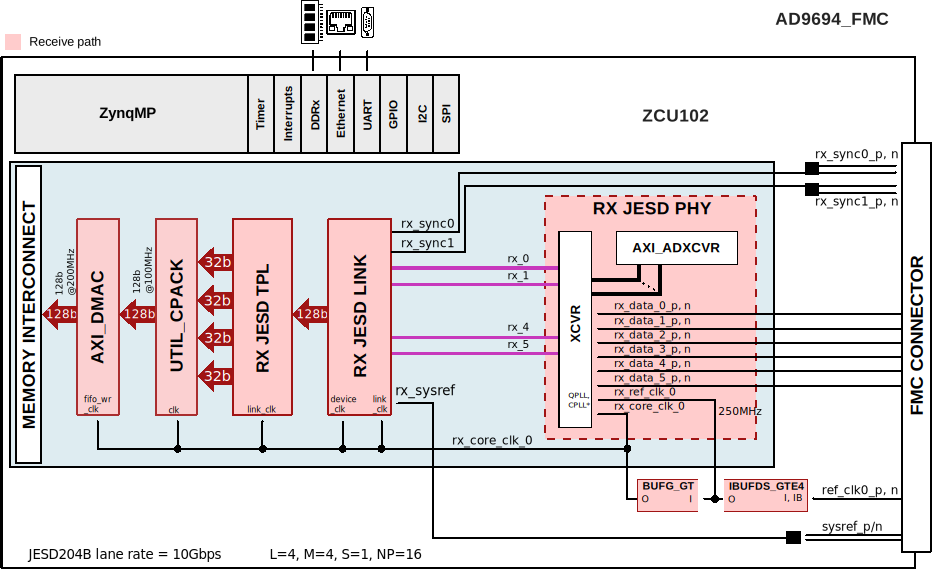

.. _ad9694_fmc:

AD9694-FMC HDL project
===============================================================================

Overview
-------------------------------------------------------------------------------

The :adi:`AD9694-500EBZ <EVAL-AD9694>` supports the :adi:`AD9694`, a quad,
14-bit, 500 MSPS ADC. The device has an on-chip buffer and a sample-and-hold
circuit designed for low power, small size, and ease of use. This device is
designed for sampling wide bandwidth analog signals of up to 1.4 GHz.
The AD9694 is optimized for wide input bandwidth, high sampling rate, excellent
linearity, and low power in a small package.

Product highlights:

- Low power consumption per channel
- JESD204B lane rate support up to 15 Gbps
- Wide full power bandwidth supports IF sampling of signals up to 1.4 GHz
- Buffered inputs ease filter design and implementation
- Four integrated wideband decimation filters and NCO blocks supporting
  multiband receivers
- Programmable fast overrange detection
- On-chip temperature diode for system thermal management

Supported boards
-------------------------------------------------------------------------------

- :adi:`EVAL-AD9694` (also referred to as AD9694-FMC/AD9694-500EBZ)

Supported devices
-------------------------------------------------------------------------------

- :adi:`AD9694`

Supported carriers
-------------------------------------------------------------------------------

- :xilinx:`ZCU102` on FMC HPC1

Block design
-------------------------------------------------------------------------------

Block diagram
~~~~~~~~~~~~~~~~~~~~~~~~~~~~~~~~~~~~~~~~~~~~~~~~~~~~~~~~~~~~~~~~~~~~~~~~~~~~~~~

The data path and clock domains are depicted in the below diagram:

Configuration modes
~~~~~~~~~~~~~~~~~~~~~~~~~~~~~~~~~~~~~~~~~~~~~~~~~~~~~~~~~~~~~~~~~~~~~~~~~~~~~~~

The only parameters of this project that can be configured are:

- RX_JESD_L: number of lanes {2, 4}
- RX_JESD_M: number of converters {2, 4, 8}
- RX_JESD_S: number of samples per frame {1, 2}

More details on these values, in the `Limitations`_ section.

Clock scheme
~~~~~~~~~~~~~~~~~~~~~~~~~~~~~~~~~~~~~~~~~~~~~~~~~~~~~~~~~~~~~~~~~~~~~~~~~~~~~~~

The reference clock, sysref and the ADC sampling clock, all have external
sources.

The system uses an external clock as source for the reference clock signal,
given at J201. The AD9694 CLK+/- signal is fed through J203. The SYSREF is
given at J200. For more details, check the
`schematic <https://wiki.analog.com/_media/eval/9694_board_files_ce04.zip>`__.

Limitations
^^^^^^^^^^^^^^^^^^^^^^^^^^^^^^^^^^^^^^^^^^^^^^^^^^^^^^^^^^^^^^^^^^^^^^^^^^^^^^^

The :adi:`AD9694` has two JESD204B links which operate in **subclass 1**.
The JESD204B lane rates are in range 1.6875 Gbps-15 Gbps.

To have the **multichip synchronization**, meaning the two channels
synchronized, they are *treated as a single link*, thus the ``L`` and ``M``
parameters **are doubled**
:git-hdl:`when used in the project <projects/ad9694_fmc/zcu102/system_project.tcl>`
(since they have the same L & M).

The default configuration for this project uses the full bandwith mode,
where no Digital Down Converters (DDCs) are used, so the Decimation factor
is 1 in the formula :math:`f_{OUT} = \frac{f_{ADC}}{Decim.}`

| f\ :sub:`ADC` = 500 MSPS (ADC sample rate)
| f\ :sub:`OUT` = f\ :sub:`ADC`/1 = 500 MSPS (output sample rate)
| L = 4
| M = 4
| S = 1
| no DDCs

=> JESD204B lane rate = 10 Gbps

.. math::
   Lane Rate &= \frac{M * NP * \frac{10}{8} * f_{OUT}}{L} \\
             &= \frac{80 * 500}{4} = 10 Gbps

The JESD receive chain consists of a physical layer represented by an
XCVR module, a link layer represented by an RX JESD LINK module and
transport layer represented by a RX JESD TPL module. The link operates
in subclass 1.

The link is set for full bandwidth mode and operate with the following
parameters:

- Used link layer encoder mode is 8B10B, defined in JESD204B, which uses ADI
  IP as Physical Layer
- L: 4 lanes, 2 per link
- M: 4 converters, 2 per link
- S: 1 sample per converter per frame
- NP: 16 bits per sample, and converter resolution: 16 (N)
- F: 2 octets per frame

For more details, check *Table 27, JESD204B Output Configurations* from the
:adi:`AD9694 data sheet`.

Deframer paramaters: L=4, M=4, F=2, S=1, NP=16

| REFCLK - 500 MHz (Lane Rate/20) external
| DEVICE CLK - 250 MHz (Lane Rate/40) external
| ADC CLK - 500 MHz
| SYSREF - 7.8125 MHz (external)
| JESD204B Lane Rate - 10 Gbps

SYSREF was chosen 7.8125 MHz because the period of the SYSREF signal must be
an integer multiple of the LMFC (Local Multi Frame Clock), and the LMFC can be
derived using the formula:

.. math::
   LMFC = \frac{ADC Sample Rate}{N * S * K} = \frac{500}{N * 1 * 32}

where N is integer, >=1.

SYSREF = LMFC / N, and in this case we chose N = 2.

CPU/Memory interconnects addresses
~~~~~~~~~~~~~~~~~~~~~~~~~~~~~~~~~~~~~~~~~~~~~~~~~~~~~~~~~~~~~~~~~~~~~~~~~~~~~~~

The addresses are dependent on the architecture of the FPGA, having an offset
added to the base address from HDL (see more at :ref:`architecture cpu-intercon-addr`).

================== ===========
Instance           ZynqMP
================== ===========
rx_ad9694_tpl_core 0x84A0_0000
axi_ad9694_rx_xcvr 0x84A6_0000
axi_ad9694_rx_jesd 0x84AA_0000
axi_ad9694_rx_dma  0x9C40_0000
================== ===========

SPI connections
~~~~~~~~~~~~~~~~~~~~~~~~~~~~~~~~~~~~~~~~~~~~~~~~~~~~~~~~~~~~~~~~~~~~~~~~~~~~~~~

.. list-table::
   :widths: 25 25 25 25
   :header-rows: 1

   * - SPI type
     - SPI manager instance
     - SPI subordinate
     - CS
   * - PS
     - SPI 0
     - AD9694
     - 0
   * - PS
     - SPI 1
     - PMOD
     - 0

GPIOs
~~~~~~~~~~~~~~~~~~~~~~~~~~~~~~~~~~~~~~~~~~~~~~~~~~~~~~~~~~~~~~~~~~~~~~~~~~~~~~~

.. list-table::
   :widths: 25 20 20 20 15
   :header-rows: 2

   * - GPIO signal
     - Direction
     - HDL GPIO EMIO
     - Software GPIO
     - Software GPIO
   * -
     - (from FPGA view)
     -
     - Zynq-7000
     - Zynq MP
   * - fdb
     - INOUT
     - 34
     - 88
     - 112
   * - fda
     - INOUT
     - 33
     - 87
     - 111
   * - pwdn
     - INOUT
     - 32
     - 86
     - 110

Interrupts
~~~~~~~~~~~~~~~~~~~~~~~~~~~~~~~~~~~~~~~~~~~~~~~~~~~~~~~~~~~~~~~~~~~~~~~~~~~~~~~

Below are the Programmable Logic interrupts used in this project.

================== === ========== ===========
Instance name      HDL Linux Zynq Actual Zynq
================== === ========== ===========
axi_ad6676_rx_dma  13  57         89
axi_ad6676_rx_jesd 12  56         88
================== === ========== ===========

Building the HDL project
-------------------------------------------------------------------------------

The design is built upon ADI's generic HDL reference design framework.
ADI distributes the bit/elf files of these projects as part of the
:dokuwiki:`ADI Kuiper Linux <resources/tools-software/linux-software/kuiper-linux>`.
If you want to build the sources, ADI makes them available on the
:git-hdl:`HDL repository </>`. To get the source you must
`clone <https://git-scm.com/book/en/v2/Git-Basics-Getting-a-Git-Repository>`__
the HDL repository.

**Linux/Cygwin/WSL**

Building the project with the default configuration, L=4, M=4, S=1:

.. shell:: bash

   $cd hdl/projects/ad9694_fmc/zcu102
   $make

Or you can specify the parameter that you want to change (see
`Configuration modes`_).

.. shell:: bash

   $cd hdl/projects/ad9694_fmc/zcu102
   $make RX_JESD_L=2 RX_JESD_M=4 RX_JESD_S=1

The result of the build, if parameters were used, will be in a folder named
by the configuration used:
``hdl/projects/ad9694_fmc/zcu102/RXL2_RXM4_RXS1``.

A more comprehensive build guide can be found in the :ref:`build_hdl` user guide.

Resources
-------------------------------------------------------------------------------

Systems related
~~~~~~~~~~~~~~~~~~~~~~~~~~~~~~~~~~~~~~~~~~~~~~~~~~~~~~~~~~~~~~~~~~~~~~~~~~~~~~~

Hardware related
~~~~~~~~~~~~~~~~~~~~~~~~~~~~~~~~~~~~~~~~~~~~~~~~~~~~~~~~~~~~~~~~~~~~~~~~~~~~~~~

-  Product datasheet: :adi:`AD9694`

HDL related
~~~~~~~~~~~~~~~~~~~~~~~~~~~~~~~~~~~~~~~~~~~~~~~~~~~~~~~~~~~~~~~~~~~~~~~~~~~~~~~

- :git-hdl:`AD9694_FMC HDL project source code <projects/ad9694_fmc>`

.. list-table::
   :widths: 30 35 35
   :header-rows: 1

   * - IP name
     - Source code link
     - Documentation link
   * - AXI_DMAC
     - :git-hdl:`library/axi_dmac`
     - :ref:`axi_dmac`
   * - AXI_SYSID
     - :git-hdl:`library/axi_sysid`
     - :ref:`axi_sysid`
   * - JESD204_TPL_ADC
     - :git-hdl:`library/jesd204/ad_ip_jesd204_tpl_adc`
     - :ref:`ad_ip_jesd204_tpl_adc`
   * - AXI_JESD204_RX
     - :git-hdl:`library/jesd204/axi_jesd204_rx`
     - :ref:`axi_jesd204_rx`
   * - JESD204_RX
     - :git-hdl:`library/jesd204/jesd204_rx`
     - :ref:`axi_jesd204_rx`
   * - SYSID_ROM
     - :git-hdl:`library/sysid_rom`
     - :ref:`axi_sysid`
   * - UTIL_CPACK2
     - :git-hdl:`library/util_pack/util_cpack2`
     - :ref:`util_cpack2`
   * - AXI_ADXCVR for AMD
     - :git-hdl:`library/xilinx/axi_adxcvr`
     - :ref:`axi_adxcvr amd`
   * - UTIL_ADXCVR for AMD
     - :git-hdl:`library/xilinx/util_adxcvr`
     - :ref:`util_adxcvr`

- :dokuwiki:`[Wiki] Generic JESD204B block designs <resources/fpga/docs/hdl/generic_jesd_bds>`
- :ref:`jesd204`

Software related
~~~~~~~~~~~~~~~~~~~~~~~~~~~~~~~~~~~~~~~~~~~~~~~~~~~~~~~~~~~~~~~~~~~~~~~~~~~~~~~

- Linux driver :git-linux:`drivers/iio/adc/ad9208.c` (common for AD9694 as well)
- AD9694-500EBZ ZCU102 Linux device tree :git-linux:`arch/arm64/boot/dts/xilinx/zynqmp-zcu102-rev10-ad9694.dts`
- :dokuwiki:`AD9208 Linux device driver documentation <resources/tools-software/linux-drivers/iio-adc/ad9208>`

.. include:: ../common/more_information.rst

.. include:: ../common/support.rst
